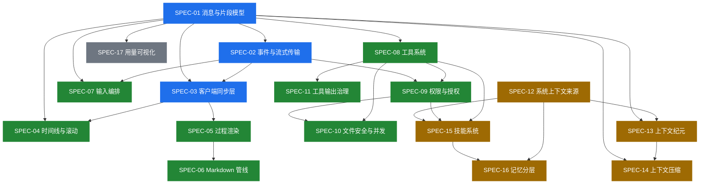

# 能力清单 · 依赖图 · 实施顺序

本文件是整个工具包的索引和调度表。**开始任何实施之前先读这一页。**

---

## 1. 十七项能力总表

| ID | 能力 | 一句话价值 | 层 | 优先级 | 工作量 | 依赖 | 分析原文 |
| --- | --- | --- | --- | --- | --- | --- | --- |
| [SPEC-01](./spec/SPEC-01-message-model.md) | 消息与片段模型 | 前后端共用一套消息/片段类型，加一种 part 只改一处 | 地基 | **P0** | S | — | [ch04](../context-and-streaming/04-history-and-messages.md) |
| [SPEC-02](./spec/SPEC-02-event-transport.md) | 事件模型与流式传输 | 过程落库 + 广播，刷新页面不丢 | 地基 | **P0** | M | 01 | [ch07](../context-and-streaming/07-events-and-sse.md) |
| [SPEC-03](./spec/SPEC-03-client-sync.md) | 客户端同步层 | 合帧 + delta 合并，流式不掉帧 | 前端 | **P0** | M | 01,02 | [ch08](../context-and-streaming/08-client-sync.md) |
| [SPEC-04](./spec/SPEC-04-timeline-scroll.md) | 时间线投影与滚动 | 千条消息不卡、流式不跳动 | 前端 | P1 | L | 01,03 | [ch09](../context-and-streaming/09-timeline-and-scroll.md) |
| [SPEC-05](./spec/SPEC-05-process-render.md) | 过程渲染 | 追赶式打字、工具卡片、忙碌指示 | 前端 | P1 | M | 01,03 | [ch10](../context-and-streaming/10-rendering-parts.md) |
| [SPEC-06](./spec/SPEC-06-markdown-pipeline.md) | 流式 Markdown 管线 | 长回答后期不卡、无语法闪烁 | 前端 | P1 | M | 05 | [ch11](../context-and-streaming/11-streaming-markdown.md) |
| [SPEC-07](./spec/SPEC-07-input-orchestration.md) | 输入编排与执行循环 | 模型跑着的时候能插话 | 后端 | P1 | M | 01,02 | [ch05](../context-and-streaming/05-input-and-drain.md) |
| [SPEC-08](./spec/SPEC-08-tool-system.md) | 工具系统 | 工具定义/校验/结算的统一契约 | 后端 | P1 | L | 01 | [ch14](../context-and-streaming/14-tools.md) |
| [SPEC-09](./spec/SPEC-09-permission.md) | 权限与授权 | 危险操作可控，且不烦用户 | 后端 | P1 | M | 02,08 | [ch14](../context-and-streaming/14-tools.md) |
| [SPEC-10](./spec/SPEC-10-file-safety.md) | 文件访问安全与并发 | 路径不逃逸、并发不互相覆盖 | 后端 | P1 | M | 08,09 | [ch14](../context-and-streaming/14-tools.md) |
| [SPEC-11](./spec/SPEC-11-tool-output.md) | 工具输出治理 | 一次大输出不吃掉半个窗口 | 后端 | P1 | S | 08 | [ch06](../context-and-streaming/06-tool-output.md) |
| [SPEC-12](./spec/SPEC-12-system-context.md) | 系统上下文来源 | 系统提示词从字符串升级成可比较的类型化来源 | 后端 | P2 | L | — | [ch01](../context-and-streaming/01-system-context.md) |
| [SPEC-13](./spec/SPEC-13-context-epoch.md) | 上下文纪元 | system 段字节不变，保住 provider 缓存 | 后端 | P2 | M | 01,12 | [ch02](../context-and-streaming/02-context-epoch.md) |
| [SPEC-14](./spec/SPEC-14-compaction.md) | 上下文压缩 | 长会话不再报超窗 | 后端 | P2 | M | 01,13 | [ch03](../context-and-streaming/03-compaction.md) |
| [SPEC-15](./spec/SPEC-15-skills.md) | 技能系统 | 50 篇手册常驻只花 2–4k token | 后端 | P2 | M | 08,09,12 | [ch15](../context-and-streaming/15-skills.md) |
| [SPEC-16](./spec/SPEC-16-memory-layers.md) | 记忆分层 | 六类记忆各走各的通道，不互相污染 | 后端 | P2 | M | 12,15 | [ch16](../context-and-streaming/16-memory.md) |
| [SPEC-17](./spec/SPEC-17-context-usage-ui.md) | 上下文用量可视化 | 用户能看见窗口被谁吃掉了 | 前端 | P3 | S | 01 | [ch12](../context-and-streaming/12-context-usage-ui.md) |

**工作量档位**：S ≈ 1 天以内，M ≈ 2–4 天，L ≈ 1 周上下（单人，含测试）。

---

## 2. 依赖图



**唯一的硬依赖是 SPEC-01**。它定义前后端共用的消息/片段类型，几乎所有其它能力都以它为词汇表。**先做它，且一次做对**——中途改消息模型的代价是所有下游能力返工。

SPEC-12（系统上下文来源）是唯一一个**零依赖但被多方依赖**的能力。它可以独立于会话系统先做出来并单测。

---

## 3. 推荐实施顺序

### 路线 1 · 最小可上线闭环（P0，约 1 周）

```
SPEC-01 → SPEC-02 → SPEC-03
```

做完这三项你就有：统一消息模型、过程落库与广播、刷新不丢、流式不掉帧。
**很多产品做到这里就上线了。** 然后在 SPEC-07（插话）和 SPEC-14（压缩）上反复踩坑。

### 路线 2 · 完整对话体验（+P1 前端，约 +1.5 周）

```
… → SPEC-05 → SPEC-06 → SPEC-04
```

先做渲染（SPEC-05/06）再做虚拟化（SPEC-04）：**虚拟化是性能优化，渲染是功能**，顺序反了会在没有稳定渲染单元的情况下调虚拟化参数，白费功夫。

### 路线 3 · Agent 能力（+P1 后端，约 +2 周）

```
… → SPEC-08 → SPEC-09 → SPEC-11 → SPEC-10 → SPEC-07
```

`SPEC-11`（输出治理）排在 `SPEC-10`（文件安全）前面：输出治理是 S 工作量且立刻见效，文件安全是 M 且只在有写文件工具后才需要。

### 路线 4 · 长会话（+P2，约 +2 周）

```
… → SPEC-12 → SPEC-13 → SPEC-14 → SPEC-15 → SPEC-16
```

**SPEC-12/13 必须一起做**。只做 12 不做 13，你得到一堆能算出变化的来源但无处安放；只做 13 不做 12，纪元里装的还是拼接字符串，没有意义。

### 路线 5 · 可观测（P3）

```
SPEC-17
```

随时可做，只依赖 SPEC-01。半天的工作量，但对「为什么变慢/变贵」这类用户提问的回答质量提升很大。

---

## 4. 按症状索引

不想按顺序走，只想解决眼前的问题：

| 你遇到的问题 | 做哪几项 | 备注 |
| --- | --- | --- |
| 流式输出卡顿、掉帧 | SPEC-03 + SPEC-06 | 两项都是纯前端，可独立上线 |
| 长回答到后面越来越卡 | SPEC-06 | 单项，约 60 行核心代码 |
| 刷新页面对话过程丢失 | SPEC-01 + SPEC-02 | 必须一起做 |
| 页面流式时乱跳、上滑被拉回底部 | SPEC-04（只做贴底跟随部分） | 约 80 行 hook |
| 长会话报超窗 | SPEC-14（需 SPEC-13 铺底） | |
| 改了项目配置模型不知道 | SPEC-12 + SPEC-13 | |
| provider 缓存命中率低、成本高 | SPEC-13 | 直接体现在账单上 |
| 模型跑着时用户不能发消息 | SPEC-07 | |
| 一次工具调用撑爆上下文 | SPEC-11 | S 工作量，性价比最高 |
| 权限弹窗太烦 / 太危险 | SPEC-09 | 重点看 `resources`/`save` 分离 |
| 模型读写了不该碰的路径 | SPEC-10 | 重点看符号链接逃逸 |
| 操作手册太多塞不进 prompt | SPEC-15 | |
| 用户问「为什么变贵了」答不上来 | SPEC-17 | 半天 |

---

## 5. 分层视角

```
┌─────────────────────────────────────────────────────────────┐
│ 前端                                                          │
│  SPEC-03 同步层 → SPEC-04 时间线 → SPEC-05 渲染 → SPEC-06 Markdown │
│                                          SPEC-17 用量可视化      │
├─────────────────────────────────────────────────────────────┤
│ 传输                                                          │
│  SPEC-02 事件模型与流式传输（durable / live-only 分野）           │
├─────────────────────────────────────────────────────────────┤
│ 会话运行时                                                     │
│  SPEC-07 输入编排 · SPEC-13 纪元 · SPEC-14 压缩                  │
├─────────────────────────────────────────────────────────────┤
│ 能力层                                                        │
│  SPEC-08 工具 · SPEC-09 权限 · SPEC-10 文件安全 · SPEC-11 输出治理 │
│  SPEC-15 技能 · SPEC-16 记忆分层                                │
├─────────────────────────────────────────────────────────────┤
│ 共享词汇表                                                     │
│  SPEC-01 消息与片段模型 · SPEC-12 系统上下文来源                  │
└─────────────────────────────────────────────────────────────┘
```

---

## 6. 验收覆盖

| SPEC | 断言数 | 文件 |
| --- | --- | --- |
| SPEC-01 | 17 | [`acceptance/SPEC-01.yaml`](./acceptance/SPEC-01.yaml) |
| SPEC-02 | 23 | [`acceptance/SPEC-02.yaml`](./acceptance/SPEC-02.yaml) |
| SPEC-03 | 20 | [`acceptance/SPEC-03.yaml`](./acceptance/SPEC-03.yaml) |
| SPEC-04 | 27 | [`acceptance/SPEC-04.yaml`](./acceptance/SPEC-04.yaml) |
| SPEC-05 | 29 | [`acceptance/SPEC-05.yaml`](./acceptance/SPEC-05.yaml) |
| SPEC-06 | 22 | [`acceptance/SPEC-06.yaml`](./acceptance/SPEC-06.yaml) |
| SPEC-07 | 16 | [`acceptance/SPEC-07.yaml`](./acceptance/SPEC-07.yaml) |
| SPEC-08 | 18 | [`acceptance/SPEC-08.yaml`](./acceptance/SPEC-08.yaml) |
| SPEC-09 | 10 | [`acceptance/SPEC-09.yaml`](./acceptance/SPEC-09.yaml) |
| SPEC-10 | 7 | [`acceptance/SPEC-10.yaml`](./acceptance/SPEC-10.yaml) |
| SPEC-11 | 18 | [`acceptance/SPEC-11.yaml`](./acceptance/SPEC-11.yaml) |
| SPEC-12 | 15 | [`acceptance/SPEC-12.yaml`](./acceptance/SPEC-12.yaml) |
| SPEC-13 | 14 | [`acceptance/SPEC-13.yaml`](./acceptance/SPEC-13.yaml) |
| SPEC-14 | 18 | [`acceptance/SPEC-14.yaml`](./acceptance/SPEC-14.yaml) |
| SPEC-15 | 23 | [`acceptance/SPEC-15.yaml`](./acceptance/SPEC-15.yaml) |
| SPEC-16 | 26 | [`acceptance/SPEC-16.yaml`](./acceptance/SPEC-16.yaml) |
| SPEC-17 | 15 | [`acceptance/SPEC-17.yaml`](./acceptance/SPEC-17.yaml) |
| **E2E** | 26 | [`acceptance/E2E.yaml`](./acceptance/E2E.yaml) |
| **合计** | **344** | |

`kind` 字段把断言分成三类：`unit`（可单测）、`integration`（需要起服务/并发/重启）、`manual`（需人工或性能工具确认）。
`04-verify.md` 会要求 AI 对三类分别给出可核对的证据。
