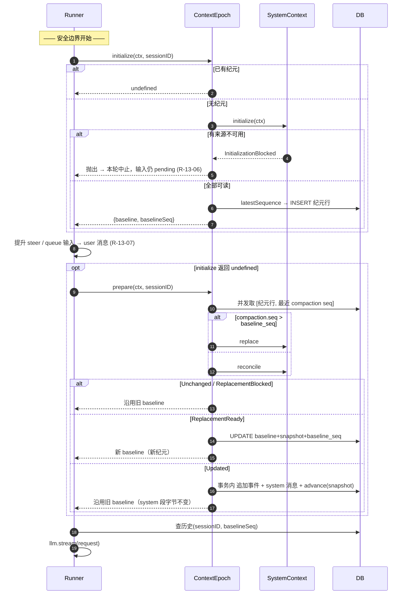

# SPEC-13 · 上下文纪元

> **优先级** P2 · **工作量** M · **依赖** SPEC-01（消息模型 / seq 水位线）、SPEC-12（系统上下文来源）
> **分析原文** [ch02 Context Epoch](../../context-and-streaming/02-context-epoch.md)
> **验收** [`acceptance/SPEC-13.yaml`](../acceptance/SPEC-13.yaml)（14 条）

SPEC-12 给了「算出变化」的能力，本规范给「什么时候算、算完往哪放、怎么保证不重不漏」。
**两者必须成对实现**：只做 12 不做 13，你得到一堆能算出变化的来源但无处安放；只做 13 不做 12，纪元里装的还是每轮重拼的字符串，毫无意义。

---

## 1. 目标与非目标

### 目标

三个互相拉扯的约束同时成立：

1. **provider prompt cache 的前缀必须稳定。** 各家 provider 的缓存都是前缀匹配：system prompt 改一个字，整段缓存作废。
2. **世界确实会变，且变化必须让模型知道。**
3. **不能重复通知，也不能漏通知**——崩溃、重试、并发都不能破坏这一点。

解法：

> **上下文纪元 = 一份不可变的 `baseline` 文本 + 一份可推进的 `snapshot` + 一条 `baseline_seq` 水位线。**
> 纪元**内**的变化以 `type: "system"` 的**会话中系统消息**追加进历史尾部（system 段一个字节不动）；
> 纪元**结束**时重渲染 baseline，旧的系统消息被水位线 cutoff 掉（但作为审计记录永久留在库里）。

### 非目标

- 不负责观测和比较来源（SPEC-12 负责），本规范只调用它的 `initialize` / `reconcile` / `replace`。
- 不负责决定何时压缩（SPEC-14 负责），本规范只**消费**「最近一条压缩消息的 seq」。
- 不规定 baseline 的文本内容（SPEC-12 §7 给了参考来源集）。

---

## 2. 领域模型

### 2.1 安全边界（Safe Provider-Turn Boundary）

> **provider 调用之前、durable 输入提升之后、上一轮工具全部 settle 之后的那个点。**
> **这是唯一允许改动上下文的位置。**

这个定义是整套设计的地基。把它写进你的代码注释里。

### 2.2 存储

```sql
CREATE TABLE session_context_epoch (
  session_id   TEXT PRIMARY KEY REFERENCES session(id) ON DELETE CASCADE,
  baseline     TEXT    NOT NULL,   -- 本纪元不可变的 system prompt 动态段
  snapshot     TEXT    NOT NULL,   -- JSON: Record<SourceKey, {value, removed?}>，见 SPEC-12 §2
  baseline_seq INTEGER NOT NULL    -- 水位线：本纪元开始时会话的最新事件 seq
);
```

**主键是 `session_id`，不是自增 id。** 纪元没有历史价值——过去的 baseline 已经被折进过去的对话里了。
需要审计时查 `session_message` 里 `type = 'system'` 的行即可，它们永久保留。

```ts
interface ContextEpochRow {
  sessionId: string
  baseline: string
  snapshot: Snapshot        // SPEC-12 的 Snapshot
  baselineSeq: number
}

/** 两个入口的统一返回值 */
interface Prepared {
  readonly baseline: string
  readonly baselineSeq: number
}
```

### 2.3 会话中系统消息

```ts
interface SystemMessage {
  id: string
  type: "system"
  text: string              // 来自 SPEC-12 的 Updated.text
  seq: number               // 与写入同源、同事务分配
  time: { created: number }
}
```

---

## 3. 规范条款

### R-13-01 一个会话至多一个活跃纪元 · **必须**

**要求**：纪元表以 `session_id` 为主键。并发调用 `initialize` 只能产生一行。

**理由**：两行纪元意味着两条水位线，历史投影结果不确定。

**常见错误**：用「先查再插」而没有会话级串行锁。必须依赖主键约束 **或** 会话级串行（见 R-13-12），二选一不够——建议都要。

---

### R-13-02 纪元内 `baseline` 字符串不变 · **必须**

**要求**：只有换纪元（`ReplacementReady` 分支）才允许改写 `baseline` 列。`Updated` 分支**必须**返回 `stored.baseline` 原值。

**理由**：这是 prompt cache 得以保留的唯一原因。变化全部落在 messages 数组尾部，system 段逐字节相同。

**常见错误**：在 `Updated` 分支里顺手把新文本拼到 baseline 后面——缓存立刻全失效，本规范就白做了。

---

### R-13-03 `baseline_seq` 是历史投影的水位线 · **必须**

**要求**：历史投影查询**必须**带上条件：

```
保留条件 =  (type != 'system')  OR  (seq > baseline_seq)
```

即：本纪元开始**之前**发出的所有会话中系统消息，全部从投影历史里消失。

**理由**：那些消息描述的状态已经被新 baseline 全量表达了。同时存在 = 模型收到两份互相矛盾的环境描述。

**常见错误**：只按时间戳过滤。时间戳会撞，且与写入不同源。

> 这条水位线由 SPEC-01 的历史投影消费（见 SPEC-01 R-01-14 的第二道 cutoff）。

---

### R-13-04 系统消息与快照推进必须原子 · **必须**

**要求**：「持久化这条 system 消息」和「`snapshot` 列前进」**必须**在同一个事务里，要么都成功要么都失败。

**理由**：
- 只发消息不推快照 → 下一轮 `reconcile` 再次算出同样的变化，重复通知。
- 只推快照不发消息 → 变化永久丢失，模型带着过期事实干活。

**参考实现**（无事务钩子时的等价写法）：

```ts
await db.transaction(async (tx) => {
  await tx.insert(eventTable).values({ ...contextUpdatedEvent })
  await tx.insert(messageTable).values({ type: "system", text: result.text, ... })
  await tx.update(epochTable).set({ snapshot: result.snapshot })
          .where(eq(epochTable.sessionId, sessionID))
})
```

**常见错误**：先 `publish` 事件、等事件落库后再单独 `UPDATE` 快照。两条语句之间崩溃 = 重复通知。

---

### R-13-05 首轮初始化不发更新消息 · **必须**

**要求**：`initialize` 路径只 INSERT 纪元行，**不得**发布任何 `ContextUpdated` 事件、不得写任何 system 消息。

**理由**：首轮的全量内容就是 `baseline` 本身。再发一条「环境变成了 X」的消息是纯粹的重复。

---

### R-13-06 初始化被阻塞时不写任何行 · **必须**

**要求**：`SystemContext.initialize` 抛 `InitializationBlocked`（SPEC-12 R-12-10）时，**不得**写入半截纪元行，本轮直接中止。

**理由**：写了半截行，下次调用会当成「已初始化」直接走 reconcile，那个残缺 baseline 就**永久固化**在整个纪元里。

**常见错误**：catch 住异常用空 baseline 建行。

---

### R-13-07 `initialize` 在输入提升之前，`prepare` 在输入提升之后 · **必须**

**要求**：一轮 turn 的调用顺序固定为：

```
initialize(ctx, sessionID)          # ① 输入提升之前
  → promoteSteers / promoteQueued   # ② 待处理输入变成 user 消息
  → prepare(ctx, sessionID)         # ③ 仅当 ① 返回 undefined 时才调
  → 查历史(baselineSeq) → 组请求
```

**理由**（两个方向各一条，缺一不可）：

| 为什么 `initialize` 必须在前 | 为什么 `prepare` 必须在后 |
| --- | --- |
| 基线不可用时（R-13-06）用户刚提交的输入还没被消费，保持 pending 可重试 | 新提升的 user 消息 seq 要**早于**本次上下文更新消息，历史顺序才是 `user → system → assistant` |

**常见错误**：合成一次调用。后果是基线不可用时用户输入已被消费，重试就丢消息。
**这是整个模块最容易被抄错的地方。**

---

### R-13-08 历史顺序固定为 user → system → assistant · **必须**

**要求**：一轮里既有新输入又有上下文变化时，三者在历史中的 seq 顺序必须是这个。

**理由**：反过来（system 在 user 之前）模型会把规则变更理解成「对新问题的回应」，而不是独立的环境事实。

> 这条是 R-13-07 的直接后果；单独立条是因为它是可独立验证的观测结果。

---

### R-13-09 压缩完成后必须换纪元 · **必须**

**要求**：

```
replacementSeq = (compaction 存在 && compaction.seq > stored.baseline_seq)
                 ? compaction.seq
                 : undefined
```

`replacementSeq` 有值时走 `SystemContext.replace`（强制重建），否则走 `reconcile`（增量比对）。

**理由**：压缩把历史换成了一段摘要，摘要里不含那些增量系统消息的内容。不换纪元，模型就丢失了压缩点之前所有的上下文变更。

---

### R-13-10 新 `baseline_seq` 精确等于压缩消息的 seq · **必须**

**要求**：换纪元时

```
baselineSeq = replacementSeq ?? latestSequence(sessionID)
```

**优先取压缩消息的 seq，而不是「当前最新 seq」。**

**理由**：压缩完成之后可能又发生了别的事件（包括新的 system 消息）。若取最新 seq，那些**介于压缩点和当前之间**的 system 消息会被 R-13-03 的水位线误杀。

**常见错误**：图省事一律用 `latestSequence`。这是静默丢信息，测试很难发现。

---

### R-13-11 `ReplacementBlocked` 沿用旧值且不永久卡住 · **必须**

**要求**：`replace` 返回 `ReplacementBlocked` 时，返回 `stored.baseline` 与 `stored.baseline_seq`，**不写库**。

**理由**：下一轮还会再试，因为 `compaction.seq > baseline_seq` 仍然成立（库没动）。自然重试，不需要额外的重试队列。

---

### R-13-12 同一会话的 turn 必须串行 · **必须**

**要求**：同一会话同时只能有一个 drain 在跑（会话级串行锁）。

**理由**：并发 drain 会让两个 `prepare` 同时读到同一份 snapshot，各自算出同一个变化，发两条重复的 system 消息。

**常见错误**：只靠主键约束防并发。主键防得住重复建行，防不住重复 `Updated`。

---

### R-13-13 会话迁移时删除纪元行 · **应该**

**要求**：会话换目录 / 换工作区时，`DELETE FROM session_context_epoch WHERE session_id = ?`。下一轮 `initialize` 重建完整基线。

**理由**：**删除而不是标记失效**——目标位置的作用域服务会重新解析出全新的来源集合，旧快照对新位置毫无意义（旧快照会让新位置的每个来源都被误判成「变化」，发一大堆 Updated）。

**可省略条件**：你的产品没有多目录 / 多工作区概念。

---

### R-13-14 上下文是惰性拉取，不是异步推送 · **必须**

**要求**：只在安全边界上采一次。**不得**做文件监听 → 立即推送系统消息。

**理由**：流式过程中往消息序列里插一条 system 消息会破坏 provider 的消息序列（多数 provider 要求 assistant 的流式响应不被打断）。

**常见错误**：用 fs.watch 监听 `AGENTS.md`，改动时立即 `publish`。

---

### R-13-15 快照解码失败是硬错误 · **必须**

**要求**：`snapshot` 列 JSON 解不出来时抛 `ContextSnapshotDecodeError`，本轮失败。

**理由**：catch 后当空快照处理，会把所有来源当成新增，重发一遍全量——在一个本该缓存命中的纪元里。

---

### R-13-16 无事件哨兵用 `-1` · **必须**

**要求**：`latestSequence` 在会话一条事件都没有时返回 `-1`（不是 `0`、不是 `null`）。

**理由**：消息 seq 从 `0` 开始。用 `0` 做哨兵，第一条消息（seq = 0）会被 `seq > baseline_seq` 的水位线吃掉。

---

## 4. 算法规范

### 4.1 `initializeOnce`

```
initializeOnce(db, context, sessionID):
    if exists(db, sessionID):                              # R-13-01 幂等
        return undefined
    generation = SystemContext.initialize(context)         # 可能抛 InitializationBlocked → R-13-06 直接向上传播
    baselineSeq = insert(db, sessionID, generation)
    return { baseline: generation.baseline, baselineSeq }  # R-13-05：不发任何事件

insert(db, sessionID, generation):
    baselineSeq = latestSequence(db, sessionID)            # 无事件时 -1，R-13-16
    INSERT INTO session_context_epoch
        VALUES (sessionID, generation.baseline, generation.snapshot, baselineSeq)
    return baselineSeq
```

### 4.2 `prepareOnce` —— 主算法（六个分支一个不能少）

```
prepareOnce(db, events, context, sessionID):

  # ① 三件事并发取
  [value, stored, compaction] = await all([
      context,                              # SPEC-12 组合好的 PackedContext
      find(db, sessionID),                  # 纪元行
      latestCompaction(db, sessionID),      # 最近一条 compaction 消息（含 seq）
  ])

  # ② 分支 1：没有纪元行 → 走与 initialize 相同的建行路径
  if !stored:
      generation  = SystemContext.initialize(value)
      baselineSeq = insert(db, sessionID, generation)
      return { baseline: generation.baseline, baselineSeq }

  # ③ 解码快照，失败是硬错误（R-13-15）
  snapshot = decodeSnapshot(stored.snapshot)
             ?? throw ContextSnapshotDecodeError{ sessionID }

  # ④ 是否需要换纪元（R-13-09）
  replacementSeq = (compaction != null && compaction.seq > stored.baseline_seq)
                   ? compaction.seq : undefined

  # ⑤ 分派
  result = replacementSeq
           ? SystemContext.replace(value, snapshot)
           : SystemContext.reconcile(value, snapshot)

  # ⑥ 分支 2 & 3：无事发生
  if result.tag == "Unchanged" or result.tag == "ReplacementBlocked":     # R-13-11
      return { baseline: stored.baseline, baselineSeq: stored.baseline_seq }

  # ⑦ 分支 4：换纪元
  if result.tag == "ReplacementReady":
      baselineSeq = replacementSeq ?? latestSequence(db, sessionID)       # R-13-10
      UPDATE session_context_epoch
         SET baseline     = result.generation.baseline,
             snapshot     = result.generation.snapshot,
             baseline_seq = baselineSeq
       WHERE session_id = sessionID
      return { baseline: result.generation.baseline, baselineSeq }

  # ⑧ 分支 5：Updated —— 纪元内增量
  transaction:                                                            # R-13-04
      append ContextUpdated 事件 { sessionID, messageID: newID(), timestamp: now, text: result.text }
      project → INSERT session_message { type: "system", text: result.text }
      UPDATE session_context_epoch SET snapshot = result.snapshot WHERE session_id = sessionID
      if 受影响行数 == 0: die("Context Epoch not found")                   # 并发迁移，见 §6 边界表

  return { baseline: stored.baseline, baselineSeq: stored.baseline_seq }  # R-13-02：baseline 不变！
```

> 分支 6 是 `initializeOnce` 的「已存在 → 返回 undefined」，由调用方决定是否继续调 `prepare`。

### 4.3 `reset`

```
reset(db, sessionID):
    DELETE FROM session_context_epoch WHERE session_id = sessionID      # R-13-13
```

### 4.4 baseline 如何进入请求

```
request.system = [ agent.staticSystem, epoch.baseline ]
                 .filter(非空)
                 .map(toSystemPart)
```

**顺序固定：静态 system 在前，纪元 baseline 在后。**
这样即使切换 agent 导致 baseline 变化，前缀里最长的那段静态文本仍可能命中缓存。

### 4.5 一轮 turn 的完整调用顺序



---

## 5. 可配置参数

| 参数 | 参考默认值 | 可调范围 | 调大 / 调小的影响 |
| --- | --- | --- | --- |
| 无事件哨兵 | `-1` | 必须 < 最小合法 seq | 用 `0` 会吃掉第一条消息（R-13-16） |
| system part 顺序 | `[静态, baseline]` | 可调换 | 调换后切 agent 会丢掉静态前缀的缓存 |
| `latestCompaction` 查询 | 取最近一条 | — | 取全部会浪费；取过旧会重复换纪元 |
| 纪元行保留策略 | 覆盖（主键单行） | 可改为追加历史表 | 追加便于审计，但要多一个「当前纪元」指针 |

---

## 6. 边界情况

| 场景 | 正确处理 | 错误处理的后果 |
| --- | --- | --- |
| 首轮 `AGENTS.md` 读失败 | 抛 `InitializationBlocked`，**不写行**，输入未提升 | 写半截行 → 残缺 baseline 永久固化 |
| 快照 JSON 损坏 | 抛 `ContextSnapshotDecodeError`，本轮失败 | 当空快照 → 重发一遍全量 |
| 压缩刚完成 | `replace`，`baseline_seq = compaction.seq` | 用最新 seq → 误杀压缩点之后的 system 消息 |
| 压缩完成但某来源不可用 | `ReplacementBlocked`，沿用旧值不写库 | 写库 → 下轮条件不再成立，永久丢失这次换纪元 |
| 会话迁移到别的目录 | `reset` 删行，下轮重建 | 复用旧快照 → 新位置每个来源都被误判成变化 |
| 同一会话并发两个 drain | 会话级串行锁 + 主键约束 | 两条重复 system 消息 |
| `advance` 时纪元行已被删 | 显式 die | 静默忽略 → 消息发了快照没推进 → 重复通知 |
| 会话一个事件都没有 | `baseline_seq = -1` | 用 `0` → 第一条消息被吃掉 |
| 上下文在流式过程中变化 | 不采样，下个安全边界再说 | 中途插 system 消息 → 破坏 provider 消息序列 |
| 一轮里既有新输入又有上下文变化 | `user → system → assistant` | 反序 → 模型以为规则变更是对新问题的回应 |

---

## 7. 反模式

| 反模式 | 后果 |
| --- | --- |
| `Updated` 分支改写 `baseline` | prompt cache 每轮全失效，本规范白做 |
| `initialize` 与 `prepare` 合成一次调用 | 基线不可用时丢用户输入 |
| 系统消息与快照推进分两次提交 | 重复通知或永久丢变化 |
| 换纪元用 `latestSequence` 而非 `compaction.seq` | 静默丢失压缩点之后的上下文变更 |
| 用时间戳代替 seq 做水位线 | 时间戳会撞，水位线错位 |
| 文件监听 → 立即推送 | 破坏流式中的消息序列 |
| 首轮额外发一条「环境是 X」 | 与 baseline 完全重复 |
| 纪元表建成带自增 id 的历史表还去 join 最新行 | 多一次查询、多一类竞态，零收益 |
| 快照解码失败 catch 成空 | 每轮重发全量，缓存永不命中 |
| 靠主键约束防并发 `Updated` | 防得住重复建行，防不住重复通知 |

---

## 8. 分级实现路径

### 最小可用版（半天）

保留：
- 一张表 `(session_id PK, baseline, snapshot, baseline_seq)`
- 一个函数：turn 开始时调，返回 `{ baseline, baselineSeq }`
- 历史投影按 `baseline_seq` 过滤 system 消息

可以先砍掉：
- `replace` 路径（没做 SPEC-14 压缩前用不上）
- `ReplacementBlocked`（SPEC-12 没有 `UNAVAILABLE` 时不会出现）
- `initialize` / `prepare` 的拆分（没有 SPEC-07 输入收件箱时可以合成一个）
- `reset`（没有多目录概念时）

**绝对不能砍**：`baseline_seq` 水位线（R-13-03）。没有它，历史里会同时存在「旧 baseline 折叠前的系统消息」和「新 baseline」，模型收到两份互相矛盾的环境描述。

### 完整版

补齐六分支 `prepare`、事务原子性、两入口拆分、压缩换纪元、迁移重置。

### 落地步骤

1. 建表（§2.2 DDL），`session_id` 主键 + 级联删除。
2. 确保会话消息有**单调递增的 seq**，与消息写入同源、同事务（不是时间戳）。
3. 实现 `initializeEpoch`：存在即返回 `undefined`；否则 `SystemContext.initialize` → 取当前 max seq → INSERT。
4. 实现 `prepareEpoch`：照 §4.2 的伪代码，六个分支一个不能少。
5. 把 `Updated` 分支包进事务：追加 system 消息 + 更新 `snapshot` 列，同一个 `db.transaction`。
6. 在 turn 组装处按 §4.5 顺序调用。
7. 历史查询加水位线过滤（SPEC-01 R-01-14）。
8. 会话迁移 / 重置处调 `deleteEpoch`。
9. 把 `baseline` 作为 system 段的**最后一个** part。

### 你需要自己提供的依赖

| 依赖 | 用途 | 注意 |
| --- | --- | --- |
| 单调 seq | 水位线比较 | 必须与消息写入同源、同事务，否则水位线错位 |
| 事务 | R-13-04 原子性 | system 消息 + 快照推进必须同事务 |
| 会话级串行锁 | R-13-12 | 见 SPEC-07 的 run-coordinator |
| 作用域服务 | 迁移后重解析来源 | 无多目录概念时可省略 `reset` |

---

## 9. 验收

见 [`acceptance/SPEC-13.yaml`](../acceptance/SPEC-13.yaml)（14 条）。

**必须优先验证**：
- 触发一次来源变化后 `baseline` 与变化前**逐字节相同**（A-13-02）——这是整条规范的存在理由。
- 压缩后紧接着又产生 2 条事件，再 `prepare` 时 `baseline_seq` 仍等于压缩消息 seq（A-13-10）——最容易抄错的一条。
- 在快照更新语句后人为抛错 → 事务回滚，system 消息也不存在，重跑 `prepare` 得到相同的 `Updated.text`（A-13-06）。
