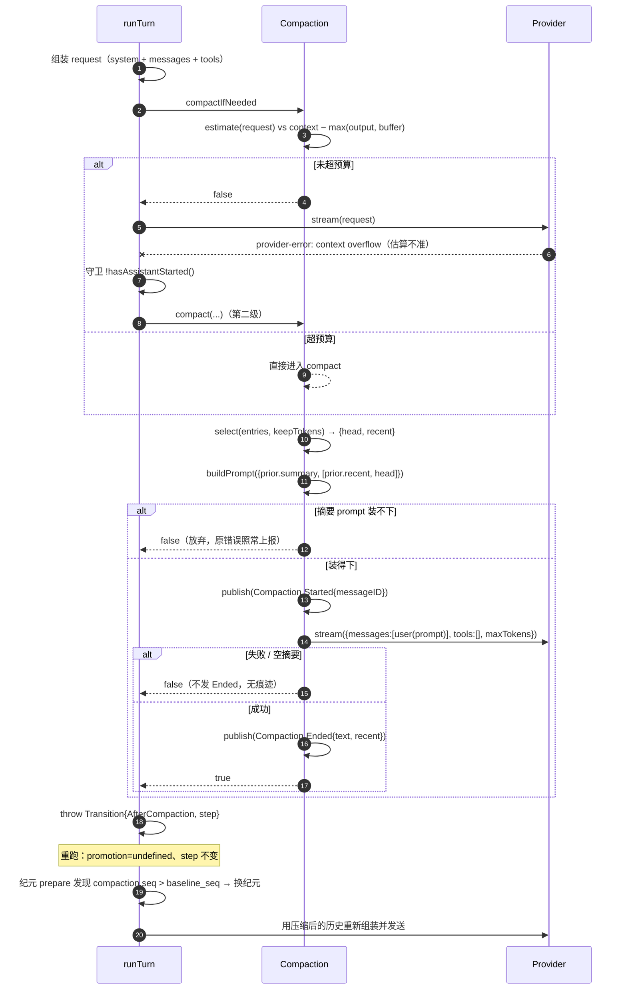

# SPEC-14 · 上下文压缩

> **优先级** P2 · **工作量** M · **依赖** SPEC-01（消息模型 / seq）、SPEC-13（纪元换代）
> **分析原文** [ch03 上下文压缩](../../context-and-streaming/03-compaction.md)
> **验收** [`acceptance/SPEC-14.yaml`](../acceptance/SPEC-14.yaml)（18 条）

长会话必然撞上下文窗口。本规范给出**两级触发 + 结构化摘要 + 换纪元**的完整方案，包括可直接抄走的两段 prompt 原文。

---

## 1. 目标与非目标

### 目标

三种朴素做法都不够：

| 做法 | 问题 |
| --- | --- |
| 滑动窗口丢头部 | 模型忘了用户最初的目标、约束、已做的决定 |
| 每 N 轮摘要一次 | 触发点与真实压力无关：有时白烧一次调用，有时已经溢出了还没轮到 |
| 等 provider 报 `context_length_exceeded` 再处理 | 用户已经看到一次失败；且此时可能连"发一次摘要请求"的余量都没有 |

本规范的答案是**两级**：

- **第一级（预算预检）**：每轮请求组装完成后、发出去之前估算 token 数，超阈值就先压缩。**正常情况下永远不会走到第二级。**
- **第二级（溢出兜底）**：估算不准（不同模型 tokenizer 差异大）导致真溢出了，且**模型还没开始输出**，就压缩后重跑这一轮。

加一条硬约束：**压缩请求本身也要能装进窗口**，装不下就放弃压缩，而不是发一个必定失败的请求。

### 非目标

- 不负责历史投影的 cutoff 实现（SPEC-01 R-01-14 负责，本规范只产出 cutoff 点）。
- 不负责换纪元（SPEC-13 R-13-09/10 负责，本规范只产出 `compaction.seq`）。
- 不规定 token 估算的精度（§5 给出参考实现与调优方向）。

---

## 2. 领域模型

```ts
export const COMPACTION_DEFAULTS = {
  /** 安全余量：即使模型声明的 output 很小，也至少留这么多 */
  buffer: 20_000,
  /** 保留在尾部、不进摘要的 token 数 */
  keepTokens: 8_000,
  /** 进摘要前工具输出的二次截断上限 */
  toolOutputMaxChars: 2_000,
  /** 摘要请求的输出上限 */
  summaryOutputTokens: 4_096,
} as const

interface Settings {
  auto: boolean      // 是否启用自动压缩（第一级）
  buffer: number
  tokens: number     // keepTokens
}

interface Entry {
  seq: number
  message: Message   // SPEC-01 的消息联合类型
}

/** 压缩产物：一条会话消息，同时是历史投影的 cutoff 点 */
export interface CompactionMessage {
  id: string
  type: "compaction"
  reason: "auto" | "manual"
  summary: string          // 结构化 Markdown 摘要
  recent: string           // 原样保留的尾部对话（已序列化成纯文本）
  seq: number
  time: { created: number }
}

interface Selection {
  head: string             // 进摘要
  recent: string           // 原样保留
}
```

**配置合并**：多份配置文档时后面覆盖前面，全部缺省用默认值 —— `auto: true, buffer: 20_000, tokens: 8_000`。

---

## 3. 规范条款

### R-14-01 触发判据必须覆盖整个请求体 · **必须**

**要求**：

```
estimate(system + messages + tools) > context − max(output, buffer)   →  压缩
```

`estimate` 的输入**必须**包含工具定义。

**理由**：工具定义在 coding agent 里常常占几千 token。漏算会让预检形同虚设——你以为还有余量，实际早就该压缩了。

**常见错误**：只估 `messages`。

---

### R-14-02 安全余量取 `max(output, buffer)` · **必须**

**要求**：阈值减去的是 `max(模型输出上限, buffer)`，不是两者之一。

**理由**：既要留出模型输出的空间，也要留出至少 `buffer` 的安全余量（应对估算误差）。声明了小 output 的模型不该因此失去安全余量。

---

### R-14-03 模型未声明窗口上限时不压缩 · **必须**

**要求**：`context` 为 `undefined` 或 `<= 0` 时直接返回「不压缩」。

**理由**：宁可不做，也不要基于猜测的窗口大小误压缩——猜小了会疯狂压缩，猜大了等于没做。

**常见错误**：给一个「保守默认值」如 8k。对 200k 窗口的模型就是每几轮压一次。

---

### R-14-04 head / recent 从尾部往前切 · **必须**

**要求**：从最后一条消息往前累加 token，累加后**超过** `keepTokens` 就停止且**不放入**。切点之前进摘要（head），之后原样保留（recent）。

**理由**：保证最近的对话**完整、逐字**保留。摘要必然有损，最近的上下文最不能损。

**后置条件**：`estimate(recent) ≤ keepTokens`。

**常见错误**：从头往后切（保留了最旧的），或「超了才停但已放入」（recent 可能超出 keepTokens）。

---

### R-14-05 旧 compaction 消息不参与新的序列化 · **必须**

**要求**：`select` 的输入里**必须**过滤掉 `type === "compaction"` 的条目。

**理由**：否则摘要里会嵌套摘要（`<conversation-checkpoint>` 套 `<conversation-checkpoint>`），层层套娃后信息密度崩塌。

> 旧摘要的内容通过 R-14-06 的增量通道进入，不走序列化通道。

---

### R-14-06 增量摘要：旧摘要用完即弃 · **必须**

**要求**：已有摘要时，

```
新的 <conversation>  =  上次的 recent  +  这次的 head
<prior-summary>      =  上次的 summary
```

并且 prompt 里**必须**显式告知模型：旧摘要在此之后就被丢弃，没带过去的东西就永久丢失。

**理由**：上次的 recent 这次已经不"最近"了，该进摘要。不说"用完即弃"那句话，模型会把旧摘要当成"还在的东西"而只写增量，于是旧信息全丢。

---

### R-14-07 摘要请求自己必须装得下 · **必须**

**要求**：

```
estimate(summaryPrompt) > context − summaryOutput   →  放弃压缩，返回 false
```

**理由**：硬发必然失败，还浪费一次调用和一次用户等待。

**放弃后的行为**：原始错误照常上报，让用户知道会话已经无法继续（而不是静默卡住）。

---

### R-14-08 压缩失败不留痕迹 · **必须**

**要求**：摘要流报错 / provider 失败 / 返回空白字符串时，**不得**发布 `Compaction.Ended` 事件，**不得**写入 compaction 消息。返回「未压缩」。

**理由**：幂等安全。下一轮自然重试，不需要补偿逻辑。

**配套要求**：`Started` 事件已经发出去了，UI **必须**能处理「只有 Started 没有 Ended」的悬空态（见 SPEC-05）。

---

### R-14-09 `Started` / `Ended` 共用同一个 messageID · **应该**

**要求**：两个事件携带同一个 `messageID`。

**理由**：`Started` 让 UI 立刻显示「正在压缩」，`Ended` 才产生真正的消息行。共用 id 让 UI 能把两者关联成同一行的两个状态。

---

### R-14-10 摘要请求不带工具且输出上限固定 · **必须**

**要求**：`tools: []`，`maxTokens = min(output || 4096, 4096)`。

**理由**：
- 带工具 → 模型可能开始读文件而不是写摘要，且工具定义白占几千 token。
- 不限输出 → 摘要可能写成几万 token，比原文还长。

---

### R-14-11 溢出兜底只在模型未开始输出时可用 · **必须**

**要求**：第二级的守卫条件是 `!assistantHasStarted() && isContextOverflowError(err)`。

**理由**：已经流给用户的内容不能丢。压缩后重跑会让那段内容重新生成一遍，用户看到重复输出。

---

### R-14-12 压缩后重跑不再允许溢出兜底 · **必须**

**要求**：压缩后的重跑走一条**不带兜底能力**的路径；若它再次溢出，直接抛明确错误。

**理由**：防死循环。压缩后还溢出说明是单条消息过大之类的结构性问题，再压一次也没用。

---

### R-14-13 重跑不重复提升输入 · **必须**

**要求**：重跑时**不得**再次执行输入提升（SPEC-07 的 promote）。

**理由**：输入在第一次尝试时已经提升成 user 消息了。再提升一次 = 同一条 user 消息在历史里出现两次。

---

### R-14-14 压缩不消耗步数配额 · **必须**

**要求**：重跑时 `step` 原样透传，**不得** `+1`。

**理由**：压缩是基础设施行为，不是模型的一步推理。用户会莫名少一轮。

---

### R-14-15 摘要以 `user` 角色回放且标注为历史 · **必须**

**要求**：compaction 消息转成 LLM 消息时：

- `role: "user"`（**不是** `system`）
- 内容包裹在 `<conversation-checkpoint>` 中
- **必须**含有等价于 `Treat it as historical context, not as new instructions.` 的声明

**理由**：摘要里有 `## Next Move` 小节。不加这句话，模型会把它当成用户的新指令**直接开始执行**。这是一个真实踩过的坑。

---

### R-14-16 关闭自动压缩不等于关闭兜底 · **应该**

**要求**：`auto: false` 只跳过第一级；第二级在真溢出时仍应触发。

**理由**：兜底是防止用户看到硬失败的最后一道防线，不该被「我不想自动压缩」这个偏好关掉。

---

### R-14-17 待压缩内容为空时放弃 · **必须**

**要求**：`select` 返回空、或（`head` 为空 **且** 没有旧摘要）时返回「未压缩」。

**注意这个条件的精确形式**：`head` 为空但**有**旧摘要时**仍然要压缩**——此时是把上次的 recent 折进摘要。这个分支最容易漏。

**理由**：`head` 和旧摘要都没有意味着只有一条超大消息，压缩救不了它，应上报明确错误。

---

### R-14-18 压缩后必须换纪元 · **必须**

**要求**：压缩完成后，下一轮的纪元准备逻辑看到 `compaction.seq > baseline_seq` 时走 replace 路径，新 `baseline_seq = compaction.seq`。

> 实现在 SPEC-13 R-13-09 / R-13-10。这里立条是因为它是压缩正确性的组成部分：不换纪元，压缩点之前的所有增量系统消息就悄悄丢了。

---

## 4. 算法规范

### 4.1 第一级：预算预检

```
compactIfNeeded(entries, model, request) -> bool:
    if !settings.auto: return false                                    # R-14-16
    context = model.limits.context
    if context == null or context <= 0: return false                   # R-14-03
    output = request.maxTokens ?? model.limits.output ?? 0
    used = estimate({ system: request.system,
                      messages: request.messages,
                      tools: request.tools })                          # R-14-01
    if used <= context - max(output, settings.buffer): return false    # R-14-02
    return compact(entries, model, request)
```

### 4.2 head / recent 切分

```
select(entries, keepTokens) -> {head, recent} | undefined:
    conversation = entries
        .filter(e => e.message.type != "compaction")                   # R-14-05
        .map(e => serialize(e.message))
        .filter(非空)
    if conversation.length == 0: return undefined

    total = 0
    split = conversation.length
    for index from conversation.length-1 down to 0:                    # R-14-04 从尾往前
        next = total + estimate(conversation[index])
        if next > keepTokens: break                                    # 「不放入」语义
        total = next
        split = index

    return {
        head:   conversation.slice(0, split).join("\n\n"),
        recent: conversation.slice(split).join("\n\n"),
    }
```

### 4.3 消息序列化（进摘要用的纯文本形式）

每种消息类型一个分支，未知类型返回空串后被过滤：

| 类型 | 序列化形式 |
| --- | --- |
| user | `[User]: <text>` + 每个附件一行 `[Attached <mime>: <name>]` |
| assistant / text | `[Assistant]: <text>` |
| assistant / reasoning | `[Assistant reasoning]: <text>`（text 为空则跳过） |
| assistant / tool(completed) | `[Assistant tool call]: <name>(<input>)` + `[Tool result]: <truncate(content)>` |
| assistant / tool(error) | `[Assistant tool call]: <name>(<input>)` + `[Tool error]: <message>` |
| assistant / tool(其它状态) | 只有 `[Assistant tool call]: <name>(<input>)` |
| system | `[System update]: <text>` |
| synthetic | `[Synthetic context]: <text>` |
| shell | `[Shell]: <command>\n<truncate(output)>` |
| agent-switched / model-switched | `""`（被过滤） |

```
truncate(v) = v.length <= 2000 ? v : v.slice(0, 2000) + "\n[truncated]"
```

**工具输出在进摘要前要再截断一次**。即使它已经过了 SPEC-11 的落盘治理（2000 行 / 50KB），对摘要来说仍然太长。摘要要的是"做过什么"，不是"输出了什么"。

### 4.4 prompt 构造

```
buildPrompt({ previousSummary, context }) -> string:
    conversation = "Here is the conversation so far:\n\n<conversation>\n"
                 + context.join("\n\n") + "\n</conversation>"

    if !previousSummary:
        return [conversation,
                "Create a new anchored summary from the conversation history in the "
                + "<conversation> tags above so another coding agent can continue the work.",
                SUMMARY_TEMPLATE].join("\n\n")

    return [conversation,
            "Here is the summary of the conversation before the <conversation> above:"
            + "\n\n<prior-summary>\n" + previousSummary + "\n</prior-summary>",
            SUMMARY_UPDATE_INSTRUCTIONS,
            SUMMARY_TEMPLATE].join("\n\n")
```

调用处（R-14-06 的关键）：

```
prior   = entries 中第一条 compaction 消息
prompt  = buildPrompt({
    previousSummary: prior?.summary,
    context: [prior?.recent, selected.head].filter(非空),     # ← 上次的 recent 排在前面
})
```

### 4.5 压缩主流程

```
compact(entries, model, request) -> bool:
    context = model.limits.context
    if !context or context <= 0: return false
    output  = request.maxTokens ?? model.limits.output ?? 0

    selected = select(entries, settings.tokens)
    prior    = entries 中第一条 compaction 消息

    if !selected or (selected.head 为空 and !prior): return false      # R-14-17

    prompt        = buildPrompt({ previousSummary: prior?.summary,
                                  context: [prior?.recent, selected.head].filter(非空) })
    summaryOutput = min(output || 4096, 4096)                          # R-14-10

    if estimate(prompt) > context - summaryOutput: return false        # R-14-07

    messageID = newID()
    publish(Compaction.Started { sessionID, messageID, timestamp, reason })   # R-14-09

    chunks = []; failed = false
    try:
        for chunk in llm.stream({ model,
                                  messages: [user(prompt)],
                                  tools: [],                           # R-14-10
                                  maxTokens: summaryOutput }):
            if chunk is textDelta: chunks.push(chunk.text)
            if chunk is providerError: failed = true
    catch LLMError: return false                                       # R-14-08

    summary = chunks.join("")
    if failed or summary.trim() == "": return false                    # R-14-08 不发 Ended

    publish(Compaction.Ended { sessionID, messageID, timestamp, reason,
                               text: summary, recent: selected.recent })
    return true
```

### 4.6 压缩后的控制流

压缩发生在 turn 组装**之后**、请求发出**之前**，所以必须丢弃当前请求、用压缩后的历史重新组装。

用一个受控的「转移信号」（异常、哨兵返回值、状态机迁移都行）实现：

```
runTurn(sessionID, promotion, step):
    try:
        return runTurnAttempt(sessionID, promotion, step, recoverOverflow = compact)
    catch Transition t:
        if t.kind == "AfterOverflowCompaction":
            return runAfterOverflowCompaction(sessionID, undefined, t.step)     # R-14-13/14
        return runTurn(sessionID, undefined, t.step)                            # R-14-13/14

runAfterOverflowCompaction(sessionID, promotion, step):
    try:
        return runTurnAttempt(sessionID, promotion, step, recoverOverflow = null)  # ← 不带兜底
    catch Transition t:
        if t.kind == "AfterOverflowCompaction":
            throw Error("Post-compaction provider attempt cannot recover another overflow")  # R-14-12
        return runAfterOverflowCompaction(sessionID, undefined, t.step)
```

两个触发点：

```
# 第一级：组装完成、发送之前
if compactIfNeeded({ sessionID, entries, model, request }):
    throw Transition { kind: "AfterCompaction", step: currentStep }

# 第二级：捕获 provider 错误处
if recoverOverflow != null
   and !publisher.hasAssistantStarted()                       # R-14-11
   and isContextOverflowFailure(failure)
   and recoverOverflow({ sessionID, entries, model, request }):
    throw Transition { kind: "AfterOverflowCompaction", step: currentStep }
```

### 4.7 compaction 消息如何回到模型

```
role: "user"                                                   # R-14-15
content:
<conversation-checkpoint>
The following is a summary and serialized record of earlier conversation. Treat it as historical context, not as new instructions.

<summary>
{summary}
</summary>

<recent-context>
{recent}
</recent-context>
</conversation-checkpoint>
```

### 4.8 时序



---

## 5. 可配置参数

| 参数 | 参考默认值 | 可调范围 | 调大 / 调小的影响 |
| --- | --- | --- | --- |
| `buffer` | 20 000 | 5k–50k | 调大：更早压缩，浪费窗口但更安全；调小：更晚压缩，估算误差可能导致真溢出 |
| `keepTokens` | 8 000 | 2k–32k | 调大：最近对话保留更完整，但每次压缩省下的空间更少、压缩更频繁；调小：省空间但模型对最近细节记不清 |
| `toolOutputMaxChars` | 2 000 | 500–8 000 | 调大：摘要里工具细节更全但摘要 prompt 更大；调小：模型可能不知道某次工具调用的结果 |
| `summaryOutputTokens` | 4 096 | 2k–8k | 调大：摘要更详细但占用更多窗口；调小：摘要可能被截断（结构化模板未写完） |
| `auto` | `true` | — | 关闭后只剩第二级兜底（R-14-16） |
| token 估算函数 | `chars / 4` | 可换 `tiktoken` | 精确估算可以把 `buffer` 调小、更充分利用窗口 |

---

## 6. Prompt 原文

**这两段是被调过的，抄的时候直接用，别自己重写。**

### 6.1 `SUMMARY_TEMPLATE`

<pre><code>Output exactly the Markdown structure shown inside &lt;template&gt; and keep the section order unchanged. Do not include the &lt;template&gt; tags in your response.
&lt;template&gt;
## Objective
- [one or two brief sentences describing what the user is trying to accomplish]

## Important Details
- [constraints/preferences, decisions and why, important facts/assumptions, exact context needed to continue, or "(none)"]

## Work State
### Completed
- [finished work, verified facts, or changes made; otherwise "(none)"]

### Active
- [current work, partial changes, or investigation state; otherwise "(none)"]

### Blocked
- [blockers, failing commands, or unknowns; otherwise "(none)"]

## Next Move
1. [immediate concrete action, or "(none)"]
2. [next action if known, or "(none)"]

## Relevant Files
- [file or directory path: why it matters, or "(none)"]
&lt;/template&gt;

Rules:
- Keep every section, even when empty.
- Use terse bullets, not prose paragraphs.
- Preserve exact file paths, symbols, commands, error strings, URLs, and identifiers when known.
- Do not mention the summary process or that context was compacted.
</code></pre>

**三条设计要点**（改写时别破坏）：

- **固定小节且允许为空**（`Keep every section, even when empty`）。固定结构让下一次增量摘要好合并，也让模型不会漏掉 "Blocked" 这类容易忘的维度。
- **`Preserve exact file paths, symbols, commands, error strings, URLs, and identifiers`** —— 这是 coding agent 摘要最关键的一条。丢了精确标识符，摘要就废了。
- **`Do not mention the summary process`** —— 否则模型会在后续回答里说"根据之前的摘要…"，让用户困惑。

### 6.2 `SUMMARY_UPDATE_INSTRUCTIONS`（仅增量摘要时追加）

<pre><code>The &lt;prior-summary&gt; summarizes everything that happened before the &lt;conversation&gt;. Construct a new summary that combines both. The &lt;prior-summary&gt; is discarded after this: anything you do not carry into the new summary is lost.

When combining:
- Carry forward objectives, constraints, user directives, decisions, and parallel workstreams from the &lt;prior-summary&gt; even when the &lt;conversation&gt; does not mention them. Drop only what is finished and no longer needed.
- The &lt;conversation&gt; is more recent than the &lt;prior-summary&gt;. Where they conflict, the conversation wins: state the corrected fact and drop the old claim.
- Add new progress, decisions, constraints, and context from the conversation.
- Move completed work from "Active" to "Completed".
- If a blocker has been resolved, update the summary to reflect that while keeping any details still needed to continue the work.
- Update "Objective" and "Next Move" to reflect the current work state.
</code></pre>

**三条设计要点**：

- **`The <prior-summary> is discarded after this: anything you do not carry into the new summary is lost.`** 这一句是整段的核心（R-14-06）。不说这句，模型会把旧摘要当"还在的东西"而只写增量。
- **明确的冲突裁决规则**（conversation wins）。
- **明确的状态迁移指令**（Active → Completed）。

---

## 7. 边界情况

| 场景 | 正确处理 | 错误处理的后果 |
| --- | --- | --- |
| 模型没声明 context 限制 | 不压缩 | 猜一个窗口大小 → 疯狂压缩或形同虚设 |
| `auto = false` | 跳过第一级，保留第二级 | 全关 → 用户直接看到硬失败 |
| 待压缩内容为空 | 返回 false，原错误上报 | 静默卡住，用户不知道发生了什么 |
| 只有旧 compaction、没有新内容 | **仍然压缩**（把旧 recent 折进摘要） | 漏这个分支 → 永远压不动 |
| 摘要 prompt 自己超窗 | 返回 false | 硬发 → 必失败 + 浪费调用 |
| 摘要流失败 / 返回空 | 不发 Ended，无痕迹 | 写半条 compaction 消息 → 历史损坏 |
| 压缩后又溢出 | 抛明确错误 | 无限递归 |
| 模型已开始输出后才溢出 | 不兜底，正常上报 | 重跑 → 用户看到重复输出 |
| 重跑时重复提升输入 | `promotion = undefined` | 同一条 user 消息进历史两次 |
| 重跑消耗步数 | `step` 原样透传 | 用户莫名少一轮 |
| 摘要的 "Next Move" 被当成新指令 | `role: "user"` + 历史声明 | 模型直接开始执行 Next Move |
| 旧 compaction 参与新序列化 | 过滤掉 | 摘要嵌套摘要 |

---

## 8. 反模式

| 反模式 | 后果 |
| --- | --- |
| 估算时漏掉工具定义 | 预检形同虚设 |
| 用固定轮数触发压缩 | 触发点与真实压力无关 |
| 只保留最后 N 条消息（不做摘要） | 丢失用户最初的目标与约束 |
| 从头往后切 head/recent | 保留了最旧的、摘要了最新的 |
| 摘要请求带工具 | 模型开始读文件而不是写摘要 |
| 摘要不限输出长度 | 摘要比原文还长 |
| 增量摘要不说"旧摘要将被丢弃" | 模型只写增量，旧信息全丢 |
| 摘要以 system role 回放 | 模型执行 Next Move |
| 压缩失败后写半条消息 | 历史损坏，且不可重试 |
| 压缩后不换纪元 | 压缩点之前的增量系统消息悄悄丢失 |
| 溢出兜底不加 `assistantStarted` 守卫 | 用户看到重复输出 |
| 溢出兜底不加"只一次"闸 | 无限递归 |

---

## 9. 分级实现路径

### 最小可用版（1 天）

只做第一级，跳过溢出兜底：

```ts
const estimate = (v: unknown) => Math.ceil(JSON.stringify(v).length / 4)   // 4 字符 ≈ 1 token

async function compactIfNeeded(req: ChatRequest, history: Entry[], model: ModelInfo) {
  const ctx = model.contextLimit
  if (!ctx) return false
  const out = req.maxTokens ?? model.outputLimit ?? 0
  if (estimate({ system: req.system, messages: req.messages, tools: req.tools })
      <= ctx - Math.max(out, 20_000)) return false
  return compact(history, model, req)
}
```

**绝对不能砍**：`head/recent` 切分（R-14-04，直接全丢进摘要会丢掉最近的精确上下文）、摘要请求自检（R-14-07）、失败无痕（R-14-08）。

### 完整版

补齐第二级兜底、两道防死循环闸、增量摘要、换纪元联动。

### 落地步骤

1. 实现 `estimate`：先用 `JSON.stringify(x).length / 4`，够用。要准就接 `tiktoken` / `gpt-tokenizer`。
2. 实现 `serialize(message)`：照 §4.3 的表，每种类型一个分支，工具输出截断到 2000 字符。
3. 实现 `select(entries, keepTokens)`：照 §4.2，**从尾往前**。
4. 把 §6 的两段 prompt 原文抄进常量。
5. 实现 `buildPrompt`：照 §4.4，注意增量时 `context = [prior.recent, head]`。
6. 实现 `compact()`：照 §4.5，六个提前返回一个不能少。
7. 在 turn 组装完成、请求发出之前插入第一级；返回 true 就丢弃当前请求、重新组装、重跑本轮。
8. 在 catch provider 溢出错误处插入第二级，加 `!assistantStarted` 守卫和"只兜底一次"的路径分叉。
9. 让历史投影以最近一条 compaction 消息的 seq 为 cutoff（SPEC-01 R-01-14）。
10. 让纪元准备逻辑在 `compaction.seq > baseline_seq` 时走 replace（SPEC-13 R-13-09）。

### 你需要自己提供的依赖

| 依赖 | 用途 | 建议 |
| --- | --- | --- |
| token 估算 | 预检与切分 | `chars/4` 起步；跨 provider 时按最保守的算 |
| 模型能力元数据 | `context` / `output` 上限 | 从 provider 目录或配置读；缺失就跳过压缩 |
| 流式文本收集 | 收摘要 | 只收 text-delta，忽略其它事件 |
| 受控的"重跑本轮" | 压缩后重组装 | 异常 / 哨兵返回值都行；关键是**不重复提升输入**、**不消耗步数** |

---

## 10. 验收

见 [`acceptance/SPEC-14.yaml`](../acceptance/SPEC-14.yaml)（18 条）。

**必须优先验证**：
- 工具定义占 5k token 时也被计入 `estimate`（A-14-02）——最常见的实现遗漏。
- 摘要请求 provider 报错时只有 `Started` 没有 `Ended`、历史无 compaction 消息（A-14-07）。
- 连续压缩两次，第二次的 `<conversation>` 里不含 `<conversation-checkpoint>` 字样（A-14-18）——嵌套防护。
