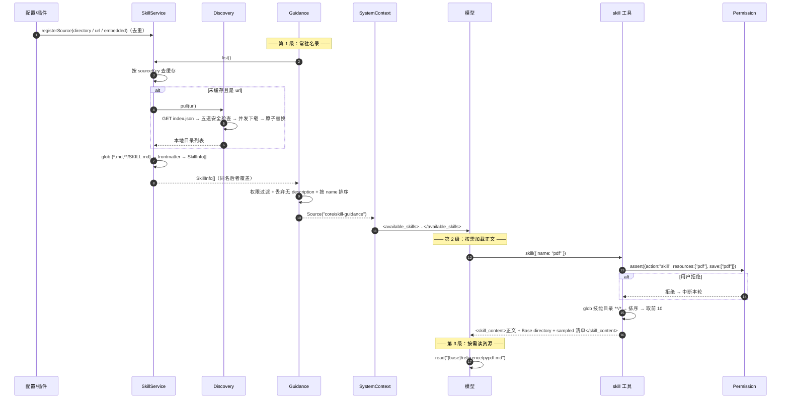

# SPEC-15 · 技能系统（三级渐进式披露）

> **优先级** P2 · **工作量** M · **依赖** SPEC-08（工具系统）、SPEC-09（权限）、SPEC-12（系统上下文来源）
> **分析原文** [ch15 技能系统](../../context-and-streaming/15-skills.md)
> **验收** [`acceptance/SPEC-15.yaml`](../acceptance/SPEC-15.yaml)（23 条）

让 50 篇操作手册常驻只花 2–4k token，而不是 10 万。

---

## 1. 目标与非目标

### 目标

你有 N 篇「怎么做某类任务」的操作手册（写 PDF、改数据库迁移、发版流程……）。三条朴素路线都不行：

| 做法 | 问题 |
| --- | --- |
| 全塞进 system prompt | 50 × 2000 字 ≈ 10 万 token，一句话没说就把窗口吃光 |
| 让模型自己去 `read` 文档 | 模型不知道有哪些文档、叫什么、什么时候该读 |
| 做成 RAG 检索 | 要维护向量库；召回不稳定；模型无法「知道自己有什么能力」 |

**三级渐进式披露**：

```
第 1 级：system context 里只放 <name> + <description>       ← 每个技能 30–80 token，常驻
              ↓ 模型判断任务匹配某个 description
第 2 级：调 skill 工具，把 SKILL.md 正文注入对话             ← 按需，一次几百到几千 token
              ↓ 正文里写着 "详见 reference/api.md"
第 3 级：模型用 read 工具读技能目录下的具体文件               ← 按需，模型自己决定
```

**只有第 1 级是常驻成本。** 另一半好处是**可解释**：模型明确知道自己有哪些能力、边界在哪，而不是靠检索碰运气。

### 非目标

- 不负责 system context 的注入机制（SPEC-12 负责，本规范只产出一个 Source）。
- 不负责权限规则的求值（SPEC-09 负责，本规范只声明动作名与资源名）。
- 不规定技能内容怎么写（§7 给出 `description` 的写法模板）。

---

## 2. 领域模型

```ts
export type SkillSource =
  | { type: "directory"; path: string }     // 本地目录
  | { type: "url"; url: string }            // 远程索引
  | { type: "embedded"; skill: SkillInfo }  // 代码内置

export interface SkillInfo {
  name: string
  description?: string        // 缺失 = 不进 system context（R-15-02）
  slash?: boolean             // 可作为斜杠命令直接触发
  location: string            // SKILL.md 的绝对路径
  content: string             // 去掉 frontmatter 的正文
}

/** 注册去重与加载缓存都用它 */
export const sourceKey = (s: SkillSource) =>
  s.type === "directory" ? `directory:${s.path}`
  : s.type === "url"     ? `url:${s.url}`
  :                        `embedded:${s.skill.name}`

export const sourceEquals = (a: SkillSource, b: SkillSource) => sourceKey(a) === sourceKey(b)

/** 进 system context 的最小投影 */
interface SkillSummary { name: string; description: string }
```

### 技能文件格式

```markdown
---
name: pdf
description: Use this skill whenever the user wants to do anything with PDF files...
---

# PDF 处理
## 步骤
1. ...
2. 详细的 API 用法见 `reference/pypdf.md`
```

两种布局都要支持：

| 布局 | glob 匹配 | `name` 来源 |
| --- | --- | --- |
| `skills/pdf.md`（扁平） | `*.md` | frontmatter，缺失时用文件名去扩展名 |
| `skills/pdf/SKILL.md`（目录） | `**/SKILL.md` | **必须**由 frontmatter 提供（见 R-15-04） |

frontmatter 三个字段**全部可选**。

---

## 3. 规范条款

### R-15-01 同名技能后加载覆盖先加载 · **必须**

**要求**：`list()` 用 `Map<name, SkillInfo>` 收集，按来源注册顺序 `set`。

**理由**：给用户一个可预期的覆盖规则（项目级技能覆盖全局技能）。

**常见错误**：用数组收集然后 `find` 取第一个——覆盖方向反了，且行为随实现细节漂移。

---

### R-15-02 只有带 `description` 的技能进 system context · **必须**

**要求**：渲染名录时过滤掉 `description === undefined` 的技能。它们**仍可**被 `skill` 工具按名加载。

**理由**：没有描述，模型无法判断何时该用它。列出来纯粹浪费常驻 token，还可能被误触发。

---

### R-15-03 名录按 name 字典序排序后渲染 · **必须**

**要求**：渲染前 `toSorted((a, b) => a.name.localeCompare(b.name))`。

**理由**：SPEC-12 R-12-02 的渲染确定性要求。来源加载顺序变化不能导致 baseline 文本抖动 → prompt cache 失效。

---

### R-15-04 子目录 `SKILL.md` 缺 `name` 时跳过 · **必须**

**要求**：`name` 的推导规则是

```
name = frontmatter.name
    ?? (dirname(filepath) === scanRoot ? basename(filepath, ".md") : undefined)
name === undefined  →  跳过这个文件
```

**理由**：子目录里的 `SKILL.md` 若用 `basename` 推导会得到 `"SKILL"`，那显然不是技能名。直接跳过，逼用户写 `name`。

---

### R-15-05 逐步失败即跳过，不抛错 · **必须**

**要求**：glob 失败 → 返回空数组；读文件失败 → 跳过；frontmatter 解析失败 → 跳过；缺 name → 跳过。

**理由**：**一个坏技能文件不能让整个技能系统瘫痪。**

---

### R-15-06 frontmatter 必须带未引号冒号的容错层 · **必须**

**要求**：标准 YAML 解析失败时，用一个 sanitizer 把「值里含未引号冒号」的行转成 YAML block scalar 后**重试一次**。

**理由**：技能描述里几乎必然出现冒号（`Use when: the user...`）。不带这一层，**用户写的第一个技能就会因为一个冒号加载失败**。

**算法**（逐行处理 frontmatter 区块）：

```
对每一行：
    是注释 / 空行 / 以空白开头（续行）        → 原样保留
    不匹配 /^([A-Za-z_]\w*)\s*:\s*(.*)$/     → 原样保留
    值为空 / 是 ">" / 是 "|" / 以引号开头     → 原样保留
    值里不含 ":"                             → 原样保留
    否则                                     → 拆成两行：`key: |-` 和 `  <值>`
```

---

### R-15-07 同一目录内按文件名排序后加载 · **必须**

**要求**：glob 结果 `sort()` 后再遍历。

**理由**：R-15-01 的覆盖语义只有在加载顺序确定时才有意义。

---

### R-15-08 技能受权限系统管控 · **必须**

**要求**：动作名固定为 `skill`，资源为技能名。

- **名录过滤**用 `evaluate("skill", name, agent.permissions).effect !== "deny"` —— 即 `ask` 也算可用。
- **实际加载**时 `skill` 工具再走一次 `assert`，那时才可能弹窗。

**理由**：名录是「你有什么能力」，弹窗是「这次准不准用」。`ask` 的技能应该出现在名录里，否则模型永远不会去请求它。

---

### R-15-09 「总是允许」只记住该技能 · **必须**

**要求**：`assert` 时传 `resources: [skill.name]` 且 `save: [skill.name]`。

**理由**：用户对 `pdf` 点「总是允许」不应该连带允许 `docx`。

> 见 SPEC-09 R-09-10 的 `resources` / `save` 分离。

---

### R-15-10 名录空时仍然渲染 · **必须**

**要求**：技能列表为空时渲染 `"No skills are currently available."`，**不是**返回空上下文。

**理由**：「明确告知没有技能」比「什么都不说」更能防止模型幻觉出一个 `skill` 调用。

---

### R-15-11 agent 完全禁用技能时返回空上下文 · **必须**

**要求**：`evaluate("skill", "*", agent.permissions).effect === "deny"` 且过滤后为空时，返回 `SystemContext.empty`。

**理由**：此时连「有技能系统」这件事都不该告诉模型，否则白占 token 还会引发无效调用。

---

### R-15-12 名录变化时全量重发并声明「取代」 · **必须**

**要求**：Context Source 的 `update` 渲染必须是

```
"The available skills have changed. This list supersedes the previous available skills list."
+ 完整的新名录
```

**不得**发 diff。

**理由**：名录是**枚举**。发 diff 会让模型不确定最终有哪些技能可用。

> 与 SPEC-12 R-12-14 的规则类来源一致。

---

### R-15-13 切换 agent 自动触发名录更新 · **应该**

**要求**：技能名录 Source 的 `load` 依赖当前 agent 的权限规则。

**理由**：换 agent → 可用技能集变化 → 下一个安全边界上 `reconcile` 检测到 → 自动发一条「available skills have changed」。**整个链路不需要任何 agent 切换的专门代码。** 这是本设计的威力所在。

---

### R-15-14 按 source key 缓存加载结果 · **应该**

**要求**：`list()` 按 `sourceKey(source)` 查缓存，进程内不重复读盘。

**理由**：`list()` 每轮都会被名录 Source 调用，不缓存就是每轮遍历全部技能目录。

**已知取舍**：本地技能目录**不做文件监听失效**，改了 SKILL.md 要重启才生效。想热更新就加 watcher + 缓存失效，代价是要处理 Context Source 的重新 reconcile。

---

### R-15-15 技能正文注入时附带采样的文件清单 · **必须**

**要求**：`skill` 工具的输出模板**四个要素缺一不可**：

| 要素 | 作用 | 漏了会怎样 |
| --- | --- | --- |
| `Base directory for this skill: /abs/path` | 模型知道去哪读文件 | 读不到第 3 级资源 |
| `Relative paths in this skill (e.g., scripts/, reference/) are relative to this base directory.` | 明确相对路径基准 | 模型用 cwd 拼路径 |
| `Note: file list is sampled.` | 告诉模型清单不完整 | 模型认定「没列出的文件不存在」 |
| `<skill_files>` 清单 | 让模型知道有什么可读 | 瞎猜文件名 |

---

### R-15-16 文件清单有硬上限 · **必须**

**要求**：清单最多 `FILE_LIMIT`（参考值 10）个文件，排序后取前 N。

**理由**：技能目录可能有几百个文件，全列会把第 2 级的成本推回第 1 级的量级。

---

### R-15-17 只对目录布局枚举文件 · **必须**

**要求**：仅当 `basename(skill.location) === "SKILL.md"` 时才枚举同目录文件；扁平布局返回空清单。

**理由**：扁平布局（`pdf.md`）没有专属目录，枚举会把整个 skills 目录列出来。

---

### R-15-18 URL 来源只接受 http/https · **必须**

**要求**：配置里的字符串被当作 URL 来源的条件是 `URL.canParse(s) && /^https?:$/.test(new URL(s).protocol)`。

**理由**：不做这个校验，`file://` 或自定义协议会变成**任意文件读取**。

---

### R-15-19 远程技能名与文件路径必须通过五道安全检查 · **必须**

**要求**：

| # | 检查 | 挡住什么 |
| --- | --- | --- |
| 1 | `isSafeSegment(skill.name)` | 技能名里的 `..` / `/` → 写到缓存目录外 |
| 2 | `isSafeRelativePath(file)`，**每段 `decodeURIComponent` 后再查** | `%2e%2e%2f` 这类编码穿越 |
| 3 | `new URL(file, skillUrl).origin === source.origin` | 索引里塞一个指向别的域名的文件 |
| 4 | `contains(root, resolve(root, file)) && destination !== root` | 解析后仍在技能目录内 |
| 5 | `contains(sourceRoot, root) && root !== sourceRoot` | 技能目录仍在缓存根内 |

**任一文件不合法 → 丢弃整个技能**，不是跳过那个文件。

**理由**：半个技能比没有技能更危险——模型会按残缺的手册操作。

---

### R-15-20 远程索引必须声明入口文件 · **必须**

**要求**：`skill.files` 里必须包含 `SKILL.md` 或 `<name>.md`，否则丢弃该技能。

**理由**：没有入口文件的技能下载下来也加载不了，只是污染缓存目录。

---

### R-15-21 缓存根按来源 URL 哈希分桶 · **必须**

**要求**：`sourceRoot = <cache>/skills/<hash(baseUrl)>`。

**理由**：不同来源的同名技能不会互相覆盖。

---

### R-15-22 远程版本更新必须原子且可回滚 · **必须**

**要求**：staging → 校验 → rename 旧目录为 backup → rename staging 为正式 → 删 backup。

- 任一文件下载失败 → **放弃更新，保留旧版本**
- staging 里没有入口文件 → 放弃
- rename 失败 → **回滚 backup**
- 无论成败 → **总是清理 staging**
- 整个块的异常只记日志 → **远程技能更新失败不能让会话起不来**

**理由**：技能目录被更新到一半 = 模型按残缺手册操作，或者技能目录直接变空。

---

### R-15-23 远程拉取带并发限制与抖动退避 · **应该**

**要求**：技能级并发 4、文件级并发 8；HTTP 重试 2 次，指数退避从 200ms 起，**带 jitter**。

**理由**：没有 jitter，多个技能同时失败时会同步重试打爆服务器。

---

## 4. 算法规范

### 4.1 来源注册（去重）

```
registerSource(source):
    if draft.sources.some(s => sourceEquals(s, source)): return     # 幂等
    draft.sources.push(source)
```

来源的四个注册点：

1. **配置目录约定**：每个配置目录下的 `skill/` 和 `skills/` **两个名字都收**。
2. **配置显式声明**：`opencode.json` 的 `skills` 数组 —— http/https 走 URL 来源（R-15-18），其余展开 `~/`、相对路径按配置文件所在目录解析。
3. **代码内置**（`embedded`）：用一个假的绝对路径作 `location`（如 `/builtin/x.md`）。`location` 只有两个用途——求 `dirname` 和判断文件名是否 `SKILL.md`——假路径两者都能正确工作（会因文件名不是 `SKILL.md` 而跳过枚举，正是期望行为）。
4. **插件动态注册**。

### 4.2 加载与解析

```
load(source) -> SkillInfo[]:
    if source.type == "embedded": return [source.skill]

    directories = source.type == "directory"
                ? [source.path]
                : discovery.pull(source.url)          # §4.6

    skills = []
    for directory in directories:
        files = glob("{*.md,**/SKILL.md}", { cwd: directory, absolute: true,
                                             onlyFiles: true, dot: true })
                catch → []                                        # R-15-05
        for filepath in files.sorted():                           # R-15-07
            content = readFile(filepath) catch → continue         # R-15-05
            md = parseMarkdown(content)                           # 带 sanitize 重试，R-15-06
            if !md: continue
            fm = decodeFrontmatter(md.data)
            if !fm: continue
            name = fm.name
                ?? (dirname(filepath) == directory
                    ? basename(filepath, ".md") : undefined)      # R-15-04
            if !name: continue
            skills.push({ name, description: fm.description, slash: fm.slash,
                          location: filepath, content: md.content })
    return skills
```

### 4.3 缓存与合并

```
list() -> SkillInfo[]:
    result = new Map<string, SkillInfo>()
    for source in sources:
        key    = sourceKey(source)
        loaded = cache.get(key) ?? load(source)                   # R-15-14
        cache.set(key, loaded)
        for skill in loaded: result.set(skill.name, skill)        # R-15-01 后者覆盖
    return [...result.values()]
```

### 4.4 名录渲染（第 1 级）

```
render(summaries) -> string:
    [
      "Skills provide specialized instructions and workflows for specific tasks.",
      "Use the skill tool to load a skill when a task matches its description.",
      ...(summaries.length == 0
          ? ["No skills are currently available."]                # R-15-10
          : ["<available_skills>",
             ...summaries.flatMap(s => [
                "  <skill>",
                `    <name>${s.name}</name>`,
                `    <description>${s.description}</description>`,
                "  </skill>"]),
             "</available_skills>"]),
    ].join("\n")

guidanceSource(agent) -> Source | empty:
    if !agent: return empty
    permitted = list().filter(s =>
        evaluate("skill", s.name, agent.permissions).effect != "deny")        # R-15-08
    if permitted.isEmpty and evaluate("skill", "*", agent.permissions).effect == "deny":
        return empty                                                          # R-15-11
    available = permitted
        .filter(s => s.description != undefined)                              # R-15-02
        .map(s => ({ name: s.name, description: s.description }))
        .sortBy(s => s.name)                                                  # R-15-03
    return SystemContext.make({
        key:      "core/skill-guidance",
        load:     available,
        baseline: render,
        update:   (_prev, cur) => [
            "The available skills have changed. This list supersedes the previous available skills list.",
            render(cur)].join("\n"),                                          # R-15-12
        removed:  () => "Skill guidance is no longer available. Do not use any previously listed skill.",
    })
```

### 4.5 `skill` 工具（第 2 级）

```
execute({ name }, ctx):
    skill = list().find(s => s.name == name)
    if !skill: fail(`Unable to load skill ${name}`)

    permission.assert({ action: "skill",
                        resources: [skill.name], save: [skill.name],          # R-15-09
                        sessionID: ctx.sessionID, agent: ctx.agent,
                        source: { type: "tool", messageID: ..., callID: ... } })

    directory = dirname(skill.location)
    files = basename(skill.location) == "SKILL.md"                            # R-15-17
          ? glob("**/*", { cwd: directory, absolute: true, onlyFiles: true, dot: true })
              .filter(f => basename(f) != "SKILL.md")
              .sorted()
              .slice(0, FILE_LIMIT)                                           # R-15-16
          : []
    return { name: skill.name, directory, output: toModelOutput(skill, files) }
```

**输出模板**（R-15-15，四要素）：

```
<skill_content name="{name}">
# Skill: {name}

{content.trim()}

Base directory for this skill: {directory}
Relative paths in this skill (e.g., scripts/, reference/) are relative to this base directory.
Note: file list is sampled.

<skill_files>
<file>{f1}</file>
...
</skill_files>
</skill_content>
```

**工具描述**（写给模型看的，直接抄）：

```
Load a specialized skill when the task at hand matches one of the available skills in the system context.

Use this tool to inject the skill's instructions and resources into the current conversation. The output may contain detailed workflow guidance as well as references to scripts, files, etc. in the same directory as the skill.

The skill name must match one of the available skills in the system context.
```

### 4.6 远程拉取

**索引格式** `GET {url}/index.json`：

```json
{
  "skills": [
    { "name": "pdf", "version": "1.2.0",
      "files": ["SKILL.md", "reference/pypdf.md", "scripts/convert.py"] }
  ]
}
```

**安全校验函数**（R-15-19）：

```
isSafeSegment(v):
    v != "" and v != "." and v != ".."
    and !v.includes("/") and !v.includes("\\") and !v.includes("\0")

isSafeRelativePath(v):
    v != "" and !v.includes("\\") and !v.includes("\0")
    and !v.includes("?") and !v.includes("#")
    and !URL.canParse(v)
    and !posix.isAbsolute(v) and !win32.isAbsolute(v)
    and v.split("/").every(seg => {
          decoded = decodeURIComponent(seg)   catch → false     # ← 解码后再查
          return isSafeSegment(decoded)
        })
```

**单个技能的处理**：

```
pullSkill(source, skill, sourceRoot):
    if !isSafeSegment(skill.name): return []                              # ①
    if !skill.files.includes("SKILL.md")
       and !skill.files.includes(`${skill.name}.md`): return []           # R-15-20

    root = resolve(sourceRoot, skill.name)
    if !contains(sourceRoot, root) or root == sourceRoot: return []       # ⑤

    resolved = skill.files.map(file => {
        if !isSafeRelativePath(file): return undefined                    # ②
        resource = new URL(file, skillUrl)  catch → undefined
        if resource.origin != source.origin: return undefined             # ③
        destination = resolve(root, file)
        if !contains(root, destination) or destination == root: return undefined  # ④
        return { url: resource.href, destination, file }
    })
    if resolved.some(x => x == undefined): return []                      # 任一不合法 → 整个技能丢弃

    version = skill.version
    current = version == null ? null : readFileSafe(root + "/.version")

    if version == null or current == version:
        # 无版本或版本未变 → 只补缺失文件（download 遇到已存在就跳过）
        forEach(resolved, f => download(f.url, f.destination), { concurrency: 8 })
    else:
        atomicRefresh(root, resolved, skill, version)                     # §4.7
    return [root]
```

### 4.7 原子版本更新（R-15-22）

```
atomicRefresh(root, files, skill, version):
    token   = randomUUID()
    staging = `${root}.tmp-${token}`
    backup  = `${root}.old-${token}`
    try:
        ok = forEach(files, f => download(f.url, resolve(staging, f.file)),
                     { concurrency: 8 })
        if !ok.every(true): return                       # 有文件失败 → 保留旧版本
        if !exists(staging + "/SKILL.md")
           and !exists(staging + `/${skill.name}.md`): return
        writeFile(staging + "/.version", version)

        uninterruptible:                                  # ← 这一段必须不可中断
            cached = exists(root)
            if cached: rename(root, backup)
            try: rename(staging, root)
            catch e:
                if cached: rename(backup, root) ignore    # 回滚
                throw e
            if cached: remove(backup, { recursive: true }) ignore
    catch e:
        log.error("failed to refresh skill", { skill: skill.name, error: e })   # 只记日志
    finally:
        remove(staging, { recursive: true, force: true }) ignore                # 总是清理
```

### 4.8 时序



---

## 5. 可配置参数

| 参数 | 参考默认值 | 可调范围 | 调大 / 调小的影响 |
| --- | --- | --- | --- |
| `FILE_LIMIT` | 10 | 5–30 | 调大：模型更清楚有什么资源，但第 2 级成本上升；调小：模型可能不知道关键脚本存在 |
| 技能级并发 | 4 | 1–16 | 调大：冷启动更快，但远程服务压力大 |
| 文件级并发 | 8 | 1–32 | 同上 |
| HTTP 重试次数 | 2 | 0–5 | 调大：弱网更稳，但失败时冷启动变慢 |
| 退避起点 | 200ms（带 jitter） | 100–1000ms | jitter **不可省** |
| 目录扫描名 | `skill/` + `skills/` | 任选 | 两个都收可以省掉一类用户困惑 |
| 本地缓存失效 | 进程内不失效 | 可加 watcher | 加了要处理 Context Source 重新 reconcile |

---

## 6. 边界情况

| 场景 | 正确处理 | 错误处理的后果 |
| --- | --- | --- |
| frontmatter 有未引号冒号 | sanitize 后重试 | 用户第一个技能就加载失败 |
| 某个技能文件损坏 | 跳过，其余照常 | 整个技能系统瘫痪 |
| 子目录 `SKILL.md` 没写 `name` | 跳过 | 出现一个叫 `SKILL` 的假技能 |
| 技能没写 `description` | 不进名录，但可按名加载 | 占 token 且模型不知何时用 |
| 两个来源有同名技能 | 后加载覆盖 | 静默歧义 |
| 名录为空 | 仍渲染「当前没有技能」 | 模型幻觉出 skill 调用 |
| agent 完全禁用技能 | 返回空上下文 | 白占 token |
| 切换 agent | Context Source 的 `update` 自动发「列表已替换」 | 模型继续用已失效的技能 |
| 改了 SKILL.md | 当前实现需重启 | 想热更新要加 watcher |
| 远程技能名含 `..` | 丢弃 | 写到缓存目录外 |
| 远程路径是 `%2e%2e%2f` | 解码后检查并丢弃整个技能 | 编码穿越 |
| 远程文件指向别的域名 | 丢弃整个技能 | 索引可让你下载任意 URL |
| 某文件下载失败 | 放弃更新，保留旧版本 | 半个技能被装上 |
| rename 失败 | 回滚 backup | 技能目录变空 |
| staging 残留 | 总是清理 | 缓存目录无限增长 |
| 远程服务不可用 | 记日志，返回空 | 会话起不来 |
| 技能目录有 500 个文件 | 清单取前 10 + 标注 sampled | 第 2 级成本爆炸 |
| 扁平布局技能 | 不枚举文件 | 把整个 skills 目录列进去 |
| 技能正文里的相对路径 | 输出显式声明 base directory | 模型用 cwd 拼，读不到 |

---

## 7. `description` 的写法（决定触发率）

**技能能不能被正确触发，几乎完全取决于 `description`。** 结构是三段，**一段都不能少**：

```
Use ONLY when the user is editing or creating opencode's own configuration:
opencode.json, opencode.jsonc, files under .opencode/, or files under
~/.config/opencode/.                                              ← ① 正向触发条件（具体到文件名/路径）

Also use when creating or fixing opencode agents, subagents, commands,
skills, plugins, MCP servers, or permission rules.                ← ② 补充触发条件

Do not use for the user's own application code, or for any project
that is not configuring opencode itself.                          ← ③ 明确的排除条件
```

**只写正向条件的描述会导致过度触发**——模型宁可多调也不愿漏调。

另一个模板（宽触发型）：

```
Use this skill whenever the user wants to do anything with PDF files. This includes
reading or extracting text/tables from PDFs, combining or merging multiple PDFs, ...
If the user mentions a .pdf file or asks to produce one, use this skill.
```

---

## 8. 反模式

| 反模式 | 后果 |
| --- | --- |
| 把技能正文全塞进 system prompt | 窗口被吃光，本规范白做 |
| 名录不排序 | baseline 文本抖动，prompt cache 全失效 |
| 名录变化时发 diff | 模型不确定最终有哪些技能 |
| 列出无 description 的技能 | 占 token + 误触发 |
| frontmatter 不带 sanitize 容错 | 用户第一个技能就失败 |
| 一个坏文件抛错终止加载 | 整个技能系统瘫痪 |
| 「总是允许」记住所有技能 | 权限形同虚设 |
| 名录过滤用 `=== "allow"` | `ask` 的技能永远不会被请求 |
| 文件清单不设上限 / 不标 sampled | 成本爆炸 / 模型认定文件不存在 |
| 输出不带 base directory | 第 3 级披露断链 |
| URL 来源不校验协议 | 任意文件读取 |
| 路径检查不做 URL 解码 | 编码穿越 |
| 远程更新逐文件覆盖（非原子） | 半个技能被装上 |
| 远程失败抛到会话层 | 网络抖动导致会话起不来 |
| `description` 只写正向条件 | 过度触发 |

---

## 9. 分级实现路径

### 最小可用版（1 天，只做本地目录）

保留：
- `loadSkillsFromDirectory`（glob `{*.md,**/SKILL.md}` + frontmatter + sanitize 容错）
- `listSkills`（同名后者覆盖）
- `renderSkillGuidance`（过滤无 description、按 name 排序、空名录也渲染）
- `skill` 工具（四要素输出模板 + `FILE_LIMIT`）

可以先砍掉：`url` 来源与整个 discovery 模块、`embedded` 来源、按 source key 缓存（技能少时每次读盘也还好）、权限过滤（单 agent 时）。

**绝对不能砍**：frontmatter sanitize 容错（R-15-06）、名录排序（R-15-03）、输出四要素（R-15-15）、`Note: file list is sampled.`。

### 完整版

补齐远程来源（五道安全检查 + 原子更新）、权限过滤、缓存、embedded 来源。

### 落地步骤

1. 定 `SkillInfo` 和 `SkillSource`（§2）。
2. 实现 frontmatter 解析 + **sanitize 容错层**（R-15-06，别省）。
3. 实现 `loadSkillsFromDirectory`：glob 两种布局、逐步失败即跳过、`sort()` 保序。
4. 实现 `listSkills`：按 source key 缓存，同名后者覆盖。
5. 实现 `renderSkillGuidance`：过滤无 description、按 name 排序、空名录也渲染。
6. 接成一个 Context Source（SPEC-12）：`baseline` = render，`update` = 「supersedes」+ render，`removed` = 「不再可用」。
7. 实现 `skill` 工具（§4.5），输出模板四要素全带上。
8. 接权限（SPEC-09）：动作 `skill`、资源为技能名、`save` 只存该名。
9. 写 2–3 个真实技能验证触发率，重点打磨 `description`（§7 的三段结构）。
10. 需要远程技能时再做 discovery，**五道安全检查一条都不能少**。

### 你需要自己提供的依赖

| 依赖 | 用途 | 建议 |
| --- | --- | --- |
| frontmatter 解析 | SKILL.md 元数据 | `gray-matter` / `python-frontmatter` + 自己的 sanitize 层 |
| glob | 技能发现与文件枚举 | `fast-glob`，注意 `dot: true` |
| Context Source | 名录进 system prompt | SPEC-12 |
| 权限系统 | 技能级授权 | SPEC-09 |
| HTTP + 重试 | 远程技能 | 带 jitter 的指数退避 |

---

## 10. 验收

见 [`acceptance/SPEC-15.yaml`](../acceptance/SPEC-15.yaml)（23 条）。

**必须优先验证**：
- frontmatter 值含未引号冒号时正常加载（A-15-18）——最高频的真实故障。
- 打乱来源注册顺序后名录文本逐字节相同（A-15-17）——决定 prompt cache 能不能保住。
- 远程文件路径为 `%2e%2e%2fevil` 时整个技能被丢弃（A-15-08）——安全底线。
- 用户对 pdf 点「总是允许」后加载 docx 仍然询问（A-15-22）。
