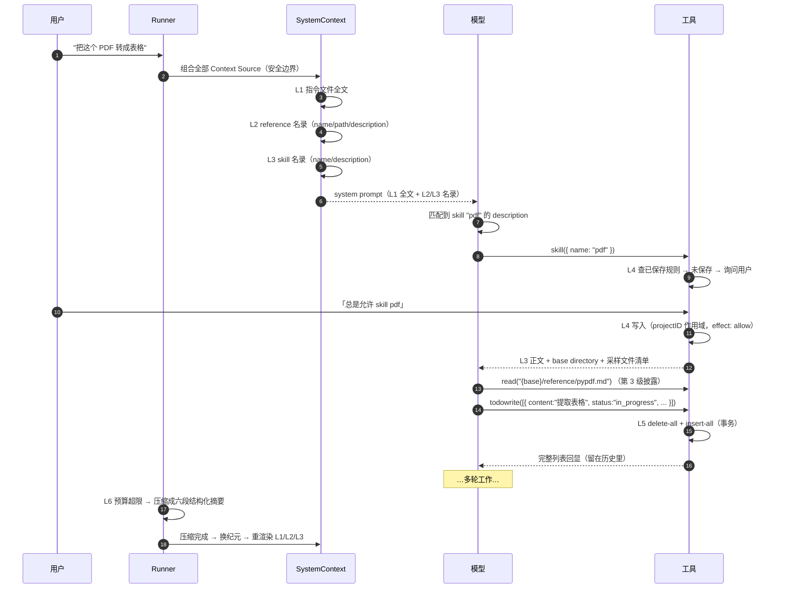

# SPEC-16 · 记忆分层

> **优先级** P2 · **工作量** M · **依赖** SPEC-12（系统上下文来源）、SPEC-15（技能系统）
> **分析原文** [ch16 记忆系统](../../context-and-streaming/16-memory.md)
> **验收** [`acceptance/SPEC-16.yaml`](../acceptance/SPEC-16.yaml)（26 条）

**本规范最值得抄的是「拆法」本身**：「AI 的记忆」实际上是六个完全不同的问题，用一个 KV 存储去解会全部解错。

---

## 1. 目标与非目标

### 目标

不要建一个叫 `memory` 的模块。建六个各自独立、各有生命周期的机制：

| 层 | 记忆类型 | 载体 | 作用域 | 谁写 | 怎么进上下文 |
| --- | --- | --- | --- | --- | --- |
| **L1** | 程序性记忆（规则） | `AGENTS.md` 类指令文件 | 全局 + 项目，跨会话 | 人（或让模型写） | **全文常驻** system context |
| **L2** | 语义记忆（外部知识） | 本地目录 / git 仓库 | 项目，跨会话 | 人（配置） | 名录常驻，内容按需 `read` |
| **L3** | 技能记忆（可执行流程） | SKILL.md + 资源 | 全局 + 项目，跨会话 | 人 | 名录常驻，正文按需加载（SPEC-15） |
| **L4** | 决策记忆（用户偏好） | 已保存的权限规则 | 项目，跨会话 | 用户点「总是允许」 | **不进上下文**，只影响授权判定 |
| **L5** | 工作记忆（当前任务） | todo 列表 | 会话 | 模型（`todowrite` 工具） | **不进 system context**，UI 独立展示 |
| **L6** | 情景记忆（对话本身） | 消息历史 + 压缩摘要 | 会话 | 系统自动 | 就是历史本身（SPEC-14） |

**核心判断**：不同记忆的「进入上下文的方式」必须不同。L1 必须常驻（否则规则失效），L2/L3 必须是「名录常驻 + 内容按需」（否则爆窗口），L4 根本不该进上下文（它是判定规则不是知识），L5 进 UI 不进 prompt，L6 靠压缩控制。

### 非目标

- L3 的完整规范在 SPEC-15，本规范只把它放进分层里对照。
- L6 的完整规范在 SPEC-14 + SPEC-01，本规范只补一条「摘要模板即记忆 schema」的视角。
- 不做向量检索 / RAG。L2 的方案是「挂一个目录 + 一段描述，交给已有的 read/grep/glob 工具」。

---

## 2. 领域模型

```ts
/** L1 */
interface InstructionFile { path: string; content: string }

/** L2 */
type ReferenceSource =
  | { type: "local"; path: string; description?: string; hidden?: boolean }
  | { type: "git"; repository: string; branch?: string; description?: string; hidden?: boolean }

interface ReferenceInfo {
  name: string
  path: string              // 本地路径；git 来源是「算出来的」缓存路径
  description?: string      // 缺失 = 不进上下文
  hidden?: boolean          // 仅影响 UI 文件树，不影响模型可见性
  source: ReferenceSource
}

/** L4 */
interface SavedPermission {
  id: string
  projectID: string         // ← 作用域边界（R-16-16）
  action: string
  resource: string
  // effect 不存：恒为 "allow"（R-16-15）
}

/** L5 */
interface Todo {
  content: string
  status: string            // "pending" | "in_progress" | "completed" | "cancelled"，但类型是 string（R-16-20）
  priority: string          // "high" | "medium" | "low"
}
```

---

## 3. 规范条款

### 3.1 跨层通则

#### R-16-01 规则/枚举类记忆变化时全量重发 · **必须**

**要求**：L1、L2、L3 三层的 Context Source `update` 渲染**必须**是「完整新内容 + 明确的取代声明」，**不得**发 diff。

参考措辞（三层各自独立，措辞刻意一致）：

| 层 | update 措辞 |
| --- | --- |
| L1 | `These instructions replace all previously loaded ambient instructions.` |
| L2 | `The available project references have changed. This list supersedes the previous reference list.` |
| L3 | `The available skills have changed. This list supersedes the previous available skills list.` |

**理由**：指令是命令式的。发「删除了第 3 条」这样的 diff，模型要自己在脑子里重建最终状态，而且历史里同时存在旧版本和 diff，模型不确定该听哪个。

---

#### R-16-02 体积不可控的记忆，名录进上下文、内容留在工具后面 · **必须**

**要求**：L2 只把 `name` / `path` / `description` 放进上下文；L3 只把 `name` / `description` 放进上下文。**内容一律不进**。

**理由**：这是唯一能让「记忆量」和「常驻成本」解耦的做法。

---

#### R-16-03 判定规则不是知识 · **必须**

**要求**：L4（用户偏好 / 已保存授权）**不得**出现在 system context 里。

**理由**：模型不需要（也不应该）知道用户批准过什么——知道了反而可能诱导它去做更多同类操作。**把用户偏好塞进 system prompt 是常见错误。**

---

#### R-16-04 每一层必须区分「观测失败」与「观测到空」 · **必须**

**要求**：见 SPEC-12 R-12-05 的 `UNAVAILABLE` 语义。每一层的加载函数都要能返回三态：有内容 / 确认为空 / 观测失败。

**理由**：把「读不到」当成「被删了」会让模型突然不守规矩。

---

#### R-16-05 跨会话的层以项目为作用域 · **必须**

**要求**：L1、L2、L4 的作用域边界是**项目**，不是会话。新开会话仍然生效。

**理由**：这些记忆描述的是「这个代码库怎么干活」，与会话无关。

---

### 3.2 L1 · 程序性记忆

#### R-16-06 指令文件的发现规则 · **必须**

**要求**：

1. 全局配置目录下的指令文件（**永远尝试**）
2. 从当前工作目录**向上逐级**扫到项目根，每一级的指令文件都收
3. 去重，**全局的排在最前**（后加载的优先级更高 → 越靠近 cwd 的规则越具体）
4. 设了禁用环境变量、或当前目录不在项目内 → **跳过第 2 步**

**理由**：第 4 条防两件事——CI 环境读到开发者的本地规则；在项目外启动时扫到别人的项目配置。

---

#### R-16-07 只有「明确发现」的文件读失败才算不可用 · **必须**

**要求**：

```
if files.some((f, i) => f 读失败 && discovered.has(paths[i])):
    return UNAVAILABLE
```

- 全局文件不存在 → **正常**（它不在 `discovered` 里），返回已读到的列表
- 向上扫描**明确发现了**某个指令文件、读它却失败 → **`UNAVAILABLE`**

**理由**：前者是「成功观测到不存在」，后者是「观测失败」。误判成失败会阻塞每一轮。

---

#### R-16-08 零个文件时返回「来源不存在」而非空内容 · **必须**

**要求**：一个指令文件都没有时返回 `SystemContext.empty`（该 key 从快照消失），**不是**一个内容为空串的 Source。

**理由**：后者会在 system prompt 里留下一段空的 `Instructions from:`；前者走 `removed` 渲染路径，语义正确。

---

#### R-16-09 任何异常与 defect 都兜底成不可用 · **必须**

**要求**：`observe()` 的所有异常、甚至 defect，都 catch 成 `UNAVAILABLE`。

**理由**：**绝不让指令加载失败把整轮请求打挂。** 保留上次已告知模型的状态是永远更好的选择。

---

#### R-16-10 让模型写记忆时必须给出取舍判据 · **应该**

**要求**：如果你提供「让模型生成项目规则文件」的命令，prompt 里**必须**包含：

- **收录判据**：`Every line should answer: "Would an agent likely miss this without help?" If not, leave it out.`
- **信源优先级**：`Prefer executable sources of truth over prose. If docs conflict with config or scripts, trust the executable source and only keep what you can verify.`
- **更新语义**：`improve it in place rather than rewriting blindly. Preserve verified useful guidance, delete fluff or stale claims, and reconcile it with the current codebase.`
- **提问上限**：`Only ask the user questions if the repo cannot answer something important. Use the question tool for one short batch at most.`

完整的收录 / 排除清单见 §6。

**理由**：不给判据，模型会写出一篇「本项目使用 TypeScript」级别的废话。「可执行的事实优先于散文」这一条能挡住绝大多数过时记忆。

---

### 3.3 L2 · 语义记忆

#### R-16-11 远程来源的路径先算出来、内容后台拉 · **必须**

**要求**：git 来源的本地路径用**纯函数**从仓库地址 + 分支算出来，立刻写进物化结果；clone / pull 在后台执行，**不阻塞配置加载**。

**理由**：模型可能在拉完之前就去读——读到空目录或旧版本。这是**刻意接受的取舍**：宁可给旧资料，不要卡住会话。

**配套**：clone 失败只记警告，其它 reference 与会话不受影响。

---

#### R-16-12 非法仓库地址 / 分支名跳过而非报错 · **必须**

**要求**：仓库地址解析失败、非远程仓库、分支名不合法 → 跳过该条。

**理由**：一条坏配置不能让所有 reference 失效。

---

#### R-16-13 reference 名录给绝对路径，技能名录不给 · **应该**

**要求**：L2 的名录里**要有** `<path>`；L3 的名录里**不要有**路径。

**理由**：技能有 `SKILL.md` 这个约定入口，值得做专用工具做渐进式披露；reference 是「一堆文件」没有固定入口，直接暴露路径让模型用通用 `read` / `grep` 工具探索更简单。

---

#### R-16-14 `hidden` 只影响 UI，不影响模型可见性 · **应该**

**要求**：模型可见性完全由 `description` 是否存在决定；`hidden` 只用于在文件树里隐藏。

**理由**：两个正交的关注点，混在一起会让「为什么模型看不见」变得难以排查。

---

### 3.4 L4 · 决策记忆

#### R-16-15 保存的规则 effect 恒为 allow · **必须**

**要求**：已保存的权限规则的 `effect` **硬编码**为 `"allow"`，不存这个字段。

**理由**：保存的记忆只能**放宽**，不能收紧——收紧应该改 agent 配置。

---

#### R-16-16 保存按项目作用域 · **必须**

**要求**：保存时带 `projectID`，读取时按 `projectID` 过滤。

**理由**：在 A 项目允许的 `rm -rf build/` 不能泄漏到 B 项目。

---

#### R-16-17 agent 的 deny 不可被保存的规则覆盖 · **必须**

**要求**：agent 的 `deny` 规则**先单独判一次**，先于已保存规则。

**理由**：这是安全底线。否则用户一次点击就能打开整个沙箱。

> 实现见 SPEC-09 R-09-06。

---

#### R-16-18 记住的粒度由工具声明 · **必须**

**要求**：由每个工具的 `save` 字段决定记住什么——`read` 存 `["*"]`（一次批准全部放行），`bash` 存具体命令（逐条批准）。

**理由**：**这个粒度选择就是「用户体验」和「安全」的平衡点**，是整个权限系统里最需要按你自己的产品调的一处。

---

### 3.5 L5 · 工作记忆

#### R-16-19 全量替换语义 · **必须**

**要求**：`todowrite` 是 delete-all + insert-all，**在一个事务里**。不做 diff、不做增量更新。用数组下标作 `position` 记顺序。

**理由**：模型每次都传完整列表。做 diff 需要稳定 id，而模型不会可靠地维护 id（它会重写整个数组）。

**代价**：todo 项没有稳定身份，前端要按位置重建（影响动画连续性）。这是可接受的。

---

#### R-16-20 状态字段用宽松类型 + 描述约束 · **应该**

**要求**：`status` / `priority` 声明为字符串，合法值只写在**给模型看的描述**里。

**理由**：模型偶尔会写 `"in-progress"` 或 `"done"`。用严格枚举会让整个工具调用**输入校验失败**，模型得重试，浪费一轮。**容错优先于严格。**

**替代方案**：如果你的 UI 需要严格状态，在 `execute` 里做归一化（`"done"` → `"completed"`），而**不是**在 schema 层拒绝。

---

#### R-16-21 空数组是合法输入 · **必须**

**要求**：模型传空数组时，事务里 delete 之后直接返回，**不执行** insert。

**理由**：多数 SQL 驱动对空 values 列表会报错。

---

#### R-16-22 完整列表回显给模型 · **必须**

**要求**：`toModelOutput` 返回格式化后的完整列表（`JSON.stringify(todos, null, 2)`）。

**理由**：既确认写入成功，也让模型在后续轮次中不用重新回忆自己写过什么。

---

#### R-16-23 todo 不做 Context Source · **必须**

**要求**：todo **不是** Context Source。它通过事件推给前端（独立的 todo dock），并在时间线里**隐藏**其工具卡片。模型对它的记忆来自**工具调用的回显**留在历史里。

**理由**：做成常驻 Context Source 会让每次列表变化都产生一条系统消息，污染历史；靠工具回显则天然随历史留存，且压缩时会被摘要吸收。

> 前端隐藏见 SPEC-05 的 `HIDDEN_TOOLS`。

---

### 3.6 L6 · 情景记忆

#### R-16-24 压缩摘要模板即情景记忆的 schema · **应该**

**要求**：与其自己发明一套记忆 schema，直接用这六段：

```
## Objective          ← 目标（最不该忘的）
## Important Details  ← 约束、决定及其理由
## Work State
   ### Completed      ← 已完成
   ### Active         ← 进行中
   ### Blocked        ← 卡住的
## Next Move          ← 下一步
## Relevant Files     ← 相关文件
```

配合硬规则 `Preserve exact file paths, symbols, commands, error strings, URLs, and identifiers when known.`

**理由**：这六段覆盖了「继续工作所需的最小信息集」。

---

#### R-16-25 压缩后 L1/L2/L3 必须重新进入 baseline · **必须**

**要求**：压缩 → 换纪元 → baseline 重渲染 → L1/L2/L3 全部回到上下文。

**理由**：不做这一步，压缩后模型就忘记了项目规则。

> 实现由 SPEC-13 R-13-09 保证。

---

## 4. 算法规范

### 4.1 L1 观测

```
observeInstructions(cwd, projectRoot, globalConfigDir):
    rel           = relative(projectRoot, resolve(cwd))
    insideProject = rel == "" or (!rel.startsWith("..") and !isAbsolute(rel))

    discovered = (DISABLE_PROJECT_CONFIG or !insideProject)
               ? []
               : findUpwards("AGENTS.md", start = cwd, stop = projectRoot)     # R-16-06
    paths = dedupe([join(globalConfigDir, "AGENTS.md"), ...discovered])        # 全局在最前

    files = await all(paths.map(p => readFileSafe(p)))
            # 返回 { path, content } / undefined(不存在) / null(读失败)

    if files.some((f, i) => f == null and discovered.has(paths[i])):           # R-16-07
        return UNAVAILABLE
    return files.filter(非空)

# 注册时的三态（R-16-08 / R-16-09）
register({
  key: "core/instructions",
  load: () => observeInstructions(...)
      .then(v => v == UNAVAILABLE ? source(UNAVAILABLE)
                : v.length == 0   ? SystemContext.empty
                :                   source(v))
      .catch(() => source(UNAVAILABLE)),
})
```

`findUpwards` 的返回顺序：**项目根在前，当前目录在后**（后者优先级更高）。

**渲染**：

```
render(files) = files.map(f => `Instructions from: ${f.path}\n${f.content}`).join("\n\n")

source(value) = SystemContext.make({
    key:      "core/instructions",
    load:     value,
    baseline: render,
    update:   (_prev, cur) =>
        "These instructions replace all previously loaded ambient instructions.\n\n" + render(cur),   # R-16-01
    removed:  () => "Previously loaded instructions no longer apply.",
})
```

### 4.2 L2 物化与名录

```
materialize(draft):
    materialized.clear()
    for [name, source] of draft.list():
        if source.type == "local":
            materialized.set(name, { name, path: source.path, description, hidden, source })
            continue
        repo = parseRepository(source.repository)
        if !repo or !isRemote(repo): continue                              # R-16-12
        if source.branch and !validBranch(source.branch): continue         # R-16-12
        path = cachePath(reposRoot, repo, source.branch)                   # ← 纯函数，立刻可用
        materialized.set(name, { name, path, description, hidden, source })
        forkInBackground(                                                   # R-16-11
            ensureClone(repo, source.branch).catch(warn))
    publish(Event.ReferenceUpdated)
```

**名录渲染**：

```
render(refs) = [
    "Project references provide additional directories that can be accessed when relevant.",
    "<available_references>",
    ...refs.flatMap(r => [
        "  <reference>",
        `    <name>${r.name}</name>`,
        `    <path>${r.path}</path>`,                                       # R-16-13
        ...(r.description == null ? [] : [`    <description>${r.description}</description>`]),
        "  </reference>"]),
    "</available_references>",
].join("\n")

guidanceSource():
    available = list()
        .filter(r => r.description != null)          # 无描述不进上下文
        .map(r => ({ name, path, description }))
        .sortBy(r => r.name)                         # SPEC-12 R-12-02 渲染确定性
    if available.isEmpty: return SystemContext.empty
    return SystemContext.make({
        key: "core/reference-guidance",
        load: available,
        baseline: render,
        update: (_prev, cur) => [
            "The available project references have changed. This list supersedes the previous reference list.",
            render(cur)].join("\n"),                                        # R-16-01
        removed: () => "Project reference guidance is no longer available. Do not use previously listed references.",
    })
```

### 4.3 L4 读取

```
savedRules(projectID):
    return saved.list({ projectID })                                        # R-16-16
        .map(item => ({ action: item.action, resource: item.resource, effect: "allow" }))   # R-16-15
```

求值顺序（SPEC-09）：**agent deny → 已保存规则 → agent 其余规则 → 默认 ask**。

### 4.4 L5 全量替换

```sql
CREATE TABLE todo (
  session_id TEXT NOT NULL REFERENCES session(id) ON DELETE CASCADE,
  content    TEXT NOT NULL,
  status     TEXT NOT NULL,
  priority   TEXT NOT NULL,
  position   INTEGER NOT NULL
);
CREATE INDEX idx_todo_session ON todo(session_id, position);
```

```
updateTodos(sessionID, todos):
    transaction:                                                            # R-16-19
        DELETE FROM todo WHERE session_id = sessionID
        if todos.length == 0: return                                        # R-16-21
        INSERT INTO todo(session_id, content, status, priority, position)
            VALUES ...todos.map((t, position) => (...))
    publish(Event.TodoUpdated, { sessionID, todos })
```

**工具定义**：

```
description: "Create and maintain a structured task list for the current coding session.
              Use it to track progress during multi-step work and keep todo statuses current."
input:  { todos: Array<{ content: string,     // "Brief description of the task"
                         status:  string,     // "Current status of the task: pending, in_progress, completed, cancelled"
                         priority: string }> }// "Priority level of the task: high, medium, low"
output: { todos: Todo[] }
toModelOutput: ({ output }) => [{ type: "text", text: JSON.stringify(output.todos, null, 2) }]   # R-16-22
execute:
    permission.assert({ action: "todowrite", resources: ["*"], save: ["*"], ... })
    updateTodos(ctx.sessionID, input.todos)
    return { todos: input.todos }
```

### 4.5 时序：一次提问触到几层



---

## 5. 六层对照总表

| 维度 | L1 指令文件 | L2 Reference | L3 Skill | L4 已保存授权 | L5 Todo | L6 History |
| --- | --- | --- | --- | --- | --- | --- |
| 载体 | 文件 | 目录 / git 仓库 | SKILL.md + 资源 | 数据库 | 数据库 | 数据库 |
| 作用域 | 全局 + 项目 | 项目 | 全局 + 项目 | 项目 | 会话 | 会话 |
| 写入方 | 人 / 模型辅助 | 人（配置） | 人 | 用户点击 | 模型 | 系统 |
| 进上下文 | 全文常驻 | 名录常驻 | 名录常驻 | **不进** | **不进** | 就是上下文 |
| 内容获取 | — | `read` / `grep` | `skill` 工具 | — | 工具回显 | — |
| 变化通知 | 全量重发 | 全量重发 | 全量重发 | 无 | 事件推 UI | — |
| 失效策略 | 每轮边界重读 | 后台 pull | 进程内缓存 | 永久 | 会话结束 | 压缩 |
| 不可用处理 | `UNAVAILABLE` 保留旧值 | 跳过 + 日志 | 跳过 | — | — | — |
| 权限控制 | 无 | 无 | `skill` 动作 | 自身 | `todowrite` 动作 | 无 |
| 典型体积 | 1–5 KB | 名录 200 B | 名录 2–4 KB | 0 | 0 | 全部 |

---

## 6. 让模型写 L1 的 prompt 骨架

**调查顺序（按信息密度排序，不是按目录顺序）**：

```
- README*, root manifests, workspace config, lockfiles
- build, test, lint, formatter, typecheck, and codegen config
- CI workflows and pre-commit / task runner config
- existing instruction files (AGENTS.md, CLAUDE.md, .cursor/rules/, .cursorrules,
  .github/copilot-instructions.md)
- repo-local agent config
```

**该提取什么**：

```
- exact developer commands, especially non-obvious ones
- how to run a single test, a single package, or a focused verification step
- required command order when it matters, such as `lint -> typecheck -> test`
- monorepo or multi-package boundaries, ownership of major directories,
  and the real app/library entrypoints
- framework or toolchain quirks: generated code, migrations, codegen, build artifacts,
  special env loading, dev servers, infra deploy flow
- testing quirks: fixtures, integration test prerequisites, snapshot workflows,
  required services, flaky or expensive suites
- important constraints from existing instruction files worth preserving

Good instruction-file content is usually hard-earned context that took reading
multiple files to infer.
```

**该排除什么**：

```
- generic software advice
- long tutorials or exhaustive file trees
- obvious language conventions
- speculative claims or anything you could not verify
- content better stored in another file referenced from config

When in doubt, omit.
```

**四条元规则**（R-16-10）：

1. `Every line should answer: "Would an agent likely miss this without help?" If not, leave it out.`
2. `Prefer executable sources of truth over prose. If docs conflict with config or scripts, trust the executable source and only keep what you can verify.`
3. `improve it in place rather than rewriting blindly. Preserve verified useful guidance, delete fluff or stale claims, and reconcile it with the current codebase.` —— **记忆更新是对账，不是覆写。**
4. `Only ask the user questions if the repo cannot answer something important. Use the question tool for one short batch at most.` —— **记忆生成不该变成二十问。**

---

## 7. 可配置参数

| 参数 | 参考默认值 | 可调范围 | 调大 / 调小的影响 |
| --- | --- | --- | --- |
| 指令文件名 | `AGENTS.md` | 任选，可多个 | 多个名字兼容其它工具的约定，但会增加读盘次数 |
| 向上扫描上界 | 项目根 | 可到文件系统根 | 放宽会扫到无关目录 |
| 全局 vs 项目优先级 | 全局在前（项目覆盖） | 可反转 | 反转后全局规则无法被项目覆盖 |
| git reference 刷新 | 每次物化后台 pull | 可改为定时 / 手动 | 每次 pull 会增加启动 I/O |
| todo `status` 类型 | 宽松字符串 | 可改枚举 + 归一化 | 改枚举必须在 execute 归一化，不能在 schema 拒绝 |
| 保存粒度 | 按工具的 `save` 字段 | `["*"]` ↔ 具体资源 | **最需要按产品调的一处** |

---

## 8. 边界情况

| 场景 | 正确处理 | 错误处理的后果 |
| --- | --- | --- |
| 指令文件存在但读失败 | `UNAVAILABLE` → 保留上次状态 | 当成「规则被删了」→ 模型突然不守规矩 |
| 全局指令文件不存在 | 正常，不算不可用 | 误判成失败会阻塞每一轮 |
| 一个指令文件都没有 | `SystemContext.empty` | 留一段空的 `Instructions from:` |
| 指令内容变了 | 全量重发 + 取代声明 | 发 diff → 模型不确定最终生效什么 |
| 当前目录不在项目内 | 跳过向上扫描 | 扫到别人的项目配置 |
| 禁用环境变量已设 | 跳过向上扫描 | CI 读到开发者本地规则 |
| git 仓库地址非法 | 跳过该条，不报错 | 一条坏配置让所有 reference 失效 |
| git 还在 clone | 路径先给出，后台拉 | 阻塞会话启动 |
| git clone 失败 | 记警告 + 继续 | 会话起不来 |
| reference 无 description | 不进上下文（路径仍给 UI） | 模型不知道该不该用 |
| 用户在 A 项目点「总是允许」 | 只写 A 项目 | 泄漏到所有项目 |
| 保存的规则试图覆盖 agent deny | agent deny 先单独判 | 一次点击打开整个沙箱 |
| 模型写 `status: "done"` | 宽松接受 | 严格枚举 → 工具调用失败 → 模型重试 |
| 模型传空 todo 数组 | delete 后直接返回 | 插入空数组报错 |
| todo 并发更新 | 事务保证原子 | 半删半插 |
| 压缩后 L1/L2/L3 状态 | 换纪元 → baseline 重渲染 | 压缩后模型忘记项目规则 |

---

## 9. 反模式

| 反模式 | 后果 |
| --- | --- |
| 建一个统一的 `memory` KV 存储 | 六个不同的问题被同一套失效策略解错 |
| 把用户偏好写进 system prompt | 诱导模型做更多同类操作 |
| 规则类记忆发 diff | 模型不确定最终生效什么 |
| 把 reference / skill 的内容常驻 | 窗口爆掉 |
| 读不到指令文件当成「被删了」 | 模型突然不守规矩 |
| 指令加载失败抛到会话层 | 一个文件权限问题让产品不可用 |
| git clone 同步阻塞配置加载 | 会话启动卡几十秒 |
| 保存的授权规则允许 `deny` | 用户可以自己把自己锁死，且语义混乱 |
| 保存的授权不分项目 | 跨项目泄漏 |
| todo 用严格枚举 | 模型写 `"done"` 就整个调用失败 |
| todo 做成 Context Source | 每次变化一条系统消息，污染历史 |
| todo 做增量 diff | 需要模型维护稳定 id，它不会 |
| 让模型写记忆却不给收录判据 | 得到一篇正确但无用的废话 |
| 记忆更新用覆写而非对账 | 每次重新生成，丢掉人工补充的内容 |

---

## 10. 分级实现路径

### 优先级建议

**如果只做一层，做 L1。** 一个文件、一次读取、常驻 system prompt，能消除掉一半以上的「模型不知道我们项目怎么跑测试」类问题。投入产出比远高于其它任何记忆机制。

顺序：**L1 → L5 → L3 → L2 → L4 → L6**

- L1 立刻见效
- L5（todo）几乎零成本，且大幅提升多步任务的可观测性
- L3（技能）在你积累了 3–5 篇操作手册之后再做（SPEC-15）
- L2（reference）在你有外部知识仓库时做
- L4 在你有权限系统之后自然就有了（SPEC-09）
- L6（压缩）长会话产品必须做（SPEC-14）

### L1 最小版（2 小时）

向上扫描 + 全局文件 + 三态返回 + 全量重发渲染。**不能砍**：三态区分（R-16-07）、全量重发（R-16-01）、异常兜底（R-16-09）。

### L5 最小版（1 小时）

一张表 + delete-all/insert-all 事务 + 宽松 status + 完整回显 + 前端隐藏工具卡片。

### L2 最小版（2 小时）

只做 `local` 来源。名录渲染与 L3 完全同构（过滤无 description、按 name 排序、空则 empty、update 全量 + supersedes），照抄即可。

### 落地步骤

1. 先建 SPEC-12 的 Context Source 抽象（L1/L2/L3 都挂在上面）。
2. 实现 L1 的 `observeInstructions`（§4.1），三态返回一个不能少。
3. 接成 Context Source，`update` 用全量重发措辞。
4. 实现 L5 的表和 `todowrite` 工具（§4.4），前端加 dock + 隐藏工具卡片。
5. 实现 L2 的名录 Source（§4.2）—— 与 L3 同构，可以抽一个公共的「名录 Source 工厂」。
6. L2 的 git 来源：路径纯函数算出，clone 后台跑。
7. L4 随 SPEC-09 一起做，注意 effect 恒为 allow、按 projectID 过滤、agent deny 先判。
8. L6 见 SPEC-14。

### 你需要自己提供的依赖

| 依赖 | 用途 | 建议 |
| --- | --- | --- |
| Context Source | L1/L2/L3 进 system prompt | SPEC-12 |
| 事务 | L5 全量替换 | 任意 SQL |
| 项目 id | L4/L2 的作用域边界 | 项目根路径的哈希即可 |
| git 缓存 | L2 的 git 来源 | `simple-git` 等，后台执行 |

---

## 11. 验收

见 [`acceptance/SPEC-16.yaml`](../acceptance/SPEC-16.yaml)（26 条）。

**必须优先验证**：
- 指令文件权限改成 000 → 返回不可用，system prompt 保持上一轮内容不变（A-16-12）；文件被删除 → 走 `removed` 渲染而不是不可用（A-16-13）。这两条是 R-16-04 的正反面。
- agent 配 `deny bash *` 且用户点过「总是允许 bash npm test」→ **仍然 deny**（A-16-08）。安全底线。
- 模型传 3 条 todo 再传 2 条 → 库里正好 2 条（A-16-09）。
- 压缩后 L1/L2/L3 全部重新出现在新 baseline 里（A-16-25）。
