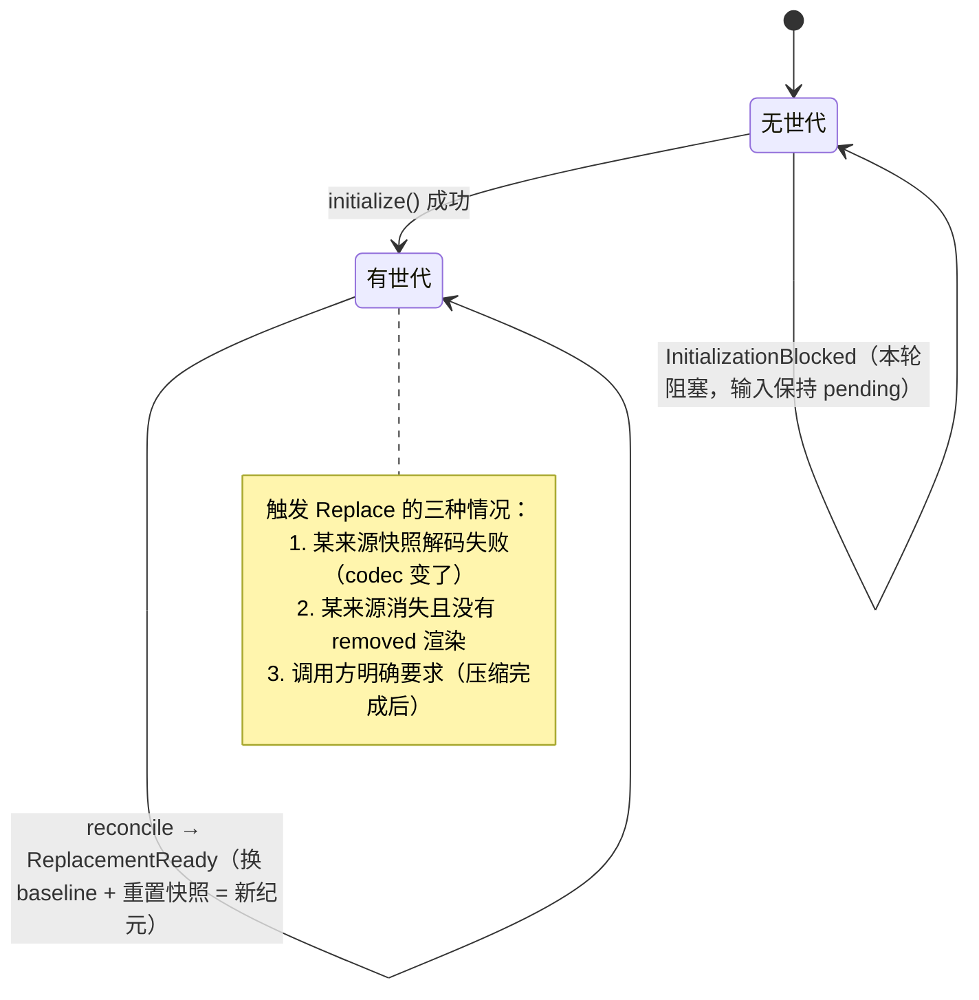
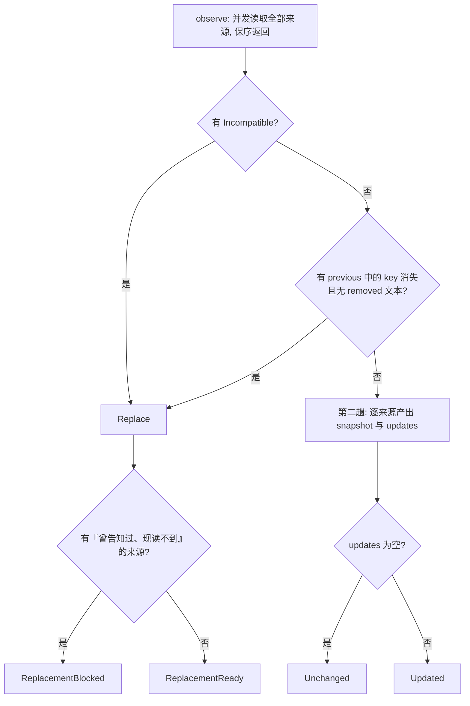

# 01 · SystemContext 抽象：把「系统提示词」从字符串升级成类型化来源集合

源码：`packages/core/src/system-context/index.ts`（320 行，本章几乎逐行讲完）、`registry.ts`、`builtins.ts`、`instruction-context.ts`

---

## 1. 解决什么问题

一个 coding agent 的 system prompt 里混着两类东西：

- **真正静态的**：角色设定、工具使用规范、输出格式要求。
- **反映当前世界状态的**：工作目录、是不是 git 仓库、今天几号、项目里的 `AGENTS.md` 说了什么、当前启用了哪些 skill。

第二类会在会话进行中变化。朴素实现有两条路，都是死路：

| 做法 | 后果 |
| --- | --- |
| 每轮重新拼 system prompt | provider 的 prompt cache 每轮全部失效（前缀变了），成本和延迟暴涨；而且模型会困惑于「同一件事我上轮明明看到的是另一个值」 |
| 第一轮拼好就不动 | 模型拿着过期事实干活：在旧目录里找文件、无视用户刚加的项目规范 |

opencode 的第三条路：

> **system prompt 在一个「纪元」内保持字节级不变（缓存友好），世界状态的变化以「会话中系统消息」的形式追加进对话历史。**

要做到这一点，必须能精确回答：「这一轮，相比上次告诉模型的，到底有什么变了？」——这就是 `SystemContext` 这层抽象存在的唯一理由。它不负责发消息、不负责存储，只负责**观测、比较、渲染**。

---

## 2. 概念模型与不变量

**Context Source（上下文来源）**：一个独立可观测的类型化值，带稳定 key 和三个渲染函数。
**Snapshot（快照）**：上次告诉模型的那些值的 JSON 编码，按 key 存。
**Generation（世代）**：一次完整渲染的产物 = baseline 文本 + 对应快照。

必须成立的不变量：

1. **I1 · key 唯一**：组合时出现重复 key 立即抛错，不做静默去重。
2. **I2 · 渲染确定性**：同一组来源、同样的值，组合出的文本逐字节相同（顺序稳定，不依赖并发完成次序）。
3. **I3 · 渲染非空**：任何一个渲染函数返回空串都是 bug，直接抛错。
4. **I4 · 类型隐藏**：不同来源的值类型不同，但组合后必须能放进同一个数组统一处理。
5. **I5 · 「暂时读不到」≠「不存在」**：读文件失败要保留上次已告知模型的状态，不能当成「这项配置被删了」。
6. **I6 · 快照与消息原子推进**：只有当「告诉模型变化」这件事持久化成功，快照才能前进；否则下次必须重新报告同一个变化。
7. **I7 · 新增来源自动补发**：运行中新注册的来源，下次边界上发一次它的 baseline 渲染。
8. **I8 · 移除来源可显式告知**：来源消失时，若它声明了 `removed` 渲染，就发一条「这项不再适用」；若没声明，则整个 baseline 必须重建（因为无法用增量表达这个变化）。
9. **I9 · 编解码不兼容 ⇒ 重建**：快照里存的 JSON 用当前 codec 解不出来（代码升级改了结构），必须整体重建 baseline，不能猜。

---

## 3. 数据结构定义

### 3.1 原样摘录（Effect Schema 版）

```ts
/** Stable namespaced identity for one independently refreshable context source. */
export const Key = Schema.String.check(Schema.isPattern(/^[a-z0-9][a-z0-9._-]*\/[a-z0-9][a-z0-9._/-]*$/)).pipe(
  Schema.brand("SystemContext.Key"),
)
export type Key = typeof Key.Type

/** Indicates that a source could not be observed without treating it as removed. */
export const unavailable = Symbol.for("@opencode/SystemContext.Unavailable")
export type Unavailable = typeof unavailable

/** Defines one typed source before its value type is hidden by `make`. */
export interface Source<A> {
  readonly key: Key
  readonly codec: Schema.Codec<A, Schema.Json, never, never>
  readonly load: Effect.Effect<A | Unavailable>
  readonly baseline: (current: A) => string
  readonly update: (previous: A, current: A) => string
  readonly removed?: (previous: A) => string
}
```
> `packages/core/src/system-context/index.ts:22-39`

```ts
/** Durable comparison state for one admitted source. */
export const SourceSnapshot = Schema.Struct({
  value: Schema.Json,
  removed: Schema.optional(Schema.NonEmptyString),
})
/** Durable structured comparison state for one active context generation. */
export const Snapshot = Schema.Record(Key, SourceSnapshot)
export type Snapshot = Readonly<Record<string, SourceSnapshot>>

export interface Generation {
  readonly baseline: string
  readonly snapshot: Snapshot
}

export interface Updated { readonly _tag: "Updated"; readonly text: string; readonly snapshot: Snapshot }
export interface ReplacementReady { readonly _tag: "ReplacementReady"; readonly generation: Generation }
export interface ReplacementBlocked { readonly _tag: "ReplacementBlocked" }

export type ReplacementResult = ReplacementReady | ReplacementBlocked
export type ReconcileResult = { readonly _tag: "Unchanged" } | Updated | ReplacementResult
```
> `index.ts:49-80`

注意 `SourceSnapshot.removed` 这个字段：**移除文本是在来源还「活着」的时候预先渲染并存进快照的**。因为等到来源真的消失时，你已经拿不到它的值了，渲染不出「XX 不再适用」这句话。这是整个设计里最容易被漏掉的一个细节。

### 3.2 去 Effect 依赖的等价纯 TS 版（可直接抄进你的项目）

```ts
// ---------- 基础类型 ----------
export type Json = null | boolean | number | string | Json[] | { [k: string]: Json }

/** 稳定命名空间 key，形如 "core/environment"、"plugin/my-thing" */
export type SourceKey = string
const KEY_PATTERN = /^[a-z0-9][a-z0-9._-]*\/[a-z0-9][a-z0-9._/-]*$/

export const UNAVAILABLE = Symbol.for("system-context/unavailable")
export type Unavailable = typeof UNAVAILABLE

/** 一个来源的完整定义。A 是它的值类型。 */
export interface Source<A> {
  key: SourceKey
  /** 值 ↔ JSON 的双向编解码 + 相等判定 */
  codec: {
    encode: (value: A) => Json
    decode: (json: Json) => { ok: true; value: A } | { ok: false }
    equals: (a: A, b: A) => boolean
  }
  /** 不会 reject。读不到时返回 UNAVAILABLE。 */
  load: () => Promise<A | Unavailable>
  /** 纪元开始时的完整渲染 */
  baseline: (current: A) => string
  /** 值变化时的「现在生效值是」渲染 */
  update: (previous: A, current: A) => string
  /** 来源消失时的渲染。不提供则该来源消失会触发整体重建。 */
  removed?: (previous: A) => string
}

export interface SourceSnapshot {
  value: Json
  /** 预渲染的移除文本，仅当 Source 提供了 removed 时存在 */
  removed?: string
}
export type Snapshot = Readonly<Record<SourceKey, SourceSnapshot>>

export interface Generation {
  baseline: string
  snapshot: Snapshot
}

export type ReconcileResult =
  | { tag: "Unchanged" }
  | { tag: "Updated"; text: string; snapshot: Snapshot }
  | { tag: "ReplacementReady"; generation: Generation }
  | { tag: "ReplacementBlocked" }
```

**如果你用 zod**：`codec` 三件套可以这样得到——

```ts
import { z } from "zod"
function codecFromZod<A>(schema: z.ZodType<A>) {
  return {
    encode: (value: A) => JSON.parse(JSON.stringify(value)) as Json,
    decode: (json: Json) => {
      const r = schema.safeParse(json)
      return r.success ? ({ ok: true, value: r.data } as const) : ({ ok: false } as const)
    },
    // 结构相等即可；值都是可 JSON 化的
    equals: (a: A, b: A) => JSON.stringify(a) === JSON.stringify(b),
  }
}
```

> ⚠️ `JSON.stringify` 比较对**对象键顺序敏感**。opencode 用的是 schema 推导出的结构化 equivalence，不受键顺序影响。如果你的来源值是对象且构造路径不唯一，请自己写稳定的深比较，或在 `encode` 里做键排序。

---

## 4. 核心算法

### 4.1 `make<A>()`：把类型 A 藏起来（I4）

这是整个模块的技术核心。问题是：`Source<string>` 和 `Source<File[]>` 类型不同，怎么放进同一个数组？

答案是**存在类型（existential type）编码**——不暴露 `A`，只暴露「已经闭合了 A 的操作」：

```ts
interface PackedSource {
  readonly key: Key
  readonly load: Effect.Effect<Loaded | Unavailable>
}
interface Loaded {
  readonly baseline: () => Rendered
  readonly compare: (previous: Schema.Json) => Compared
}
interface Rendered { readonly text: string; readonly snapshot: SourceSnapshot }
type Compared =
  | { readonly _tag: "Incompatible" }
  | { readonly _tag: "Unchanged" }
  | { readonly _tag: "Updated"; readonly render: () => Rendered }
```
> `index.ts:99-117`

`make` 在闭包里捕获了 `A` 和它的 codec，对外只交出 `() => Rendered` 和 `(json) => Compared`。**外部代码永远不需要知道 `A` 是什么。**

步骤：

1. 从 codec 派生三个函数：`decode`（Json → Option\<A\>）、`encode`（A → Json）、`equivalent`（A × A → boolean）。
2. `load` 后若得到 `unavailable`，原样传出。
3. 否则构造一个 `snapshot()` 惰性函数：`{ value: encode(value), ...(source.removed ? { removed: requireText(removed(value)) } : {}) }`。
   **注意 `removed` 在这里就渲染好并存进快照了**（I8 的实现）。
4. `baseline()` = `{ text: requireText(source.baseline(value)), snapshot: snapshot() }`。
5. `compare(previousJson)`：
   - `decode(previousJson)` 失败 → `Incompatible`（触发 I9）
   - 解出 `decoded` 且 `equivalent(decoded, value)` → `Unchanged`
   - 否则 → `Updated`，其 `render()` 产出 `source.update(decoded, value)`

### 4.2 `combine()`：组合并校验唯一性（I1）

```
combine(contexts):
  sources = contexts.flatMap(取出内部数组)     # 保持调用方顺序
  assertUniqueKeys(sources)                    # 重复 key → 抛 DuplicateKeyError
  return context(sources)
```
> `index.ts:176-180`，`assertUniqueKeys` 在 `index.ts:314-319`

### 4.3 `observe()`：并发读取，但结果顺序不变

```ts
const observe = (value: SystemContext) =>
  Effect.forEach(value[ContextTypeId], (source) => source.load.pipe(...), { concurrency: "unbounded" })
```
> `index.ts:182-195`

**`Effect.forEach` 并发执行但按输入顺序返回结果**——这是 I2（渲染确定性）的一半。另一半在注册表（见 4.7）。

用 Promise 实现的等价物是 `Promise.all(sources.map(...))`，它同样保序。**不要用 `Promise.race` 或按完成顺序 push 到数组里**，那会破坏确定性。

### 4.4 `initialize()`：开启新世代

```
initialize(context):
  entries = observe(context)
  unavailableKeys = entries 里所有 Unavailable 的 key
  if unavailableKeys 非空:
      抛 InitializationBlocked{keys}        # 绝不生成不完整的 baseline
  return initializeObservation(entries)

initializeObservation(entries):
  available = entries 里所有 Available
  rendered = available.map(e => [e.key, e.baseline()])
  return {
    baseline: rendered.map(([, r]) => r.text).join("\n\n"),
    snapshot: Object.fromEntries(rendered.map(([k, r]) => [k, r.snapshot])),
  }
```
> `index.ts:198-215`；连接符 `"\n\n"` 在 `index.ts:297`

**关键决策**：初始化时任何一个来源读不到，就整体失败。宁可让这一轮跑不起来（用户的输入保持 pending 可重试），也不要用一个缺了半截的 system prompt 去问模型——那会污染整个纪元的 provider 缓存。

### 4.5 `reconcile()`：本章最复杂的函数

`reconcile` 先跑 `reconcileObservation`；若它返回 `Replace`，再跑 `replaceObservation` 决定是 ready 还是 blocked。

```
reconcileObservation(entries, previous):

  # ---- 第一趟：只做判定，不产生副作用 ----
  keys = entries 的 key 集合
  comparisons = {}
  for entry in entries:
      if entry 是 Unavailable: continue                 # I5：不可用不参与比较
      stored = previous[entry.key]
      if 不存在 stored: continue                         # 新增来源，第二趟处理
      c = entry.compare(stored.value)
      if c 是 Incompatible: return Replace               # I9
      comparisons[entry.key] = c

  for key in Object.keys(previous).sort():               # 排序 → 确定性
      if keys 包含 key: continue
      if previous[key].removed 未定义: return Replace     # I8 后半：无法增量表达
      # 有 removed 文本 → 可以增量表达，留到第二趟

  # ---- 第二趟：产出新快照与更新文本 ----
  snapshot = {}
  updates = []

  for entry in entries:
      stored = previous[entry.key]
      if entry 是 Unavailable:
          if stored: snapshot[entry.key] = stored        # I5：保留旧快照，不发更新
          continue                                        # 从未成功读过 → 直接略过
      if 不存在 stored:                                   # I7：新注册的来源
          r = entry.baseline()
          updates.push(r.text)
          snapshot[entry.key] = r.snapshot
          continue
      c = comparisons[entry.key]
      if c 是 Unchanged:
          snapshot[entry.key] = stored                   # 原样搬运，不重新编码
          continue
      r = c.render()                                     # 调 source.update(prev, cur)
      updates.push(r.text)
      snapshot[entry.key] = r.snapshot

  for key in Object.keys(previous).sort():
      if keys 包含 key: continue
      updates.push(previous[key].removed)                # 用预渲染的移除文本
      # 注意：不把该 key 写进新 snapshot —— 它就此消失

  if updates 为空: return Unchanged
  return Updated{ text: updates.join("\n\n"), snapshot }
```
> `index.ts:228-280`

四种返回值的含义与调用方动作：

| 结果 | 含义 | 调用方该做什么 |
| --- | --- | --- |
| `Unchanged` | 世界没变 | 沿用现有 baseline，什么都不发 |
| `Updated{text, snapshot}` | 有增量变化，可用一条消息表达 | 发一条会话中系统消息，**在同一事务里**把快照推进到新值（I6） |
| `ReplacementReady{generation}` | 无法增量表达，但能安全重建 | 用新 baseline 替换，重置快照，开启新纪元 |
| `ReplacementBlocked` | 需要重建，但重建所需的某个来源现在读不到 | **什么都不做**，沿用旧 baseline，下次边界再试 |

### 4.6 `replace()` / `replaceObservation()`：重建的守门人

```ts
function replaceObservation(entries, previous): ReplacementResult {
  if (entries.some((entry) => entry._tag === "Unavailable" && getSnapshot(previous, entry.key) !== undefined))
    return { _tag: "ReplacementBlocked" }
  return { _tag: "ReplacementReady", generation: initializeObservation(entries) }
}
```
> `index.ts:287-291`

判据非常精确：**只有「曾经成功告知过模型、现在却读不到」的来源才阻塞重建**。一个从来没成功读过的来源不阻塞——它本来就不在 baseline 里，缺了不算退化。

### 4.7 注册表：谁来提供这些来源

```ts
load: Effect.fn("SystemContextRegistry.load")(function* () {
  const current = (yield* Ref.get(entries)).toSorted((a, b) => (a.key < b.key ? -1 : a.key > b.key ? 1 : 0))
  return SystemContext.combine(
    yield* Effect.forEach(current, (entry) => entry.load, { concurrency: "unbounded" }),
  )
}),
```
> `packages/core/src/system-context/registry.ts:39-44`

- 注册项按 **key 字典序**排序后再组合 → I2 的另一半。注册顺序、插件加载顺序都不影响最终文本。
- 注册用 `Effect.acquireRelease`（`registry.ts:26-38`）：**作用域结束自动注销**。插件卸载时它贡献的来源自然消失，然后在下一个安全边界上通过 `removed` 或整体重建反映出去。
- 重复 key 直接 `Effect.die`（不可恢复）。

---

## 5. 关键源码摘录

**`make` 的全貌** —— 类型隐藏 + 惰性渲染 + 移除文本预渲染：

```ts
export function make<A>(source: Source<A>): SystemContext {
  const decode = Schema.decodeUnknownOption(source.codec)
  const encode = Schema.encodeSync(source.codec)
  const equivalent = Schema.toEquivalence(source.codec)
  return context([
    {
      key: source.key,
      load: source.load.pipe(
        Effect.map((value) => {
          if (isUnavailable(value)) return value
          const snapshot = (): SourceSnapshot => ({
            value: encode(value),
            ...(source.removed ? { removed: requireText(source.key, "removal", source.removed(value)) } : {}),
          })
          return {
            baseline: (): Rendered => ({
              text: requireText(source.key, "baseline", source.baseline(value)),
              snapshot: snapshot(),
            }),
            compare: (previous): Compared =>
              Option.match(decode(previous), {
                onNone: (): Compared => ({ _tag: "Incompatible" }),
                onSome: (decoded): Compared =>
                  equivalent(decoded, value)
                    ? { _tag: "Unchanged" }
                    : { _tag: "Updated", render: () => ({
                        text: requireText(source.key, "update", source.update(decoded, value)),
                        snapshot: snapshot(),
                      }) },
              }),
          }
        }),
      ),
    },
  ])
}
```
> `index.ts:135-173`

**非空校验（I3）** —— 空渲染是编程错误，早失败：

```ts
function requireText(key: Key, kind: string, text: string) {
  if (text.length === 0) throw new Error(`System context source ${key} rendered an empty ${kind}`)
  return text
}
```
> `index.ts:309-312`

**内置来源** —— 看它有多简单，你就知道这套抽象的门槛有多低：

```ts
const environment = [
  "<env>",
  `  Working directory: ${location.directory}`,
  `  Workspace root folder: ${location.project.directory}`,
  `  Is directory a git repo: ${location.vcs?.type === "git" ? "yes" : "no"}`,
  `  Platform: ${process.platform}`,
  "</env>",
].join("\n")
const context = SystemContext.combine([
  SystemContext.make({
    key: SystemContext.Key.make("core/environment"),
    codec: Schema.toCodecJson(Schema.String),
    load: Effect.succeed(environment),
    baseline: (environment) =>
      ["Here is some useful information about the environment you are running in:", environment].join("\n"),
    update: (_previous, environment) => ["The environment you are running in is now:", environment].join("\n"),
  }),
  SystemContext.make({
    key: SystemContext.Key.make("core/date"),
    codec: Schema.toCodecJson(Schema.String),
    load: DateTime.nowAsDate.pipe(Effect.map((date) => date.toDateString())),
    baseline: (date) => `Today's date: ${date}`,
    update: (_previous, date) => `Today's date is now: ${date}`,
  }),
])
```
> `packages/core/src/system-context/builtins.ts:16-40`

**注意 baseline 与 update 的措辞差异**——这是提示工程，不是随手写的：
- baseline：`"Here is some useful information about the environment you are running in:"`（陈述初始事实）
- update：`"The environment you are running in is now:"`（`now` 明确表达「取代之前」）

**`AGENTS.md` 聚合来源** —— 展示了 `Unavailable` 的正确用法：

```ts
const observe = Effect.fn("InstructionContext.observe")(function* () {
  const start = yield* fs.resolve(location.directory)
  const stop = yield* fs.resolve(location.project.directory)
  const fromProject = relative(stop, start)
  const insideProject =
    fromProject === "" || (fromProject !== ".." && !fromProject.startsWith(`..${sep}`) && !isAbsolute(fromProject))
  const discovered = new Set(
    yield* Effect.forEach(
      Flag.OPENCODE_DISABLE_PROJECT_CONFIG || !insideProject ? [] : yield* fs.up({ targets: ["AGENTS.md"], start, stop }),
      fs.resolve,
    ),
  )
  const paths = Array.dedupe([yield* fs.resolve(join(global.config, "AGENTS.md")), ...discovered])
  const files = yield* Effect.forEach(paths, (path) => fs.readFileStringSafe(path).pipe(...), { concurrency: "unbounded" })
  if (files.some((file, index) => file === undefined && discovered.has(paths[index])))
    return SystemContext.unavailable          // ← 已发现的文件读不到 = 暂时不可用
  return files.filter((file) => file !== undefined)
})
```
> `packages/core/src/instruction-context.ts:40-74`

判据的精妙之处：**「全局 `~/.config/opencode/AGENTS.md` 不存在」是正常状态（返回空数组），但「向上扫描明确发现了某个 `AGENTS.md`、读它却失败了」是 `unavailable`**。前者是「成功观测到不存在」，后者是「观测失败」。这两者在本设计里被严格区分（I5）。

它的渲染函数：

```ts
baseline: render,
update: (_previous, current) =>
  `These instructions replace all previously loaded ambient instructions.\n\n${render(current)}`,
removed: () => "Previously loaded instructions no longer apply.",
// render(files) = files.map((f) => `Instructions from: ${f.path}\n${f.content}`).join("\n\n")
```
> `instruction-context.ts:34-38, 99-101`

`update` 全量重发而不是发 diff——**因为指令是命令式的，发 diff 会让模型不知道最终生效的是什么**。这条经验适用于所有「规则类」上下文。

---

## 6. 状态流转



一次 `reconcile` 内部的判定流：



---

## 7. 边界情况与失败模式

| 场景 | opencode 怎么处理 | 你自己实现时必须处理 |
| --- | --- | --- |
| 首轮某来源读不到 | `initialize` 抛 `InitializationBlocked{keys}`，整轮不跑 | 别用半截 baseline 发请求。让用户输入保持 pending，可重试 |
| 运行中某来源临时读不到（文件被锁） | 保留旧快照条目，不发更新，也不发移除 | 区分「成功读到 null」和「读失败」——这是两个完全不同的语义 |
| 从未成功读过的来源现在读不到 | 直接略过，不写快照 | 别写一个 `{value: null}` 占位，那会让下次真读到时误判成「变化」 |
| 来源被注销且声明了 `removed` | 发预渲染的移除文本，从快照删掉该 key | **移除文本必须在来源还活着时预渲染**，否则你渲染不出来 |
| 来源被注销但没声明 `removed` | 整体重建 baseline | 不要静默丢弃——模型还记着那条已失效的指令 |
| 代码升级改了某来源的值结构 | 快照解码失败 → `Incompatible` → 整体重建 | 别 try/catch 后当作「无变化」，那会永久卡住 |
| 两个插件注册了同一个 key | `combine` 抛 `DuplicateKeyError`；注册表 `Effect.die` | 静默覆盖会造成极难排查的"我的指令为什么没生效" |
| 某来源渲染出空串 | `requireText` 抛错 | 空串会让 `join("\n\n")` 产生连续空行，污染 prompt |
| 并发完成顺序不同导致文本抖动 | `forEach` 保序 + 注册项 key 排序 | 用 `Promise.all` 而非按完成顺序收集；组合前显式排序 |
| 一次边界上多个来源同时变化 | 全部合并进**一条** `Updated.text`（`"\n\n"` 连接） | 别发多条消息——那会在历史里留下一串碎片 |

---

## 8. 移植到你自己的项目

### 8.1 最小可用版

可以砍掉的：

- **`removed` 渲染**：先不支持动态注销来源，所有来源在进程启动时固定注册。`reconcile` 里那两段「previous 中消失的 key」逻辑直接删。
- **`Unavailable`**：如果你的来源全是内存值（当前时间、当前目录），永远不会读失败。`load` 直接返回 `A`。
- **`Incompatible` 重建**：如果你不在乎跨版本升级的会话，`decode` 失败时直接当 `Updated` 处理也能跑（代价是升级后第一轮会重发一次全量）。
- **并发读取**：来源少于 10 个且都是内存值时，串行读没区别。

**绝对不能砍的**：`baseline` / `update` 双渲染函数、快照按 key 存、以及「快照与消息原子推进」。砍掉任何一个，这套设计就退化成「每轮重拼 prompt」，缓存全丢。

### 8.2 落地步骤

1. 定义 `Source<A>` 接口和 `Snapshot` 类型，照抄 §3.2 的纯 TS 版。
2. 实现 `makeSource<A>(source: Source<A>): PackedSource`：闭包捕获 `A`，对外只暴露 `load(): Promise<Loaded | Unavailable>`，`Loaded` 含 `baseline()` 和 `compare(json)`。
3. 实现 `combine(list)`：`flatMap` 后检查 key 唯一，重复即 `throw`。
4. 实现 `observe(ctx)`：`Promise.all(sources.map(s => s.load()))`，保序。
5. 实现 `initialize(ctx)`：有任一 `UNAVAILABLE` 则 `throw InitializationBlocked`，否则渲染全部 `baseline()`，`"\n\n"` 连接，同时收集快照。
6. 实现 `reconcile(ctx, previous)`：严格照 §4.5 的两趟结构写。**第一趟只判定不产副作用**，这样 `Replace` 能在不浪费渲染的情况下早退出。
7. 实现 `replace(ctx, previous)`：照 §4.6，六行。
8. 建注册表：一个 `Map<key, () => Promise<PackedSource[]>>`，`load()` 时按 key 排序后并发求值再 `combine`。注册返回一个 `unregister` 函数。
9. 注册两个内置来源（环境、日期）验证链路，措辞照抄 §5。
10. 写测试覆盖 §9 的每一条。

### 8.3 你需要自己提供的依赖

| 依赖 | 用途 | 建议实现 |
| --- | --- | --- |
| JSON codec + 相等判定 | 快照编解码与变化检测 | zod + 稳定深比较（注意键顺序，见 §3.2 警告） |
| 快照持久化 | 存 `Snapshot` | 一列 JSON，跟会话一对一（见第 02 章的表结构） |
| 作用域/生命周期钩子 | 插件卸载时自动注销来源 | 注册函数返回 `unregister`，插件卸载时调用 |
| 文件读取（若有文件类来源） | 区分「不存在」和「读失败」 | `readFileSafe` 返回 `string | undefined`，抛错的路径单独走 `UNAVAILABLE` |

---

## 9. 验收清单

- [ ] **I1** 用同一个 key 注册两次 → 抛错，且错误信息里带 key
- [ ] **I2** 打乱来源注册顺序，`initialize` 产出的 `baseline` 字符串逐字节相同
- [ ] **I2** 让某来源的 `load` 人为延迟 100ms，`baseline` 中它的位置不变
- [ ] **I3** 某来源 `baseline` 返回 `""` → 抛错，错误信息含来源 key 和 `"baseline"`
- [ ] **I4** 一个 `Source<string>` 和一个 `Source<{a: number}[]>` 能被 `combine` 到一起并正常渲染
- [ ] **I5** 来源第二次 `load` 返回 `UNAVAILABLE` → `reconcile` 返回 `Unchanged`，快照里该 key 的值保持不变
- [ ] **I5** 来源从未成功读过且返回 `UNAVAILABLE` → 快照里不出现该 key
- [ ] **I6** 模拟持久化失败 → 快照未推进；下次 `reconcile` 仍返回相同的 `Updated.text`
- [ ] **I7** 运行中新注册一个来源 → 下次 `reconcile` 返回 `Updated`，文本是该来源的 `baseline()` 输出
- [ ] **I8** 注销一个有 `removed` 的来源 → `Updated`，文本是预渲染的移除文本，且该 key 从快照消失
- [ ] **I8** 注销一个没有 `removed` 的来源 → `ReplacementReady`
- [ ] **I9** 手工把快照里某 key 的 `value` 改成不符合 codec 的形状 → `ReplacementReady`（或在有来源不可用时 `ReplacementBlocked`）
- [ ] **重建守门** 某来源不可用 **且** 它在旧快照里 → `ReplacementBlocked`；不在旧快照里 → `ReplacementReady`
- [ ] **合并** 同一次 `reconcile` 中两个来源都变化 → 返回**一个** `Updated`，`text` 中两段以 `"\n\n"` 分隔，顺序按 key 字典序
- [ ] **无变化零成本** 所有来源值不变 → `Unchanged`，且期间没有调用过任何 `update()` 渲染函数
