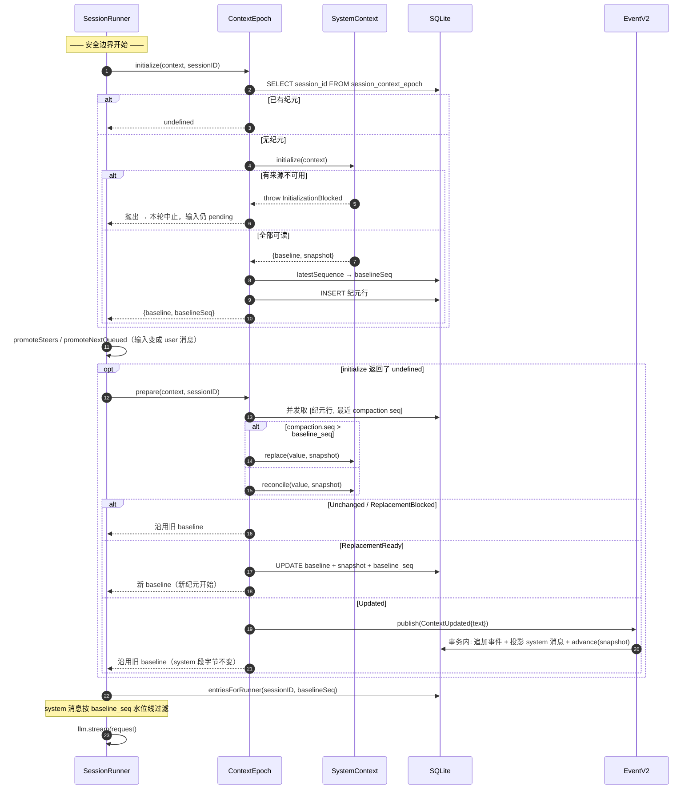

# 02 · Context Epoch：让 system prompt 在一个纪元内字节不变

源码：`packages/core/src/session/context-epoch.ts`（174 行）、`packages/core/src/session/sql.ts`、调用方 `packages/core/src/session/runner/llm.ts:183,198`

---

## 1. 解决什么问题

第 01 章给了「算出变化」的能力。本章解决「什么时候算、算完了往哪放、怎么保证不重不漏」。

三个具体问题：

1. **provider prompt cache 的前缀必须稳定。** 各家 provider 的缓存都是前缀匹配：system prompt 改一个字，整个缓存作废。所以 system 段必须在一段时间内**字节级不变**。
2. **但世界确实会变。** 变化得让模型知道。
3. **不能重复通知，也不能漏通知。** 崩溃、重试、并发都不能破坏这一点。

答案：

> **Context Epoch（上下文纪元）= 一份不可变的 baseline 文本 + 一份可推进的 snapshot + 一个 `baseline_seq` 水位线。**
> 纪元内的变化以 `type: "system"` 的会话消息追加进历史；纪元结束时重渲染 baseline，旧的系统消息被 cutoff 掉（但作为审计记录留在库里）。

---

## 2. 概念模型与不变量

**Safe Provider-Turn Boundary（安全的 provider 轮次边界）**：provider 调用之前、durable 输入提升之后、上一轮工具全部 settle 之后的那个点。**这是唯一允许改动上下文的位置**。

不变量：

1. **E1** 一个会话至多一个活跃纪元（表主键是 `session_id`）。
2. **E2** 纪元内 `baseline` 字符串不变。
3. **E3** `baseline_seq` 是一条水位线：seq ≤ 它的 `system` 消息**不进入**投影历史（已折进 baseline）；seq > 它的进入。
4. **E4** 每次变化产生的系统消息与快照推进**原子**发生。
5. **E5** 首轮初始化不发冗余更新消息（baseline 本身就是全量）。
6. **E6** 初始化被阻塞时不写任何行——用户输入保持 pending 可重试。
7. **E7** 压缩完成后必须换纪元，且新 `baseline_seq` 精确等于压缩消息的 seq。
8. **E8** 会话迁移（换目录/工作区）清空纪元，下轮重建。
9. **E9** 上下文的采样是**惰性拉取**：只在安全边界上采一次，绝不在来源变化时异步推送。

---

## 3. 数据结构定义

### 3.1 原样摘录

```ts
export const SessionContextEpochTable = sqliteTable("session_context_epoch", {
  session_id: text()
    .$type<SessionSchema.ID>()
    .primaryKey()
    .references(() => SessionTable.id, { onDelete: "cascade" }),
  baseline: text().notNull(),
  snapshot: text({ mode: "json" }).notNull().$type<SystemContext.Snapshot>(),
  baseline_seq: integer().notNull(),
})
```
> `packages/core/src/session/sql.ts:168-176`

```ts
interface Prepared {
  readonly baseline: string
  readonly baselineSeq: number
}
```
> `packages/core/src/session/context-epoch.ts:18-21`

会话消息表里对应的一行（`type: "system"`）：

```ts
export interface System extends Schema.Schema.Type<typeof System> {}
export const System = Schema.Struct({
  ...Base,                       // id, metadata?, time.created
  type: Schema.Literal("system"),
  text: Schema.String,
}).annotate({ identifier: "Session.Message.System" })
```
> `packages/schema/src/session-message.ts:61-66`

### 3.2 等价纯 SQL / TS 版

```sql
CREATE TABLE session_context_epoch (
  session_id   TEXT PRIMARY KEY REFERENCES session(id) ON DELETE CASCADE,
  baseline     TEXT    NOT NULL,   -- 本纪元不可变的 system prompt 动态段
  snapshot     TEXT    NOT NULL,   -- JSON: Record<sourceKey, {value, removed?}>
  baseline_seq INTEGER NOT NULL    -- 水位线：本纪元开始时会话的最新事件 seq
);
```

```ts
interface ContextEpochRow {
  sessionId: string
  baseline: string
  snapshot: Snapshot      // 见第 01 章 §3.2
  baselineSeq: number
}
interface Prepared {
  baseline: string
  baselineSeq: number
}
```

**为什么是 `PRIMARY KEY` 而不是带自增 id 的历史表**：纪元没有历史价值——过去的 baseline 已经被折进过去的对话里了。需要审计时看 `session_message` 里那些 `type: "system"` 的行即可（它们永久保留）。

---

## 4. 核心算法

### 4.1 两个入口，职责不同

runner 在每轮 turn 开始时调**两次**，中间夹着输入提升：

```ts
const initialized = yield* SessionContextEpoch.initialize(db, loadSystemContext(agent), session.id)
// ... 中间：提升 steer / queue 输入 ...
const system =
  initialized ?? (yield* SessionContextEpoch.prepare(db, events, loadSystemContext(agent), session.id))
```
> `packages/core/src/session/runner/llm.ts:183, 197-198`

| 函数 | 何时生效 | 为什么要分开 |
| --- | --- | --- |
| `initialize` | 只在**还没有纪元行**时建纪元；已存在则返回 `undefined` | 必须在**输入提升之前**跑：若基线不可用（E6），用户刚提交的输入还没被消费，保持 pending 可重试 |
| `prepare` | 纪元已存在时做 reconcile / replace | 必须在**输入提升之后**跑：新提升的 user 消息 seq 要早于本次上下文更新消息（顺序：用户输入 → 上下文变更 → 模型回答） |

这个「一前一后」的拆分是整个模块最容易被抄错的地方。合成一次调用会导致：基线不可用时用户输入已经被消费掉了，重试就丢消息。

### 4.2 `initializeOnce`

```
initializeOnce(db, context, sessionID):
  if 已存在纪元行: return undefined            # 幂等
  generation = SystemContext.initialize(context)   # 可能抛 InitializationBlocked（E6）
  baselineSeq = insert(db, sessionID, generation)
  return { baseline: generation.baseline, baselineSeq }

insert(db, sessionID, generation):
  baselineSeq = EventV2.latestSequence(db, sessionID)   # 会话当前最新事件 seq，无事件时为 -1
  INSERT INTO session_context_epoch VALUES (sessionID, generation.baseline, generation.snapshot, baselineSeq)
  return baselineSeq
```
> `context-epoch.ts:80-89, 122-139`；`latestSequence` 无行时返回 `-1`（`packages/core/src/event.ts:30`）

注意 **E5**：这里只 insert，不发任何 `ContextUpdated` 事件。首轮的全量内容就是 baseline 本身。

### 4.3 `prepareOnce` —— 本章的主算法

```
prepareOnce(db, events, context, sessionID):

  # 1. 三件事并发取
  [value, stored, compaction] = await all([
      context,                                  # 组合好的 SystemContext
      find(db, sessionID),                      # 纪元行
      SessionHistory.latestCompaction(db, sessionID),   # 最近一条 compaction 消息的 seq
  ])

  # 2. 没有纪元行 → 建一个（与 initialize 相同的路径）
  if !stored:
      generation = SystemContext.initialize(value)
      baselineSeq = insert(db, sessionID, generation)
      return { baseline: generation.baseline, baselineSeq }

  # 3. 解码快照；解不出来是硬错误
  snapshot = decode(SystemContext.Snapshot, stored.snapshot)
      ?? throw ContextSnapshotDecodeError{sessionID, details}

  # 4. 判断是否需要换纪元（E7）
  replacementSeq =
      (compaction 存在 && compaction.seq > stored.baseline_seq) ? compaction.seq : undefined

  # 5. 分派
  result = replacementSeq
      ? SystemContext.replace(value, snapshot)      # 压缩后：强制重建
      : SystemContext.reconcile(value, snapshot)    # 常规：增量比对

  # 6. 处理四种结果
  if result is Unchanged or ReplacementBlocked:
      return { baseline: stored.baseline, baselineSeq: stored.baseline_seq }   # 原样沿用

  if result is ReplacementReady:
      baselineSeq = replacementSeq ?? EventV2.latestSequence(db, sessionID)
      UPDATE session_context_epoch
         SET baseline = result.generation.baseline,
             snapshot = result.generation.snapshot,
             baseline_seq = baselineSeq
       WHERE session_id = sessionID
      return { baseline: result.generation.baseline, baselineSeq }

  # result is Updated
  events.publish(
      SessionEvent.ContextUpdated,
      { sessionID, messageID: 新建 ID, timestamp: now, text: result.text },
      { commit: () => advance(db, sessionID, result.snapshot) },    # ← E4 原子性在这里
  )
  return { baseline: stored.baseline, baselineSeq: stored.baseline_seq }   # baseline 不变！
```
> `context-epoch.ts:40-78`

**三个必须看懂的细节：**

**① `commit` 回调就是原子性（E4）。**
`events.publish` 的第三个参数是 `PublishOptions.commit`，签名 `(seq: number) => Effect<void>`，语义是「与新 durable 事件在同一事务里提交的本地投影」（`packages/core/src/event.ts:118`）。所以「持久化了这条系统消息」和「快照前进了」要么都成功要么都失败。

如果你的项目没有这种事务钩子，等价写法是：

```ts
await db.transaction(async (tx) => {
  await tx.insert(eventTable).values({ ...contextUpdatedEvent })
  await tx.insert(messageTable).values({ type: "system", text: result.text, ... })
  await tx.update(epochTable).set({ snapshot: result.snapshot }).where(eq(epochTable.sessionId, sessionID))
})
```

**② `Updated` 分支不动 `baseline`（E2）。**
返回的是 `stored.baseline` 和 `stored.baseline_seq`。这正是 prompt cache 得以保留的原因——system 段一个字节都没变，变化全在 messages 数组尾部。

**③ `replacementSeq` 的精确性（E7）。**
换纪元时 `baselineSeq` 优先取压缩消息的 seq，而不是「当前最新 seq」。因为压缩之后可能又发生了别的事件，若取最新 seq，那些介于压缩点和当前之间的 `system` 消息会被 E3 的水位线误杀。

### 4.4 `advance` 与 `reset`

```ts
const advance = Effect.fnUntraced(function* (db, sessionID, snapshot) {
  const updated = yield* db.update(SessionContextEpochTable)
    .set({ snapshot })                                   // 只动 snapshot
    .where(eq(SessionContextEpochTable.session_id, sessionID))
    .returning({ sessionID: SessionContextEpochTable.session_id }).get().pipe(Effect.orDie)
  if (!updated) return yield* Effect.die("Context Epoch not found")
})
```
> `context-epoch.ts:161-174`

```ts
export const reset = Effect.fn("SessionContextEpoch.reset")(function* (db, sessionID) {
  yield* db.delete(SessionContextEpochTable).where(eq(SessionContextEpochTable.session_id, sessionID)).run()...
})
```
> `context-epoch.ts:111-120`

`reset` 用于会话迁移（E8）：直接删行。下一轮 `initialize` 会重建一个完整基线。**删除而不是标记失效**——因为目标位置的 `Location` 作用域服务会重新解析出全新的来源集合，旧快照对新位置毫无意义。

### 4.5 水位线怎么被消费（E3）

`baseline_seq` 唯一的消费者是历史投影（详见第 04 章）：

```ts
baselineSeq === undefined
  ? undefined
  : or(ne(SessionMessageTable.type, "system"), gt(SessionMessageTable.seq, baselineSeq)),
```
> `packages/core/src/session/history.ts:44-46`

读作：**「不是 system 消息」或者「seq 大于 baseline_seq」的才保留。**

即：本纪元开始之前发出的所有会话中系统消息，全部从投影历史里消失——它们描述的状态已经被新 baseline 全量表达了，再留着就是重复且可能矛盾的信息。但它们仍然在 `session_message` 表里，可供审计和 UI 回放。

---

## 5. 关键源码摘录

**`prepareOnce` 全文** —— 上面伪代码的真身：

```ts
const prepareOnce = Effect.fnUntraced(function* (db, events, context, sessionID) {
  const [value, stored, compaction] = yield* Effect.all(
    [context, find(db, sessionID), SessionHistory.latestCompaction(db, sessionID)],
    { concurrency: "unbounded" },
  )
  if (!stored) {
    const generation = yield* SystemContext.initialize(value)
    const baselineSeq = yield* insert(db, sessionID, generation)
    return { baseline: generation.baseline, baselineSeq }
  }

  const snapshot = yield* Schema.decodeUnknownEffect(SystemContext.Snapshot)(stored.snapshot).pipe(
    Effect.mapError((error) => new ContextSnapshotDecodeError({ sessionID, details: String(error) })),
  )
  const replacementSeq = compaction !== undefined && compaction.seq > stored.baseline_seq ? compaction.seq : undefined
  const result = replacementSeq
    ? yield* SystemContext.replace(value, snapshot)
    : yield* SystemContext.reconcile(value, snapshot)
  if (result._tag === "Unchanged" || result._tag === "ReplacementBlocked") {
    return { baseline: stored.baseline, baselineSeq: stored.baseline_seq }
  }
  if (result._tag === "ReplacementReady") {
    const baselineSeq = replacementSeq ?? (yield* EventV2.latestSequence(db, sessionID))
    yield* replace(db, sessionID, baselineSeq, result.generation)
    return { baseline: result.generation.baseline, baselineSeq }
  }

  yield* events.publish(
    SessionEvent.ContextUpdated,
    { sessionID, messageID: SessionMessage.ID.create(), timestamp: yield* DateTime.now, text: result.text },
    { commit: () => advance(db, sessionID, result.snapshot).pipe(Effect.orDie) },
  )
  return { baseline: stored.baseline, baselineSeq: stored.baseline_seq }
})
```
> `context-epoch.ts:40-78`

**baseline 最终怎么进请求** —— 注意它和 agent 的静态 system 是**两个独立的 SystemPart**：

```ts
const request = LLM.request({
  model,
  // ...
  providerOptions: { openai: { promptCacheKey } },
  system: [agent.info?.system, system.baseline]
    .filter((part): part is string => part !== undefined && part.length > 0)
    .map(SystemPart.make),
  messages: [...toLLMMessages(context, model), ...(isLastStep ? [Message.assistant(MAX_STEPS_PROMPT)] : [])],
  tools: toolMaterialization?.definitions ?? [],
  toolChoice: isLastStep ? "none" : undefined,
})
```
> `packages/core/src/session/runner/llm.ts:203-220`

顺序是 `[agent 静态 system, 纪元 baseline]`——静态的在前，动态的在后。这样即使切换 agent，前缀里最长的那段静态文本仍可能命中缓存。

**上下文来源从哪来** —— 三个提供方合并：

```ts
const loadSystemContext = (agent: AgentV2.Selection) =>
  Effect.all([systemContext.load(), skillGuidance.load(agent), referenceGuidance.load()], {
    concurrency: "unbounded",
  }).pipe(Effect.map(SystemContext.combine))
```
> `runner/llm.ts:180-183`

分别是：注册表里的全部来源（环境、日期、`AGENTS.md`、插件）、当前 agent 可用的 skill 指引、reference 指引。**注意 skill 指引依赖 `agent`——切换 agent 会让这个来源的值变化，从而在下一个安全边界上自动产生一条系统消息告诉模型「你现在能用的技能变了」。** 这就是本设计的威力：换 agent 不需要任何特殊代码路径。

---

## 6. 时序



---

## 7. 边界情况与失败模式

| 场景 | opencode 怎么处理 | 你自己实现时必须处理 |
| --- | --- | --- |
| 首轮 `AGENTS.md` 读失败 | `initialize` 抛 `InitializationBlocked`，**不写纪元行**，输入未提升 | 别写半截纪元行——下次会当成「已初始化」直接走 reconcile，那个残缺 baseline 就永久固化了 |
| 纪元存在但快照 JSON 损坏 | 抛 `ContextSnapshotDecodeError`，本轮失败 | 别 catch 后当空快照——那会把所有来源当成新增，重发一遍全量 |
| 压缩刚完成 | `compaction.seq > baseline_seq` → 走 `replace`，新 `baseline_seq = compaction.seq` | 别用「当前最新 seq」，会误杀压缩点之后的系统消息 |
| 压缩完成但某来源不可用 | `ReplacementBlocked` → 沿用旧 baseline 和旧 `baseline_seq` | 下一轮还会再试（因为 `compaction.seq > baseline_seq` 仍成立），不会永久卡住 |
| 会话迁移到别的目录 | `reset` 删行；下轮重建完整基线 | Location 作用域的服务要能重新解析。别复用旧快照 |
| 同一会话并发两个 drain | `initialize` 幂等（先查存在性）；`prepare` 的 UPDATE 带 `WHERE session_id` | 用会话级串行锁（opencode 用 `run-coordinator` 保证单会话单 drain） |
| `advance` 时纪元行已被删（并发迁移） | `Effect.die("Context Epoch not found")` | 别静默忽略——快照没推进但消息发出去了，会重复通知 |
| 会话一个事件都没有 | `latestSequence` 返回 `-1`，`baseline_seq = -1`，所有消息 seq ≥ 0 都保留 | 用 `-1` 而非 `0` 作哨兵，否则第一条消息会被水位线吃掉 |
| 上下文变化发生在 provider 流式过程中 | **不采样**（E9）。只在下一个安全边界上采 | 别做文件监听 → 立即推送。流式中途插系统消息会破坏 provider 的消息序列 |
| 一轮里既有新输入又有上下文变化 | 顺序固定：user 消息（提升）→ system 消息（`prepare`）→ assistant | 保持这个顺序。反过来模型会以为规则变更是对新问题的回应 |

---

## 8. 移植到你自己的项目

### 8.1 最小可用版

砍到只剩这些仍然成立：

- 一张表：`(session_id PK, baseline TEXT, snapshot JSON, baseline_seq INT)`
- 一个函数：turn 开始时调，返回 `{baseline, baselineSeq}`
- 投影历史时按 `baseline_seq` 过滤 system 消息

可以先砍掉的：`replace` 路径（没做压缩前用不上）、`ReplacementBlocked`（没有 `Unavailable` 就不会出现）、`initialize`/`prepare` 的拆分（没有输入收件箱时可以合成一个）。

**不能砍的**：`baseline_seq` 水位线。没有它，历史里会同时存在「旧 baseline 折叠前的系统消息」和「新 baseline」，模型收到两份互相矛盾的环境描述。

### 8.2 落地步骤

1. 建表（§3.2 的 DDL）。`session_id` 做主键，级联删除。
2. 确保你的会话消息有单调递增的 `seq`（不是时间戳——时间戳会撞）。opencode 用的是事件表的聚合序号。
3. 写 `initializeEpoch(sessionId, ctx)`：存在即返回 `undefined`；否则 `SystemContext.initialize` → 取当前 max seq → insert。
4. 写 `prepareEpoch(sessionId, ctx)`：照 §4.3 的伪代码，六个分支一个不能少。
5. 把 `Updated` 分支包进事务：追加 system 消息 + 更新 snapshot 列，同一个 `db.transaction`。
6. 在 turn 组装处按顺序调用：`initializeEpoch` → 提升输入 → `prepareEpoch` → 查历史 → 组请求。
7. 历史查询加上水位线过滤（第 04 章 §4）。
8. 会话迁移/重置的地方调 `deleteEpoch(sessionId)`。
9. 把 `baseline` 作为 system 段的**最后一个** part（静态 system 在前）。

### 8.3 你需要自己提供的依赖

| 依赖 | 用途 | 注意 |
| --- | --- | --- |
| 单调 seq | 水位线比较 | 必须与消息写入同源、同事务，否则水位线会错位 |
| 事务 | E4 原子性 | 系统消息 + 快照推进必须同事务 |
| 会话级串行 | 防并发 drain | 见第 05 章的 run-coordinator |
| Location 作用域服务 | 迁移后重解析来源 | 若你没有多目录概念，可省略 `reset` |

---

## 9. 验收清单

- [ ] **E1** 同一会话并发调两次 `initializeEpoch` → 只产生一行
- [ ] **E2** 触发一次来源变化后再取 `baseline` → 与变化前**逐字节相同**
- [ ] **E2** 同一纪元内连续 3 轮请求，抓包看 system 段完全一致（provider 缓存命中率可验证）
- [ ] **E3** 造一条 seq ≤ `baseline_seq` 的 `system` 消息 → 不出现在 `entriesForRunner` 结果里
- [ ] **E3** 造一条 seq > `baseline_seq` 的 `system` 消息 → 出现在结果里
- [ ] **E4** 在快照更新语句后人为抛错 → 事务回滚，system 消息也不存在；重跑 `prepare` 再次得到相同的 `Updated.text`
- [ ] **E5** 首轮 `initialize` 后查事件表 → 没有 `ContextUpdated` 事件
- [ ] **E6** 让某来源首轮不可用 → 纪元表**无行**，且此前提交的输入 `promoted_seq` 仍为 `NULL`
- [ ] **E7** 触发压缩后调 `prepare` → 走 replace 分支，且新 `baseline_seq === compaction 消息的 seq`
- [ ] **E7** 压缩后紧接着又产生了 2 条事件，再 `prepare` → `baseline_seq` 仍等于压缩消息 seq，不是最新 seq
- [ ] **E8** 迁移会话 → 纪元行被删；下轮 `initialize` 建出全新 baseline
- [ ] **E9** 在 provider 流式过程中修改 `AGENTS.md` → 本轮请求不受影响；下一轮才出现 system 消息
- [ ] **顺序** 一轮里同时有新输入和上下文变化 → 历史中顺序为 user → system → assistant
- [ ] **幂等** 连续两次 `prepare` 且期间世界未变 → 第二次返回 `Unchanged`，不产生第二条 system 消息
