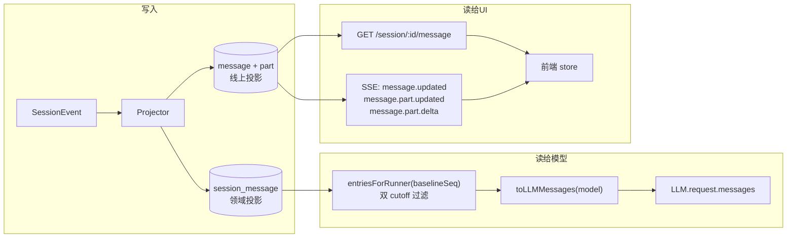

# 04 · 消息模型与历史投影：模型看到的到底是什么

源码：`packages/schema/src/session-message.ts`（213 行，完整定义）、`packages/core/src/session/history.ts`（101 行）、`packages/core/src/session/runner/to-llm-message.ts`（171 行）、`packages/core/src/session/sql.ts`

---

## 1. 解决什么问题

这一章是全书的地基。前后端都围着这套类型转，定错了后面全歪。

要同时满足四个互相拉扯的需求：

1. **模型要的**：一个 provider 协议的 messages 数组，工具调用/结果配对正确，reasoning signature 能续接。
2. **UI 要的**：可增量更新的细粒度片段（一段文本正在流、一个工具正在跑），可折叠、可定位、可回退。
3. **持久化要的**：能从事件流完整重建，能审计（包括那些已经不给模型看的历史）。
4. **压缩要的**：能被裁剪，且裁剪点清晰。

opencode 的解法是**一份领域模型 + 两个投影**：

- 领域模型：`SessionMessage.Message`——8 种消息，assistant 消息内嵌 `content: AssistantContent[]`。
- 投影 A（给模型）：`session_message` 表 → `entriesForRunner` → `toLLMMessages`。
- 投影 B（给 UI）：`message` + `part` 两张扁平表 → HTTP API / SSE 事件。

---

## 2. 概念模型与不变量

1. **M1** 消息类型是**封闭的判别联合**，`type` 是判别式。加类型必须同时更新两个投影。
2. **M2** assistant 消息的 `content` 是有序数组，顺序即模型输出顺序（文本、思考、工具调用交错）。
3. **M3** 工具状态是四态单向机：`pending → running → completed | error`。
4. **M4** 历史投影有**两条 cutoff**：compaction seq（丢更早的一切）和 baseline seq（丢更早的 system 消息）。
5. **M5** 被 cutoff 掉的消息**仍在库里**，只是不进模型上下文。
6. **M6** `agent-switched` / `model-switched` 是纯 UI 消息，对模型不可见。
7. **M7** 跨模型续接时，reasoning 必须降级（signature 不通用）。
8. **M8** 非 provider-executed 的工具结果，作为独立的 tool 消息跟在 assistant 消息之后。

---

## 3. 数据结构定义

### 3.1 原样摘录（Effect Schema）

**ID 与公共字段**

```ts
export const ID = Schema.String.check(Schema.isStartsWith("msg_")).pipe(
  Schema.brand("Session.Message.ID"),
  statics((schema) => ({ create: () => schema.make("msg_" + ascending()) })),
)

const Base = {
  id: ID,
  metadata: Schema.Record(Schema.String, Schema.Unknown).pipe(optional),
  time: Schema.Struct({ created: DateTimeUtcFromMillis }),
}
```
> `packages/schema/src/session-message.ts:12-28`

`ascending()` 生成单调递增 ID（ULID 风格）——**ID 本身可排序**，这让前端能用二分插入维持有序数组（第 08 章）。

**8 种消息**

```ts
export const AgentSwitched = Schema.Struct({ ...Base, type: Schema.Literal("agent-switched"), agent: Schema.String })
export const ModelSwitched = Schema.Struct({ ...Base, type: Schema.Literal("model-switched"), model: Model.Ref })

export const User = Schema.Struct({
  ...Base,
  text: Prompt.fields.text,
  files: Prompt.fields.files,
  agents: Prompt.fields.agents,
  type: Schema.Literal("user"),
})

export const Synthetic = Schema.Struct({ ...Base, sessionID: SessionID, text: Schema.String, type: Schema.Literal("synthetic") })
export const System = Schema.Struct({ ...Base, type: Schema.Literal("system"), text: Schema.String })

export const Shell = Schema.Struct({
  ...Base,
  type: Schema.Literal("shell"),
  callID: Schema.String,
  command: Schema.String,
  output: Schema.String,
  time: Schema.Struct({ created: DateTimeUtcFromMillis, completed: DateTimeUtcFromMillis.pipe(optional) }),
})

export const Assistant = Schema.Struct({
  ...Base,
  type: Schema.Literal("assistant"),
  agent: Schema.String,
  model: Model.Ref,
  content: AssistantContent.pipe(Schema.Array),
  snapshot: Schema.Struct({
    start: Schema.String.pipe(optional),
    end: Schema.String.pipe(optional),
    files: Schema.Array(RelativePath).pipe(optional),
  }).pipe(optional),
  finish: Schema.String.pipe(optional),
  cost: Schema.Finite.pipe(optional),
  tokens: Schema.Struct({
    input: Schema.Finite,
    output: Schema.Finite,
    reasoning: Schema.Finite,
    cache: Schema.Struct({ read: Schema.Finite, write: Schema.Finite }),
  }).pipe(optional),
  error: UnknownError.pipe(optional),
  time: Schema.Struct({ created: DateTimeUtcFromMillis, completed: DateTimeUtcFromMillis.pipe(optional) }),
})

export const Compaction = Schema.Struct({
  type: Schema.Literal("compaction"),
  reason: Schema.Literals(["auto", "manual"]),
  summary: Schema.String,
  recent: Schema.String,
  ...Base,
})

export const Message = Schema.Union([
  AgentSwitched, ModelSwitched, User, Synthetic, System, Shell, Assistant, Compaction,
]).pipe(Schema.toTaggedUnion("type"))
export type Type = Message["type"]
```
> `session-message.ts:30-213`

**assistant 的三种 content**

```ts
export const AssistantText = Schema.Struct({ type: Schema.Literal("text"), id: Schema.String, text: Schema.String })

export const AssistantReasoning = Schema.Struct({
  type: Schema.Literal("reasoning"),
  id: Schema.String,
  text: Schema.String,
  providerMetadata: ProviderMetadata.pipe(optional),      // ← reasoning signature 存这里
  time: Schema.Struct({ created: ..., completed: ...optional }).pipe(optional),
})

export const AssistantTool = Schema.Struct({
  type: Schema.Literal("tool"),
  id: Schema.String,                                       // = provider 的 tool call id
  name: Schema.String,
  provider: Schema.Struct({
    executed: Schema.Boolean,                              // provider 侧执行（如内置 web search）
    metadata: ProviderMetadata.pipe(optional),
    resultMetadata: ProviderMetadata.pipe(optional),
  }).pipe(optional),
  state: ToolState,
  time: Schema.Struct({
    created: ..., ran: ...optional, completed: ...optional, pruned: ...optional,
  }),
})

export const AssistantContent = Schema.Union([AssistantText, AssistantReasoning, AssistantTool])
  .pipe(Schema.toTaggedUnion("type"))
```
> `session-message.ts:121-162`

**工具四态**

```ts
export const ToolStatePending = Schema.Struct({
  status: Schema.Literal("pending"),
  input: Schema.String,                    // ← 注意：还在流式拼装中，是原始 JSON 字符串
})

export const ToolStateRunning = Schema.Struct({
  status: Schema.Literal("running"),
  input: Schema.Record(Schema.String, Schema.Unknown),     // ← 已解析成对象
  structured: Schema.Record(Schema.String, Schema.Unknown),
  content: ToolContent.pipe(Schema.Array),
})

export const ToolStateCompleted = Schema.Struct({
  status: Schema.Literal("completed"),
  input: Schema.Record(Schema.String, Schema.Unknown),
  attachments: FileAttachment.pipe(Schema.Array, optional),
  content: ToolContent.pipe(Schema.Array),
  outputPaths: Schema.Array(Schema.String).pipe(optional),  // ← 落盘的完整输出路径（第 06 章）
  structured: Schema.Record(Schema.String, Schema.Unknown),
  result: Schema.Unknown.pipe(optional),
})

export const ToolStateError = Schema.Struct({
  status: Schema.Literal("error"),
  input: Schema.Record(Schema.String, Schema.Unknown),
  content: ToolContent.pipe(Schema.Array),
  structured: Schema.Record(Schema.String, Schema.Unknown),
  error: UnknownError,
  result: Schema.Unknown.pipe(optional),
})

export const ToolState = Schema.Union([ToolStatePending, ToolStateRunning, ToolStateCompleted, ToolStateError])
  .pipe(Schema.toTaggedUnion("status"))
```
> `session-message.ts:81-119`

**`pending.input` 是 `string`、其余是对象**——这个类型差异不是疏忽，是刻意的：工具参数是流式到达的 JSON 片段，在 `tool-input-end` 之前只有半截字符串，解析不了。UI 必须能渲染这个中间态（显示"正在拼参数"）。

### 3.2 等价纯 TS 版（可直接复制）

```ts
// ============ 公共 ============
export type MessageID = string          // "msg_" + 单调递增后缀
export interface UnknownError { type: "unknown"; message: string }
export type ProviderMetadata = Record<string, unknown>
export type ToolContent =
  | { type: "text"; text: string }
  | { type: "file"; mime: string; name?: string; uri: string }

interface Base {
  id: MessageID
  metadata?: Record<string, unknown>
  time: { created: number }             // epoch ms
}

// ============ assistant content ============
export interface AssistantText { type: "text"; id: string; text: string }

export interface AssistantReasoning {
  type: "reasoning"
  id: string
  text: string
  providerMetadata?: ProviderMetadata   // reasoning signature / 供应商续接凭据
  time?: { created: number; completed?: number }
}

export type ToolState =
  | { status: "pending"; input: string }                                   // 原始 JSON 片段
  | { status: "running"; input: Record<string, unknown>; structured: Record<string, unknown>; content: ToolContent[] }
  | { status: "completed"; input: Record<string, unknown>; structured: Record<string, unknown>
      content: ToolContent[]; attachments?: FileAttachment[]; outputPaths?: string[]; result?: unknown }
  | { status: "error"; input: Record<string, unknown>; structured: Record<string, unknown>
      content: ToolContent[]; error: UnknownError; result?: unknown }

export interface AssistantTool {
  type: "tool"
  id: string                            // provider tool call id
  name: string
  provider?: { executed: boolean; metadata?: ProviderMetadata; resultMetadata?: ProviderMetadata }
  state: ToolState
  time: { created: number; ran?: number; completed?: number; pruned?: number }
}

export type AssistantContent = AssistantText | AssistantReasoning | AssistantTool

// ============ 8 种消息 ============
export type Message =
  | (Base & { type: "agent-switched"; agent: string })
  | (Base & { type: "model-switched"; model: ModelRef })
  | (Base & { type: "user"; text: string; files?: FileAttachment[]; agents?: string[] })
  | (Base & { type: "synthetic"; sessionID: string; text: string })
  | (Base & { type: "system"; text: string })
  | (Base & { type: "shell"; callID: string; command: string; output: string
              time: { created: number; completed?: number } })
  | (Base & { type: "assistant"; agent: string; model: ModelRef; content: AssistantContent[]
              snapshot?: { start?: string; end?: string; files?: string[] }
              finish?: string; cost?: number
              tokens?: { input: number; output: number; reasoning: number; cache: { read: number; write: number } }
              error?: UnknownError
              time: { created: number; completed?: number } })
  | (Base & { type: "compaction"; reason: "auto" | "manual"; summary: string; recent: string })
```

### 3.3 八种消息各自干什么

| type | 谁产生 | 给模型看吗 | UI 表现 |
| --- | --- | --- | --- |
| `user` | 用户输入被提升（第 05 章） | ✅ `role: "user"` | 用户气泡 |
| `assistant` | 模型一轮输出 | ✅ `role: "assistant"`（+ 附带的 tool 消息） | 文本 / 思考 / 工具卡片 |
| `system` | 上下文变更（第 02 章） | ✅ `role: "system"`，受 baseline_seq cutoff | 通常隐藏或折叠成一条细提示 |
| `synthetic` | 系统注入的伪用户消息（如行内评论） | ✅ `role: "user"` | 特殊样式 |
| `shell` | 用户直接跑的 shell 命令 | ✅ `role: "user"`，格式化成 `Shell command: ...` | 终端块 |
| `compaction` | 压缩完成（第 03 章） | ✅ `role: "user"`，`<conversation-checkpoint>` 包裹 | 分隔线 |
| `agent-switched` | 用户换 agent | ❌ | 分隔线 / 标记 |
| `model-switched` | 用户换模型 | ❌ | 分隔线 / 标记 |

**为什么 `synthetic` 和 `compaction` 用 `user` role 而不是 `system`**：多数 provider 只允许 system 出现在开头，或对 system 有特殊的权重处理。把"历史上下文"塞进 system 会被模型当成高优先级指令。用 `user` + 显式的元标记（`<conversation-checkpoint>` 和那句 `not as new instructions`）更安全。

### 3.4 两张表：领域投影 vs 线上投影

```ts
// 领域投影：runner 用，一行一条完整消息
export const SessionMessageTable = sqliteTable("session_message", {
  id: text().$type<SessionMessage.ID>().primaryKey(),
  session_id: text().notNull().references(() => SessionTable.id, { onDelete: "cascade" }),
  type: text().$type<SessionMessage.Type>().notNull(),
  seq: integer().notNull(),
  ...Timestamps,
  data: text({ mode: "json" }).notNull().$type<SessionMessageData>(),
}, (table) => [
  uniqueIndex("session_message_session_seq_idx").on(table.session_id, table.seq),
  index("session_message_session_type_seq_idx").on(table.session_id, table.type, table.seq),
  index("session_message_session_time_created_id_idx").on(table.session_id, table.time_created, table.id),
  index("session_message_time_created_idx").on(table.time_created),
])
```
> `packages/core/src/session/sql.ts:119-138`

```ts
// 线上投影：API / SSE 用，消息与片段分开
export const MessageTable = sqliteTable("message", {
  id: text().$type<MessageID>().primaryKey(),
  session_id: text().notNull().references(() => SessionTable.id, { onDelete: "cascade" }),
  ...Timestamps,
  data: text({ mode: "json" }).notNull().$type<V1MessageData>(),
}, (table) => [index("message_session_time_created_id_idx").on(table.session_id, table.time_created, table.id)])

export const PartTable = sqliteTable("part", {
  id: text().$type<PartID>().primaryKey(),
  message_id: text().notNull().references(() => MessageTable.id, { onDelete: "cascade" }),
  session_id: text().$type<SessionSchema.ID>().notNull(),
  ...Timestamps,
  data: text({ mode: "json" }).notNull().$type<V1PartData>(),
}, (table) => [
  index("part_message_id_id_idx").on(table.message_id, table.id),
  index("part_session_idx").on(table.session_id),
])
```
> `sql.ts:68-98`

**同一个投影器（`packages/core/src/session/projector.ts`）同时维护两套。** 这看起来是冗余，实际上是刻意的读写分离：

- runner 要的是「一次读出整条消息，含全部 content」→ 一行一条，`data` 内嵌数组。
- UI 要的是「某个 part 变了，只推这个 part」→ part 独立成行，独立成事件。

**你自己实现时的建议**：如果只有一个前端且量不大，可以只做扁平的 message+part 两张表，runner 侧读出来再组装。但**事件粒度必须是 part 级**，否则每次文本 delta 都要推整条消息。

---

## 4. 历史投影：两条 cutoff 的那条 SQL

```ts
const messageRows = Effect.fnUntraced(function* (db, sessionID, compaction, baselineSeq) {
  const rows = yield* db
    .select()
    .from(SessionMessageTable)
    .where(
      and(
        eq(SessionMessageTable.session_id, sessionID),
        compaction
          ? or(
              gte(SessionMessageTable.seq, compaction.seq),
              baselineSeq === undefined
                ? undefined
                : and(eq(SessionMessageTable.type, "system"), gt(SessionMessageTable.seq, baselineSeq)),
            )
          : undefined,
        baselineSeq === undefined
          ? undefined
          : or(ne(SessionMessageTable.type, "system"), gt(SessionMessageTable.seq, baselineSeq)),
      ),
    )
    .orderBy(asc(SessionMessageTable.seq))
    .all()
  return rows
})
```
> `packages/core/src/session/history.ts:24-53`

翻译成 SQL：

```sql
SELECT * FROM session_message
WHERE session_id = :sessionID
  -- cutoff 1：压缩点。压缩点之前的一律丢弃，
  --           但压缩点之前、baseline 之后的 system 消息要留（见下方说明）
  AND ( :compactionSeq IS NULL
        OR seq >= :compactionSeq
        OR (type = 'system' AND seq > :baselineSeq) )
  -- cutoff 2：纪元水位线。baseline 之前的 system 消息已折进 baseline，丢弃
  AND ( :baselineSeq IS NULL
        OR type <> 'system'
        OR seq > :baselineSeq )
ORDER BY seq ASC;
```

**两条 cutoff 的语义分工**：

| cutoff | 丢什么 | 为什么 |
| --- | --- | --- |
| compaction seq | 压缩点之前的**所有**消息 | 它们已经被摘要覆盖了 |
| baseline seq | 水位线之前的**所有 `system` 消息** | 它们描述的状态已被新 baseline 全量表达；留着会与 baseline 矛盾 |

第一条里那个 `OR (type = 'system' AND seq > :baselineSeq)` 分支看起来多余——因为压缩会把 `baselineSeq` 抬到 `compaction.seq`，两个条件重合。它是一道**保险**：万一纪元还没来得及替换（比如 `ReplacementBlocked`），压缩点之后的 system 消息仍然能进历史，不会因为第一条 cutoff 被误杀。

两个入口：

```ts
// 面向 API / UI：自己去查 baselineSeq
export const load = Effect.fn("SessionHistory.load")(function* (db, sessionID) {
  const [epoch, compaction] = yield* Effect.all([
    db.select({ baselineSeq: SessionContextEpochTable.baseline_seq }).from(SessionContextEpochTable)
      .where(eq(SessionContextEpochTable.session_id, sessionID)).get(),
    latestCompaction(db, sessionID),
  ], { concurrency: "unbounded" })
  return yield* Effect.forEach(yield* messageRows(db, sessionID, compaction, epoch?.baselineSeq), decodeMessageRow)
})

// 面向 runner：baselineSeq 由调用方传入（就是 prepare() 刚返回的那个）
export const entriesForRunner = Effect.fn("SessionHistory.entriesForRunner")(function* (db, sessionID, baselineSeq) {
  const rows = yield* messageRows(db, sessionID, yield* latestCompaction(db, sessionID), baselineSeq)
  return yield* Effect.forEach(rows, (row) => decodeMessageRow(row).pipe(Effect.map((message) => ({ seq: row.seq, message }))))
})
```
> `history.ts:66-99`

**runner 必须用传入的 `baselineSeq` 而不是重查**——因为 `prepare()` 可能刚刚换了纪元，重查会有竞态。

---

## 5. `toLLMMessages`：每条分支

```ts
function toLLMMessage(message: SessionMessage.Message, model: Model): Message[] {
  switch (message.type) {
    case "agent-switched":
    case "model-switched":
      return []                                                          // M6
    case "user":
      return [Message.make({
        id: message.id, role: "user",
        content: [{ type: "text", text: message.text }, ...(message.files ?? []).map(media)],
        metadata: { ...message.metadata, ...(message.agents?.length ? { agents: message.agents } : {}) },
      })]
    case "synthetic":
      return [Message.make({ id: message.id, role: "user", content: message.text, metadata: message.metadata })]
    case "system":
      return [Message.system(message.text)]
    case "shell":
      return [Message.make({
        id: message.id, role: "user",
        content: `Shell command: ${message.command}\n\n${message.output}`,
        metadata: message.metadata,
      })]
    case "assistant":
      return assistant(message, model)
    case "compaction":
      return [ /* <conversation-checkpoint> 包裹，见第 03 章 §4.8 */ ]
  }
}

export const toLLMMessages = (messages: readonly SessionMessage.Message[], model: Model) =>
  messages.flatMap((message) => toLLMMessage(message, model))
```
> `packages/core/src/session/runner/to-llm-message.ts:115-171`

### 5.1 assistant 的转换（最复杂的一段）

```ts
const assistant = (message: SessionMessage.Assistant, model: Model) => {
  const sameModel =
    String(message.model.providerID) === String(model.provider) && String(message.model.id) === String(model.id)
  const reuseProviderMetadata = sameModel && message.error === undefined

  const content = message.content.flatMap((item): ContentPart[] => {
    if (item.type === "text") return [{ type: "text", text: item.text }]
    if (item.type === "reasoning")
      return sameModel
        ? [{ type: "reasoning", text: item.text,
             providerMetadata: reuseProviderMetadata ? item.providerMetadata : undefined }]
        : item.text.length > 0
          ? [{ type: "text", text: item.text }]      // ← M7：跨模型降级成普通文本
          : []
    const call = toolCall(item, reuseProviderMetadata ? item.provider?.metadata : undefined)
    if (item.provider?.executed !== true) return [call]
    const result = toolResult(item, reuseProviderMetadata ? (item.provider.resultMetadata ?? item.provider.metadata) : undefined)
    return result ? [call, result] : [call]           // provider 执行的工具：调用和结果都在 assistant 里
  })

  const meaningful = content.filter((part) => {
    if (part.type === "text") return part.text !== ""
    if (part.type !== "reasoning") return true
    return part.text !== "" || (part.providerMetadata !== undefined && Object.keys(part.providerMetadata).length > 0)
  })

  const results = message.content
    .filter((item): item is SessionMessage.AssistantTool => item.type === "tool" && item.provider?.executed !== true)
    .map((item) => toolResult(item, reuseProviderMetadata ? (item.provider?.resultMetadata ?? item.provider?.metadata) : undefined))
    .filter((message) => message !== undefined)
    .map(Message.tool)                                 // ← M8：本地工具结果单独成消息

  if (meaningful.length === 0) return results
  return [Message.make({ id: message.id, role: "assistant", content: meaningful, metadata: message.metadata }), ...results]
}
```
> `to-llm-message.ts:70-113`

四个必须抄对的规则：

1. **`sameModel` 判定**：provider 和 model id 都相同才算。用于决定能否复用 provider 元数据。
2. **`reuseProviderMetadata = sameModel && message.error === undefined`**：**出过错的消息即使同模型也不复用元数据**。因为错误可能就是元数据损坏引起的，带着它重试会一直失败。
3. **跨模型时 reasoning 降级**：`sameModel` 为假时，reasoning 变成普通 text（空文本则丢弃）。reasoning signature 是 provider 私有的，喂给别家会报错。
4. **`meaningful` 过滤**：空文本丢弃；**空 reasoning 但有 providerMetadata 的要保留**——因为有些 provider 的 reasoning 内容不回传，只回传一个签名，那个签名是续接必需的。

工具输入的容错：

```ts
const toolInput = (tool: SessionMessage.AssistantTool) => {
  if (tool.state.status !== "pending") return tool.state.input
  try { return JSON.parse(tool.state.input) as unknown } catch { return tool.state.input }
}
```
> `to-llm-message.ts:21-28`

pending 态的 input 是半截 JSON 字符串，解析不了就原样传——**让 provider 自己报错，比在这里静默丢弃工具调用要好**（丢了会导致 tool_call / tool_result 不配对，直接 400）。

工具结果的两条路径：

```ts
const toolResult = (tool, providerMetadata) => {
  if (tool.state.status === "completed") {
    const result =
      tool.provider?.executed === true && tool.state.result !== undefined
        ? tool.state.result                                                    // provider 原样回放
        : ToolOutput.toResultValue({ structured: tool.state.structured, content: tool.state.content })
    return ToolResultPart.make({ id: tool.id, name: tool.name, result,
                                 providerExecuted: tool.provider?.executed, providerMetadata })
  }
  if (tool.state.status === "error") {
    return ToolResultPart.make({
      id: tool.id, name: tool.name,
      result: tool.provider?.executed === true && tool.state.result !== undefined
        ? tool.state.result
        : { error: tool.state.error, content: tool.state.content, structured: tool.state.structured },
      resultType: "error",
      providerExecuted: tool.provider?.executed, providerMetadata,
    })
  }
  // pending / running → undefined（不产生 result part）
}
```
> `to-llm-message.ts:39-68`

**`pending` / `running` 返回 `undefined`**：还没结果的工具不生成 result。runner 会在流结束时把所有未 settle 的工具标记为失败（第 07 章），保证下一轮不会出现悬空的 tool_call。

---

## 6. 数据流



---

## 7. 边界情况与失败模式

| 场景 | opencode 怎么处理 | 你自己实现时必须处理 |
| --- | --- | --- |
| 某行 `data` 解码失败 | 抛 `MessageDecodeError{sessionID, messageID}`，整轮失败 | 别 skip——历史缺一条会让 tool_call/result 不配对 |
| 工具还在 pending 就进历史 | `toolInput` 尝试解析，失败原样传；`toolResult` 返回 undefined | 保证下一轮之前所有工具都被 settle（成功或标失败） |
| 换模型继续同一会话 | `sameModel = false` → reasoning 降级为 text，不带任何 providerMetadata | 不做这个降级，多数 provider 直接 400 |
| 消息带 `error` 但要重试 | `reuseProviderMetadata = false` | 带着可能损坏的元数据重试会一直失败 |
| reasoning 文本为空但有 signature | 保留（`meaningful` 过滤放行） | 丢了就无法续接思考链 |
| assistant 消息只有工具没有文本 | `meaningful.length === 0` → 只返回 tool 结果消息，不发空 assistant | 空 content 的 assistant 消息多数 provider 拒收 |
| provider-executed 工具 | 调用和结果都放进 assistant 的 content，不单独成消息 | 单独成消息会被 provider 视为重复 |
| `agent-switched` / `model-switched` | 返回 `[]` | 别当成 system 消息传给模型 |
| 消息 seq 与时间戳不一致 | 一律按 `seq` 排序 | 时间戳会撞、会因时钟回拨乱序 |
| 压缩点之后又有 system 消息，但纪元没换 | 第一条 cutoff 的 `OR` 分支保住它 | 漏掉这个分支，`ReplacementBlocked` 期间的上下文更新会消失 |

---

## 8. 移植到你自己的项目

### 8.1 最小可用版

```ts
type Message =
  | { id: string; type: "user"; text: string; files?: File[]; time: { created: number } }
  | { id: string; type: "assistant"; content: AssistantContent[]; model: ModelRef
      tokens?: Tokens; error?: UnknownError; time: { created: number; completed?: number } }
  | { id: string; type: "system"; text: string; time: { created: number } }
  | { id: string; type: "compaction"; summary: string; recent: string; reason: "auto" | "manual"; time: { created: number } }
```

四种就够跑通。`shell` / `synthetic` / `agent-switched` / `model-switched` 是产品特性，不是架构必需。

**不能砍的**：assistant 的 `content` 数组（工具和文本必须交错有序）、工具四态、`seq` 单调序号、双 cutoff。

### 8.2 落地步骤

1. 在共享包里定义 `Message` 判别联合（§3.2 可直接复制）。前后端 import 同一份。
2. 建表：`session_message(id PK, session_id, type, seq, data JSON)`，加 `UNIQUE(session_id, seq)` 和 `INDEX(session_id, type, seq)`。
3. 若要 part 级事件，再建 `message` + `part` 两张扁平表，由同一个投影器维护。
4. 消息 ID 用单调递增（ULID / `Date.now()+counter`），保证字典序 = 时间序。
5. 实现 `latestCompaction(sessionId)`：`SELECT seq FROM session_message WHERE type='compaction' ORDER BY seq DESC LIMIT 1`。
6. 实现 `entriesForRunner(sessionId, baselineSeq)`：照 §4 的 SQL，两条 cutoff 一条都不能少。
7. 实现 `toLLMMessages`：照 §5 逐分支写。**先写 `sameModel` / `reuseProviderMetadata` 这两个判定**，其它分支都依赖它们。
8. 写一个往返测试：构造含全部 8 种消息、全部 4 种工具态的会话 → 序列化 → 反序列化 → 深比较。

### 8.3 你需要自己提供的依赖

| 依赖 | 用途 | 建议 |
| --- | --- | --- |
| 单调 ID 生成 | 消息 ID 兼排序键 | `ulid()` 或 `${Date.now()}-${counter++}` |
| 会话级 seq | cutoff 比较 | 事件表自增，或 `MAX(seq)+1` 在同一事务里取 |
| provider 消息类型 | `toLLMMessages` 的目标 | 各家 SDK 的 `messages` 类型 |

---

## 9. 验收清单

- [ ] **M1** 给 `Message` 加一个新 type 后，`toLLMMessage` 的 switch 编译报错（穷尽性检查生效）
- [ ] **M2** 一条 assistant 消息含 `[text, tool, text, reasoning]` → 转换后顺序保持
- [ ] **M3** 工具从 pending 走到 completed，每一步的 `input` 类型符合定义（pending 是 string，其余是对象）
- [ ] **M4** 造一条 seq < compaction.seq 的 user 消息 → 不在 `entriesForRunner` 结果里
- [ ] **M4** 造一条 seq ≤ baseline_seq 的 system 消息 → 不在结果里；seq > baseline_seq 的在
- [ ] **M4** 压缩点之后、纪元未替换时的 system 消息 → 仍在结果里
- [ ] **M5** 上述被过滤的消息，`SELECT` 原表仍能查到
- [ ] **M6** `agent-switched` / `model-switched` → `toLLMMessage` 返回 `[]`
- [ ] **M7** 用 A 模型产生 reasoning，切到 B 模型 → reasoning 变成 `{type:"text"}`，无 providerMetadata
- [ ] **M7** 同模型续接 → reasoning 保留 `providerMetadata`
- [ ] **M7** 消息带 `error` 且同模型 → `providerMetadata` 仍被剥掉
- [ ] **M8** 本地工具（`provider.executed !== true`）→ 结果是独立的 tool 消息，排在 assistant 之后
- [ ] **M8** provider 执行的工具 → 调用+结果都在 assistant 的 content 里
- [ ] **空消息** assistant 只有工具无文本 → 不产生空 content 的 assistant 消息
- [ ] **空 reasoning** 文本空但有 providerMetadata → 保留
- [ ] **往返** 8 种消息 × 4 种工具态全覆盖的会话，序列化再反序列化后深相等
- [ ] **排序** 同一毫秒创建的两条消息，按 `seq` 稳定排序
