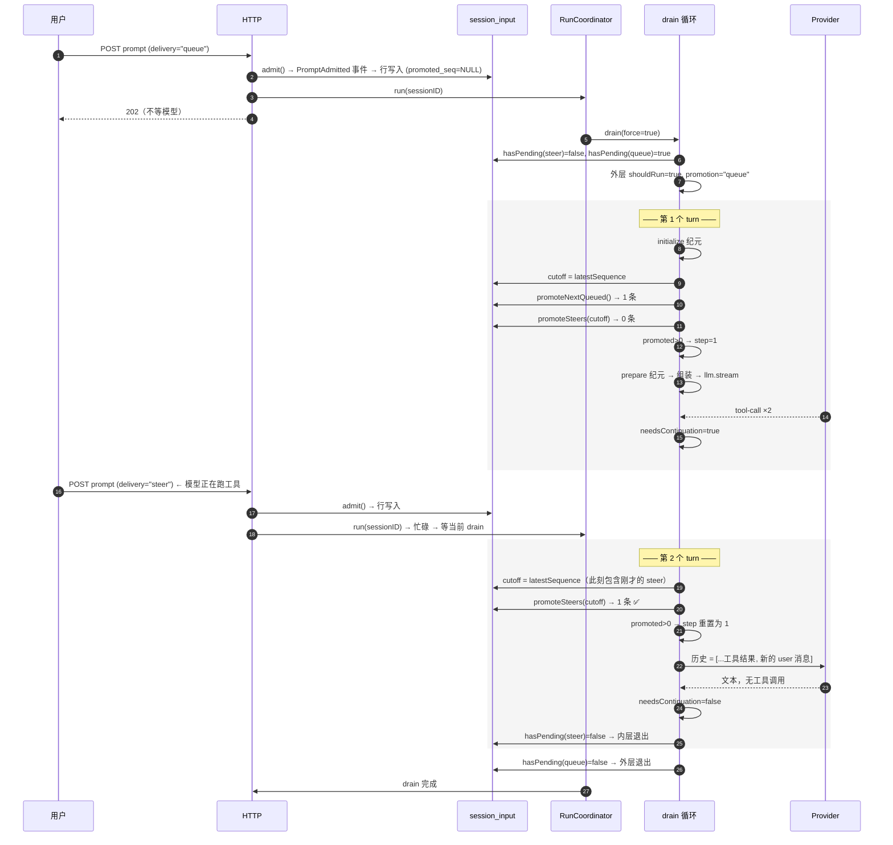

# 05 · 输入收件箱与 Drain 循环：用户随时能发，模型一轮不被打断

源码：`packages/core/src/session/input.ts`（288 行）、`packages/core/src/session/run-coordinator.ts`（104 行）、`packages/core/src/session/runner/llm.ts:387-411`

---

## 1. 解决什么问题

一个正在跑工具的 agent，用户又发了一条消息。三种朴素处理都不对：

| 做法 | 问题 |
| --- | --- |
| 直接 append 到 messages 数组 | 当前 provider 请求已经发出去了，改数组没用；下一轮会突然多出一条来路不明的消息 |
| 拒绝用户输入（禁用输入框） | 用户体验极差。真实场景里用户经常要在 agent 跑偏时立刻纠正 |
| 中断当前请求再重发 | 已产生的工具结果全丢；成本浪费；用户看到内容消失 |

opencode 的解法有两层：

**第一层：受理 ≠ 进入历史。**
`POST prompt` 只把输入写进一张 `session_input` 收件箱表并立刻返回。它此时是 **Admitted Prompt**（已受理的待办输入），**不在** Session History 里，模型看不见。

**第二层：两种投递语义。**

| delivery | 语义 | 提升时机 |
| --- | --- | --- |
| `steer`（打断/转向） | "现在就让模型知道" | 当前 drain 还需要继续时，在**下一个安全边界**提升 |
| `queue`（排队） | "等这轮彻底做完再说" | 当前 drain 即将 idle 时才提升，且**一次只提升一条** |

**Prompt Promotion（提升）**才是「从收件箱变成模型可见的 user 消息」的那个原子动作。

---

## 2. 概念模型与不变量

1. **P1** 受理是幂等的：同一个 `id` 重复提交返回已存在的那条，不产生第二条。
2. **P2** 提升是原子的：`promoted_seq` 从 `NULL` 变成具体值，与 user 消息的产生同事务。
3. **P3** steer 提升带 **cutoff**：只提升 `admitted_seq <= cutoff` 的，`cutoff` 是本轮开始时的最新 seq。
4. **P4** queue 每次只提升**一条**，提升后重新评估是否还要继续。
5. **P5** 任何输入被提升 → **provider-turn 配额（step）重置为 1**；一个边界上提升多条也只重置一次。
6. **P6** 一个会话同时只有一个 drain 在跑（进程内串行）。
7. **P7** Drain 没有持久身份：崩溃恢复只能靠 `session_input` + 历史 + 工具状态重建。
8. **P8** 已提升的输入不能再次提升（`promoted_seq IS NULL` 是提升的前置条件）。

---

## 3. 数据结构定义

### 3.1 原样摘录

```ts
export const SessionInputTable = sqliteTable("session_input", {
  id: text().$type<SessionMessage.ID>().primaryKey(),
  session_id: text().$type<SessionSchema.ID>().notNull()
    .references(() => SessionTable.id, { onDelete: "cascade" }),
  prompt: text({ mode: "json" }).notNull().$type<Prompt>(),
  delivery: text().$type<SessionInput.Delivery>().notNull(),
  admitted_seq: integer().notNull(),
  promoted_seq: integer(),                                 // NULL = 还没提升
  time_created: integer().notNull().$default(() => Date.now()),
}, (table) => [
  index("session_input_session_pending_delivery_seq_idx")
    .on(table.session_id, table.promoted_seq, table.delivery, table.admitted_seq),
  uniqueIndex("session_input_session_admitted_seq_idx").on(table.session_id, table.admitted_seq),
  uniqueIndex("session_input_session_promoted_seq_idx").on(table.session_id, table.promoted_seq),
])
```
> `packages/core/src/session/sql.ts:140-166`

**三个索引各有分工**：
- 复合索引 `(session_id, promoted_seq, delivery, admitted_seq)` 服务所有 pending 查询（`hasPending` / `promoteSteers` / `promoteNextQueued`）。字段顺序就是查询谓词顺序。
- 两个唯一索引保证 `admitted_seq` 和 `promoted_seq` 在会话内不重复——**这是 P2 原子性的数据库级保障**。

```ts
export const Delivery = ...   // "steer" | "queue"

const fromRow = (row): Admitted =>
  Admitted.make({
    admittedSeq: row.admitted_seq,
    id: SessionMessage.ID.make(row.id),
    sessionID: SessionSchema.ID.make(row.session_id),
    prompt: decodePrompt(row.prompt),
    delivery: row.delivery,
    timeCreated: DateTime.makeUnsafe(row.time_created),
    ...(row.promoted_seq === null ? {} : { promotedSeq: row.promoted_seq }),
  })
```
> `packages/core/src/session/input.ts:16-30`

### 3.2 等价纯 SQL / TS 版

```sql
CREATE TABLE session_input (
  id           TEXT PRIMARY KEY,                 -- 复用未来的 message id
  session_id   TEXT NOT NULL REFERENCES session(id) ON DELETE CASCADE,
  prompt       TEXT NOT NULL,                    -- JSON
  delivery     TEXT NOT NULL,                    -- 'steer' | 'queue'
  admitted_seq INTEGER NOT NULL,
  promoted_seq INTEGER,                          -- NULL = pending
  time_created INTEGER NOT NULL
);
CREATE INDEX  idx_input_pending ON session_input(session_id, promoted_seq, delivery, admitted_seq);
CREATE UNIQUE INDEX idx_input_admitted ON session_input(session_id, admitted_seq);
CREATE UNIQUE INDEX idx_input_promoted ON session_input(session_id, promoted_seq);
```

```ts
export type Delivery = "steer" | "queue"

export interface AdmittedPrompt {
  id: string                    // 提升后就是 user 消息的 id
  sessionId: string
  prompt: Prompt                // {text, files?, agents?}
  delivery: Delivery
  admittedSeq: number
  promotedSeq?: number          // undefined = 还没提升
  timeCreated: number
}
```

**`id` 在受理时就定下，提升后直接当 user 消息的 id 用。** 这让「乐观更新」变得简单：前端提交时自己生成 id，本地立刻插入一条 pending user 消息；服务端提升后广播的 user 消息 id 相同，前端直接原地替换，不会闪烁或重复。

---

## 4. 核心算法

### 4.1 受理（admit）

```ts
export const admit = Effect.fn("SessionInput.admit")(function* (db, events, input) {
  const existing = yield* find(db, input.id)
  if (existing !== undefined) return existing                     // P1：幂等
  const timestamp = yield* DateTime.now
  return yield* events
    .publish(SessionEvent.PromptAdmitted, {
      messageID: input.id, sessionID: input.sessionID, timestamp,
      prompt: input.prompt, delivery: input.delivery,
    })
    .pipe(
      Effect.flatMap((event) =>
        event.durable === undefined
          ? Effect.die("Prompt admission event is missing aggregate sequence")
          : Effect.succeed(Admitted.make({ admittedSeq: event.durable.seq, ...input, timeCreated: timestamp })),
      ),
      Effect.catchDefect((defect) =>
        find(db, input.id).pipe(Effect.flatMap((stored) => (stored ? Effect.succeed(stored) : Effect.die(defect)))),
      ),
    )
})
```
> `input.ts:41-81`

两道幂等保险：查询前置检查 + 失败后重查兜底（并发提交时前置检查可能都没命中，靠唯一约束冲突后重查解决）。

`admitted_seq` **来自事件的 durable seq**——不是自己 `MAX+1`。这保证它和会话里其它事件在同一个序号空间，可以直接和 `baseline_seq`、`compaction.seq` 比较。

投影：

```ts
export const projectAdmitted = Effect.fn(...)(function* (db, input) {
  const message = yield* db.select({ id: SessionMessageTable.id }).from(SessionMessageTable)
    .where(eq(SessionMessageTable.id, input.id)).get()
  if (message !== undefined) return yield* Effect.die(new LifecycleConflict({ id: input.id }))
  //          ^^^ 已经是消息了却又来受理 → 生命周期冲突
  const stored = yield* db.insert(SessionInputTable).values({...}).onConflictDoNothing()
    .returning({ id: SessionInputTable.id }).get()
  if (!stored) return yield* Effect.die(new LifecycleConflict({ id: input.id }))
})
```
> `input.ts:83-116`

### 4.2 提升（promotion）

**steer —— 带 cutoff 的批量提升（P3）：**

```ts
export const promoteSteers = Effect.fn("SessionInput.promoteSteers")(function* (db, events, sessionID, cutoff) {
  const rows = yield* db.select().from(SessionInputTable)
    .where(and(
      eq(SessionInputTable.session_id, sessionID),
      isNull(SessionInputTable.promoted_seq),                    // P8
      eq(SessionInputTable.delivery, "steer"),
      lte(SessionInputTable.admitted_seq, cutoff),               // P3
    ))
    .orderBy(asc(SessionInputTable.admitted_seq))
    .all()
  return yield* publish(db, events, sessionID, rows)
})
```
> `input.ts:245-266`

**cutoff 是本轮开始时的最新 seq**：

```ts
const cutoff = yield* EventV2.latestSequence(db, session.id)
let promoted = 0
if (promotion === "steer") promoted = yield* SessionInput.promoteSteers(db, events, session.id, cutoff)
if (promotion === "queue") {
  promoted += Number(yield* SessionInput.promoteNextQueued(db, events, session.id))
  promoted += yield* SessionInput.promoteSteers(db, events, session.id, cutoff)
}
if (promoted > 0) currentStep = 1                                // P5
```
> `packages/core/src/session/runner/llm.ts:184-192`

**为什么 steer 要 cutoff**：提升过程本身会产生事件、耗时。没有 cutoff 的话，提升过程中新到达的 steer 也会被卷进这一轮——这个集合可能永远不收敛（用户手速快时）。cutoff 把「本轮要处理的输入」在开始瞬间冻结成一个有限集合。

**queue —— 一次一条（P4）：**

```ts
export const promoteNextQueued = Effect.fn("SessionInput.promoteNextQueued")(function* (db, events, sessionID) {
  const row = yield* db.select().from(SessionInputTable)
    .where(and(
      eq(SessionInputTable.session_id, sessionID),
      isNull(SessionInputTable.promoted_seq),
      eq(SessionInputTable.delivery, "queue"),
    ))
    .orderBy(asc(SessionInputTable.admitted_seq))
    .limit(1)                                                    // ← 只取一条
    .get()
  return row === undefined ? false : yield* publish(db, events, sessionID, [row]).pipe(Effect.as(true))
})
```
> `input.ts:268-288`

**注意 `queue` 分支会同时提升 steer**（`llm.ts:189-190`）：从 idle 恢复时，排队的那一条和所有待处理的 steer 一起进历史。顺序是 queue 先、steer 后（steer 是对 queue 那条的补充说明）。

**提升的实际动作**是发一条 `Prompted` 事件：

```ts
const publish = Effect.fn("SessionInput.publish")(function* (db, events, sessionID, rows) {
  for (const row of rows) {
    const id = SessionMessage.ID.make(row.id)
    yield* events.publish(SessionEvent.Prompted, {
      sessionID, timestamp: DateTime.makeUnsafe(row.time_created),
      messageID: id, prompt: decodePrompt(row.prompt), delivery: row.delivery,
    }).pipe(
      Effect.catchDefect((defect) =>
        defect instanceof LifecycleConflict
          ? find(db, id).pipe(Effect.flatMap((stored) => (stored?.promotedSeq === undefined ? Effect.die(defect) : Effect.void)))
          : Effect.die(defect),
      ),
    )
  }
  return rows.length
})
```
> `input.ts:216-243`

`timestamp` 用的是**受理时间**（`row.time_created`），不是提升时间。用户看到的时间戳应该是他按下回车的时刻。

投影侧（P2 原子性）：

```ts
export const projectPrompted = Effect.fn(...)(function* (db, input) {
  const updated = yield* db.update(SessionInputTable)
    .set({ promoted_seq: input.promotedSeq })
    .where(and(
      eq(SessionInputTable.id, input.id),
      eq(SessionInputTable.session_id, input.sessionID),
      isNull(SessionInputTable.promoted_seq),                    // ← CAS：只有还没提升才更新
    ))
    .returning().get()
  if (updated) {
    const stored = fromRow(updated)
    if (!matchesProjection(stored, input)) return yield* Effect.die(new LifecycleConflict({ id: input.id }))
    return
  }
  const stored = yield* find(db, input.id)
  if (stored) {
    if (!matchesProjection(stored, input) || stored.promotedSeq !== input.promotedSeq)
      return yield* Effect.die(new LifecycleConflict({ id: input.id }))
    return                                                       // 重放：已是目标状态，幂等成功
  }
  // 事件重放时收件箱行不存在 → 直接建一条已提升的
  yield* db.insert(SessionInputTable).values({
    id: input.id, prompt: encodePrompt(input.prompt), delivery: input.delivery,
    admitted_seq: input.promotedSeq, promoted_seq: input.promotedSeq, time_created: ...,
  }).run()
})
```
> `input.ts:118-168`

`WHERE ... AND promoted_seq IS NULL` 是**数据库层面的 compare-and-swap**。并发下只有一个 writer 能成功，另一个走「重查 + 校验一致」路径。这就是 P2 和 P8 的实现。

### 4.3 Drain 循环

```ts
const run = Effect.fn("SessionRunner.run")(function* (input: { sessionID; force: boolean }) {
  const hasSteer = yield* SessionInput.hasPending(db, input.sessionID, "steer")
  const hasQueue = hasSteer ? false : yield* SessionInput.hasPending(db, input.sessionID, "queue")
  if (!input.force && !hasSteer && !hasQueue) return
  yield* failInterruptedTools(input.sessionID)                   // 崩溃恢复：清理悬空工具

  let promotion: SessionInput.Delivery | undefined = hasSteer ? "steer" : hasQueue ? "queue" : undefined
  let shouldRun = input.force || hasSteer || hasQueue

  while (shouldRun) {                                            // 外层：处理 queue
    let needsContinuation = true
    let step = 1
    while (needsContinuation) {                                  // 内层：处理 step
      const result = yield* runTurn(input.sessionID, promotion, step)
      needsContinuation = result.needsContinuation
      step = result.step + 1
      promotion = "steer"                                        // 第二轮起固定为 steer
      if (!needsContinuation) needsContinuation = yield* SessionInput.hasPending(db, input.sessionID, "steer")
    }
    shouldRun = yield* SessionInput.hasPending(db, input.sessionID, "queue")
    promotion = shouldRun ? "queue" : undefined
  }
})
```
> `runner/llm.ts:387-411`

读懂这段的四个要点：

1. **`hasSteer ? false : hasQueue`** —— 有 steer 时不查 queue。steer 优先级更高，这一轮先处理它。
2. **`promotion = "steer"`（内层循环末尾）** —— 第一轮可能是 queue，之后每一轮都检查 steer。这就是「模型跑着的时候用户插话，下一步就能看到」。
3. **`if (!needsContinuation) needsContinuation = hasPending(steer)`** —— 模型说完了（没有工具调用要继续），但如果这期间用户又插了话，**继续跑**而不是 idle。
4. **外层 while 的存在** —— 内层跑到没有 steer 了，看看有没有排队的 queue；有就再来一轮外层。**每次外层只放行一条 queue**（P4）。

`needsContinuation` 的来源：

```ts
needsContinuation = true       // 每次收到非 provider-executed 的 tool-call 时置位
...
return { needsContinuation: !publisher.hasProviderError() && needsContinuation, step: currentStep }
```
> `runner/llm.ts:253, 351`

即：**有本地工具被调用 且 没有 provider 错误 → 需要下一轮**（把工具结果喂回去）。

### 4.4 会话级串行（P6）

```ts
/** Serializes execution for each key while allowing different keys to run concurrently. */
export interface Coordinator<Key, E> {
  readonly active: Effect.Effect<ReadonlySet<Key>>
  readonly run: (key: Key) => Effect.Effect<void, E>       // 空闲则启动，否则加入当前执行
  readonly wake: (key: Key) => Effect.Effect<void>         // 注册一次合并的后继
  readonly interrupt: (key: Key) => Effect.Effect<void>    // 中断并等待清理
}
```
> `packages/core/src/session/run-coordinator.ts:6-15`

三个操作的语义差异是关键：

| 操作 | 空闲时 | 忙碌时 |
| --- | --- | --- |
| `run(key)` | 启动 drain（`force = true`），等它结束 | **等当前 drain 结束**（不排新的） |
| `wake(key)` | 启动 drain（`force = false`） | 置 `pendingWake = true`，**多次 wake 合并成一次后继** |
| `interrupt(key)` | 无操作 | 置 `stopping`，清 `pendingWake`，中断 fiber 并等清理 |

`settle` 里的后继逻辑：

```ts
const settle = (key, entry, exit) => {
  if (Exit.isSuccess(exit) && !entry.stopping && entry.pendingWake) {
    entry.pendingWake = false
    start(key, entry, false, true)         // 复用同一个 entry，等待方继续等
    return
  }
  const successor = entry.pendingWake ? makeEntry() : undefined
  if (successor === undefined) active.delete(key)
  else { active.set(key, successor); start(key, successor, false, true) }
  Deferred.doneUnsafe(entry.done, exit)    // 唤醒所有等待方
}
```
> `run-coordinator.ts:51-65`

**成功且有 pendingWake 时复用同一个 entry**（等待方继续等，因为工作还没真正做完）；**失败时另起一个 entry**（等待方立刻拿到失败结果，新的后继独立跑）。这个区分决定了 `POST prompt` 的调用方是「等到真的处理完」还是「立刻拿到上一轮的错误」。

`wake` 用在「有新输入了，去看看」；`run` 用在「我要确保这次输入被处理」。

---

## 5. 时序



---

## 6. 边界情况与失败模式

| 场景 | opencode 怎么处理 | 你自己实现时必须处理 |
| --- | --- | --- |
| 同一个 id 提交两次 | `admit` 前置查 + 冲突后重查，返回已存在的（P1） | 网络重试很常见，不幂等会产生重复消息 |
| 提升过程中又来一条 steer | cutoff 冻结集合（P3），新的留到下一轮 | 没有 cutoff 时高频输入会让本轮永不收敛 |
| 并发两个 writer 提升同一条 | `WHERE promoted_seq IS NULL` 做 CAS；败者重查校验（P2/P8） | 用「先查后写」会双写 |
| 同一会话并发两个 drain | Coordinator 按 key 串行（P6） | 两个 drain 会交错写历史，工具配对错乱 |
| 多次 wake 堆积 | `pendingWake` 布尔合并成一次后继 | 用计数器会跑 N 轮空转 |
| 进程崩溃时有 pending/running 工具 | `failInterruptedTools` 把它们标记为 `Tool.Failed{"Tool execution interrupted"}` | 不清理的话下一轮历史里有悬空 tool_call，provider 直接 400 |
| 进程崩溃时输入已受理未提升 | 行还在，`promoted_seq` 仍是 NULL，下次 drain 自然处理（P7） | 别把待办输入放内存队列 |
| 用户拒绝权限请求 | `isUserDeclined` 检测 `PermissionV2.DeclinedError` / `QuestionV2.RejectedError` → 中断整个 drain，不把拒绝当工具输出喂回模型 | 喂回去模型会反复尝试同一个操作 |
| 模型说完了但用户刚插话 | 内层 `needsContinuation = hasPending(steer)` 兜底 | 不查的话用户的插话要等下次触发才被处理 |
| 一个边界提升了 3 条 | `promoted > 0` 只重置一次 step（P5） | 按条数重置会让配额失效 |
| queue 里有 5 条 | 外层每轮只放一条（P4） | 一次全放会让模型收到 5 个互相冲突的任务 |
| 会话已迁移到别的位置 | `runTurnAttempt` 开头比较 location，不符就 `Effect.interrupt` | 在错误的工作目录跑工具会破坏用户文件 |

---

## 7. 移植到你自己的项目

### 7.1 最小可用版

```ts
// 只做 queue，不做 steer
async function submitPrompt(sessionId: string, id: string, prompt: Prompt) {
  await db.insert("session_input").values({ id, sessionId, prompt, delivery: "queue",
    admittedSeq: await nextSeq(sessionId), promotedSeq: null, timeCreated: Date.now() })
  coordinator.wake(sessionId)          // 不等结果
}

async function drain(sessionId: string) {
  while (true) {
    const promoted = await promoteNextQueued(sessionId)
    if (!promoted && !needsContinuation) break
    const result = await runTurn(sessionId)
    needsContinuation = result.needsContinuation
  }
}
```

**不能砍的**：收件箱表本身（没有它就没法做「受理即返回」）、`promoted_seq` 的 CAS、会话级串行。

steer 可以后加——它只是多一个 delivery 值和一次带 cutoff 的查询。

### 7.2 落地步骤

1. 建 `session_input` 表（§3.2 的 DDL），三个索引都要。
2. 实现 `nextSeq(sessionId)`：与消息 seq 同源。若你用事件表，就是事件的自增序号。
3. 实现 `admit(id, sessionId, prompt, delivery)`：前置查 + `INSERT ... ON CONFLICT DO NOTHING` + 冲突后重查。
4. `POST /prompt` handler：`admit()` → `coordinator.wake(sessionId)` → 立刻 202 返回。**前端自己生成 id**，同时本地乐观插入。
5. 实现 `hasPending(sessionId, delivery)`：`SELECT 1 ... WHERE promoted_seq IS NULL AND delivery = ? LIMIT 1`。
6. 实现 `promoteNextQueued`：`ORDER BY admitted_seq LIMIT 1` 取一条 → 事务内「UPDATE 置 promoted_seq（带 `IS NULL` 条件）+ INSERT user 消息」。
7. 实现 `promoteSteers(cutoff)`：同上，但批量且加 `admitted_seq <= cutoff`。
8. 实现 Coordinator：一个 `Map<sessionId, {promise, pendingWake, stopping}>`，照 §4.4 的三个操作写。
9. 实现 drain 双层循环：照 §4.3 逐行抄，四个要点一个不能少。
10. 实现 `failInterruptedTools(sessionId)`：drain 开头扫历史，把 pending/running 的工具标记失败。

### 7.3 你需要自己提供的依赖

| 依赖 | 用途 | 建议 |
| --- | --- | --- |
| 会话级单调 seq | cutoff 与排序 | 与消息 seq 同源同事务 |
| 事务 + CAS | 提升的原子性 | `UPDATE ... WHERE promoted_seq IS NULL RETURNING *` |
| 进程内串行原语 | 单会话单 drain | 一个 `Map<key, Promise>` 就够；分布式则需要分布式锁 |
| 中断信号 | 用户点停止 | `AbortController` 贯穿整个 turn |

---

## 8. 验收清单

- [ ] **P1** 同一个 id 连续 POST 三次 → 收件箱只有一行，返回同一条
- [ ] **P1** 并发 POST 同一个 id → 同上，无异常
- [ ] **P2** 在「UPDATE promoted_seq」和「INSERT user 消息」之间人为抛错 → 两者都不生效
- [ ] **P3** 模型跑工具期间连续发 3 条 steer，其中第 3 条在 cutoff 之后到达 → 本轮只提升前 2 条
- [ ] **P4** queue 里有 3 条 → 每个外层循环只提升 1 条，共跑 3 个外层
- [ ] **P5** 一个边界提升 2 条 steer → `step` 只重置一次（值为 1，不是 -1 或跳变）
- [ ] **P6** 并发调 `run(sessionId)` 两次 → 只有一个 drain 在跑，第二个等待
- [ ] **P6** 不同 sessionId 并发 → 各自独立跑，互不阻塞
- [ ] **P7** 受理后立刻 kill 进程，重启 → 该输入仍 pending，drain 后正常提升
- [ ] **P8** 手工把某行 `promoted_seq` 置为非 NULL → 后续提升跳过它
- [ ] **崩溃清理** 造一条 running 状态的工具，重启后 drain → 该工具变成 error，历史无悬空 tool_call
- [ ] **继续判定** 模型返回工具调用 → `needsContinuation = true`；纯文本 → `false`
- [ ] **插话兜底** 模型返回纯文本的同时收件箱有 steer → 继续跑而不是 idle
- [ ] **wake 合并** drain 期间连续 `wake` 5 次 → 结束后只跑一个后继 drain
- [ ] **拒绝中断** 用户拒绝权限 → 整个 drain 中断，历史里没有「拒绝」作为工具输出
- [ ] **乐观更新** 前端自生成 id 插入本地 → 服务端提升后的 user 消息 id 相同，UI 无重复无闪烁
