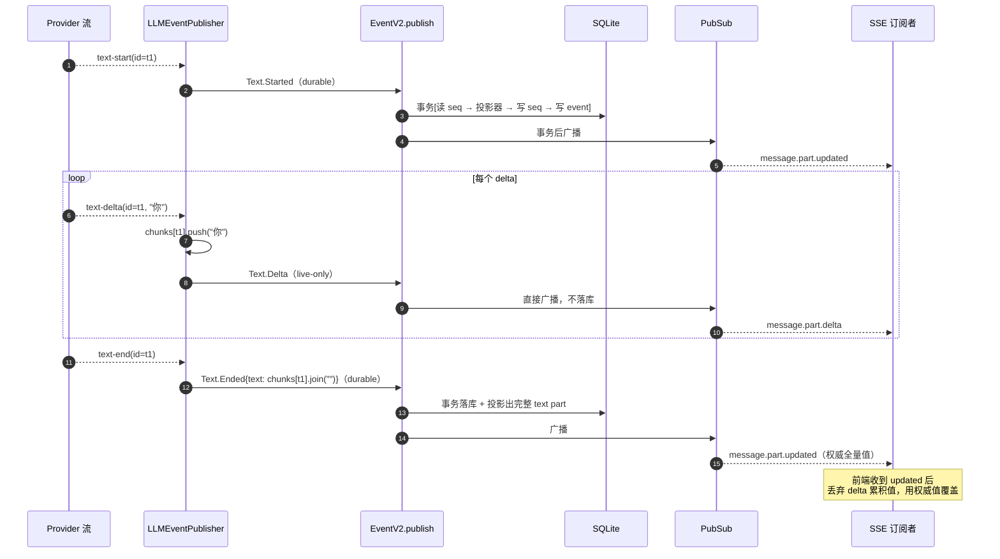

# 07 · 事件模型与 SSE：过程怎么变成可订阅的流

源码：`packages/core/src/event.ts`（638 行）、`packages/core/src/event/sql.ts`、`packages/schema/src/session-event.ts`（521 行）、`packages/core/src/session/runner/publish-llm-event.ts`（423 行）、`packages/server/src/handlers/event.ts`（52 行）

---

## 1. 解决什么问题

「让用户看见过程」这件事，需求比看起来复杂：

- 文本要**逐字**出现（每秒几十次更新）
- 刷新页面后过程要能**完整回放**
- 多个客户端（Web / 桌面 / 终端）要看到**同一份**过程
- 服务端崩溃重启后，历史不能丢

如果所有更新都持久化，SQLite 每秒写几十次，磁盘和 I/O 都受不了。如果都不持久化，刷新就丢。

opencode 的分野极其清晰：

> **`.Delta` 事件是 live-only（只广播不落库）；`.Started` / `.Ended` 是 durable（落库并广播）。**

源码里有一行注释直接说了：

```ts
// Stream fragments are live-only; Text.Ended is the replayable full-value boundary.
export const Delta = Event.define({
  type: "session.next.text.delta",
  schema: { ...Base, assistantMessageID: SessionMessage.ID, textID: Schema.String, delta: Schema.String },
})
```
> `packages/schema/src/session-event.ts:209-217`

注意它**没有 `...options`**——而 `Started` / `Ended` 都有。`options` 就是 `{ durable: { aggregate: "sessionID", version: 1 } }`（`session-event.ts:36-41`）。**有 `durable` 就落库，没有就只广播。**

结果：
- 正在连着的客户端：收到 delta，逐字渲染。
- 刷新 / 后来连上的客户端：收到 `Ended` 里的完整文本，一次性渲染。
- 数据库：一段文本只写一行，不是几百行。

---

## 2. 概念模型与不变量

1. **E1** durable 事件按 `aggregateID`（会话 id）分配严格连续的 `seq`（0,1,2,...，无空洞）。
2. **E2** 一次 publish 在**一个事务**里做完：读 seq → 跑投影器 → 跑 commit 钩子 → 写序号 → 写事件。
3. **E3** 广播发生在事务**提交之后**。订阅者永远不会看到没落库的 durable 事件。
4. **E4** 事件 id 全局唯一，重复插入直接 die（防重放歧义）。
5. **E5** 重放时 seq 必须精确等于 `latest + 1`，否则 die；重放已有 seq 时校验内容完全一致（幂等）。
6. **E6** live-only 事件不参与 seq，不落库，只走广播。
7. **E7** 每个 SSE 订阅者一个**有界丢弃队列**（256）；溢出即把该订阅者的流置为失败（断开），不阻塞发布方。
8. **E8** `commit` 钩子只允许配 durable 事件（本地投影必须和事件同事务）。

---

## 3. 数据结构定义

### 3.1 事件表

```ts
export const EventSequenceTable = sqliteTable("event_sequence", {
  aggregate_id: text().notNull().primaryKey(),
  seq: integer().notNull(),          // 该聚合当前最大 seq
  owner_id: text(),                  // 集群场景的所有权标记
})

export const EventTable = sqliteTable("event", {
  id: text().$type<EventV2.ID>().primaryKey(),
  aggregate_id: text().notNull().references(() => EventSequenceTable.aggregate_id, { onDelete: "cascade" }),
  seq: integer().notNull(),
  type: text().notNull(),            // 带版本，如 "session.next.text.ended.v1"
  data: text({ mode: "json" }).notNull(),
}, (table) => [
  uniqueIndex("event_aggregate_seq_idx").on(table.aggregate_id, table.seq),
  index("event_aggregate_type_seq_idx").on(table.aggregate_id, table.type, table.seq),
])
```
> `packages/core/src/event/sql.ts:4-25`

### 3.2 发布接口

```ts
export interface PublishOptions {
  readonly id?: ID
  readonly metadata?: Record<string, unknown>
  readonly location?: Location.Ref
  /** Local operational projection committed atomically with a new durable event. Not replayed or serialized. */
  readonly commit?: (seq: number) => Effect.Effect<void>
}

export interface Interface {
  readonly publish: <D extends Definition>(definition: D, data: Data<D>, options?: PublishOptions) => Effect.Effect<Payload<D>>
  readonly subscribe: <D extends Definition>(definition: D) => Stream.Stream<Payload<D>>
  readonly all: () => Stream.Stream<Payload>
  readonly durable: (input: { aggregateID: string; after?: number }) => Stream.Stream<Payload>
  readonly project: <D extends Definition>(definition: D, projector: Subscriber<D>) => Effect.Effect<void>
  readonly replay: (event: SerializedEvent, options?: {...}) => Effect.Effect<void>
  readonly replayAll: (events: SerializedEvent[], options?: {...}) => Effect.Effect<string | undefined>
  readonly remove: (aggregateID: string) => Effect.Effect<void>
  readonly claim: (aggregateID: string, ownerID: string) => Effect.Effect<void>
}
```
> `packages/core/src/event.ts:126-148`

`commit` 那行注释是理解第 02 章原子性的钥匙：**「与新 durable 事件原子提交的本地操作投影。不会被重放，也不被序列化。」**

### 3.3 等价纯 TS / SQL 版

```sql
CREATE TABLE event_sequence (
  aggregate_id TEXT PRIMARY KEY,
  seq          INTEGER NOT NULL,
  owner_id     TEXT
);
CREATE TABLE event (
  id           TEXT PRIMARY KEY,
  aggregate_id TEXT NOT NULL REFERENCES event_sequence(aggregate_id) ON DELETE CASCADE,
  seq          INTEGER NOT NULL,
  type         TEXT NOT NULL,          -- 含版本后缀
  data         TEXT NOT NULL           -- JSON
);
CREATE UNIQUE INDEX event_aggregate_seq_idx ON event(aggregate_id, seq);
CREATE INDEX event_aggregate_type_seq_idx  ON event(aggregate_id, type, seq);
```

```ts
interface EventDefinition<T extends string, D> {
  type: T
  /** 有则落库；无则只广播（live-only） */
  durable?: { aggregate: keyof D & string; version: number }
  schema: D
}

interface EventPayload<D> {
  id: string
  type: string
  data: D
  durable?: { aggregateID: string; seq: number; version: number }
}

interface PublishOptions {
  id?: string
  metadata?: Record<string, unknown>
  /** 与事件同事务的本地投影 */
  commit?: (seq: number) => Promise<void>
}
```

---

## 4. 会话事件全清单

### 4.1 Durable（28 个，落库 + 广播）

```ts
export const DurableDefinitions = Event.inventory(
  AgentSwitched, ModelSwitched, Moved, Prompted, PromptAdmitted, ContextUpdated, Synthetic,
  Shell.Started, Shell.Ended,
  Step.Started, Step.Ended, Step.Failed,
  Text.Started, Text.Ended,
  Tool.Input.Started, Tool.Input.Ended, Tool.Called, Tool.Progress, Tool.Success, Tool.Failed,
  Reasoning.Started, Reasoning.Ended,
  Retried,
  Compaction.Started, Compaction.Ended,
  RevertEvent.Staged, RevertEvent.Cleared, RevertEvent.Committed,
)
```
> `packages/schema/src/session-event.ts:448-477`

### 4.2 All（32 个 = 28 durable + 4 live-only）

```ts
export const Definitions = Event.inventory(
  AgentSwitched, ModelSwitched, Moved, Prompted, PromptAdmitted, ContextUpdated, Synthetic,
  Shell.Started, Shell.Ended,
  Step.Started, Step.Ended, Step.Failed,
  Text.Started, Text.Delta, Text.Ended,                       // ← Delta 是 live-only
  Reasoning.Started, Reasoning.Delta, Reasoning.Ended,        // ← live-only
  Tool.Input.Started, Tool.Input.Delta, Tool.Input.Ended,     // ← live-only
  Tool.Called, Tool.Progress, Tool.Success, Tool.Failed,
  Retried,
  Compaction.Started, Compaction.Delta, Compaction.Ended,     // ← live-only
  RevertEvent.Staged, RevertEvent.Cleared, RevertEvent.Committed,
)
```
> `session-event.ts:479-511`

**四个 live-only 事件**：`Text.Delta`、`Reasoning.Delta`、`Tool.Input.Delta`、`Compaction.Delta`。全都是"片段"语义，全都有对应的 `.Ended` 承载完整值。

### 4.3 会话状态事件（独立定义，也是 live-only）

```ts
export const Info = Schema.Union([
  Schema.Struct({ type: Schema.Literal("idle") }),
  Schema.Struct({
    type: Schema.Literal("retry"),
    attempt: NonNegativeInt,
    message: Schema.String,
    action: optional(Schema.Struct({
      reason: Schema.String, provider: Schema.String, title: Schema.String,
      message: Schema.String, label: Schema.String, link: optional(Schema.String),
    })),
    next: NonNegativeInt,
  }),
  Schema.Struct({ type: Schema.Literal("busy") }),
]).annotate({ identifier: "SessionStatus" })

export const Status = Event.define({ type: "session.status", schema: { sessionID: SessionID, status: Info } })
```
> `packages/schema/src/session-status-event.ts:9-41`

**三态：`idle` / `busy` / `retry`。** `retry` 携带 `attempt`（第几次）、`message`（原因）、`next`（下次重试的等待秒数）和可选的 `action`（引导用户去处理，比如"余额不足，去充值"）。UI 靠这个渲染重试倒计时。

---

## 5. `LLMEvent → SessionEvent` 完整映射

这是整章最实用的一张表。源码 `packages/core/src/session/runner/publish-llm-event.ts:236-405`。

| provider 事件 | 发出的 SessionEvent | 备注 |
| --- | --- | --- |
| `step-start` | （无） | 直接 return |
| `text-start` | `Text.Started{textID}` | 首次会先 `startAssistant()` → 发 `Step.Started` |
| `text-delta` | `Text.Delta{textID, delta}` | **live-only**；同时在内存 `fragments` 累积 |
| `text-end` | `Text.Ended{textID, text}` | 累积串一次性落库 |
| `reasoning-start` | `Reasoning.Started{reasoningID, providerMetadata}` | |
| `reasoning-delta` | `Reasoning.Delta{reasoningID, delta}` | **live-only** |
| `reasoning-end` | `Reasoning.Ended{reasoningID, text, providerMetadata}` | providerMetadata = reasoning signature |
| `tool-input-start` | `Tool.Input.Started{callID, name}` | 建 tools map 条目 |
| `tool-input-delta` | `Tool.Input.Delta{callID, delta}` | **live-only**；工具参数 JSON 也是流式的 |
| `tool-input-end` | `Tool.Input.Ended{callID, text}` | |
| `tool-call` | `Tool.Called{callID, tool, input, provider}` | 若前面没 input-start 会补发；置 `called=true` |
| `tool-result` | `Tool.Success{structured, content, outputPaths}` 或 `Tool.Failed` | `result.type === "error"` 走 Failed |
| `tool-error` | `Tool.Failed{error}` | |
| `step-finish` | （仅记录 `stepSettlement`） | runner 在工具全部 settle 后才发 `Step.Ended` |
| `finish` | （无） | |
| `provider-error` | `Step.Failed{error}` | 置 `providerFailed`，**后续事件全部忽略** |

### 5.1 片段累积器

```ts
const fragments = (name: string, ended: (id, value, providerMetadata?) => Effect.Effect<void>) => {
  const chunks = new Map<string, string[]>()
  const start = (id) => Effect.suspend(() => {
    if (chunks.has(id)) return Effect.die(`Duplicate ${name} start: ${id}`)
    chunks.set(id, []); return Effect.void
  })
  const append = (id, value) => Effect.suspend(() => {
    const current = chunks.get(id)
    if (!current) return Effect.die(`${name} delta before start: ${id}`)
    current.push(value); return Effect.void
  })
  const end = Effect.fnUntraced(function* (id, providerMetadata?) {
    const current = chunks.get(id)
    if (!current) return yield* Effect.die(`${name} end before start: ${id}`)
    yield* ended(id, current.join(""), providerMetadata)
    chunks.delete(id)
  })
  const flush = Effect.fnUntraced(function* () { for (const id of chunks.keys()) yield* end(id) })
  return { start, append, end, flush }
}
```
> `publish-llm-event.ts:88-115`

一个泛用的「开始 → 累积 → 结束」累积器，被 text / reasoning / toolInput 三处复用。

**`flush()` 是防丢失的关键**：provider 流被中断时，那些只有 `start` 和 `delta` 没有 `end` 的片段会被强制 end，把已收到的内容落库。调用点：

```ts
const providerStream = llm.stream(request).pipe(
  Stream.runForEach((event) => ...),
  Effect.ensuring(withPublication(publisher.flush())),      // ← 无论成功失败都 flush
)
```
> `packages/core/src/session/runner/llm.ts:238-274`

### 5.2 硬保证的不变量（全部 `Effect.die`，不软处理）

- text / reasoning / toolInput 的 delta 必须在 start 之后、end 之前
- 同一 id 不能 start 两次、end 两次
- tool 的 `name` 在 input-start / input-delta / call / result / error 之间必须完全一致
- tool-result / tool-error 必须在 tool-call 之后
- `step-finish` 只能出现一次

```ts
case "tool-input-delta": {
  const tool = tools.get(event.id)
  if (!tool) return yield* Effect.die(`Tool input delta before start: ${event.id}`)
  if (tool.name !== event.name)
    return yield* Effect.die(`Tool input name changed for ${event.id}: ${tool.name} -> ${event.name}`)
  if (tool.inputEnded) return yield* Effect.die(`Tool input delta after end: ${event.id}`)
  ...
}
```
> `publish-llm-event.ts:314-318`

**为什么用 die 而不是忽略**：这些都是 provider 协议违约。静默忽略会产生一条语义损坏的消息，然后在下一轮回放时让 provider 报 400，而那时你已经不知道根因在哪了。**早失败，带上下文。**

### 5.3 token 统计口径

```ts
const safe = (value: number | undefined) => Math.max(0, Number.isFinite(value) ? (value ?? 0) : 0)

const tokens = (usage: Usage | undefined) => {
  const reasoning = safe(usage?.reasoningTokens)
  const read = safe(usage?.cacheReadInputTokens)
  const write = safe(usage?.cacheWriteInputTokens)
  return {
    input: safe(usage?.nonCachedInputTokens),
    output: safe(usage?.visibleOutputTokens),
    reasoning,
    cache: { read, write },
  }
}
```
> `publish-llm-event.ts:15-27`

**`input` 是 `nonCachedInputTokens`**（不含缓存命中的部分），缓存读写单独统计。这样 UI 才能显示"本轮实际付费的 input 是多少、缓存省了多少"。`safe()` 兜底成非负有限数——某些 provider 会回 `null` 或 `NaN`。

`Step.Ended` 由 runner 发（不是 publisher），因为它要等工具全部 settle 并算出文件快照：

```ts
yield* withPublication(events.publish(SessionEvent.Step.Ended, {
  sessionID: session.id, timestamp: yield* DateTime.now,
  assistantMessageID: yield* publisher.startAssistant(),
  finish: stepSettlement.finish, cost: 0, tokens: stepSettlement.tokens,
  snapshot: endSnapshot, files,
}))
```
> `packages/core/src/session/runner/llm.ts:325-342`

### 5.4 发布的串行化

```ts
const withPublication = Semaphore.makeUnsafe(1).withPermit
const publish = (event: LLMEvent, outputPaths: ReadonlyArray<string> = []) =>
  withPublication(publisher.publish(event, outputPaths))
```
> `runner/llm.ts:233-235`

**所有发布经过一个容量 1 的信号量。** 因为工具是并发执行的（`FiberSet`），它们的结果事件可能同时到达。没有这道串行，两个 `Tool.Success` 会并发进 `commitDurableEvent`，抢同一个 `seq`。

---

## 6. publish 的事务语义

```
publishEvent(definition, event, commit):
  if !definition.durable && commit: die("Local commit hooks require a durable event")   # E8
  if definition.durable:
      committed = commitDurableEvent(definition, event, undefined, commit)
      if committed:
          event.durable = {aggregateID, seq, version}
          notify(event, true)          # E3：事务后广播
          return event
  notify(event, false)                 # E6：live-only 直接广播
  return event
```
> `packages/core/src/event.ts:369-393`

`commitDurableEvent` 的事务体（`event.ts:236-350`）顺序**不能改**：

```
db.transaction:
  1. SELECT seq, owner_id FROM event_sequence WHERE aggregate_id = ?     → latest（无行则 -1）
  2. encoded = schema.encode(event.data)
  3. （重放路径）校验 owner / seq 连续性 / 内容一致性                        # E5
  4. SELECT ... FROM event WHERE id = ?  → 已存在则 die                    # E4
  5. seq = latest + 1
  6. for projector of projectors[event.type]: projector(committed)        # ← 投影器在事务内
  7. if commit: commit(seq)                                              # ← 本地投影也在事务内 (E2)
  8. UPSERT event_sequence SET seq
  9. INSERT INTO event
  10. return {aggregateID, seq}
# 事务提交后：
  唤醒 durable 订阅者 → notify(event, true) 广播给所有 listener            # E3
```

**投影器（第 6 步）和 commit 钩子（第 7 步）在写事件行之前跑**。这看起来反直觉，但保证了：投影失败 → 整个事务回滚 → 事件也不存在。不会出现「事件在库里但投影没跑」的裂开状态。

---

## 7. SSE 端点

全文只有 52 行：

```ts
const subscriberCapacity = 256

function eventData(data: unknown): Sse.Event {
  return { _tag: "Event", event: "message", id: undefined, data: JSON.stringify(Schema.encodeUnknownSync(OpenCodeEvent)(data)) }
}

export const EventHandler = HttpApiBuilder.group(Api, "server.event", (handlers) =>
  Effect.gen(function* () {
    const events = yield* EventV2.Service
    return handlers.handleRaw("event.subscribe", () =>
      Effect.gen(function* () {
        const connected = { id: EventV2.ID.create(), type: "server.connected", data: {} }
        const output = Stream.unwrap(
          Effect.gen(function* () {
            // Acquiring the bounded stream installs its listener before readiness is observable.
            const live = yield* EventV2.allBounded(events, subscriberCapacity)
            return Stream.make(connected).pipe(Stream.concat(live))
          }),
        ).pipe(Stream.map(eventData), Stream.pipeThroughChannel(Sse.encode()))
        const heartbeat = Stream.tick("15 seconds").pipe(Stream.map(() => ": heartbeat\n\n"))
        return HttpServerResponse.stream(
          output.pipe(Stream.merge(heartbeat, { haltStrategy: "left" }), Stream.encodeText),
          {
            contentType: "text/event-stream",
            headers: {
              "Cache-Control": "no-cache, no-transform",
              "X-Accel-Buffering": "no",
              "X-Content-Type-Options": "nosniff",
            },
          },
        )
      }),
    )
  }),
)
```
> `packages/server/src/handlers/event.ts:1-52`

六个必抄的细节：

1. **首帧 `server.connected`**。客户端收到它就知道"订阅已建立"，此时才去拉全量快照——**先订阅后拉取**，避免拉取和订阅之间的窗口丢事件。那行注释说得很清楚：`Acquiring the bounded stream installs its listener before readiness is observable.`
2. **心跳 `: heartbeat\n\n`**（SSE 注释行，客户端会忽略），每 15 秒。用来穿透中间代理的空闲超时。
3. **`haltStrategy: "left"`**：事件流结束时整个响应结束，心跳流不会把连接吊住。
4. **`X-Accel-Buffering: no`**：告诉 nginx 别缓冲。**不加这个，nginx 后面的 SSE 会整段延迟。**
5. **`Cache-Control: no-cache, no-transform`**：`no-transform` 防止中间代理压缩/改写流。
6. **`X-Content-Type-Options: nosniff`**：防浏览器嗅探。

### 7.1 有界订阅者（E7）

```ts
export const allBounded = (events: Interface, capacity: number) =>
  Effect.gen(function* () {
    const queue = yield* Queue.dropping<Payload, SubscriberOverflowError>(capacity)
    const unsubscribe = yield* events.listen((event) =>
      Queue.offer(queue, event).pipe(
        Effect.flatMap((accepted) =>
          accepted ? Effect.void : Queue.fail(queue, new SubscriberOverflowError({ capacity })).pipe(Effect.asVoid),
        ),
      ),
    )
    yield* Effect.addFinalizer(() => unsubscribe.pipe(Effect.andThen(Queue.shutdown(queue)), Effect.asVoid))
    return Stream.fromQueue(queue)
  })
```
> `packages/core/src/event.ts:152-164`

**慢消费者的处理方式是断开它，不是阻塞发布方。** 队列满 → `Queue.fail` → 该订阅者的流以 `SubscriberOverflowError` 结束 → SSE 连接断开 → 客户端 250ms 后重连并重新拉全量。

这是正确的取舍：**一个卡住的浏览器标签页绝不能拖慢 agent 的执行**。

---

## 8. 时序



---

## 9. 边界情况与失败模式

| 场景 | opencode 怎么处理 | 你自己实现时必须处理 |
| --- | --- | --- |
| 客户端处理不过来 | 有界丢弃队列（256）→ 溢出即失败该订阅者（E7） | 用无界队列会 OOM；阻塞发布方会拖慢 agent |
| provider 流中途断开 | `Effect.ensuring(flush())` 把未 end 的片段强制落库 | 不 flush 就丢已生成的内容 |
| 工具并发返回结果 | 容量 1 的信号量串行化所有 publish | 不串行会抢 seq |
| provider 违反协议（delta 在 start 之前） | `Effect.die` 带完整上下文 | 静默忽略 → 下轮 provider 400 且无从排查 |
| provider-error 后仍有事件 | `if (overflowFailure \|\| publisher.hasProviderError()) return` 直接丢弃 | 错误后的事件会污染已标记失败的消息 |
| 事件 id 重复 | 查到已存在则 die（E4） | 重放场景下会静默产生歧义 |
| 重放 seq 不连续 | die（E5） | 允许空洞会让 `after` 增量拉取失效 |
| 重放同一 seq 且内容一致 | 幂等返回（E5） | 崩溃恢复时必然发生，不能报错 |
| 投影器抛错 | 在事务内 → 整个事务回滚，事件不存在 | 事务外投影会产生「有事件无投影」的裂开状态 |
| 订阅建立与全量拉取之间丢事件 | 先发 `server.connected`，客户端收到后才拉全量 | 反过来会丢窗口期的事件 |
| nginx 缓冲 SSE | `X-Accel-Buffering: no` | 不加会看到整段延迟几秒才出现 |
| 中间代理空闲超时 | 15 秒心跳 | 不发心跳，60 秒无输出的连接会被切 |
| `commit` 钩子配在非 durable 事件上 | die（E8） | 静默允许会让本地投影与事件不同步 |

---

## 10. 移植到你自己的项目

### 10.1 最小可用版

```ts
type EventDef<T extends string, D> = { type: T; durable?: { aggregate: keyof D & string }; schema?: unknown }

class EventBus {
  private listeners = new Set<(e: AnyEvent) => void>()
  private projectors = new Map<string, ((e: AnyEvent) => Promise<void>)[]>()

  async publish<D>(def: EventDef<string, D>, data: D, opts?: { commit?: (seq: number) => Promise<void> }) {
    const event = { id: ulid(), type: def.type, data }
    if (!def.durable) { this.broadcast(event); return event }          // live-only

    const aggregateId = (data as any)[def.durable.aggregate] as string
    const committed = await db.transaction(async (tx) => {
      const row = await tx.get("SELECT seq FROM event_sequence WHERE aggregate_id = ?", aggregateId)
      const seq = (row?.seq ?? -1) + 1
      const full = { ...event, durable: { aggregateId, seq } }
      for (const p of this.projectors.get(def.type) ?? []) await p(full)
      if (opts?.commit) await opts.commit(seq)
      await tx.run("INSERT INTO event_sequence(aggregate_id,seq) VALUES(?,?) ON CONFLICT(aggregate_id) DO UPDATE SET seq=?", aggregateId, seq, seq)
      await tx.run("INSERT INTO event(id,aggregate_id,seq,type,data) VALUES(?,?,?,?,?)",
                   event.id, aggregateId, seq, def.type, JSON.stringify(data))
      return full
    })
    this.broadcast(committed)                                          // E3：事务后
    return committed
  }

  private broadcast(e: AnyEvent) { for (const l of this.listeners) l(e) }
  subscribe(fn: (e: AnyEvent) => void) { this.listeners.add(fn); return () => this.listeners.delete(fn) }
}
```

**不能砍的**：durable / live-only 的分野、事务后广播、投影器在事务内、有界订阅队列。

### 10.2 落地步骤

1. 建 `event` + `event_sequence` 两张表（§3.3 DDL）。
2. 定义事件清单：每个事件带 `type`，**只给需要回放的加 `durable`**。所有 `.Delta` 不加。
3. 实现 `publish`：照 §10.1，事务内做完 6 步，事务后广播。
4. 实现 `project(type, fn)`：注册投影器，在事务内被调用。
5. 实现有界订阅：`subscribe` 时给每个订阅者一个 256 容量的队列，满了就关闭该订阅者。
6. 写 SSE 端点：
   ```ts
   res.writeHead(200, {
     "Content-Type": "text/event-stream",
     "Cache-Control": "no-cache, no-transform",
     "X-Accel-Buffering": "no",
     "X-Content-Type-Options": "nosniff",
     Connection: "keep-alive",
   })
   res.write(`data: ${JSON.stringify({ type: "server.connected" })}\n\n`)   // 首帧
   const off = bus.subscribe((e) => res.write(`data: ${JSON.stringify(e)}\n\n`))
   const hb = setInterval(() => res.write(": heartbeat\n\n"), 15_000)
   req.on("close", () => { off(); clearInterval(hb) })
   ```
7. 实现 `LLMEvent → 你的事件` 的映射：照 §5 的表逐条写，片段累积器复用一份，`finally` 里 flush。
8. 所有 publish 走一个串行队列（`let chain = Promise.resolve(); chain = chain.then(() => publish(...))`）。

### 10.3 你需要自己提供的依赖

| 依赖 | 用途 | 建议 |
| --- | --- | --- |
| 支持嵌套调用的事务 | E2 | better-sqlite3 / pg 的 `transaction()` |
| 单调 id | 事件 id | `ulid()` |
| 有界队列 | E7 | 数组 + 长度检查即可 |
| 串行原语 | 并发 publish | Promise 链 |

---

## 11. 验收清单

- [ ] **E1** 连发 100 个 durable 事件 → seq 为 0..99，无空洞无重复
- [ ] **E1** 两个会话并发发事件 → 各自 seq 独立从 0 开始
- [ ] **E2** 让投影器抛错 → 事务回滚，`event` 表里没有该事件，`event_sequence` 未推进
- [ ] **E2** 让 `commit` 钩子抛错 → 同上
- [ ] **E3** 订阅者收到事件时，用另一个连接查库 → 该事件已存在
- [ ] **E4** 用同一个 id publish 两次 → 第二次抛错
- [ ] **E5** 重放 seq = latest + 2 → 抛错
- [ ] **E5** 重放已存在且内容相同的 seq → 幂等成功，不重复插入
- [ ] **E5** 重放已存在但内容不同的 seq → 抛「Replay diverged」
- [ ] **E6** publish 一个 `Text.Delta` → 订阅者收到，但 `event` 表无新行，`event_sequence` 未推进
- [ ] **E7** 让某订阅者不消费，发 300 个事件 → 该订阅者被断开，其它订阅者正常
- [ ] **E7** 慢订阅者不影响 publish 的耗时
- [ ] **E8** 给 live-only 事件传 `commit` → 抛错
- [ ] **flush** provider 流在 `text-end` 之前断开 → `Text.Ended` 仍被发出，内容是已收到的部分
- [ ] **协议校验** 构造 `tool-input-delta` 在 `tool-input-start` 之前 → 抛错并带 callID
- [ ] **协议校验** 同一 callID 的 `name` 前后不一致 → 抛错并带新旧名字
- [ ] **错误短路** `provider-error` 之后再来 `text-delta` → 被丢弃，无事件发出
- [ ] **串行** 两个工具同时返回 → 两个 `Tool.Success` 的 seq 相差 1，无冲突
- [ ] **SSE** 连接建立后首帧是 `server.connected`
- [ ] **SSE** 静默 20 秒后收到至少一次 `: heartbeat`
- [ ] **SSE** 断线后 250ms 重连，先收到 `server.connected` 再拉全量，期间无事件丢失
- [ ] **token 口径** `input` 不含缓存命中部分；`cache.read` / `cache.write` 单独有值
- [ ] **token 口径** provider 回 `null` usage → 各项为 0，不是 `NaN`
