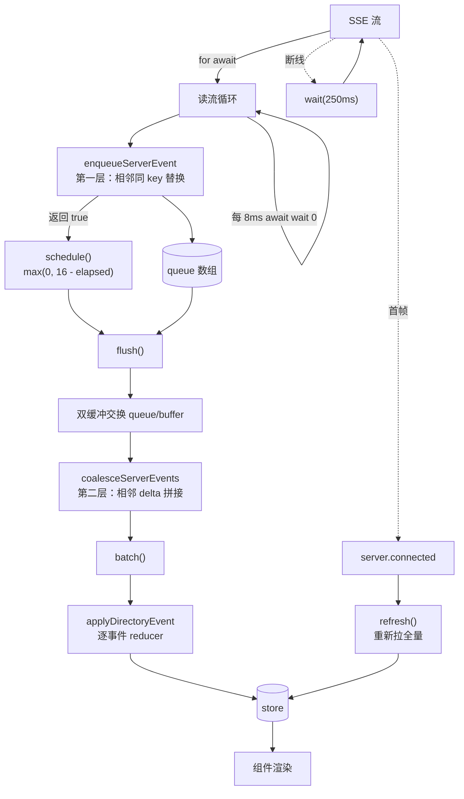

# 08 · 客户端同步层：SSE → store，以及让它不卡的那些细节

源码：`packages/app/src/context/server-sdk.tsx:55-345`、`packages/app/src/context/global-sync/`（event-reducer.ts 479 行、queue.ts、eviction.ts、session-trim.ts、types.ts）

---

## 1. 解决什么问题

后端每秒推几十个 delta，前端要做三件事而且都不能卡：

1. **把事件 apply 到本地 store**（有序、幂等、可乱序容忍）
2. **不让每个 delta 触发一次渲染**（16ms 合帧 + delta 合并）
3. **断线能自愈**（重连 + 重新拉全量，且不丢窗口期事件）

再加一个长期运行才会暴露的问题：**内存无限增长**。用户开一天，几十个目录、几百个会话、几万条消息全在内存里。

---

## 2. 概念模型与不变量

1. **S1** 所有有序集合（session / message / part / permission / question）用**二分查找插入**维持有序，不做 push-then-sort。
2. **S2** delta 累积值与权威值分离：`part_text_accum_delta[partID]` 存累积串；`message.part.updated` 到达时删掉它。
3. **S3** 事件在**读流阶段**就做相邻合并，在**刷帧阶段**再做一次跨批合并。
4. **S4** 每 16ms 刷一帧，用双缓冲数组避免刷帧过程中的新事件丢失。
5. **S5** 读流每 8ms 让出一次主线程，避免长任务饿死渲染。
6. **S6** 断线固定退避 250ms 重连；重连后 `server.connected` 触发全量刷新。
7. **S7** 目录 store 按 LRU + TTL 驱逐；会话列表按「最近 + 上限」裁剪。

---

## 3. 数据结构

### 3.1 store 形状（原样摘录，节选）

```ts
export type State = {
  status: "loading" | "partial" | "complete"
  agent: Agent[]
  command: CommandInfo[]
  reference: ReferenceInfo[]
  project: string
  projectMeta: ProjectMeta | undefined
  icon: string | undefined
  provider_ready: boolean
  provider: NormalizedProviderListResponse
  config: Config
  path: Path
  session: Session[]                                  // 有序数组，按 id
  sessionTotal: number
  session_status: { [sessionID: string]: SessionStatus }
  session_working(id: string): boolean
  session_diff: { [sessionID: string]: FileDiffInfo[] }
  todo: { [sessionID: string]: Todo[] }
  permission: { [sessionID: string]: PermissionRequest[] }
  question: { ... }
  // message: { [sessionID: string]: Message[] }
  // part: { [messageID: string]: Part[] }
  // part_text_accum_delta: { [partID: string]: string }
}
```
> `packages/app/src/context/global-sync/types.ts:33-60`（省略号处见源码）

三级索引：**session 是数组（有序），message 按 sessionID 分组，part 按 messageID 分组。**

为什么 message/part 用 `Record` 而不是一个大数组：单个会话的消息可以独立加载和驱逐，切会话时不用扫全表。

### 3.2 常量

```ts
export const MAX_DIR_STORES = 30
export const DIR_IDLE_TTL_MS = 20 * 60 * 1000
export const SESSION_RECENT_WINDOW = 4 * 60 * 60 * 1000
export const SESSION_RECENT_LIMIT = 50
```
> `types.ts:132-135`

```ts
const FLUSH_FRAME_MS = 16
const STREAM_YIELD_MS = 8
const RECONNECT_DELAY_MS = 250
```
> `packages/app/src/context/server-sdk.tsx:218-220`

### 3.3 React 版等价 store

opencode 用 SolidJS 的 `createStore`（细粒度响应式代理）。React 里最接近的是 **Zustand + Immer**，或者 `useSyncExternalStore` + 手写不可变更新：

```ts
import { create } from "zustand"
import { immer } from "zustand/middleware/immer"

interface SyncState {
  session: Session[]                              // 按 id 有序
  message: Record<string, Message[]>              // sessionId → 有序消息
  part: Record<string, Part[]>                    // messageId → 有序 part
  partTextAccumDelta: Record<string, string>      // partId → 累积文本
  sessionStatus: Record<string, SessionStatus>
  permission: Record<string, PermissionRequest[]>
  question: Record<string, QuestionRequest[]>
  todo: Record<string, Todo[]>
  sessionDiff: Record<string, FileDiffInfo[]>
  apply: (event: ServerEvent) => void
}

export const useSync = create<SyncState>()(immer((set) => ({
  session: [], message: {}, part: {}, partTextAccumDelta: {},
  sessionStatus: {}, permission: {}, question: {}, todo: {}, sessionDiff: {},
  apply: (event) => set((draft) => applyEvent(draft, event)),
})))
```

> **React 性能提示**：opencode 靠 SolidJS 的细粒度响应式做到「只有变的那个 part 重渲染」。React 里必须自己做：用 `useSync(s => s.part[messageId])` 之类的选择器订阅最小切片，并给列表项加 `React.memo`。否则 store 一变整棵树重渲染，前面所有优化都白费。

---

## 4. 事件 reducer 逐事件行为

`packages/app/src/context/global-sync/event-reducer.ts:105-479` 的完整分派。

### 4.1 两个过滤集合

```ts
const SKIP_PARTS = new Set(["patch", "step-start", "step-finish"])
const SESSION_CONTENT_EVENTS = new Set([
  "session.diff", "todo.updated", "session.status",
  "message.updated", "message.removed",
  "message.part.updated", "message.part.removed", "message.part.delta",
  "permission.asked", "permission.replied",
  "question.asked", "question.replied", "question.rejected",
])
```
> `event-reducer.ts:20-34`

- `SKIP_PARTS`：这三种 part **不进前端 store**。`patch` / `step-start` / `step-finish` 是后端记账用的，UI 从别处（`message.tokens`、`summary.diffs`）取同样的信息。
- `SESSION_CONTENT_EVENTS`：当某个目录的 store 只需要会话列表、不需要会话内容时（比如后台目录），整体跳过这 13 类事件。这是内存治理的第一道闸。

```ts
if (input.sessionContent === false && SESSION_CONTENT_EVENTS.has(event.type)) return
```
> `event-reducer.ts:124`

### 4.2 逐事件表

| 事件 | store 动作 | 关键点 |
| --- | --- | --- |
| `server.connected` / `global.disposed` | `refresh()` | 触发全量重新 bootstrap（S6） |
| `project.updated` | 二分查找定位 → 有则 merge，无则插入 | |
| `server.instance.disposed` | `push(directory)` 进刷新队列 | |
| `session.created` | 二分定位；已存在则 `reconcile`；否则插入 → `trimSessions` → 清理被裁掉的会话缓存；根会话则 `sessionTotal + 1` | |
| `session.updated` | 若 `time.archived` 有值：移除该会话 + 清缓存 + `sessionTotal - 1`；否则同 created | 归档 = 从列表移除 |
| `session.deleted` | 移除 + 清缓存 + 根会话 `sessionTotal - 1` | `sessionID` 可能来自 `info.id` 或 `sessionID` 字段 |
| `session.renamed` | 原地改 `title` 并把 `time.updated` 设成 `Date.now()` | 本地时间戳让它排到列表前面 |
| `session.usage.updated` | 原地改 `cost` / `tokens` | |
| `session.moved` | 目标目录 == 当前目录 → 原地更新位置字段；否则从本 store 移除 | |
| `session.diff` | `reconcile(list(diff), { key: "file" })` | |
| `todo.updated` | `reconcile(todos, { key: "id" })` + 通知外部 | |
| `session.status` | `reconcile(status)` | |
| `message.updated` | 二分定位 → 有则 `reconcile(info)`，无则插入 | 用 `messageKey(info)` 排序（不是裸 id） |
| `message.removed` | 删消息 + 删该消息所有 part + 删这些 part 的 delta 累积 | 三处都要清 |
| `message.part.updated` | **先删 `part_text_accum_delta[part.id]`**（S2）→ 二分定位 → reconcile 或插入 | `SKIP_PARTS` 直接 break |
| `message.part.removed` | 删 delta 累积 → 删 part；该消息 part 清空则删掉整个 key | |
| `message.part.delta` | 同时更新累积串和 part 上的字段 | 见 §4.3 |
| `permission.asked` | 二分插入 / reconcile | |
| `permission.replied` | 按 requestID 二分定位后移除 | |
| `question.asked` | 同 permission.asked | |
| `question.replied` / `question.rejected` | 同 permission.replied | 两个事件共用一个分支 |
| `vcs.branch.updated` | 值不同才写；同时写缓存 | |
| `lsp.updated` | `loadLsp()` 重新拉 | 事件只当"信号"，数据另拉 |
| `reference.updated` | `loadReferences?.()` | 同上 |

### 4.3 delta 的双写（S2）

```ts
case "message.part.delta": {
  const props = event.properties as { messageID: string; partID: string; field: string; delta: string }
  const parts = input.store.part[props.messageID]
  if (!parts) break
  const result = Binary.search(parts, props.partID, (part) => part.id)
  if (!result.found) break                                   // part 还没到，丢弃这个 delta
  const field = props.field as keyof (typeof parts)[number]
  const current = parts[result.index]?.[field]

  // 写 1：累积串（供需要"从头完整文本"的消费者用）
  input.setStore("part_text_accum_delta", props.partID,
    (existing) => (existing ?? (typeof current === "string" ? current : "")) + props.delta)

  // 写 2：直接追加到 part 的字段上（供渲染用）
  input.setStore("part", props.messageID, produce((draft) => {
    const part = draft[result.index]
    const field = props.field as keyof typeof part
    const existing = part[field] as string | undefined
    ;(part[field] as string) = (existing ?? "") + props.delta
  }))
  break
}
```
> `event-reducer.ts:364-386`

**`field` 是动态的**——同一个 delta 机制同时服务 `text`（文本 part）和其它可流式字段。事件里带字段名，reducer 不硬编码。

**`if (!result.found) break`**：part 还没创建就来了 delta，直接丢。这不是 bug——`Text.Started`（durable）和 `Text.Delta`（live-only）是两条路径，理论上 Started 先到，但极端时序下可能反过来。丢掉这个 delta 的代价是它的内容会在后续的 `message.part.updated`（权威全量值）里补回来。

**权威值覆盖累积值**：

```ts
case "message.part.updated": {
  const part = (event.properties as { part: Part }).part
  if (SKIP_PARTS.has(part.type)) break
  input.setStore(produce((draft) => { delete draft.part_text_accum_delta[part.id] }))   // ← 先清累积
  ...
}
```
> `event-reducer.ts:313-320`

这就是第 07 章 durable / live-only 分野在前端的落点：**delta 是乐观的近似，`updated` 是权威的真相**。

### 4.4 二分插入（S1）

所有有序数组都是这个模式：

```ts
const result = Binary.search(input.store.session, info.id, (s) => s.id)
if (result.found) { input.setStore("session", result.index, reconcile(info)); break }
const next = input.store.session.slice()
next.splice(result.index, 0, info)
```
> `event-reducer.ts:133-137`

`Binary.search` 返回 `{found, index}`：找到就是元素下标，没找到就是**应该插入的位置**。

因为消息/会话 id 是单调递增的（第 04 章 §3.1），**id 的字典序 == 时间序**，所以二分有效。这是「用 ULID 而不是 UUID」带来的直接收益。

React 版：

```ts
function binarySearch<T>(arr: T[], key: string, getKey: (x: T) => string) {
  let lo = 0, hi = arr.length
  while (lo < hi) {
    const mid = (lo + hi) >> 1
    if (getKey(arr[mid]) < key) lo = mid + 1
    else hi = mid
  }
  return { found: lo < arr.length && getKey(arr[lo]) === key, index: lo }
}
```

---

## 5. 合帧与 delta 合并（S3 / S4）

这是让流式不卡的核心，分**两层**。

### 5.1 第一层：入队时的相邻去重

```ts
const coalescedKey = (event: QueuedServerEvent) => {
  if (event.payload.type === "lsp.updated") return `lsp.updated:${event.directory}`
  if (event.payload.type === "message.part.updated") {
    const part = event.payload.properties.part
    return `message.part.updated:${event.directory}:${part.messageID}:${part.id}`
  }
  return undefined
}

export function enqueueServerEvent(queue: QueuedServerEvent[], event: QueuedServerEvent) {
  const key = coalescedKey(event)
  const previous = queue[queue.length - 1]
  if (key && previous && coalescedKey(previous) === key) {
    queue[queue.length - 1] = event                    // 直接替换队尾，不入新的
    return false                                       // 返回 false = 不需要重新调度
  }
  queue.push(event)
  return true
}
```
> `server-sdk.tsx:59-77`

**同一个 part 的连续 `updated` 只保留最后一个**——中间态没有渲染价值。`lsp.updated` 同理（它只是个"去重新拉"的信号）。

### 5.2 第二层：刷帧时的跨事件合并

```ts
export function coalesceServerEvents(events: QueuedServerEvent[]) {
  const output: QueuedServerEvent[] = []
  events.forEach((event) => {
    // ... 新协议的 delta 分支（currentDelta）：同 key 则拼接 fragment ...
    if (event.payload.type !== "message.part.delta") { output.push(event); return }
    const props = event.payload.properties
    const previous = output[output.length - 1]
    if (
      !previous ||
      previous.payload.type !== "message.part.delta" ||
      previous.directory !== event.directory ||
      previous.payload.properties.messageID !== props.messageID ||
      previous.payload.properties.partID !== props.partID ||
      previous.payload.properties.field !== props.field
    ) {
      output.push({ directory: event.directory, payload: { ...event.payload, properties: { ...props } } })
      return
    }
    output[output.length - 1] = {
      directory: event.directory,
      payload: { ...event.payload,
                 properties: { ...props, delta: previous.payload.properties.delta + props.delta } },
    }
  })
  return output
}
```
> `server-sdk.tsx:79-140`

**相邻且四元组 `(directory, messageID, partID, field)` 相同的 delta 拼成一个。** 一帧里收到 20 个字符的 delta，最终只走一次 reducer、一次渲染。

注意 `output.push({...event.payload, properties: {...props}})` 的浅拷贝：因为后面可能要就地改 `delta`，不拷贝会污染原始事件对象。

### 5.3 双缓冲刷帧（S4）

```ts
const flush = () => {
  if (queue.length === 0) return
  const events = queue
  queue = buffer                    // 交换：新事件写进另一个数组
  buffer = events
  queue.length = 0
  last = Date.now()
  const output = coalesceServerEvents(events)
  batch(() => { output.forEach((event) => emitter.emit(event.directory, event.payload)) })
  buffer.length = 0
}

const schedule = () => {
  if (timer) return
  const elapsed = Date.now() - last
  timer = setTimeout(flush, Math.max(0, FLUSH_FRAME_MS - elapsed))
}
```
> `server-sdk.tsx:227-251`

- **双缓冲**：`queue` 和 `buffer` 交换角色。刷帧期间到达的事件写进新的 `queue`，不会丢也不会被并发修改。
- **`Math.max(0, 16 - elapsed)`**：距上次刷帧不足 16ms 就等剩余时间，超过就立刻刷。**不是固定 `setTimeout(16)`**——那会让空闲后的第一个事件也白等 16ms。
- **`batch()`**：SolidJS 的批量更新。React 18+ 的自动批处理在事件回调外（如 SSE 回调）也生效，但显式 `flushSync` 控制更稳；或直接在 store 层一次性 `set`。

### 5.4 读流让出（S5）

```ts
let yielded = Date.now()
for await (const event of events) {
  ...
  if (enqueueServerEvent(queue, { directory, payload })) schedule()
  if (Date.now() - yielded < STREAM_YIELD_MS) continue
  yielded = Date.now()
  await wait(0)                                          // setTimeout(resolve, 0)
}
```
> `server-sdk.tsx:283-291`

**每 8ms 强制 `await wait(0)` 让出主线程。** 不让出的话，一个 `for await` 循环在事件密集时会变成一个几百毫秒的长任务，`setTimeout(flush)` 排在它后面永远轮不上——**用户看到的是"卡住然后一次性全出来"**。

---

## 6. 断线重连（S6）

```ts
const start = () => {
  if (started) return run
  started = true
  const active = ++generation
  const previous = run
  const current = (async () => {
    if (previous) await previous                          // 等上一个循环彻底结束
    while (!abort.signal.aborted && started && generation === active) {
      attempt = new AbortController()
      const onAbort = () => { attempt?.abort() }
      abort.signal.addEventListener("abort", onAbort)
      try {
        const kind = await protocol
        const events = kind === "v1"
          ? (await eventSdk.global.event({ signal: attempt.signal })).stream
          : eventApi.event.subscribe({ signal: attempt.signal })
        let yielded = Date.now()
        for await (const event of events) { /* 入队 + 让出 */ }
      } catch (error) {
        if (!isStreamClosed(error, attempt?.signal) && !streamErrorLogged) {
          streamErrorLogged = true
          console.error("[global-sdk] event stream failed", { url: server.http.url, ... })
        }
      } finally {
        abort.signal.removeEventListener("abort", onAbort)
        attempt = undefined
      }
      if (abort.signal.aborted || !started || generation !== active) return
      await wait(RECONNECT_DELAY_MS)                      // 250ms
    }
  })().finally(() => { if (run !== current) return; run = undefined; flush() })
  run = current
  return run
}
```
> `server-sdk.tsx:262-313`

三个防重入机制叠加：
- **`started` 标志**：`stop()` 置 false，循环条件检查它。
- **`generation` 计数**：`stop()` 自增，旧循环发现 `generation !== active` 就退出。防止 stop→start 快速切换时两个循环并存。
- **`await previous`**：新循环等旧循环完全结束才开始。

**`streamErrorLogged` 去重日志**：断网时会每 250ms 失败一次，不去重会刷屏。收到第一个事件时 `streamErrorLogged = false` 重置。

页面生命周期：

```ts
onMount(() => {
  makeEventListener(window, "pagehide", stop)
  makeEventListener(window, "pageshow", (event) => resumeStreamAfterPageShow(event, start))
})
```
> `server-sdk.tsx:322-325`

用 `pagehide` / `pageshow` 而不是 `beforeunload` / `load`——**前者才能正确处理浏览器的 bfcache**（前进后退缓存）。从 bfcache 恢复时 `pageshow` 会带 `persisted: true`，此时连接早已断开但页面状态还在。

**重连后的补齐**（S6 后半）：

```ts
if (input.event.type === "global.disposed" || input.event.type === "server.connected") {
  input.refresh()
  return
}
```
> `event-reducer.ts:43-46`

服务端在每个新连接上先发 `server.connected`（第 07 章 §7），前端收到就**重新拉全量**。全量的权威值会覆盖掉断线期间可能不一致的本地状态。

> **这就是「先订阅后拉取」的完整闭环**：订阅建立 → 服务端发 connected → 客户端拉全量 → 期间到达的事件已经在队列里排着 → 拉完后 apply。任何窗口期的事件都不会丢。

---

## 7. 内存治理（S7）

### 7.1 目录 store 驱逐

```ts
export function pickDirectoriesToEvict(input: EvictPlan) {
  const overflow = Math.max(0, input.stores.length - input.max)      // max = MAX_DIR_STORES = 30
  let pendingOverflow = overflow
  const sorted = input.stores
    .filter((dir) => !input.pins.has(dir))                           // 钉住的不动
    .slice()
    .sort((a, b) => (input.state.get(a)?.lastAccessAt ?? 0) - (input.state.get(b)?.lastAccessAt ?? 0))
  const output: string[] = []
  for (const dir of sorted) {
    const last = input.state.get(dir)?.lastAccessAt ?? 0
    const idle = input.now - last >= input.ttl                       // ttl = 20 min
    if (!idle && pendingOverflow <= 0) continue
    output.push(dir)
    if (pendingOverflow > 0) pendingOverflow -= 1
  }
  return output
}

export function canDisposeDirectory(input: DisposeCheck) {
  if (!input.directory) return false
  if (!input.hasStore) return false
  if (input.pinned) return false
  if (input.booting) return false            // 正在初始化，不能拆
  if (input.loadingSessions) return false    // 正在加载会话，不能拆
  return true
}
```
> `packages/app/src/context/global-sync/eviction.ts`

**两个驱逐理由**：超出上限（LRU）或空闲超时（TTL）。按 `lastAccessAt` 升序，先满足 overflow 配额，其余只驱逐真正空闲的。

### 7.2 会话列表裁剪

```ts
export function trimSessions(input: Session[], options: { limit: number; permission: ...; now?: number }) {
  const limit = Math.max(0, options.limit)
  const cutoff = (options.now ?? Date.now()) - SESSION_RECENT_WINDOW          // 4 小时
  const all = input.filter((s) => !!s?.id).filter((s) => !s.time?.archived).sort((a, b) => cmp(a.id, b.id))
  const roots = all.filter((s) => !s.parentID)
  roots.sort(compareSessionRecent)                                            // 按 updated 降序
  const children = all.filter((s) => !!s.parentID)
  const base = roots.slice(0, limit)                                          // 前 limit 个最近的根会话
  const recent = takeRecentSessions(roots.slice(limit), SESSION_RECENT_LIMIT, cutoff)  // 再多留 50 个 4h 内的
  const keepRoots = [...base, ...recent]
  const keepRootIds = new Set(keepRoots.map((s) => s.id))
  const keepChildren = children.filter((s) => {
    if (s.parentID && keepRootIds.has(s.parentID)) return true                // 父在则留
    const perms = options.permission[s.id] ?? []
    if (perms.length > 0) return true                                         // 有待处理权限则留
    return sessionUpdatedAt(s) > cutoff                                       // 4h 内活跃则留
  })
  return [...keepRoots, ...keepChildren].sort((a, b) => cmp(a.id, b.id))
}
```
> `packages/app/src/context/global-sync/session-trim.ts:33-57`

**子会话（subagent）的三条保留规则**很值得抄：父会话还在、有待处理的权限请求、4 小时内有更新。第二条尤其重要——**一个正在等用户批准权限的子会话被裁掉，用户就永远批不了了，agent 卡死**。

裁剪后必须清缓存：

```ts
export function cleanupDroppedSessionCaches(store, setStore, next, setSessionTodo?) {
  const keep = new Set(next.map((item) => item.id))
  const stale = [
    ...Object.keys(store.message), ...Object.keys(store.session_diff), ...Object.keys(store.todo),
    ...Object.keys(store.permission), ...Object.keys(store.question), ...Object.keys(store.session_status),
    ...Object.values(store.part).map((parts) => parts?.find((part) => !!part?.sessionID)?.sessionID)
      .filter((sessionID): sessionID is string => !!sessionID),
  ].filter((sessionID, index, list) => !keep.has(sessionID) && list.indexOf(sessionID) === index)
  if (stale.length === 0) return
  for (const sessionID of stale) setSessionTodo?.(sessionID, undefined)
  setStore(produce((draft) => { dropSessionCaches(draft, stale) }))
}
```
> `event-reducer.ts:80-103`

**七个缓存字典都要扫。** 漏一个就是内存泄漏。`part` 那一行特别绕：part 按 messageID 索引，要从 part 里反查 sessionID。

### 7.3 刷新队列

```ts
export function createRefreshQueue(input: QueueInput) {
  const queued = new Map<string, string>()
  let root = false, running = false, timer

  const push = (directory: string) => {
    if (!directory) return
    queued.set(key(directory), directory)                 // Map 天然去重
    if (input.paused()) return
    schedule()
  }

  async function drain() {
    if (running) return
    running = true
    try {
      while (true) {
        if (input.paused()) return
        if (root) { root = false; await input.bootstrap(); await tick(); continue }   // 根刷新优先
        const dirs = take(2)                                                          // 每批 2 个
        if (dirs.length === 0) return
        await Promise.all(dirs.map((dir) => input.bootstrapInstance(dir)))
        await tick()                                                                  // setTimeout 0
      }
    } finally {
      running = false
      if (input.paused()) return
      if (root || queued.size) schedule()
    }
  }
  ...
}
```
> `packages/app/src/context/global-sync/queue.ts`

**每批只处理 2 个目录，每批之间 `await tick()`（`setTimeout 0`）让出主线程。** 30 个目录一起 bootstrap 会冻结 UI 好几秒。

---

## 8. 数据流总图



---

## 9. 边界情况与性能陷阱

| 场景 | opencode 怎么处理 | 你自己实现时必须处理 |
| --- | --- | --- |
| 一帧内 50 个 delta | 两层合并 → 1 次 reducer + 1 次渲染 | 不合并 = 50 次渲染，直接掉帧 |
| 事件密集导致长任务 | 每 8ms `await wait(0)` | 不让出 = 刷帧 timer 永远排不上 |
| 刷帧期间到达新事件 | 双缓冲交换 | 单数组 + `splice` 会漏事件 |
| delta 先于 part 到达 | `if (!result.found) break` 丢弃 | 硬创建一个占位 part 会产生类型不完整的对象 |
| `updated` 与累积值冲突 | `updated` 到达时先删累积值 | 不删 = 两份真相，UI 闪烁 |
| 消息乱序到达 | 二分插入到正确位置 | push 后排序 = O(n log n) × 每条消息 |
| 断线期间的事件 | 重连 → `server.connected` → 全量刷新 | 只重连不刷新 = 永久性状态漂移 |
| stop / start 快速切换 | `generation` 计数 + `await previous` | 两个读流循环并存 = 事件重复 apply |
| bfcache 前进后退 | `pagehide` / `pageshow` | `beforeunload` / `load` 在 bfcache 下不触发 |
| 断网刷屏日志 | `streamErrorLogged` 去重 | 每 250ms 一条 error，控制台不可用 |
| 会话归档 | 从列表移除 + 清七处缓存 + `sessionTotal - 1` | 漏清缓存 = 内存泄漏 |
| 子会话在等权限却被裁剪 | `permission[s.id].length > 0` 强制保留 | 裁掉 = agent 永久卡死 |
| 30 个目录同时刷新 | 每批 2 个 + `tick()` 让出 | 一起来会冻结 UI 数秒 |
| 正在 bootstrap 的目录被驱逐 | `canDisposeDirectory` 检查 `booting` / `loadingSessions` | 拆掉正在初始化的 store 会崩 |

---

## 10. 移植到你自己的项目（React 版）

### 10.1 最小可用版：合帧 + delta 合并

```ts
const FLUSH_FRAME_MS = 16
const STREAM_YIELD_MS = 8
const RECONNECT_DELAY_MS = 250

function createEventPump(apply: (events: ServerEvent[]) => void) {
  let queue: ServerEvent[] = []
  let buffer: ServerEvent[] = []
  let timer: ReturnType<typeof setTimeout> | undefined
  let last = 0

  const coalesce = (events: ServerEvent[]) => {
    const out: ServerEvent[] = []
    for (const e of events) {
      const p = out[out.length - 1]
      if (
        e.type === "message.part.delta" && p?.type === "message.part.delta" &&
        p.properties.messageID === e.properties.messageID &&
        p.properties.partID === e.properties.partID &&
        p.properties.field === e.properties.field
      ) {
        out[out.length - 1] = { ...e, properties: { ...e.properties, delta: p.properties.delta + e.properties.delta } }
        continue
      }
      out.push(e)
    }
    return out
  }

  const flush = () => {
    timer = undefined
    if (!queue.length) return
    const events = queue; queue = buffer; buffer = events; queue.length = 0
    last = Date.now()
    apply(coalesce(events))          // 在这里面一次性 set store
    buffer.length = 0
  }

  const schedule = () => {
    if (timer) return
    timer = setTimeout(flush, Math.max(0, FLUSH_FRAME_MS - (Date.now() - last)))
  }

  return {
    enqueue(e: ServerEvent) {
      // 第一层：同一个 part 的连续 updated 只留最后一个
      const prev = queue[queue.length - 1]
      if (
        e.type === "message.part.updated" && prev?.type === "message.part.updated" &&
        prev.properties.part.id === e.properties.part.id
      ) { queue[queue.length - 1] = e; return }
      queue.push(e); schedule()
    },
  }
}
```

### 10.2 SSE 消费循环（React / fetch 版）

```ts
async function runStream(url: string, pump: ReturnType<typeof createEventPump>, signal: AbortSignal) {
  let generation = 0
  const active = ++generation
  while (!signal.aborted && generation === active) {
    const attempt = new AbortController()
    const onAbort = () => attempt.abort()
    signal.addEventListener("abort", onAbort)
    try {
      const res = await fetch(url, { signal: attempt.signal, headers: { Accept: "text/event-stream" } })
      const reader = res.body!.pipeThrough(new TextDecoderStream()).getReader()
      let buf = ""
      let yielded = Date.now()
      while (true) {
        const { done, value } = await reader.read()
        if (done) break
        buf += value
        let idx: number
        while ((idx = buf.indexOf("\n\n")) >= 0) {
          const frame = buf.slice(0, idx); buf = buf.slice(idx + 2)
          if (frame.startsWith(":")) continue                      // 心跳注释行
          const line = frame.split("\n").find((l) => l.startsWith("data:"))
          if (!line) continue
          pump.enqueue(JSON.parse(line.slice(5).trim()))
        }
        if (Date.now() - yielded >= STREAM_YIELD_MS) {             // 让出主线程
          yielded = Date.now()
          await new Promise((r) => setTimeout(r, 0))
        }
      }
    } catch { /* 去重日志 */ }
    finally { signal.removeEventListener("abort", onAbort) }
    if (signal.aborted || generation !== active) return
    await new Promise((r) => setTimeout(r, RECONNECT_DELAY_MS))
  }
}
```

> 用 `fetch` + `ReadableStream` 而不是 `EventSource`：`EventSource` 不支持自定义 header（认证）、不支持 POST、且重连策略不可控。

### 10.3 落地步骤

1. 定 store 形状：`session[]` + `message: Record<sid, Message[]>` + `part: Record<mid, Part[]>` + `partTextAccumDelta`。
2. 实现 `binarySearch`（§4.4），所有有序集合的增删改都走它。
3. 实现 `applyEvent(draft, event)`：照 §4.2 的表逐个 case 写。**先写 `message.part.delta` 和 `message.part.updated` 这两个**，它们决定流式体验。
4. 实现 `createEventPump`（§10.1）：两层合并 + 双缓冲 + 16ms 调度。
5. 实现 `runStream`（§10.2）：generation 防重入 + 250ms 退避 + 8ms 让出。
6. 处理 `server.connected`：触发全量重新拉取。
7. 监听 `pagehide` / `pageshow` 管理连接。
8. 组件侧用细粒度选择器 + `React.memo`：`useSync(s => s.part[messageId])`，列表项按 part.id memo。
9. 加内存治理：会话列表裁剪（§7.2 的三条子会话规则）+ 缓存清理（七处字典）。

### 10.4 你需要自己提供的依赖

| 依赖 | 用途 | 建议 |
| --- | --- | --- |
| 不可变 store | 细粒度更新 | Zustand + Immer，或 `useSyncExternalStore` |
| 单调消息 id | 二分有效性 | 后端保证（ULID） |
| 细粒度订阅 | 避免全树重渲染 | Zustand selector + `React.memo` |

---

## 11. 验收清单

- [ ] **S1** 乱序投递 100 条消息事件 → store 里按 id 有序，无重复
- [ ] **S1** 插入操作是 O(log n) 定位（不是先 push 再 sort）
- [ ] **S2** 收到 5 个 delta 后再收 `message.part.updated` → `partTextAccumDelta[partId]` 被删除，part 内容 === 权威值
- [ ] **S2** delta 先于 part 到达 → 被丢弃，不抛错，不产生占位对象
- [ ] **S3** 一帧内 20 个同 part 的 delta → reducer 只被调用 1 次
- [ ] **S3** 一帧内 5 个同 part 的 `updated` → 只有最后一个进队列
- [ ] **S3** 不同 part 的 delta 交替到达 → **不**被合并
- [ ] **S4** 在 `apply` 回调里再投递事件 → 不丢失，下一帧处理
- [ ] **S5** 连续投递 10000 个事件 → 主线程无 > 50ms 的长任务（Performance 面板可验）
- [ ] **S6** 断开 SSE → 250ms 后自动重连
- [ ] **S6** 重连后收到 `server.connected` → 触发全量拉取
- [ ] **S6** 断线期间后端产生 3 条消息 → 重连后 UI 完整显示这 3 条
- [ ] **S6** 快速 stop → start → 只有一个读流循环在跑（打日志验证）
- [ ] **S6** 浏览器前进/后退（bfcache）→ 连接正确恢复
- [ ] **S7** 打开 35 个目录 → store 数量稳定在 30
- [ ] **S7** 某目录 20 分钟无访问 → 被驱逐
- [ ] **S7** 正在 bootstrap 的目录 → 不被驱逐
- [ ] **S7** 会话被裁剪 → 其 message / part / todo / permission / question / status / diff 七处缓存全部清空
- [ ] **S7** 有待处理权限的子会话 → 即使超出上限也保留
- [ ] **渲染** 一个 part 流式更新时，其它 part 的组件不重渲染（React DevTools Profiler 可验）
