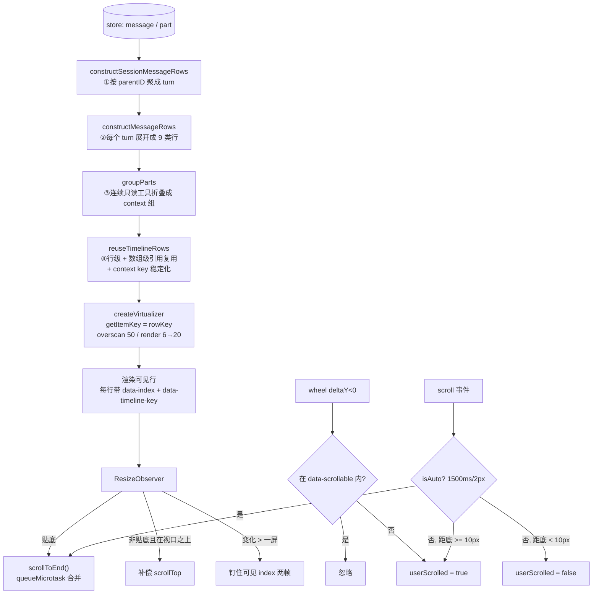

# 09 · 时间线投影与滚动：把消息流变成不抖动的虚拟列表

源码：`packages/app/src/pages/session/timeline/`（rows.ts 346 行、timeline-row.ts 80 行、row-reconciliation.ts 56 行、projection.ts 81 行、message-timeline.tsx 1847 行）、`packages/ui/src/hooks/create-auto-scroll.tsx`（237 行）、`packages/app/src/pages/session.tsx:1499-1560, 2098`

---

## 1. 解决什么问题

「把消息数组 `map` 成组件」在这个场景下会同时死于四件事：

1. **消息 ≠ 渲染行**。一次用户提问会产生多条 assistant 消息、几十个 part，还有分隔线、思考指示器、diff 摘要、错误块。真正的渲染单位是「行」，需要一次投影。
2. **流式时每帧都在变**。整表重建 = 每帧几百个组件重建 = 掉帧 + 折叠状态丢失 + 滚动位置乱跳。
3. **行高未知且会变**。一个 markdown 块渲染完高度可能翻三倍，虚拟化必须能处理。
4. **贴底跟随是个状态机**，不是 `scrollTop = scrollHeight`。用户上滑要停、回到底部要恢复、程序化滚动不能被误判成用户滚动。

---

## 2. 概念模型与不变量

**Turn（轮次）**：一条 user 消息 + 它引出的所有 assistant 消息。UI 的分组单位。
**TimelineRow（时间线行）**：虚拟列表的一个 item。9 种。
**PartGroup（片段组）**：连续的只读工具（read/glob/grep/list）被折叠成一个「上下文收集」组。

不变量：

1. **R1** 行有稳定的 `key`，相同内容的行在重投影后**对象引用不变**（结构相等则复用旧对象）。
2. **R2** context 组的 key 在流式追加时保持稳定，不因组员增加而变化。
3. **R3** 贴底跟随是显式状态，由「用户是否主动滚开」驱动，不由滚动位置直接判断。
4. **R4** 程序化滚动必须能被识别，不能触发「用户滚开」。
5. **R5** 向上加载历史时，视口内容位置不变（prepend 锚定）。
6. **R6** 行高变化时：贴底状态下重新贴底；非贴底状态下只补偿视口**之上**的变化。

---

## 3. 数据结构定义

### 3.1 九种行（原样摘录）

```ts
export namespace TimelineRow {
  export class TurnGap extends Data.TaggedClass("TurnGap")<{ userMessageID: string }> {}
  export class CommentStrip extends Data.TaggedClass("CommentStrip")<{ userMessageID: string }> {}
  export class UserMessage extends Data.TaggedClass("UserMessage")<{ userMessageID: string; anchor: boolean }> {}
  export class TurnDivider extends Data.TaggedClass("TurnDivider")<{
    userMessageID: string
    label: "compaction" | "interrupted"
  }> {}
  export class AssistantPart extends Data.TaggedClass("AssistantPart")<{
    userMessageID: string
    group: PartGroup
    previousAssistantPart: boolean
  }> {}
  export class Thinking extends Data.TaggedClass("Thinking")<{ userMessageID: string; reasoningHeading?: string }> {}
  export class DiffSummary extends Data.TaggedClass("DiffSummary")<{ userMessageID: string; diffs: SummaryDiff[] }> {}
  export class Error extends Data.TaggedClass("Error")<{ userMessageID: string; text: string }> {}
  export class Retry extends Data.TaggedClass("Retry")<{ userMessageID: string }> {}

  export type TimelineRow =
    | TurnGap | CommentStrip | UserMessage | TurnDivider
    | AssistantPart | Thinking | DiffSummary | Error | Retry

  export const key = (row: TimelineRow) => {
    switch (row._tag) {
      case "TurnGap":       return `turn-gap:${row.userMessageID}`
      case "CommentStrip":  return `comment-strip:${row.userMessageID}`
      case "UserMessage":   return `user-message:${row.userMessageID}`
      case "TurnDivider":   return `turn-divider:${row.userMessageID}:${row.label}`
      case "AssistantPart": return `assistant-part:${row.userMessageID}:${row.group.key}`
      case "Thinking":      return `thinking:${row.userMessageID}`
      case "DiffSummary":   return `diff-summary:${row.userMessageID}`
      case "Error":         return `error:${row.userMessageID}`
      case "Retry":         return `retry:${row.userMessageID}`
    }
  }

  export function equals(a: TimelineRow, b: TimelineRow) { return Equal.equals(a, b) }
}
```
> `packages/app/src/pages/session/timeline/timeline-row.ts:7-80`

**每一行都带 `userMessageID`**——它是「这一行属于哪一轮」的归属标记。key 也因此天然按轮次分段，跨轮次不会撞。

`Data.TaggedClass` 提供**结构相等**（`Equal.equals`）。这是 R1 的基础。

### 3.2 PartGroup

```ts
export type PartRef = { messageID: string; partID: string }

export type PartGroup =
  | { key: string; type: "part";    ref: PartRef }
  | { key: string; type: "context"; refs: PartRef[] }
```
> `packages/session-ui/src/components/message-part.tsx:622-637`

### 3.3 等价纯 TS 版

```ts
export type SummaryDiff = { file: string; additions: number; deletions: number }
export type PartRef = { messageID: string; partID: string }
export type PartGroup =
  | { key: string; type: "part"; ref: PartRef }
  | { key: string; type: "context"; refs: PartRef[] }

export type TimelineRow =
  | { tag: "TurnGap";       userMessageID: string }
  | { tag: "CommentStrip";  userMessageID: string }
  | { tag: "UserMessage";   userMessageID: string; anchor: boolean }
  | { tag: "TurnDivider";   userMessageID: string; label: "compaction" | "interrupted" }
  | { tag: "AssistantPart"; userMessageID: string; group: PartGroup; previousAssistantPart: boolean }
  | { tag: "Thinking";      userMessageID: string; reasoningHeading?: string }
  | { tag: "DiffSummary";   userMessageID: string; diffs: SummaryDiff[] }
  | { tag: "Error";         userMessageID: string; text: string }
  | { tag: "Retry";         userMessageID: string }

export function rowKey(row: TimelineRow): string {
  switch (row.tag) {
    case "TurnGap":       return `turn-gap:${row.userMessageID}`
    case "CommentStrip":  return `comment-strip:${row.userMessageID}`
    case "UserMessage":   return `user-message:${row.userMessageID}`
    case "TurnDivider":   return `turn-divider:${row.userMessageID}:${row.label}`
    case "AssistantPart": return `assistant-part:${row.userMessageID}:${row.group.key}`
    case "Thinking":      return `thinking:${row.userMessageID}`
    case "DiffSummary":   return `diff-summary:${row.userMessageID}`
    case "Error":         return `error:${row.userMessageID}`
    case "Retry":         return `retry:${row.userMessageID}`
  }
}

/** 结构相等（Effect Data 的等价物） */
export function rowEquals(a: TimelineRow, b: TimelineRow): boolean {
  if (a.tag !== b.tag) return false
  return JSON.stringify(a) === JSON.stringify(b)     // 字段少且形状固定时够用
}
```

---

## 4. 投影算法

### 4.1 第一步：把消息聚成 turn

```ts
const turns: { user: UserMessage; assistants: AssistantMessage[] }[] = []
const turnByUserID = new Map<string, (typeof turns)[number]>()

messages.forEach((message) => {
  const projected = getMessage(message.id)
  // shell 消息：自带一个约定 id 的 assistant 伙伴
  if (message.type === "shell" && projected?.role === "user") {
    const assistant = getMessage(`${message.id}:assistant`)
    const turn = { user: projected, assistants: assistant?.role === "assistant" ? [assistant] : [] }
    turns.push(turn); turnByUserID.set(projected.id, turn); return
  }
  if (projected?.role === "user") {
    if (turnByUserID.has(projected.id)) return
    const turn = { user: projected, assistants: [] }
    turns.push(turn); turnByUserID.set(projected.id, turn); return
  }
  if (projected?.role !== "assistant") return
  const existing = turnByUserID.get(projected.parentID)
  if (existing) { existing.assistants.push(projected); return }
  // assistant 先于它的 user 到达（乱序）→ 反查父消息补建 turn
  const user = getMessage(projected.parentID)
  if (user?.role !== "user") return
  const turn = { user, assistants: [projected] }
  turns.push(turn); turnByUserID.set(user.id, turn)
})

// 本地乐观插入的 user 消息（还没被服务端确认）也要成 turn，按序插入
projectedUserMessages.forEach((user) => {
  if (turnByUserID.has(user.id)) return
  const turn = { user, assistants: [] }
  const index = turns.findIndex((item) => compareMessages(user, item.user) < 0)
  if (index < 0) turns.push(turn)
  if (index >= 0) turns.splice(index, 0, turn)
  turnByUserID.set(user.id, turn)
})

const activeMessageID = turns.at(-1)?.user.id
```
> `packages/app/src/pages/session/timeline/rows.ts:45-83`

**`assistant.parentID` 指向它所属的 user 消息**——这是 turn 分组的依据。第三个分支处理 assistant 先到的乱序情况。

**`activeMessageID` = 最后一个 turn 的 user id**，用来判断「哪一轮是当前活跃的」（决定要不要显示 Thinking 行）。

### 4.2 第二步：把一个 turn 展开成行

```ts
const previousUserMessage = index > 0
const userParts = getMessageParts(userMessage.id)
const comments = userParts.flatMap((p) => MessageComment.fromPart(p) ?? [])
const compaction = userParts.some((p) => p.type === "compaction")
const interruptedMessageIndex = assistantMessages.findIndex((m) => m.error?.name === "MessageAbortedError")
const interrupted = interruptedMessageIndex !== -1
const latestError = assistantMessages.at(-1)?.error
const error = latestError?.name === "MessageAbortedError" ? undefined : latestError

const assistantPartRefs = assistantMessages.flatMap((message, messageIndex) =>
  getMessageParts(message.id)
    .filter((part) => renderable(part, showReasoning))
    .map((part) => ({ messageID: message.id, messageIndex, part })),
)

// 被中断的轮次：在中断点插一条分隔线，前后各自分组
const assistantItems =
  interrupted && !compaction
    ? [
        ...groupParts(assistantPartRefs.filter((r) => r.messageIndex <= interruptedMessageIndex))
          .map((group) => ({ type: "part" as const, group })),
        { type: "interrupted" as const },
        ...groupParts(assistantPartRefs.filter((r) => r.messageIndex > interruptedMessageIndex))
          .map((group) => ({ type: "part" as const, group })),
      ]
    : groupParts(assistantPartRefs).map((group) => ({ type: "part" as const, group }))
```
> `rows.ts:114-145`

行的产出顺序（**这个顺序就是最终视觉顺序**）：

```
1. TurnGap            —— 非首轮才有（轮次间距）
2. CommentStrip       —— 有行内评论且非 inlineComments 模式
3. UserMessage        —— anchor = inlineComments || comments.length === 0
4. TurnDivider(compaction) —— 该轮触发了压缩
5. AssistantPart ×N   —— previousAssistantPart = assistantGroupIndex > 0
   （中断点处插入 TurnDivider(interrupted)）
6. Thinking           —— isActive && status === "busy" && !error
                          && (showReasoning ? assistantPartRefs.length === 0 : true)
7. Retry              —— isActive && status === "retry"
8. DiffSummary        —— diffs.length > 0 && (status === "idle" || !isActive)
9. Error              —— 最后一条 assistant 有非中断错误
```
> `rows.ts:146-229`

三个容易抄错的条件：

- **Thinking 的显示条件**：`showReasoning` 为真时，只有**还没有任何 part**才显示（有 reasoning 内容了就显示内容本身）；`showReasoning` 为假时一直显示（因为 reasoning 被隐藏了，用户需要别的忙碌指示）。
- **DiffSummary 的条件**：`status === "idle" || !isActive`——**跑着的时候不显示当前轮的 diff 摘要**，因为文件还在改，显示了会不停跳变。
- **中断 vs 错误**：`MessageAbortedError` 走 `TurnDivider(interrupted)`，其它错误走 `Error` 行。中断是用户主动的，不是错误。

### 4.3 只读工具的分组折叠

```ts
const CONTEXT_GROUP_TOOLS = new Set(["read", "glob", "grep", "list"])
const HIDDEN_TOOLS = new Set(["todowrite"])

export function groupParts(parts: { messageID: string; part: PartType }[]) {
  const result: PartGroup[] = []
  let start = -1
  const flush = (end: number) => {
    if (start < 0) return
    const first = parts[start]
    const last = parts[end]
    if (!first || !last) { start = -1; return }
    result.push({
      key: `context:${first.part.id}`,                  // ← key 来自组内第一个 part
      type: "context",
      refs: parts.slice(start, end + 1).map((item) => ({ messageID: item.messageID, partID: item.part.id })),
    })
    start = -1
  }
  parts.forEach((item, index) => {
    if (isContextGroupTool(item.part)) { if (start < 0) start = index; return }
    flush(index - 1)
    result.push({ key: `part:${item.messageID}:${item.part.id}`, type: "part",
                  ref: { messageID: item.messageID, partID: item.part.id } })
  })
  flush(parts.length - 1)
  return result
}
```
> `packages/session-ui/src/components/message-part.tsx:607-705`

**连续的 read/glob/grep/list 折叠成一个「上下文收集」组**，UI 上显示成一行「Read 8 files」而不是 8 张卡片。这是 coding agent UI 里最有效的降噪手段——一次任务里这类调用能占到 70%。

**组的 key 取组内第一个 part 的 id**（`context:${first.part.id}`）——因为第一个成员在流式追加时不变，key 就稳定（R2）。

哪些 part 可渲染：

```ts
export function renderable(part: PartType, showReasoningSummaries = true) {
  if (part.type === "tool") {
    if (HIDDEN_TOOLS.has(part.tool)) return false                     // todowrite 有专门的 dock
    if (part.tool === "question") return part.state.status !== "pending" && part.state.status !== "running"
    return true
  }
  if (part.type === "text") return !!part.text?.trim()                // 空文本不渲染
  if (part.type === "reasoning") return showReasoningSummaries && !!part.text?.trim()
  return !!PART_MAPPING[part.type]                                    // 有注册组件才渲染
}
```
> `message-part.tsx:711-720`

`question` 工具在 pending/running 时不渲染成卡片——它由专门的提问 dock 呈现（第 10 章）。

### 4.4 增量行复用（R1 / R2）

```ts
export function reuseTimelineRows(previous: TimelineRow[] | undefined, rows: TimelineRow[]) {
  if (!previous?.length) return rows
  const byKey = new Map(previous.map((row) => [TimelineRow.key(row), row] as const))

  // 建立「旧的 context 组包含哪些 partID」的反向索引
  const contextByPart = new Map<string, PriorContext>()
  previous.forEach((row, index) => {
    if (row._tag !== "AssistantPart" || row.group.type !== "context") return
    row.group.refs.forEach((ref) => contextByPart.set(`${row.userMessageID}:${ref.partID}`, { index, row }))
  })

  const reserved = new Map<string, number>()
  rows.forEach((row, index) => {
    if (row._tag !== "AssistantPart" || row.group.type !== "context") return
    const key = TimelineRow.key(row)
    if (byKey.has(key) && !reserved.has(key)) reserved.set(key, index)
  })

  const claimed = new Set<string>()
  const next = rows.map((input, index) => {
    const row = stabilizeContextKey(contextByPart, reserved, input, index, claimed)
    const existing = byKey.get(TimelineRow.key(row))
    if (!existing) return row
    return TimelineRow.equals(existing, row) ? existing : row          // ← 结构相等则复用旧对象
  })

  if (previous.length === next.length && previous.every((row, index) => row === next[index])) return previous
  return next                                                          // 整体也复用，让上游 memo 短路
}
```
> `packages/app/src/pages/session/timeline/row-reconciliation.ts:6-29`

两层复用：**行级**（结构相等则返回旧对象引用）+ **数组级**（全部未变则返回旧数组）。下游用引用相等做 memo 判断，直接跳过整个子树。

`stabilizeContextKey` 处理一个具体的坑（R2）：

```ts
function stabilizeContextKey(contextByPart, reserved, row, rowIndex, claimed) {
  if (row._tag !== "AssistantPart" || row.group.type !== "context") return row
  const existing = row.group.refs.reduce<PriorContext | undefined>((result, ref) => {
    const candidate = contextByPart.get(`${row.userMessageID}:${ref.partID}`)
    if (!candidate) return result
    const key = TimelineRow.key(candidate.row)
    if (claimed.has(key)) return result                               // 一个旧组只能被认领一次
    const owner = reserved.get(key)
    if (owner !== undefined && owner !== rowIndex) return result      // 该 key 已被别的行占用
    return !result || candidate.index < result.index ? candidate : result   // 取最早的
  }, undefined)
  if (!existing) return row
  const key = TimelineRow.key(existing.row)
  claimed.add(key)
  if (row.group.key === existing.row.group.key) return row
  return new TimelineRow.AssistantPart({ ...row, group: { ...row.group, key: existing.row.group.key } })
}
```
> `row-reconciliation.ts:31-56`

**问题场景**：模型先调 `grep`（成一个 context 组，key = `context:p1`），再调 `read`（并入同组）。但如果中间插了一个非 context 工具再又回到 context 工具，重新分组后组的第一个成员可能变了，key 就变了 → 整行重建 → 折叠状态丢失、高度重测、滚动跳变。

**解法**：通过成员 partID 反查旧组，把旧 key 沿用过来。`claimed` / `reserved` 两个集合防止多个新组抢同一个旧 key。

---

## 5. 虚拟化配置

```ts
const [renderOverscan, setRenderOverscan] = createSignal(initialMeasurements?.length || coldBottomMount ? 6 : 20)

const virtualizer = createVirtualizer<HTMLDivElement, HTMLDivElement>({
  get count() { return timelineRows().length },
  getScrollElement: () => listRoot() ?? null,
  observeElementOffset: observeElementOffsetReconnectAware,
  initialOffset: () => (props.shouldAnchorBottom() ? Number.MAX_SAFE_INTEGER : 0),
  initialMeasurementsCache: initialMeasurements,
  estimateSize: () => timelineFallbackItemSize,
  scrollToFn: (offset, options, instance) => {
    // Expose the computed range before core writes an anchor correction so the browser does not clamp it to the old height.
    if (virtualContent) virtualContent.style.height = `${instance.getTotalSize()}px`
    elementScroll(offset, options, instance)
  },
  get getItemKey() {
    const rows = timelineRows()
    return (index: number) => {
      const row = rows[index]
      // ResizeObserver can report a removed element after its row has left the projection.
      if (!row) return `removed:${index}`
      return TimelineRow.key(row)
    }
  },
  anchorTo: "end",
  followOnAppend: true,
  scrollEndThreshold: 80,
  get scrollMargin() { return showHeader() ? 64 : 0 },
  overscan: 50,
  paddingEnd: 64,
  rangeExtractor: (range) => {
    const id = activeMessageID()
    const active = id ? (messageLastRowIndex().get(id) ?? -1) : -1
    const indexes = defaultRangeExtractor({ ...range, overscan: renderOverscan() })
    return filterVirtualIndexes(
      [...new Set([...resizePinnedIndexes, ...indexes, ...(active < 0 ? [] : [active])])].sort((a, b) => a - b),
      range.count,
    )
  },
})
```
> `packages/app/src/pages/session/timeline/message-timeline.tsx:411-453`

参数解读：

| 参数 | 值 | 为什么 |
| --- | --- | --- |
| `overscan` | `50` | 测量用的 overscan，大一些让高度先算好 |
| `renderOverscan` | `6` → `20` | **渲染**用的 overscan。首屏只渲染 6 个（快速可交互），挂载两帧后升到 20 |
| `initialOffset` | 贴底时 `Number.MAX_SAFE_INTEGER` | 让虚拟器一开始就定位到末尾，不经过「从头滚到尾」的过程 |
| `anchorTo` | `"end"` | 尺寸变化时以末尾为锚 |
| `followOnAppend` | `true` | 追加新 item 时自动跟随 |
| `scrollEndThreshold` | `80` | 判定滚动停止的阈值（ms） |
| `paddingEnd` | `64` | 底部留白，最后一条不贴边 |
| `scrollMargin` | 有 header 时 `64` | 补偿粘性头部占位 |

**`getItemKey` 用行 key 而不是 index** —— 这是虚拟化列表里最重要的一条。用 index 的话，列表头部插入一条会让所有 item 的身份错位，全部重建。

**`rangeExtractor` 强制并入两类额外索引**：
- `resizePinnedIndexes`：巨幅高度变化时钉住的可见项（见 §6.3）
- `activeMessageID` 的最后一行：**当前活跃轮次的最后一行永远渲染**，即使滚出视口。这保证流式内容始终在测量，高度不会在滚回去时突变。

### 5.1 两帧渐进提升 overscan

```ts
onMount(() => {
  overscanFrame = requestAnimationFrame(() => {
    if (props.shouldAnchorBottom()) virtualizer.scrollToEnd()
    overscanFrame = requestAnimationFrame(() => {
      overscanFrame = undefined
      if (renderOverscan() < 20) setRenderOverscan(20)
      if (props.shouldAnchorBottom()) virtualizer.scrollToEnd()
    })
  })
})
```
> `message-timeline.tsx:505-516`

第一帧：贴底。第二帧：提升 overscan 再贴底一次。**首屏只渲染必要的 6 个** → 首次可交互时间大幅缩短；两帧后补齐到 20，用户滚动时不会看到空白。

---

## 6. 滚动行为

### 6.1 贴底跟随状态机（R3 / R4）

`createAutoScroll` 是可以直接抄的 237 行。核心状态只有一个布尔：`userScrolled`。

**关键常量**：

```ts
const threshold = () => options.bottomThreshold ?? 10       // 距底 10px 内算「在底部」
```
> `packages/ui/src/hooks/create-auto-scroll.tsx:19`

**程序化滚动的识别（R4）** —— 这是最容易做错的地方：

```ts
// Browsers can dispatch scroll events asynchronously. If new content arrives
// between us calling `scrollTo()` and the subsequent `scroll` event firing,
// the handler can see a non-zero `distanceFromBottom` and incorrectly assume
// the user scrolled.
const markAuto = (el: HTMLElement) => {
  auto = { top: Math.max(0, el.scrollHeight - el.clientHeight), time: Date.now() }
  if (autoTimer) clearTimeout(autoTimer)
  autoTimer = setTimeout(() => { auto = undefined; autoTimer = undefined }, 1500)
}

const isAuto = (el: HTMLElement) => {
  const a = auto
  if (!a) return false
  if (Date.now() - a.time > 1500) { auto = undefined; return false }
  return Math.abs(el.scrollTop - a.top) < 2
}
```
> `create-auto-scroll.tsx:37-64`

**每次程序化滚动前记录「目标 scrollTop + 时间戳」，1500ms 内且位置差 < 2px 的 scroll 事件判定为「自己滚的」。** 不做这个识别，流式内容一到就会误判成用户滚开，跟随立刻失效。

**滚动事件处理**：

```ts
const handleScroll = () => {
  const el = store.scrollRef
  if (!el) return
  if (!canScroll(el)) { if (store.userScrolled) setStore("userScrolled", false); return }   // 内容没超出 → 重置
  if (distanceFromBottom(el) < threshold()) { if (store.userScrolled) setStore("userScrolled", false); return }  // 回到底部 → 恢复跟随
  if (!store.userScrolled && isAuto(el)) { scrollToBottom(false); return }                  // 自己滚的 → 继续贴底
  stop()                                                                                     // 其余 → 用户滚开了
}
```
> `create-auto-scroll.tsx:125-146`

**滚轮处理** —— 只有向上滚才停止跟随，且嵌套滚动区不算：

```ts
const handleWheel = (e: WheelEvent) => {
  if (e.deltaY >= 0) return                                    // 向下滚不算「离开」
  // If the user is scrolling within a nested scrollable region (tool output,
  // code block, etc), don't treat it as leaving the "follow bottom" mode.
  // Those regions opt in via `data-scrollable`.
  const el = store.scrollRef
  const target = e.target instanceof Element ? e.target : undefined
  const nested = target?.closest("[data-scrollable]")
  if (el && nested && nested !== el) return
  stop()
}
```
> `create-auto-scroll.tsx:113-123`

**`[data-scrollable]` 约定**：工具输出块、代码块这些内部可滚的区域打上这个属性，在里面滚动不会中断外层的贴底跟随。这是个非常实用的小设计。

**内容尺寸变化时同帧贴底**：

```ts
createResizeObserver(() => store.contentRef, () => {
  const el = store.scrollRef
  if (el && !canScroll(el)) { if (store.userScrolled) setStore("userScrolled", false); return }
  if (!active()) return
  if (store.userScrolled) return
  // ResizeObserver fires after layout, before paint.
  // Keep the bottom locked in the same frame to avoid visible
  // "jump up then catch up" artifacts while streaming content.
  scrollToBottom(false)
})
```
> `create-auto-scroll.tsx:172-187`

**`ResizeObserver` 在 layout 之后、paint 之前触发**——在这里贴底，用户看不到「先跳上去再追下来」的抖动。用 `requestAnimationFrame` 就晚了一帧，会看到闪烁。

**生成结束后的 300ms 尾巴**：

```ts
createEffect(on(options.working, (working: boolean) => {
  settling = false
  if (settleTimer) clearTimeout(settleTimer)
  settleTimer = undefined
  if (working) { if (!store.userScrolled) scrollToBottom(true); return }
  settling = true
  settleTimer = setTimeout(() => { settling = false }, 300)
}))
```
> `create-auto-scroll.tsx:189-205`

生成结束时最后的布局（代码高亮完成、图片加载）还会改变高度，300ms 内继续跟随。

**`overflowAnchor` 动态切换**：

```ts
const updateOverflowAnchor = (el: HTMLElement) => {
  const mode = options.overflowAnchor ?? "dynamic"
  if (mode === "none") { el.style.overflowAnchor = "none"; return }
  if (mode === "auto") { el.style.overflowAnchor = "auto"; return }
  el.style.overflowAnchor = store.userScrolled ? "auto" : "none"
}
```
> `create-auto-scroll.tsx:156-170`

跟随时设 `none`（我们自己控制滚动，不要浏览器插手）；用户滚开后设 `auto`（让浏览器的原生锚定帮忙保持位置）。

> opencode 在会话页传的是 `{ working: () => true, overflowAnchor: "none" }`（`packages/app/src/pages/session.tsx:1499-1502`）——始终跟随、始终关闭原生锚定，因为虚拟化列表自己管理位置。

### 6.2 滚动状态派生（给 UI 用）

```ts
const jumpThreshold = (el: HTMLDivElement) => Math.max(400, el.clientHeight)

const updateScrollState = (el: HTMLDivElement) => {
  const max = el.scrollHeight - el.clientHeight
  const distance = max - el.scrollTop
  const overflow = max > 1
  const bottom = !overflow || distance <= 2
  const jump = overflow && distance > jumpThreshold(el)
  if (ui.scroll.overflow === overflow && ui.scroll.bottom === bottom && ui.scroll.jump === jump) return
  setUi("scroll", { overflow, bottom, jump })
}

const scheduleScrollState = (el: HTMLDivElement) => {
  scrollStateTarget = el
  if (scrollStateFrame !== undefined) return
  scrollStateFrame = requestAnimationFrame(() => {
    scrollStateFrame = undefined
    const target = scrollStateTarget
    scrollStateTarget = undefined
    if (!target) return
    updateScrollState(target)
  })
}
```
> `packages/app/src/pages/session.tsx:1518-1543`

- `bottom`：`distance <= 2`（严格贴底，用于隐藏「回到底部」按钮）
- `jump`：距底超过 `max(400, 视口高)` 时显示「跳到最新」按钮
- **rAF 合帧 + 值未变则不 set**：滚动事件每秒几十次，不合帧会疯狂触发响应式更新

贴底总开关：

```ts
shouldAnchorBottom={() => !location.hash && !store.messageId && !ui.pendingMessage && !autoScroll.userScrolled()}
```
> `session.tsx:2098`

四个否决条件：URL 有 hash（定位到某条消息）、正在查看某条特定消息、有待处理的消息定位、用户已滚开。

### 6.3 尺寸变化的两种补偿（R6）

```ts
virtualizer.shouldAdjustScrollPositionOnItemSizeChange = (item) => {
  if (props.shouldAnchorBottom()) return false                    // 贴底时不补偿，靠 scrollToEnd
  const first = virtualizer.range?.startIndex
  return first !== undefined && item.index < first                // 只补偿视口之上的变化
}
```
> `message-timeline.tsx:491-495`

- **贴底状态**：不做位置补偿，直接 `scrollToEnd()`。
- **非贴底状态**：只有**视口之上**的 item 变高才补偿 scrollTop（保持视口内容不动）。视口内和视口下的变化不补偿——补偿了反而会让用户正在看的内容乱动。

巨幅变化的钉住策略：

```ts
virtualizer.resizeItem = (index, size) => {
  const item = virtualizer.measurementsCache[index]
  const previous = item ? (virtualizer.itemSizeCache.get(item.key) ?? item.size) : undefined
  const root = listRoot()
  if (root && previous !== undefined && Math.abs(size - previous) > root.clientHeight) {
    // 变化幅度超过一整屏 → 把当前可见的 index 钉住两帧
    const view = root.getBoundingClientRect()
    resizePinnedIndexes = [...root.querySelectorAll<HTMLElement>("[data-index]")]
      .filter((element) => {
        const rect = element.getBoundingClientRect()
        return rect.bottom > view.top && rect.top < view.bottom
      })
      .map((element) => Number(element.dataset.index))
    if (resizePinFrame !== undefined) cancelAnimationFrame(resizePinFrame)
    resizePinFrame = requestAnimationFrame(() => {
      resizePinFrame = requestAnimationFrame(() => { resizePinFrame = undefined; resizePinnedIndexes = [] })
    })
  }
  resizeItem(index, size)
  if (root && props.shouldAnchorBottom()) anchorResizedBottom()
}
```
> `message-timeline.tsx:468-489`

**当某一行的高度变化超过一整个视口高度**（比如一个大 diff 展开），把当前可见的所有 index 钉进 `rangeExtractor` 两帧。否则重算 range 时这些 item 可能瞬间被移出，产生白屏闪烁。

贴底重锚用 `queueMicrotask` 合并：

```ts
let resizeAnchorScheduled = false
const anchorResizedBottom = () => {
  if (resizeAnchorScheduled || props.hasScrollGesture()) return
  resizeAnchorScheduled = true
  queueMicrotask(() => {
    resizeAnchorScheduled = false
    if (!props.shouldAnchorBottom() || props.hasScrollGesture()) return
    virtualizer.scrollToEnd()
  })
}
```
> `message-timeline.tsx:456-466`

一帧内 10 个 item 同时变高只触发一次 `scrollToEnd`。

### 6.4 向上加载历史的锚定（R5）

```ts
let prependAnchor: { key: string; offset: number } | undefined

const updatePrependAnchor = () => {
  const anchor = [...root.querySelectorAll<HTMLElement>("[data-timeline-key]")]
    .map((element) => ({ element, rect: element.getBoundingClientRect() }))
    .filter((item) => item.rect.bottom > view.top && item.rect.top < view.bottom)   // 可见的
    [0]                                                                             // 取第一个
  if (!anchor) return
  if (!anchor.element.dataset.timelineKey) return
  prependAnchor = { key: anchor.element.dataset.timelineKey, offset: anchor.rect.top - view.top }
}

const applyPrependAnchor = () => {
  const apply = () => {
    prependAnchorFrame = undefined
    const anchor = prependAnchor
    if (!anchor) return
    const element = root.querySelector<HTMLElement>(`[data-timeline-key="${CSS.escape(anchor.key)}"]`)
    const delta = element
      ? element.getBoundingClientRect().top - root.getBoundingClientRect().top - anchor.offset
      : 0
    if (delta) root.scrollTop += delta
    ...
  }
  prependAnchorFrame = requestAnimationFrame(apply)
}
```
> `message-timeline.tsx:351-408`

**记录「第一个可见元素的 key + 它距视口顶的偏移」，插入历史后找回它并把 scrollTop 补回去。** 每一行都带 `data-timeline-key` 属性就是为了这个。`CSS.escape` 处理 key 里的特殊字符（key 含 `:`）。

### 6.5 一个容易忽略的坑

```ts
observeElementOffset: observeElementOffsetReconnectAware,
```

路由切换时滚动容器可能被从 DOM 里摘下再挂回（SolidJS 的 `<Show keyed>` 会重建）。原生 `observeElementOffset` 在元素被摘下时就失效了。`observeElementOffsetReconnectAware`（`packages/app/src/pages/session/timeline/observe-element-offset.ts`）用 `MutationObserver` 监听祖先，检测到元素重新挂载就重新同步 offset。

**React 里如果用 `key` 强制重建列表容器，会遇到同样的问题。** 简单的规避方式是别重建容器，只换内容。

---

## 7. 数据流



---

## 8. 边界情况与性能陷阱

| 场景 | opencode 怎么处理 | 你自己实现时必须处理 |
| --- | --- | --- |
| 流式时每帧重投影 | 行级 + 数组级引用复用 | 不复用 = 每帧几百组件重建，折叠状态丢失 |
| context 组新增成员导致 key 变 | `stabilizeContextKey` 沿用旧 key | key 变 = 整行重建 + 高度重测 + 滚动跳变 |
| 用 index 做 item key | 用 `TimelineRow.key(row)` | index 做 key，头部插入会让全表错位 |
| 行从投影里消失但 ResizeObserver 还在报 | `getItemKey` 返回 `removed:${index}` | 直接访问 `rows[index]` 会 undefined 崩 |
| 程序化滚动被误判成用户滚动 | `markAuto` / `isAuto`（1500ms + 2px） | 不识别 = 流式一开始跟随就失效 |
| 用户在工具输出块内滚动 | `[data-scrollable]` 白名单 | 会误判成「离开底部」 |
| 用户向下滚（还没到底） | `deltaY >= 0` 直接 return | 会误停跟随 |
| 内容变高导致的抖动 | 在 `ResizeObserver` 回调里同帧贴底 | 用 rAF 晚一帧 = 看得见闪烁 |
| 生成刚结束时高亮/图片才加载完 | 300ms `settling` 尾巴 | 会停在离底几百 px 的位置 |
| 大 diff 展开（高度变化 > 一屏） | 钉住当前可见 index 两帧 | 重算 range 会白屏闪烁 |
| 向上加载历史 | `data-timeline-key` + offset 锚定 | 视口内容会整体跳走 |
| 首屏渲染慢 | `renderOverscan` 6 → 两帧后 20 | 一上来渲染 50 个会拖慢首次可交互 |
| 当前活跃轮次滚出视口 | `rangeExtractor` 强制并入其最后一行 | 滚回去时高度突变 |
| 路由切换后滚动容器被重挂载 | `observeElementOffsetReconnectAware` | offset 监听失效，滚动位置错乱 |
| 滚动事件高频触发状态更新 | rAF 合帧 + 值未变不 set | 每秒几十次响应式更新 |

---

## 9. 移植到你自己的项目（React 版）

### 9.1 最小可用版

用 `@tanstack/react-virtual`（同一套 API）：

```tsx
import { useVirtualizer } from "@tanstack/react-virtual"

function MessageTimeline({ rows, shouldAnchorBottom }: { rows: TimelineRow[]; shouldAnchorBottom: () => boolean }) {
  const parentRef = useRef<HTMLDivElement>(null)
  const virtualizer = useVirtualizer({
    count: rows.length,
    getScrollElement: () => parentRef.current,
    estimateSize: () => 80,
    getItemKey: (index) => rows[index] ? rowKey(rows[index]) : `removed:${index}`,
    overscan: 20,
    paddingEnd: 64,
  })

  return (
    <div ref={parentRef} style={{ overflow: "auto", height: "100%" }}>
      <div style={{ height: virtualizer.getTotalSize(), position: "relative" }}>
        {virtualizer.getVirtualItems().map((item) => (
          <div
            key={item.key}
            data-index={item.index}
            data-timeline-key={item.key}
            ref={virtualizer.measureElement}
            style={{ position: "absolute", top: 0, left: 0, width: "100%", transform: `translateY(${item.start}px)` }}
          >
            <TimelineRowView row={rows[item.index]} />
          </div>
        ))}
      </div>
    </div>
  )
}
```

行复用（React 里用 `useMemo` + 手写 reducer）：

```tsx
const rowsRef = useRef<TimelineRow[] | undefined>(undefined)
const rows = useMemo(() => {
  const next = reuseTimelineRows(rowsRef.current, buildRows(messages, parts, status))
  rowsRef.current = next
  return next
}, [messages, parts, status])
```

`TimelineRowView` 必须 `React.memo`，且比较函数用引用相等——这样 `reuseTimelineRows` 的复用才有意义：

```tsx
const TimelineRowView = React.memo(
  function TimelineRowView({ row }: { row: TimelineRow }) { /* ... */ },
  (a, b) => a.row === b.row,      // 引用相等即跳过
)
```

### 9.2 贴底跟随（React hook 版）

```ts
export function useAutoScroll(opts: { working: () => boolean; bottomThreshold?: number }) {
  const scrollRef = useRef<HTMLElement | null>(null)
  const contentRef = useRef<HTMLElement | null>(null)
  const [userScrolled, setUserScrolled] = useState(false)
  const auto = useRef<{ top: number; time: number } | undefined>(undefined)
  const settling = useRef(false)
  const threshold = opts.bottomThreshold ?? 10

  const distanceFromBottom = (el: HTMLElement) => el.scrollHeight - el.clientHeight - el.scrollTop
  const canScroll = (el: HTMLElement) => el.scrollHeight - el.clientHeight > 1

  const markAuto = (el: HTMLElement) => {
    auto.current = { top: Math.max(0, el.scrollHeight - el.clientHeight), time: Date.now() }
    setTimeout(() => { auto.current = undefined }, 1500)
  }
  const isAuto = (el: HTMLElement) => {
    const a = auto.current
    if (!a || Date.now() - a.time > 1500) return false
    return Math.abs(el.scrollTop - a.top) < 2
  }
  const scrollToBottom = (force: boolean) => {
    const el = scrollRef.current
    if (!el) return
    if (!force && (userScrolled || (!opts.working() && !settling.current))) return
    if (distanceFromBottom(el) < 2) { markAuto(el); return }
    markAuto(el)
    el.scrollTop = el.scrollHeight          // 绕过 CSS scroll-behavior: smooth
  }

  const onScroll = () => {
    const el = scrollRef.current
    if (!el) return
    if (!canScroll(el) || distanceFromBottom(el) < threshold) { setUserScrolled(false); return }
    if (!userScrolled && isAuto(el)) { scrollToBottom(false); return }
    setUserScrolled(true)
  }

  const onWheel = (e: WheelEvent) => {
    if (e.deltaY >= 0) return
    const t = e.target instanceof Element ? e.target : undefined
    const nested = t?.closest("[data-scrollable]")
    if (nested && nested !== scrollRef.current) return
    setUserScrolled(true)
  }

  // ResizeObserver：同帧贴底
  useEffect(() => {
    const el = contentRef.current
    if (!el) return
    const ro = new ResizeObserver(() => {
      const s = scrollRef.current
      if (s && !canScroll(s)) { setUserScrolled(false); return }
      if (userScrolled) return
      scrollToBottom(false)                 // 在回调里直接做，别包 rAF
    })
    ro.observe(el)
    return () => ro.disconnect()
  }, [userScrolled])

  // working false 后 300ms settling
  useEffect(() => {
    if (opts.working()) { settling.current = false; if (!userScrolled) scrollToBottom(true); return }
    settling.current = true
    const t = setTimeout(() => { settling.current = false }, 300)
    return () => clearTimeout(t)
  }, [opts.working()])

  return { scrollRef, contentRef, onScroll, onWheel, userScrolled,
           resume: () => { setUserScrolled(false); scrollToBottom(true) } }
}
```

### 9.3 落地步骤

1. 定义 `TimelineRow` 判别联合（§3.3）和 `rowKey`。**每一行带 `userMessageID`**。
2. 实现 `buildRows(messages, parts, status)`：先按 `parentID` 聚 turn，再逐 turn 展开成 9 类行，顺序照 §4.2。
3. 实现 `groupParts`：把连续的 `read/glob/grep/list` 折叠成 context 组，key 取组内第一个 part id。
4. 实现 `renderable(part, showReasoning)`：空文本、`todowrite`、pending 的 `question` 都不渲染。
5. 实现 `reuseTimelineRows`：行级引用复用 + 数组级复用 + context key 稳定化（§4.4，三个集合一个不能少）。
6. 接 `@tanstack/react-virtual`：`getItemKey` 用行 key，`overscan` 首屏 6 两帧后 20，`paddingEnd: 64`。
7. 每个渲染行加 `data-index` 和 `data-timeline-key`。
8. 实现 `useAutoScroll`（§9.2），把 `[data-scrollable]` 约定用到所有内部可滚区域。
9. 实现 `shouldAnchorBottom`：`!hash && !targetMessageId && !userScrolled`。
10. 实现 prepend 锚定：加载历史前记录首个可见元素的 key + offset，加载后 rAF 里补 scrollTop。
11. 实现 `scrollState`：rAF 合帧算 `bottom`（≤2px）和 `jump`（> max(400, clientHeight)），驱动「回到底部」按钮。

### 9.4 你需要自己提供的依赖

| 依赖 | 用途 | 建议 |
| --- | --- | --- |
| 虚拟化库 | 动态高度 + 测量 | `@tanstack/react-virtual`（与 opencode 同源） |
| 结构相等 | 行复用判定 | 字段少时 `JSON.stringify` 够用；否则手写 |
| ResizeObserver | 内容变高时贴底 | 浏览器原生 |
| 单调 message id | turn 排序 | 后端保证 |

---

## 10. 验收清单

- [ ] **R1** 流式期间连续 100 次重投影 → 未变化的行对象引用不变（`Object.is` 为 true）
- [ ] **R1** 所有行都未变 → 返回的数组本身也是同一个引用
- [ ] **R1** `React.memo` 的比较函数命中，未变行不重渲染（Profiler 可验）
- [ ] **R2** 一个 context 组从 1 个成员增长到 5 个 → 组 key 全程不变
- [ ] **R2** 两个新 context 组都能反查到同一个旧组 → 只有一个认领成功
- [ ] **turn 分组** assistant 消息先于其 user 消息到达 → 仍归入正确的 turn
- [ ] **turn 分组** 本地乐观插入的 user 消息 → 按 id 序插入正确位置
- [ ] **行顺序** 一个含压缩 + 中断 + 错误的轮次 → 行顺序为 TurnGap → UserMessage → TurnDivider(compaction) → parts → TurnDivider(interrupted) → parts → Error
- [ ] **Thinking** `showReasoning=true` 且已有 part → 不显示 Thinking 行
- [ ] **Thinking** `showReasoning=false` 且 busy → 显示 Thinking 行
- [ ] **DiffSummary** 当前轮 busy 时 → 不显示；idle 后显示
- [ ] **中断 vs 错误** `MessageAbortedError` → TurnDivider(interrupted)，不产生 Error 行
- [ ] **折叠** 连续 8 个 read → 1 个 context 组行；中间插一个 bash → 变成 3 行
- [ ] **R3** 用户上滑 → 停止跟随；滚回距底 10px 内 → 恢复跟随
- [ ] **R3** 内容不足一屏 → `userScrolled` 强制为 false
- [ ] **R4** 程序化 `scrollToEnd` 触发的 scroll 事件 → 不置 `userScrolled`
- [ ] **R4** 1500ms 后同样位置的 scroll 事件 → 判定为用户滚动
- [ ] **嵌套滚动** 在 `[data-scrollable]` 内向上滚 → 外层继续跟随
- [ ] **向下滚** `deltaY > 0` → 不停止跟随
- [ ] **R5** 向上加载 20 条历史 → 视口内容视觉位置不变（截图对比）
- [ ] **R6** 贴底时某行变高 → 仍贴底，无跳动
- [ ] **R6** 非贴底时视口**之上**的行变高 → 视口内容不动
- [ ] **R6** 非贴底时视口**之下**的行变高 → 不补偿（视口不动）
- [ ] **巨幅变化** 展开一个高度 > 一屏的 diff → 无白屏闪烁
- [ ] **首屏** 1000 条消息的会话打开 → 首次可交互 < 500ms
- [ ] **性能** 1000 条消息流式追加 → 稳定 60fps，无 > 50ms 长任务
- [ ] **key 策略** 在列表头部插入一条 → 其它行不重建（DevTools 可验）
