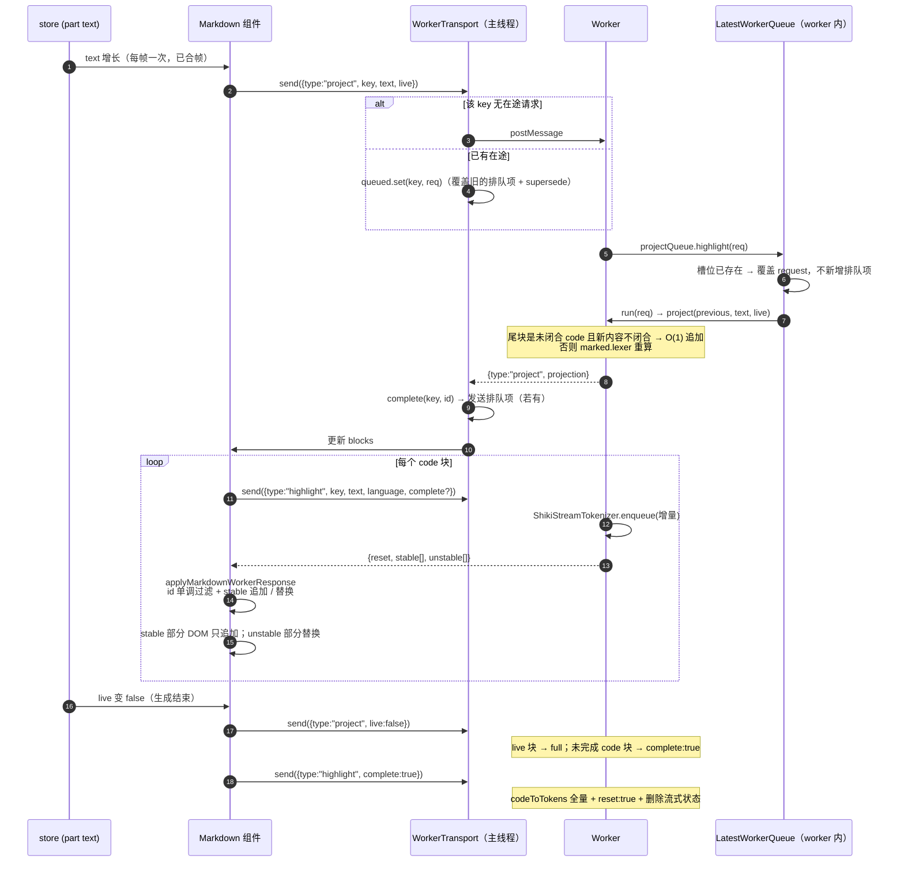

# 11 · 流式 Markdown 管线：Worker + 增量投影 + 稳定/不稳定 token

源码：`packages/session-ui/src/components/markdown-stream.ts`（122 行）、`markdown.worker.ts`（153 行）、`markdown-worker-protocol.ts`（54 行）、`markdown-worker-queue.ts`（64 行）、`markdown-worker-transport.ts`（41 行）、`markdown-code-state.ts`、`markdown-projection.ts`、`markdown-cache.tsx`

---

## 1. 解决什么问题

流式渲染 markdown，四个问题会同时出现：

1. **每次 delta 全量重新 parse + 高亮**：一段 3000 字符的回答，最后一次 parse 是 3000 字符，前面还有 300 次不同长度的 parse。O(n²)。
2. **markdown 在中途是语法不完整的**：`**bold` 还没闭合、`` ``` `` 代码块还没闭合。直接渲染会看到 `**` 字面量，闭合的瞬间又整块重排。
3. **shiki 高亮很慢**：加载语法定义 + tokenize，同步做会阻塞主线程几十到几百毫秒。
4. **代码块在流式中途**：语法高亮需要完整上下文，但内容还在增长。

opencode 的四层解法：

| 层 | 做什么 | 关键文件 |
| --- | --- | --- |
| **块投影** | 把增长中的文本切成「已稳定的块 + 一个活动块」，稳定块不再重算 | `markdown-stream.ts` |
| **语法修补** | 活动块用 `remend` 补全未闭合的标记，渲染出合法结果 | `markdown-stream.ts:49-51` |
| **Worker 卸载** | parse 和高亮全部在 Web Worker，主线程只做 DOM | `markdown.worker.ts` |
| **latest-wins 调度** | 每个块同时只有一个在途请求，新请求覆盖排队中的旧请求 | `markdown-worker-queue.ts` / `markdown-worker-transport.ts` |

---

## 2. 概念模型与不变量

**Block（块）**：markdown 的一个顶层节点（段落、列表、代码块…）。三种模式：
- `full`：已稳定，语法完整，直接渲染
- `live`：当前正在增长的尾块，需要语法修补
- `code`：代码块，走独立的流式高亮通道

**Projection（投影）**：`{ text, blocks }`，一次增量计算的结果。

**stable / unstable token**：shiki 流式 tokenizer 的输出。`stable` 是不会再变的（后续输入不影响），`unstable` 是可能被后续输入改变的（比如一个还没结束的字符串字面量）。

不变量：

1. **M1** 稳定块的 `raw` 一旦确定就不再变化，其渲染结果可无限期缓存。
2. **M2** 增量投影的前提是 `text.startsWith(previous.text)`；不满足就整体重算。
3. **M3** 同一个块 key 同时只有一个在途 worker 请求。
4. **M4** worker 响应可能乱序，按 `id` 单调过滤。
5. **M5** `reset` 语义：`true` 表示替换 stable，`false` 表示追加。
6. **M6** 流结束时 live 块转 full，未完成的 code 块置 `complete: true`。

---

## 3. 数据结构定义

### 3.1 原样摘录

```ts
export type Block = {
  raw: string                                  // 原始 markdown 片段（用于比较和复用判定）
  src: string                                  // 实际交给渲染器的内容（可能被 heal 修补过）
  mode: "full" | "live" | "code"
  language?: string
  complete?: boolean
}

export type Projection = {
  text: string
  blocks: Block[]
}
```
> `packages/session-ui/src/components/markdown-stream.ts:5-16`

```ts
export type MarkdownToken = [content: string, style: string]

export type MarkdownWorkerRequest =
  | { type: "parse";     id: number; text: string }
  | { type: "project";   id: number; key: string; text: string; live: boolean }
  | { type: "highlight"; id: number; key: string; text: string; language: string; complete?: boolean }
  | { type: "dispose";   key: string }

export type MarkdownWorkerResponse =
  | { type: "parse";      id: number; html: string }
  | { type: "project";    id: number; key: string; projection: Projection }
  | { type: "highlight";  id: number; key: string; language: string
      reset: boolean; stable: MarkdownToken[]; unstable: MarkdownToken[] }
  | { type: "error";      id: number; key?: string; message: string }
  | { type: "superseded"; id: number; key: string }

export type MarkdownWorkerState = {
  id: number
  generation: number
  language: string
  stable: MarkdownToken[]
  unstable: MarkdownToken[]
}
```
> `markdown-worker-protocol.ts:3-32`

**`MarkdownToken = [content, style]` 是个二元组而不是对象** —— 一段 500 行的代码会产生几千个 token，跨 worker 边界传对象数组（每个都有 `{content, color, fontStyle...}`）的序列化开销远高于二元组。而且**传的是 token 而不是 HTML 字符串**：HTML 字符串要么 `innerHTML`（XSS 风险 + 整块重建），要么再 parse 一遍。token 数组可以直接映射成 `<span style>`。

### 3.2 等价纯 TS 版

结构可以原样复制，唯一要替换的是 `remend`（markdown 修补库）和 `@shikijs/stream`（流式 tokenizer）。见 §8.3。

---

## 4. 核心算法

### 4.1 块切分 `stream(text, live)`

```ts
export function stream(text: string, live: boolean): Block[] {
  if (!live) return completedProjection(text).blocks              // 非流式：整体一个 full 块
  if (refs(text)) return [{ raw: text, src: heal(text), mode: "live" }]   // 含链接引用定义：整体 live
  const tokens = marked.lexer(text)
  const tail = tokens.findLastIndex((token) => token.type !== "space")
  if (tail < 0) return [{ raw: text, src: heal(text), mode: "live" }]
  const last = tokens[tail]
  if (!last) return [{ raw: text, src: heal(text), mode: "live" }]

  const result: Block[] = []
  for (let index = 0; index < tail; index++) {                     // tail 之前的全部稳定
    const token = tokens[index]
    if (!token || token.type === "space") continue
    let raw = token.raw
    while (tokens[index + 1]?.type === "space" && index + 1 < tail) raw += tokens[++index]!.raw   // 吞掉后续空白
    if (token.type === "code") {
      const code = token as Tokens.Code
      result.push({ raw, src: code.text, mode: "code", language: language(code.lang), complete: true })
      continue
    }
    result.push({ raw, src: raw, mode: "full" })
  }

  const raw = tokens.slice(tail).map((token) => token.raw).join("")
  if (last.type !== "code") return [...result, { raw, src: heal(raw), mode: "live" }]

  const code = last as Tokens.Code
  if (!open(code.raw))                                             // 围栏已闭合
    return [...result, { raw, src: code.text, mode: "code", language: language(code.lang), complete: true }]
  return [...result, { raw, src: openCode(code.raw), mode: "code", language: language(code.lang) }]
}
```
> `markdown-stream.ts:53-86`

核心思路：**用 `marked.lexer` 分词，最后一个非空白 token 之前的全部认为已稳定，只有尾部那个是活动的。**

这个假设成立的依据是 markdown 的块级语法：一旦一个段落后面出现了新的块，前面那个段落就不可能再变。**唯一的例外是链接引用定义**（`[foo]: http://...`），它可以出现在文档任何位置并影响前面的引用：

```ts
function refs(text: string) {
  if (!text.includes("]:")) return false
  return /^[ \t]{0,3}\[[^\]]+\]:[ \t]*(?:\S+|\r?\n[ \t]+\S+)/m.test(text)
}
```
> `markdown-stream.ts:18-21`

**检测到引用定义就放弃增量，整体当一个 live 块。** 先做便宜的 `includes("]:")` 再做正则——大多数文本一次字符串搜索就短路了。

### 4.2 未闭合围栏检测

```ts
function open(raw: string) {
  const match = raw.match(/^[ \t]{0,3}(`{3,}|~{3,})/)     // 开头的围栏标记
  if (!match) return false
  const mark = match[1]
  if (!mark) return false
  const char = mark[0]
  const size = mark.length
  const last = raw.trimEnd().split("\n").at(-1)?.trim() ?? ""
  return !new RegExp(`^[\\t ]{0,3}${char}{${size},}[\\t ]*$`).test(last)   // 最后一行是不是闭合围栏
}

function openCode(raw: string) {
  const newline = raw.indexOf("\n")
  return newline < 0 ? "" : raw.slice(newline + 1)         // 去掉 ```lang 那一行
}

function closesFence(raw: string, suffix: string) {
  const mark = raw.match(/^[ \t]{0,3}(`{3,}|~{3,})/)?.[1]
  if (!mark) return suffix.includes("```") || suffix.includes("~~~")
  return `${raw.slice(-(mark.length - 1))}${suffix}`.includes(mark)
}
```
> `markdown-stream.ts:27-47`

三处细节：
- 围栏可以是 3 个以上的 ` 或 ~，闭合围栏的数量必须 **≥** 开启围栏（正则里的 `{size,}`）。
- 缩进 0–3 空格都算（markdown 规范）。
- `closesFence` 拼接时带上 `raw` 的最后 `mark.length - 1` 个字符——因为围栏标记可能跨 delta 边界被切开（前一批收到 `` ``` `` 的前两个反引号，这一批收到第三个）。

### 4.3 增量投影 `project()`

```ts
export function project(previous: Projection | undefined, text: string, live: boolean): Projection {
  if (!live) {
    // 流结束：尝试把上次的流式投影"收尾"，而不是整体重算
    const current =
      previous?.text === text
        ? previous
        : previous && text.startsWith(previous.text)
          ? project(previous, text, true)
          : undefined
    if (!current) return completedProjection(text)
    return {
      text,
      blocks: current.blocks.map((block) => {
        if (block.mode === "live") return { raw: block.raw, src: block.raw, mode: "full" }   // M6
        if (block.mode === "code" && !block.complete) return { ...block, complete: true }    // M6
        return block
      }),
    }
  }
  if (!previous || !text.startsWith(previous.text)) return { text, blocks: stream(text, live) }   // M2
  const tail = previous.blocks.at(-1)
  const suffix = text.slice(previous.text.length)
  if (!suffix || tail?.mode !== "code" || tail.complete || closesFence(tail.raw, suffix))
    return { text, blocks: stream(text, live) }
  // 快路径：尾块是未闭合的代码块，且新内容不闭合它 → 只追加，其余块对象原样复用
  return {
    text,
    blocks: [...previous.blocks.slice(0, -1), { ...tail, raw: tail.raw + suffix, src: tail.src + suffix }],
  }
}
```
> `markdown-stream.ts:88-122`

**快路径的价值**：代码块是最常见的大块内容，也是 `marked.lexer` 最贵的输入。一个 200 行的代码块在流式中会收到几百次 delta——走快路径就是几百次 O(1) 字符串拼接，而不是几百次全量 lexer。

**慢路径也不算全量重建**：`stream()` 重新 lexer 一遍，但产出的稳定块 `raw` 与上次相同，下游的 `canReusePendingBlock` 会判定可复用：

```ts
export function canReusePendingBlock(current: Pick<Block, "mode" | "raw"> | undefined, next: Block) {
  if (!current || current.mode !== next.mode) return false
  if (next.mode === "code" || next.mode === "live") return next.raw.startsWith(current.raw)  // 前缀增长即可复用
  return current.raw === next.raw                                                            // full 块要求完全相等
}
```
> `markdown-projection.ts:7-11`

### 4.4 语法修补

```ts
function heal(text: string) {
  return remend(text, { linkMode: "text-only" })
}
```
> `markdown-stream.ts:49-51`

`remend` 补全未闭合的 markdown 标记：`**bold` → `**bold**`、`` `code `` → `` `code` ``、`[text](htt` → 处理成纯文本。

**`linkMode: "text-only"`** 是个重要选择：链接在流式中途 URL 还没收全，补成 `[text](htt)` 会渲染出一个坏链接（用户可能点到）。补成纯文本更安全，等 URL 收完了下一帧自然变成真链接。

### 4.5 Worker 协议与两级调度（M3）

**worker 内部**：每类请求一个 latest-wins 队列。

```ts
const highlightQueue = createLatestWorkerQueue<Extract<MarkdownWorkerRequest, { type: "highlight" }>>({
  run: highlight,
  supersede: (request) => post({ type: "superseded", id: request.id, key: request.key }),
  dispose: (key) => void streams.delete(key),
})
const projectQueue = createLatestWorkerQueue<Extract<MarkdownWorkerRequest, { type: "project" }>>({
  run: runProject,
  supersede: (request) => post({ type: "superseded", id: request.id, key: request.key }),
  dispose: (key) => void projections.delete(key),
})
```
> `markdown.worker.ts:27-35`

```ts
export function createLatestWorkerQueue<T extends { key: string }>(input: {
  run: (request: T) => Promise<void>
  supersede: (request: T) => void
  dispose: (key: string) => void
}) {
  type Slot = { type: "highlight"; key: string; request?: T }
  const jobs: Array<Slot | { type: "dispose"; key: string }> = []
  const slots = new Map<string, Slot>()
  let running: Promise<void> | undefined
  let cursor = 0

  const schedule = () => {
    if (running) return
    running = Promise.resolve().then(async () => {
      while (cursor < jobs.length) {
        const job = jobs[cursor++]!
        if (job.type === "dispose") { input.dispose(job.key); continue }
        if (slots.get(job.key) === job) slots.delete(job.key)
        const request = job.request
        job.request = undefined
        if (request) await input.run(request)
      }
    }).finally(() => {
      jobs.splice(0, cursor); cursor = 0; running = undefined
      if (jobs.length > 0) schedule()
    })
  }

  return {
    highlight(request: T) {
      const slot = slots.get(request.key)
      if (slot) {                                    // 该 key 已有排队中的槽位
        if (slot.request) input.supersede(slot.request)   // 通知调用方旧请求被取代
        slot.request = request                            // 覆盖，不新增排队项
        return
      }
      const next: Slot = { type: "highlight", key: request.key, request }
      slots.set(request.key, next)
      jobs.push(next)
      schedule()
    },
    dispose(key: string) {
      const slot = slots.get(key)
      if (slot?.request) input.supersede(slot.request)
      if (slot) { slot.request = undefined; slots.delete(key) }
      jobs.push({ type: "dispose", key })            // dispose 也进队列，保证顺序
      schedule()
    },
    pending: () => slots.size,
    async idle() { while (running) await running },
  }
}
```
> `markdown-worker-queue.ts:1-64`

**槽位（Slot）机制是关键**：每个 key 在 `jobs` 数组里只占一个位置，位置保持 FIFO 顺序，但**位置里装的请求可以被覆盖**。所以：
- 顺序公平（不会有某个块饿死）
- 不会积压（一个块最多一个待执行请求）
- `dispose` 也走队列（不会在 `run` 执行到一半时把状态删掉）

**主线程侧**：`createWorkerTransport` 保证每个 key 最多一个在途请求。

```ts
export function createWorkerTransport<T extends { id: number; key: string }>(input: {
  post: (request: T) => void
  supersede: (request: T) => void
}) {
  const active = new Map<string, T>()
  const queued = new Map<string, T>()
  return {
    send(request: T) {
      if (!active.has(request.key)) { active.set(request.key, request); input.post(request); return }
      const previous = queued.get(request.key)
      if (previous) input.supersede(previous)      // 排队中的被新的取代
      queued.set(request.key, request)
    },
    complete(key: string, id: number) {
      if (active.get(key)?.id !== id) return       // 不是当前在途的响应 → 忽略
      active.delete(key)
      const next = queued.get(key)
      if (!next) return
      queued.delete(key)
      active.set(key, next)
      input.post(next)                             // 自动发送排队项
    },
    dispose(key: string) {
      active.delete(key)
      const request = queued.get(key)
      if (request) input.supersede(request)
      queued.delete(key)
    },
    reset() { queued.forEach(input.supersede); queued.clear(); active.clear() },
    queued: () => queued.size,
  }
}
```
> `markdown-worker-transport.ts:1-41`

**两级都做 latest-wins**：主线程侧防止 `postMessage` 洪水（结构化克隆本身有开销），worker 侧防止执行洪水。

### 4.6 流式高亮：stable / unstable

```ts
async function highlight(request) {
  const instance = await getHighlighter()
  const language = request.language in bundledLanguages ? request.language : "text"   // 未知语言退化为 text
  if (!instance.getLoadedLanguages().includes(language))
    await instance.loadLanguage(bundledLanguages[language as BundledLanguage])        // 按需加载语法

  if (request.complete) {                                  // 代码块已完结：一次性全量 tokenize
    const result = instance.codeToTokens(request.text, { lang: language, theme: "OpenCode" })
    streams.delete(request.key)
    post({
      type: "highlight", id: request.id, key: request.key, language,
      reset: true,
      stable: result.tokens
        .flatMap((line, index) => (index === result.tokens.length - 1 ? line : [...line, { content: "\n", offset: 0 }]))
        .map(token),                                       // 行之间补回换行符
      unstable: [],
    })
    return
  }

  const previous = streams.get(request.key)
  const reset = !previous || previous.language !== language || !request.text.startsWith(previous.source)
  const stream = reset
    ? { language, source: "", tokenizer: new ShikiStreamTokenizer({ highlighter: instance, lang: language, theme: "OpenCode" }) }
    : previous
  const result = await stream.tokenizer.enqueue(request.text.slice(stream.source.length))   // 只喂增量
  stream.source = request.text
  streams.set(request.key, stream)
  post({
    type: "highlight", id: request.id, key: request.key, language, reset,
    stable: result.stable.filter((t) => t.content.length > 0).map(token),
    unstable: result.unstable.filter((t) => t.content.length > 0).map(token),
  })
}

function token(value: ThemedToken): MarkdownToken {
  return [value.content, stringifyTokenStyle(value.htmlStyle ?? getTokenStyleObject(value))]
}
```
> `markdown.worker.ts:86-153`

`ShikiStreamTokenizer` 每次只吃增量（`text.slice(stream.source.length)`），返回两段：
- `stable`：确定不会再变的 token（可以追加到已渲染的部分）
- `unstable`：可能被后续输入改变的 token（比如一个还没结束的字符串、一个可能是关键字前缀的标识符）

主线程侧的合并（M4 / M5）：

```ts
export function applyMarkdownWorkerResponse(state, response) {
  if (state && response.id <= state.id) return state                     // M4：丢弃乱序/过期响应
  return {
    id: response.id,
    generation: (state?.generation ?? 0) + (response.reset ? 1 : 0),
    language: response.language,
    stable: response.reset ? response.stable : [...(state?.stable ?? []), ...response.stable],   // M5
    unstable: response.unstable,                                          // unstable 始终整体替换
  }
}
```
> `markdown-worker-protocol.ts:42-53`

**渲染时 `stable` 部分的 DOM 只追加不重建，`unstable` 部分每次替换。** 这样一个 500 行代码块流式渲染时，只有末尾几个 token 在反复变。

重置判定：

```ts
export function shouldResetCodeTokens(previous, next: { language; generation; stableCount; raw }) {
  return (
    !previous ||
    previous.language !== next.language ||       // 语言变了
    previous.generation !== next.generation ||   // worker 侧 reset 过
    next.stableCount < previous.stableCount ||   // stable 变少了（异常）
    !next.raw.startsWith(previous.raw)           // 内容不是前缀增长
  )
}
```
> `markdown-code-state.ts:11-22`

### 4.7 块 key

```ts
export function markdownBlockKey(owner: string, cacheKey: string | undefined, index: number, mode: string) {
  return `${owner}:${cacheKey ? `${cacheKey}:${index}:${mode}` : `block:${index}`}`
}
```
> `markdown-worker-protocol.ts:38-40`

`owner` 是组件实例 id，`cacheKey` 是 part id。**`mode` 进 key**：同一个 index 的块从 `live` 变成 `full` 时 key 会变，强制丢弃旧的流式状态、重新走完整渲染路径。

---

## 5. 时序



---

## 6. 边界情况与陷阱

| 场景 | opencode 怎么处理 | 你自己实现时必须处理 |
| --- | --- | --- |
| 每个 delta 全量 parse | 只有尾块参与重算；代码块走 O(1) 快路径 | O(n²)，长回答后期每帧几十毫秒 |
| 文本含链接引用定义 | `refs()` 检测到就整体当 live 块 | 增量会导致前面的 `[foo]` 引用渲染错 |
| 未闭合的 `**` / `` ` `` | `remend` 修补 | 用户看到字面量 `**`，闭合瞬间整块重排 |
| 未闭合的链接 `[a](htt` | `linkMode: "text-only"` 修补成纯文本 | 会渲染出可点击的坏链接 |
| 围栏标记跨 delta 被切开 | `closesFence` 拼上 `raw` 尾部 `mark.length - 1` 个字符 | 漏判 → 代码块永远不闭合 |
| 闭合围栏比开启的短 | 正则 `{size,}` 要求 ≥ | 提前闭合，后面内容全渲染错 |
| 未知语言 | 退化成 `text` | shiki 抛错，整块渲染失败 |
| 语法定义未加载 | `loadLanguage` 按需加载 | 首次遇到某语言时抛错 |
| worker 响应乱序 | `response.id <= state.id` 丢弃 | 旧响应覆盖新状态，内容回退 |
| 一个块高频更新 | 两级 latest-wins（主线程 + worker） | postMessage 洪水 + worker 执行洪水 |
| 块被销毁时还有在途请求 | `dispose` 进队列，保证在 run 之后执行 | 删掉状态后 run 会崩 |
| 同 index 的块从 live 变 full | `mode` 进 key，强制换新状态 | 复用旧流式状态导致内容错乱 |
| 代码块内容非前缀增长 | `shouldResetCodeTokens` 检测后整块重置 | token 追加错位，高亮全乱 |
| 全量 tokenize 时行间换行丢失 | `flatMap` 在行之间补 `{content: "\n"}` | 代码变成一行 |
| 空内容 token | `.filter((t) => t.content.length > 0)` | 大量空 span 拖慢 DOM |
| 传 HTML 字符串而非 token | 传二元组数组 | 序列化开销大 + `innerHTML` 风险 |

---

## 7. 移植到你自己的项目

### 7.1 最小可用版（不用 worker）

如果你的场景没有大代码块，只做块投影 + 语法修补就能解决 80% 的问题：

```ts
import { marked } from "marked"
import remend from "remend"

export type Block = { raw: string; src: string; mode: "full" | "live" | "code"; language?: string; complete?: boolean }

const REF_RE = /^[ \t]{0,3}\[[^\]]+\]:[ \t]*(?:\S+|\r?\n[ \t]+\S+)/m
const heal = (t: string) => remend(t, { linkMode: "text-only" })

export function splitBlocks(text: string, live: boolean): Block[] {
  if (!live) return [{ raw: text, src: text, mode: "full" }]
  if (text.includes("]:") && REF_RE.test(text)) return [{ raw: text, src: heal(text), mode: "live" }]
  const tokens = marked.lexer(text)
  const tail = tokens.findLastIndex((t) => t.type !== "space")
  if (tail < 0) return [{ raw: text, src: heal(text), mode: "live" }]

  const out: Block[] = []
  for (let i = 0; i < tail; i++) {
    const t = tokens[i]
    if (!t || t.type === "space") continue
    let raw = t.raw
    while (tokens[i + 1]?.type === "space" && i + 1 < tail) raw += tokens[++i]!.raw
    if (t.type === "code") { out.push({ raw, src: (t as any).text, mode: "code",
                                        language: (t as any).lang?.trim().split(/\s+/, 1)[0] || undefined,
                                        complete: true }); continue }
    out.push({ raw, src: raw, mode: "full" })
  }
  const raw = tokens.slice(tail).map((t) => t.raw).join("")
  return [...out, { raw, src: heal(raw), mode: "live" }]
}
```

React 侧：

```tsx
const blocks = useMemo(() => splitBlocks(text, streaming), [text, streaming])

return (
  <>
    {blocks.map((b, i) => (
      <MarkdownBlock key={`${i}:${b.mode}`} block={b} />        // mode 进 key
    ))}
  </>
)

// full 块可以按 raw 做长期缓存
const MarkdownBlock = React.memo(
  ({ block }: { block: Block }) => <div dangerouslySetInnerHTML={{ __html: renderCached(block) }} />,
  (a, b) => a.block.mode === b.block.mode && a.block.raw === b.block.raw,
)
```

**光是这一步就能把长回答后期的每帧耗时从几十毫秒降到几毫秒**，因为稳定块的 `React.memo` 命中，只有最后一个块在重算。

### 7.2 加上 Worker

```ts
// main thread
const worker = new Worker(new URL("./markdown.worker.ts", import.meta.url), { type: "module" })
let nextId = 0
const transport = createWorkerTransport<Req>({
  post: (r) => worker.postMessage(r),
  supersede: (r) => { /* 可选：标记该请求已废弃 */ },
})
worker.onmessage = (e: MessageEvent<Res>) => {
  const res = e.data
  if (res.type === "superseded") { transport.complete(res.key, res.id); return }
  if ("key" in res && res.key) transport.complete(res.key, res.id)
  // ... 按 type 分派更新 state
}
function requestProject(key: string, text: string, live: boolean) {
  transport.send({ type: "project", id: nextId++, key, text, live })
}
```

`createLatestWorkerQueue` 和 `createWorkerTransport` 两个文件可以**逐字复制**（§4.5 已给出全文），它们不依赖任何框架。

### 7.3 落地步骤

1. 装依赖：`marked`、`remend`、`shiki`、`@shikijs/stream`。
2. 复制 `markdown-stream.ts`（`refs` / `open` / `openCode` / `closesFence` / `heal` / `stream` / `project`）—— 122 行，零框架依赖。
3. 复制 `markdown-projection.ts`（`completedProjection` / `canReusePendingBlock`）。
4. 复制 `markdown-worker-protocol.ts`（类型 + `applyMarkdownWorkerResponse` + `markdownBlockKey`）。
5. 复制 `markdown-worker-queue.ts` 和 `markdown-worker-transport.ts` —— 各 60/40 行，零依赖。
6. 写 worker 入口：照 §4.6 实现 `project` / `highlight` / `parse` / `dispose` 四个 handler。
7. 主线程组件：按 `blocks` 渲染，`key = ${index}:${mode}`，`full` 块用 `React.memo`（比较 `raw`）。
8. 代码块组件：维护 `{id, generation, language, stable, unstable}`，用 `applyMarkdownWorkerResponse` 合并；渲染时 `stable` 部分只追加。
9. 组件卸载时发 `dispose`。

### 7.4 你需要自己提供的依赖

| 依赖 | 用途 | 备选 |
| --- | --- | --- |
| `marked` | 块级 lexer | `micromark` / `remark`（要能拿到 token 的 `raw`） |
| `remend` | 未闭合语法修补 | 自己写：至少处理 `**` / `*` / `` ` `` / 未闭合链接 |
| `shiki` + `@shikijs/stream` | 流式高亮 | 非流式场景可用 `prism` + 只在 `complete` 时高亮 |
| Worker 打包支持 | `new Worker(new URL(...))` | Vite / webpack 5 原生支持 |

---

## 8. 验收清单

- [ ] **M1** 一个已稳定的段落，在后续 100 次更新中 `raw` 不变，其组件不重渲染
- [ ] **M2** `text` 不是 `previous.text` 的前缀 → 整体重算（不产生错误拼接）
- [ ] **M2** 尾块是未闭合代码块且新内容不闭合 → 走 O(1) 快路径（性能可测：不调用 lexer）
- [ ] **M3** 同一个块连续发 10 次请求 → worker 最多执行 2 次（在途 1 + 最新 1）
- [ ] **M3** 期间收到 8 次 `superseded` 响应
- [ ] **M4** 人为乱序投递两个 highlight 响应 → 旧 id 的被丢弃
- [ ] **M5** `reset: true` → stable 被替换；`reset: false` → stable 被追加
- [ ] **M6** `live` 由 true 变 false → 所有 live 块变 full，未完成 code 块 `complete: true`
- [ ] **引用定义** 文本含 `[foo]: http://x` → 整体当一个 live 块
- [ ] **围栏** ` ```js ` 未闭合 → 尾块 `mode: "code"` 且无 `complete`
- [ ] **围栏** 4 个反引号开启、3 个反引号出现 → **不**算闭合
- [ ] **围栏** 围栏标记跨两次 delta 被切开 → `closesFence` 正确识别
- [ ] **缩进围栏** 3 空格缩进的 `` ``` `` → 识别；4 空格 → 不识别（是代码缩进）
- [ ] **修补** `**bold` → 渲染出粗体，不显示 `**` 字面量
- [ ] **修补** `[text](htt` → 渲染成纯文本，不是可点击的坏链接
- [ ] **未知语言** ` ```foobar ` → 退化成 text，不抛错
- [ ] **换行** 全量 tokenize 一个 10 行代码块 → 渲染出 10 行（不是 1 行）
- [ ] **重置** 代码块内容被非前缀替换 → `shouldResetCodeTokens` 返回 true，token 整体重建
- [ ] **key** 同一个 index 的块从 live 变 full → key 变化，状态不复用
- [ ] **dispose** 组件卸载后 worker 内该 key 的 `streams` / `projections` 条目被删除
- [ ] **顺序** `dispose` 在同 key 的 `run` 之后执行（不会删掉正在用的状态）
- [ ] **性能** 一个 3000 字符含 500 行代码块的回答流式渲染 → 主线程无 > 16ms 长任务
