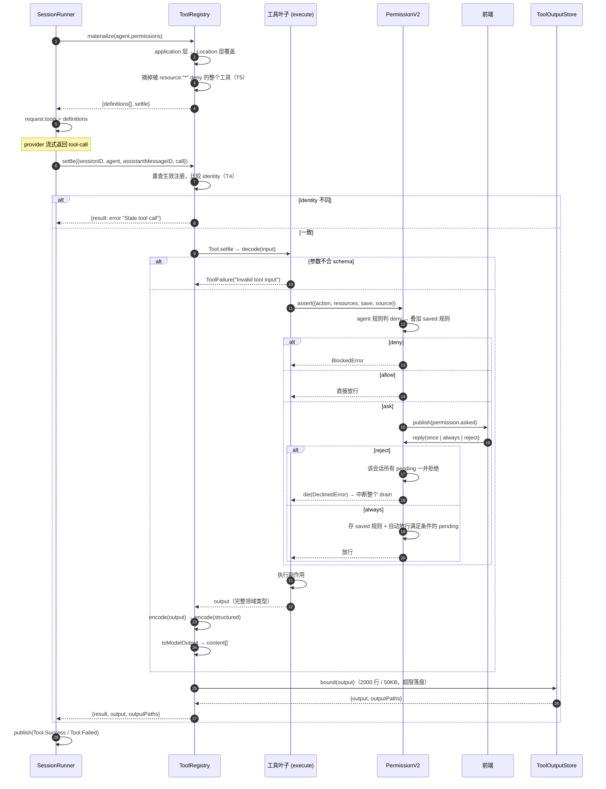

# 14 · 工具系统：一个不可变值、两层注册表、一条结算管线

源码：`packages/core/src/tool/`（tool.ts 162 行、registry.ts 147 行、tools.ts 13 行、application-tools.ts 57 行、builtins.ts 48 行 + 12 个叶子工具）、`packages/core/src/permission.ts`（310 行）、`packages/core/src/location-mutation.ts`（162 行）、`packages/core/src/file-mutation.ts`（207 行）

> 这个目录自带一份架构说明 `packages/core/src/tool/AGENTS.md`，本章的很多结论直接来自它。读源码前先读那份文件能省一半时间。

---

## 1. 解决什么问题

「给模型一组函数让它调用」听起来简单，真做起来要同时满足七件事：

| 需求 | 朴素做法的问题 |
| --- | --- |
| 模型要拿到 JSON Schema | 手写 schema 和 TS 类型两份，必然漂移 |
| 输入要校验 | 模型会传畸形参数；不校验就在业务代码里 crash |
| 输出要给两个消费者 | 模型要文本，UI 要结构化数据，混在一起两边都难受 |
| 危险操作要授权 | 授权逻辑散落在每个工具里，规则无法统一配置 |
| 输出可能巨大 | 每个工具各自截断，行为不一致 |
| 工具要能被插件/MCP 扩展和覆盖 | 全局 Map 直接 set，卸载时无法恢复被覆盖的那个 |
| 工具定义要能按 agent 过滤 | 过滤逻辑和执行授权混在一起，导致"看不见但能调用"或"看得见但必失败" |

opencode 的答案是四条硬边界：

1. **`Tool.make(...)` 返回一个不可变的空对象**，实现藏在 `WeakMap` 里。调用方拿不到 `execute`、拿不到 schema，只能通过模块函数操作它。
2. **注册是作用域化的栈**，不是覆盖式的 Map。作用域结束自动弹出，露出下一个。
3. **`materialize()` 一次性快照出「本轮可见的工具集」**，之后所有调用都对着这个快照，防止流式过程中注册表变动导致的错乱。
4. **定义过滤 ≠ 执行授权**。前者决定模型看不看得见（catalog visibility），后者在叶子内部决定这次调用准不准（execution authorization）。两者用不同机制。

---

## 2. 概念模型与不变量

**Tool（工具值）**：opaque 不可变值，`Tool.make` 产出。
**Tools.Service**：Location 作用域的**只读注册能力**（只有 `register`）。
**ApplicationTools.Service**：进程作用域的应用级注册表，被所有 Location 共享。
**ToolRegistry.Service**：Location 作用域，叠加两层注册、派生定义、执行结算。
**Materialization**：一次 provider turn 的工具快照 `{definitions, settle}`。

不变量：

1. **T1** 工具值不可变、不可内省。`Object.freeze({})` + `WeakMap` 存运行时。
2. **T2** 同名注册后到者赢；作用域关闭只移除自己那条，露出前一条。
3. **T3** Location 注册优先于 application 注册。
4. **T4** 一次调用在结算开始时捕获生效的工具；之后注册表变化不影响它（stale 检测）。
5. **T5** 定义过滤只看「整个工具是否被 `resource: "*"` 的 deny 规则完全禁用」，不做逐资源判断。
6. **T6** 注册表本身**不依赖权限服务**、不做执行授权。授权在叶子里。
7. **T7** 输入校验失败、输出不符 schema、执行失败，全部转成 `ToolFailure` 文本回给模型，不抛到 runner。
8. **T8** 中断和 defect 必须穿透，不能被 `catchCause` 吞掉。
9. **T9** 输出上限只在 `settle` 这一个地方施加（见第 06 章）。
10. **T10** 工具名必须匹配 `/^[A-Za-z][A-Za-z0-9_-]{0,63}$/`。

---

## 3. 数据结构定义

### 3.1 原样摘录

```ts
export interface Context {
  readonly sessionID: SessionSchema.ID
  readonly agent: AgentV2.ID
  readonly assistantMessageID: SessionMessage.ID
  readonly toolCallID: string
}

export type SchemaType<A> = Schema.Codec<A, any, never, never>

declare const TypeId: unique symbol

export interface Definition<Input extends SchemaType<any>, Output extends SchemaType<any>> {
  readonly [TypeId]: { readonly _Input: Input; readonly _Output: Output }
}
export type AnyTool = Definition<any, any>

export type Content =
  | { readonly type: "text"; readonly text: string }
  | { readonly type: "file"; readonly data: string; readonly mime: string; readonly name?: string }

type Config<Input extends SchemaType<any>, Output extends SchemaType<any>, Structured extends SchemaType<any> = Output> = {
  readonly description: string
  readonly input: Input
  readonly output: Output
  readonly structured?: Structured
  readonly toStructuredOutput?: (input: {
    readonly input: Schema.Schema.Type<Input>
    readonly output: Output["Encoded"]
  }) => Schema.Schema.Type<Structured>
  readonly execute: (
    input: Schema.Schema.Type<Input>,
    context: Context,
  ) => Effect.Effect<Schema.Schema.Type<Output>, ToolFailure>
  readonly toModelOutput?: (input: {
    readonly input: Schema.Schema.Type<Input>
    readonly output: Output["Encoded"]
  }) => ReadonlyArray<Content>
}

type Runtime = {
  readonly permission?: string
  readonly definition: (name: string) => ToolDefinition
  readonly settle: (call: ToolCall, context: Context) => Effect.Effect<ToolOutput, ToolFailure>
}

const runtimes = new WeakMap<AnyTool, Runtime>()
```
> `packages/core/src/tool/tool.ts:9-69`

**三个 schema 而不是两个**，这是最值得抄的一处设计：

| schema | 给谁 | 用途 |
| --- | --- | --- |
| `input` | 模型 | JSON Schema 进工具定义；结算时校验模型传的参数 |
| `output` | 内部 | 执行结果的完整领域类型，`toModelOutput` 的输入 |
| `structured`（可选） | UI / 下一轮模型 | `output` 的**瘦身投影**，进 `ToolStateCompleted.structured` |

例：bash 的 `output` 含完整 stdout（可能几 MB），`structured` 只有 `{exit, truncated, timeout}` 三个字段。UI 渲染卡片只需要后者，历史里存的也是后者——**大输出不会因为 UI 需要而被完整保留两份**。

```ts
const StructuredOutput = Schema.Struct({
  exit: Schema.Number.pipe(Schema.optional),
  truncated: Schema.Boolean,
  timeout: Schema.Boolean.pipe(Schema.optional),
})
const Output = Schema.Struct({
  ...StructuredOutput.fields,
  output: Schema.String,
  warnings: Schema.Array(Schema.String).pipe(Schema.optional),
})
```
> `packages/core/src/tool/bash.ts:35-45`

### 3.2 注册表结构

```ts
export interface Materialization {
  readonly definitions: ReadonlyArray<ToolDefinition>
  readonly settle: (input: ExecuteInput) => Effect.Effect<Settlement, ToolOutputStore.Error>
}
export interface Settlement {
  readonly result: ToolResultValue
  readonly output?: ToolOutput
  readonly outputPaths?: ReadonlyArray<string>
}
export type ExecuteInput = {
  readonly sessionID: SessionSchema.ID
  readonly agent: AgentV2.ID
  readonly assistantMessageID: SessionMessage.ID
  readonly call: ToolCall
}
```
> `packages/core/src/tool/registry.ts:16-38`

```ts
type Registration = { readonly identity: object; readonly tool: AnyTool }
const local = new Map<string, Array<{ readonly token: object; readonly registration: Registration }>>()
```
> `registry.ts:47-48`

**`Map<name, Array<...>>` 而不是 `Map<name, tool>`** —— 这个数组就是 T2 的实现：同名注册压栈，`at(-1)` 是生效的那个，作用域结束按 `token` 过滤掉自己那条。

**`identity: object`** 是一个空对象，只用来做引用比较，实现 T4 的 stale 检测。

### 3.3 等价纯 TS 版（可直接复制）

```ts
// ============ 工具值 ============
export interface ToolContext {
  sessionId: string
  agent: string
  assistantMessageId: string
  toolCallId: string
}

export type ToolContent =
  | { type: "text"; text: string }
  | { type: "file"; data: string; mime: string; name?: string }

export interface ToolOutput {
  structured: Record<string, unknown>
  content: ToolContent[]
}

export class ToolFailure extends Error {}

/** 对外只是一个不透明句柄 */
export type Tool = { readonly __tool: unique symbol }

interface ToolRuntime {
  permission?: string
  definition: (name: string) => { name: string; description: string; inputSchema: object; outputSchema: object }
  settle: (call: { id: string; name: string; input: unknown }, ctx: ToolContext) => Promise<ToolOutput>
}
const runtimes = new WeakMap<object, ToolRuntime>()

export interface ToolConfig<I, O, S = O> {
  description: string
  input: Codec<I>                 // {parse(u): I; jsonSchema(): object}
  output: Codec<O>
  structured?: Codec<S>
  toStructuredOutput?: (a: { input: I; output: O }) => S
  execute: (input: I, ctx: ToolContext) => Promise<O>          // 只允许抛 ToolFailure
  toModelOutput?: (a: { input: I; output: O }) => ToolContent[]
}

export function makeTool<I, O, S = O>(config: ToolConfig<I, O, S>): Tool {
  const tool = Object.freeze({}) as unknown as Tool
  const cache = new Map<string, ReturnType<ToolRuntime["definition"]>>()
  runtimes.set(tool as unknown as object, {
    definition(name) {
      const hit = cache.get(name)
      if (hit) return hit
      const def = {
        name,
        description: config.description,
        inputSchema: config.input.jsonSchema(),
        outputSchema: (config.structured ?? config.output).jsonSchema(),
      }
      cache.set(name, def)
      return def
    },
    async settle(call, ctx) {
      let input: I
      try { input = config.input.parse(call.input) }
      catch (e) { throw new ToolFailure(`Invalid tool input: ${(e as Error).message}`) }

      const output = await config.execute(input, ctx)           // ToolFailure 直接向上抛

      let structured: unknown = output
      try {
        if (config.structured && config.toStructuredOutput)
          structured = config.structured.parse(config.toStructuredOutput({ input, output }))
      } catch (e) {
        throw new ToolFailure(`Tool returned an invalid value for its output schema: ${(e as Error).message}`)
      }

      const content =
        config.toModelOutput?.({ input, output }) ??
        (typeof output === "string" ? [{ type: "text" as const, text: output }] : [])
      return { structured: structured as Record<string, unknown>, content }
    },
  })
  return tool
}

const TOOL_NAME = /^[A-Za-z][A-Za-z0-9_-]{0,63}$/
export const validateToolName = (name: string) => {
  if (!TOOL_NAME.test(name)) throw new Error(`Invalid tool name: ${name}`)
}

/** 装饰出一个共享权限动作的同款工具（如 edit/write/apply_patch 共用 "edit"） */
export function withPermission(tool: Tool, permission: string): Tool {
  const decorated = Object.freeze({}) as unknown as Tool
  runtimes.set(decorated as unknown as object, { ...runtimeOf(tool), permission })
  return decorated
}

export const toolPermission = (tool: Tool, name: string) => runtimeOf(tool).permission ?? name
export const toolDefinition = (name: string, tool: Tool) => runtimeOf(tool).definition(name)
export const settleTool = (tool: Tool, call: any, ctx: ToolContext) => runtimeOf(tool).settle(call, ctx)

function runtimeOf(tool: Tool): ToolRuntime {
  const r = runtimes.get(tool as unknown as object)
  if (!r) throw new TypeError("Invalid Tool value")
  return r
}
```

---

## 4. 核心算法

### 4.1 结算管线（`settle`）

`Tool.make` 里那段 pipe 就是完整管线，五步：

```
settle(call, context):
  1. decode(config.input, call.input)
       失败 → ToolFailure(`Invalid tool input: ${error.message}`)
  2. config.execute(input, context)
       只允许失败为 ToolFailure；中断/defect 穿透（T8）
  3. encode(config.output, result)
       失败 → ToolFailure(`Tool returned an invalid value for its output schema: ...`)
  4. 若声明了 structured：encode(config.structured, toStructuredOutput({input, output}))
       否则 structured = output
  5. content =
       config.toModelOutput?.({input, output}).map(转换 file → data URI)
       ?? (typeof output === "string" ? [{type:"text", text: output}] : [])
  返回 { structured, content }
```
> `tool.ts:91-129`

第 5 步的两个细节：

- **`file` content 被转成 data URI**：`` `data:${part.mime};base64,${part.data}` ``（`tool.ts:121`）。工具作者写 `{type:"file", data, mime}`，落到消息里是标准 URI。
- **兜底规则**：没提供 `toModelOutput` 且 output 是字符串就直接当文本；否则**给模型空 content**。也就是说返回对象但不写 `toModelOutput` 的工具，模型什么都看不到——这是刻意的强制约定，逼你显式决定给模型看什么。

### 4.2 定义缓存

```ts
definition: (name) => {
  const cached = definitions.get(name)
  if (cached) return cached
  const definition = new ToolDefinition({
    name,
    description: config.description,
    inputSchema: toJsonSchema(config.input),
    outputSchema: toJsonSchema(config.structured ?? config.output),
  })
  definitions.set(name, definition)
  return definition
}
```
> `tool.ts:79-90`

**按 name 缓存**，因为同一个工具值可能以不同名字注册（MCP 前缀、别名）。JSON Schema 生成不便宜，每轮 materialize 都重算会浪费。

```ts
function toJsonSchema(schema: Schema.Top): JsonSchema.JsonSchema {
  const document = Schema.toJsonSchemaDocument(schema)
  if (Object.keys(document.definitions).length === 0) return document.schema
  return { ...document.schema, $defs: document.definitions }
}
```
> `tool.ts:158-162`

**有引用定义时才加 `$defs`**。多数 provider 支持 `$defs`，但空的 `$defs: {}` 在某些 provider 上会报错。

### 4.3 作用域注册（T2）

```ts
register: Effect.fn("ToolRegistry.register")(function* (tools) {
  const entries = Object.entries(tools)
  if (entries.length === 0) return
  yield* Effect.forEach(entries, ([name]) => validateName(name), { discard: true })   // 先全部校验
  yield* Effect.uninterruptible(                                                       // 再原子注册
    Effect.gen(function* () {
      const token = {}
      for (const [name, tool] of entries)
        local.set(name, [...(local.get(name) ?? []), { token, registration: { identity: {}, tool } }])
      yield* Effect.addFinalizer(() =>
        Effect.sync(() => {
          for (const [name] of entries) {
            const registrations = local.get(name)?.filter((registration) => registration.token !== token) ?? []
            if (registrations.length > 0) local.set(name, registrations)
            else local.delete(name)
          }
        }),
      )
    }),
  )
})
```
> `registry.ts:85-105`

三个要点：
- **先校验全部名字再注册任何一个**：一批注册要么全成功要么全失败，不留半截状态。
- **`Effect.uninterruptible`**：注册和 finalizer 登记之间不能被打断，否则会泄漏一条无法回收的注册。
- **一批共享一个 `token`**：卸载时按 token 精确移除自己那批，不影响别人。

### 4.4 materialize：本轮工具快照

```ts
materialize: Effect.fn("ToolRegistry.materialize")(function* (permissions = []) {
  const registrations = new Map(applications.entries())            // 先铺 application 层
  for (const [name, entries] of local) {
    const registration = entries.at(-1)?.registration
    if (registration) registrations.set(name, registration)        // Location 层覆盖（T3）
  }
  for (const [name, registration] of registrations)
    if (whollyDisabled(permission(registration.tool, name), permissions)) registrations.delete(name)   // T5
  return {
    definitions: Array.from(registrations, ([name, registration]) => definition(name, registration.tool)),
    settle: (input) => {
      const registration = registrations.get(input.call.name)
      if (registration) return settleWith(input, registration.identity)     // 带 identity 做 stale 检测
      return Effect.succeed({ result: { type: "error", value: `Unknown tool: ${input.call.name}` } })
    },
  }
})
```
> `registry.ts:106-122`

```ts
function whollyDisabled(action: string, rules: PermissionV2.Ruleset) {
  const rule = rules.findLast((rule) => Wildcard.match(action, rule.action))
  return rule?.resource === "*" && rule.effect === "deny"
}
```
> `registry.ts:132-135`

**T5 的精确语义**：只有当**最后一条匹配该 action 的规则**同时满足 `resource === "*"` 且 `effect === "deny"` 时，才把工具从定义列表里摘掉。

为什么不做逐资源过滤：工具定义是**整体**的，你没法给模型一个「只能读 src/ 下文件的 read 工具」的 JSON Schema。所以：
- 完全禁用 → 从目录里摘掉，模型根本看不见（省 token，也不会白试）。
- 部分限制 → 保留定义，具体这次调用准不准由叶子里的 `permission.assert` 决定。

### 4.5 stale 检测（T4）

```ts
const settleWith = Effect.fn("ToolRegistry.settle")(function* (input: ExecuteInput, advertised?: object) {
  const registration = local.get(input.call.name)?.at(-1)?.registration ?? applications.entries().get(input.call.name)
  if (!registration)
    return { result: { type: "error" as const,
             value: advertised ? `Stale tool call: ${input.call.name}` : `Unknown tool: ${input.call.name}` } }
  if (advertised && registration.identity !== advertised)
    return { result: { type: "error" as const, value: `Stale tool call: ${input.call.name}` } }
  ...
})
```
> `registry.ts:50-61`

`advertised` 是 materialize 时那个注册的 `identity` 引用。结算时重新查当前生效的注册，**引用不同就说明这个工具在本轮流式过程中被换掉了**（插件热重载、MCP 重连）。此时执行新工具是危险的——模型是按旧工具的 schema 生成的参数。所以直接返回 `Stale tool call` 让模型重试。

**两种错误文案的区别**：`advertised` 存在说明这个工具本轮宣告过（是 stale），不存在说明模型凭空捏造了一个工具名（是 unknown）。给模型不同的信号能让它做不同的恢复。

### 4.6 结算后处理

```ts
const pending = yield* settle(registration.tool, input.call, {...}).pipe(
  Effect.map((output) => ({ output })),
  Effect.catchTag("LLM.ToolFailure", (failure) =>
    Effect.succeed({ result: { type: "error" as const, value: failure.message } }),   // T7
  ),
)
if ("result" in pending) return pending
const output = pending.output
const bounded = yield* resources.bound({ sessionID: input.sessionID, toolCallID: input.call.id, output })   // T9
const result = ToolOutput.toResultValue(bounded.output)
if (result.type === "error")
  return bounded.outputPaths.length > 0 ? { result, outputPaths: bounded.outputPaths } : { result }
return bounded.outputPaths.length > 0
  ? { result, output: bounded.output, outputPaths: bounded.outputPaths }
  : { result, output: bounded.output }
```
> `registry.ts:62-81`

**只 catch `LLM.ToolFailure` 这一个 tag**（T8）。中断、defect、其它错误全部穿透到 runner。`tool/AGENTS.md:28` 明确写了：`Translate only expected typed errors into ToolFailure; do not use catchCause, because interruption and defects must survive.`

**输出上限只在这里施加**（T9）——`resources.bound(...)` 就是第 06 章的 `ToolOutputStore`。叶子工具自己有采集上限（比如 bash 的 `MAX_CAPTURE_BYTES = 1MB`），但那是**采集**限制，不是模型输出限制，两者不能混。

---

## 5. 权限系统

工具系统的另一半。

### 5.1 规则模型

```ts
export const Effect = Schema.Literals(["allow", "deny", "ask"])
export const Rule = Schema.Struct({ action: Schema.String, resource: Schema.String, effect: Effect })
export const Ruleset = Schema.Array(Rule)
```
> `packages/schema/src/permission.ts:54-65`

```ts
export function evaluate(action: string, resource: string, ...rulesets: Permission.Ruleset[]): Permission.Rule {
  return (
    rulesets.flat().findLast((rule) => Wildcard.match(action, rule.action) && Wildcard.match(resource, rule.resource)) ??
    { action, resource: "*", effect: "ask" }
  )
}
```
> `packages/core/src/permission.ts:76-87`

**`findLast` = 后定义的规则赢**。默认（无匹配规则）是 `ask`，不是 allow 也不是 deny——**默认询问是唯一安全的默认值**。

通配符匹配：

```ts
export function match(input: string, pattern: string) {
  const normalized = input.replaceAll("\\", "/")
  let escaped = pattern
    .replaceAll("\\", "/")
    .replace(/[.+^${}()|[\]\\]/g, "\\$&")     // 转义正则元字符
    .replace(/\*/g, ".*")
    .replace(/\?/g, ".")
  if (escaped.endsWith(" .*")) escaped = escaped.slice(0, -3) + "( .*)?"   // "git commit *" 也匹配裸 "git commit"
  return new RegExp("^" + escaped + "$", process.platform === "win32" ? "si" : "s").test(normalized)
}
```
> `packages/core/src/util/wildcard.ts:3-14`

三个细节值得抄：
- **反斜杠归一化成正斜杠**：Windows 路径和 glob 模式能互相匹配。
- **`" .*"` 结尾的特判**：模式 `git commit *` 会匹配 `git commit`（无参数）。不做这个特判，用户保存的「允许 git commit *」对裸命令失效。
- **Windows 上大小写不敏感**（`i` flag）。

### 5.2 三层规则合并

```ts
const evaluateInput = EffectRuntime.fnUntraced(function* (input: AssertInput) {
  const rules = yield* configured(input.sessionID, input.agent)              // ① agent 配置的规则
  if (denied(input, rules)) return { effect: "deny" as const, rules }        // ② agent deny 优先，不可被保存规则覆盖
  const all = [...rules, ...(yield* savedRules())]                           // ③ 叠加用户保存的 allow 规则
  const effects = input.resources.map((resource) => evaluate(input.action, resource, all).effect)
  const effect: Permission.Effect = effects.includes("deny") ? "deny" : effects.includes("ask") ? "ask" : "allow"
  return { effect, rules: all }
})
```
> `permission.ts:154-162`

**关键设计：agent 层的 deny 先单独判一次，且不可被用户保存的规则覆盖。**

如果不这样写，用户点了一次「总是允许 rm -rf *」，就能把 agent 配置里的安全底线彻底绕过。分两步判定后，agent 的 deny 是硬约束。

**多资源聚合**：一次 assert 可以带多个 resource（比如 apply_patch 改多个文件），取最保守的结果：任一 deny 则 deny，任一 ask 则 ask，全 allow 才 allow。

**找不到 agent 时的兜底**：

```ts
const missingAgentPermissions: Permission.Ruleset = [{ action: "*", resource: "*", effect: "deny" }]
```
> `permission.ts:15`

**全部拒绝**，不是全部允许。

### 5.3 assert：阻塞直到用户回答

```ts
const assert = EffectRuntime.fn("PermissionV2.assert")((input: AssertInput) =>
  EffectRuntime.uninterruptibleMask((restore) =>
    EffectRuntime.gen(function* () {
      const result = yield* evaluateInput(input)
      if (result.effect === "deny") return yield* new BlockedError({ rules: relevant(input, result.rules) })
      if (result.effect === "allow") return
      const item = yield* create(request(input), input.agent)          // 发 permission.asked 事件
      return yield* restore(Deferred.await(item.deferred)).pipe(       // 阻塞
        EffectRuntime.catchTag("PermissionV2.DeclinedError", (error) => EffectRuntime.die(error)),
        EffectRuntime.ensuring(EffectRuntime.sync(() => { pending.delete(item.request.id) })),
      )
    }),
  ),
)
```
> `permission.ts:198-224`

**`DeclinedError` 被转成 `die`（defect）而不是普通失败**。因为第 05 章的 drain 循环会检测这个 defect 并中断整个 drain：

```ts
const isUserDeclined = (cause: Cause.Cause<unknown>) =>
  cause.reasons.some(
    (reason) =>
      Cause.isDieReason(reason) &&
      (reason.defect instanceof PermissionV2.DeclinedError || reason.defect instanceof QuestionV2.RejectedError),
  )
```
> `packages/core/src/session/runner/llm.ts:144-149`

**用户拒绝不能变成工具的错误输出回给模型**——那样模型会换个说法再试一次。必须中断整个 drain。

`CorrectedError`（用户拒绝时附带了文字说明）则是普通失败，会变成工具错误文本回给模型，让它按用户的意见调整。

### 5.4 reply：拒绝的传染与允许的传染

**拒绝一个 → 拒绝该会话全部待处理请求**：

```ts
if (input.reply === "reject") {
  yield* Deferred.fail(existing.deferred,
    input.message ? new CorrectedError({ feedback: input.message }) : new DeclinedError())
  pending.delete(input.requestID)
  for (const [id, item] of pending) {
    if (item.request.sessionID !== existing.request.sessionID) continue
    yield* events.publish(Event.Replied, { sessionID: item.request.sessionID, requestID: item.request.id, reply: "reject" })
    yield* Deferred.fail(item.deferred, new DeclinedError())
    pending.delete(id)
  }
  return
}
```
> `permission.ts:229-248`

用户说「不」的时候，并发跑着的其它工具请求（模型一次调了 5 个工具）也应该全停，而不是逐个弹窗让用户点 5 次「不」。

**「总是允许」→ 自动放行所有现在满足条件的待处理请求**：

```ts
if (input.reply === "always" && existing.request.save?.length) {
  yield* saved.add({ projectID: location.project.id, action: existing.request.action, resources: existing.request.save })
}
yield* Deferred.succeed(existing.deferred, undefined)
pending.delete(input.requestID)
if (input.reply !== "always" || !existing.request.save?.length) return

const rememberedRules = yield* savedRules()
for (const [id, item] of pending) {
  const rules = yield* configured(item.request.sessionID, item.agent).pipe(
    EffectRuntime.catchTag("Session.NotFoundError", () => EffectRuntime.succeed(undefined)))
  if (!rules) continue
  if (denied(input, rules)) continue                              // agent deny 仍然拦得住
  const effective = [...rules, ...rememberedRules]
  if (!item.request.resources.every((resource) => evaluate(item.request.action, resource, effective).effect === "allow"))
    continue
  yield* events.publish(Event.Replied, { sessionID: item.request.sessionID, requestID: item.request.id, reply: "always" })
  yield* Deferred.succeed(item.deferred, undefined)
  pending.delete(id)
}
```
> `permission.ts:250-282`

注意这里**重新跑了一遍完整判定**（含 agent deny 检查），而不是简单地放行同 action 的请求。保存的规则只能是 `allow`（`saved.ts` 里硬编码 `effect: "allow"`），不能提权绕过 agent 的 deny。

### 5.5 `save` 与 `resources` 的分离

`AssertInput` 有两个数组：

- `resources`：本次要授权的具体资源
- `save`：用户点「总是」时要记住的模式

它们**故意不同**。看三个例子：

| 工具 | `resources` | `save` | 效果 |
| --- | --- | --- | --- |
| `bash` | `[input.command]` | `[input.command]` | 记住这条具体命令 |
| `read` | `[target.resource]`（具体路径） | `["*"]` | 允许一次就允许读所有文件 |
| `edit` | `[target.resource]`（具体路径） | `["*"]` | 同上 |
| `skill` | `[skill.name]` | `[skill.name]` | 只记住这一个技能 |
| `external_directory` | `[dir + "/*"]` | 同 | 记住整个外部目录 |

> `bash.ts:142-149`、`read.ts:72-79`、`edit.ts:150-158`、`tool/skill.ts:76-83`

**读文件这类低风险高频操作，问一次就该记住全部；执行命令这类高风险操作，只记住具体那条。** 这个区分是产品体验的关键——不分离的话要么烦死用户，要么一次点击就把整个沙箱打开了。

---

## 6. 时序



---

## 7. 内置工具目录

`packages/core/src/tool/builtins.ts:31-47` 注册了 12 个 Location 作用域的内置工具。

| 工具 | 权限动作 | 关键输入 | 关键常量 | 授权点 |
| --- | --- | --- | --- | --- |
| `bash` | `bash` | `command`, `workdir?`, `timeout?` | `DEFAULT_TIMEOUT_MS = 2min`、`MAX_TIMEOUT_MS = 10min`、`MAX_CAPTURE_BYTES = 1MB` | 外部目录 + 命令本身 |
| `read` | `read` | `path`, `offset?`, `limit?` | `MAX_READ_LINES = 2000`、`MAX_READ_BYTES = 50KB`、`MAX_MEDIA_INGEST_BYTES = 20MB`、`MAX_LINE_LENGTH = 2000` | 外部目录 + 路径（save `*`） |
| `write` | **`edit`** | `path`, `content` | — | 外部目录 + 路径 |
| `edit` | **`edit`** | `path`, `oldString`, `newString`, `replaceAll?` | — | 外部目录 + 路径 |
| `apply_patch` | **`edit`** | `patch`（含 add/update/delete） | — | 外部目录 + 各文件 |
| `glob` | `glob` | `pattern`, `path?`, `limit?` | — | 路径 |
| `grep` | `grep` | `pattern`, `path?`, `include?`, `limit?` | — | 路径 |
| `webfetch` | `webfetch` | `url`, `format?`, `timeout?` | `MAX_RESPONSE_BYTES = 5MB`、`DEFAULT_TIMEOUT_SECONDS = 30`、`MAX_TIMEOUT_SECONDS = 120` | URL |
| `websearch` | `websearch` | `query`, `numResults?`, `type?`, `contextMaxCharacters?` | `MAX_NUM_RESULTS = 20`、`MAX_CONTEXT_CHARACTERS = 50_000`、`MAX_RESPONSE_BYTES = 256KB` | 查询 |
| `todowrite` | `todowrite` | `todos[]` | — | `*` |
| `question` | `question` | `questions[]` | — | `*` |
| `skill` | `skill` | `name` | `FILE_LIMIT = 10` | 技能名 |

**三个写文件工具共享 `edit` 动作**，通过 `Tool.withPermission(tool, "edit")` 声明：

```ts
[name]: Tool.withPermission(Tool.make({ ... }), "edit"),
```
> `packages/core/src/tool/edit.ts:65, 208`；`write.ts:56`；`apply-patch.ts:69`

`tool/AGENTS.md:45` 说明了原因：`Most tools default to their registered name; edit, write, and apply_patch declare the shared edit action.` 用户配「禁止 edit」时应该三个一起禁，而不是逐个列。

### 7.1 路径安全：`LocationMutation.resolve`

所有碰文件的工具都先过这一层。

```ts
const resolve = Effect.fn("LocationMutation.resolve")(function* (input: ResolveInput) {
  const relative = !path.isAbsolute(input.path)
  const absolute = path.resolve(location.directory, input.path)
  const lexicallyInternal = FSUtil.contains(location.directory, absolute)
  if (relative && !lexicallyInternal) return yield* new PathError({ path: input.path, reason: "relative_escape" })

  const resolved = yield* resolvePath(absolute)                    // 解析符号链接到真实路径
  if (lexicallyInternal && !FSUtil.contains(locationRoot, resolved.canonical)) {
    return yield* new PathError({ path: input.path, reason: "location_escape" })
  }

  const external = !lexicallyInternal
  const resource = external ? slash(resolved.canonical) : slash(path.relative(locationRoot, resolved.canonical) || ".")
  const externalDirectory =
    input.kind === "directory" && resolved.type === "Directory" ? resolved.canonical : resolved.directory
  const externalResource = slash(path.join(externalDirectory, "*"))
  return {
    canonical: resolved.canonical,
    resource,
    externalDirectory: external
      ? { action: "external_directory", directory: externalDirectory, resource: externalResource, save: externalResource }
      : undefined,
  }
})
```
> `packages/core/src/location-mutation.ts:120-150`

**三道检查，缺一不可：**

1. **相对路径不许逃逸**（`relative_escape`）：`../../etc/passwd` 直接拒。
2. **符号链接不许逃逸**（`location_escape`）：路径字面上在项目内，但 `realpath` 之后在项目外 → 拒。**这是最容易漏的一条**——`ln -s /etc ./config` 然后 `read config/passwd`。
3. **绝对外部路径**：不拒，但生成一个 `external_directory` 授权要求，工具必须先 assert 它再 assert 自己的动作。

**权限资源的表示法也有讲究**：内部路径用**相对路径**（`src/index.ts`），外部路径用**绝对路径**（`/etc/hosts`）。这样用户保存的「允许 read src/*」不会因为项目被移动到别的目录而失效。

不存在的路径怎么办（写新文件时）：`resolvePath` 向上找最近的存在的祖先目录，把剩余部分接回去（`location-mutation.ts:90-118`）。祖先不是目录就报 `non_directory_ancestor`。

### 7.2 并发安全：`FileMutation.writeIfUnchanged`

```ts
const writeIfUnchanged = Effect.fn("FileMutation.writeIfUnchanged")((input: ConditionalWriteInput) =>
  withTargetLock(input.target)(
    Effect.gen(function* () {
      const current = yield* fs.readFile(input.target.canonical)
      if (!sameBytes(current, input.expected)) return yield* new StaleContentError({ path: input.target.canonical })
      yield* typeof input.content === "string"
        ? fs.writeFileString(input.target.canonical, input.content)
        : fs.writeFile(input.target.canonical, input.content)
      return writeResult(input.target, true)
    }),
  ),
)
```
> `packages/core/src/file-mutation.ts:144-157`

```ts
const locks = KeyedMutex.makeUnsafe<string>()
const withTargetLock = (target: Target) => <A, E, R>(effect: Effect.Effect<A, E, R>) =>
  locks.withLock(target.canonical)(Effect.uninterruptible(effect))
```
> `file-mutation.ts:78-82`

**比较和写入在同一把按路径的锁里**（`file-mutation.ts:69-73` 的注释说明了这一点）。模型并发调 5 个 edit 改同一个文件时，不会互相覆盖。

edit 工具把这个错误翻译成给模型的可操作提示：

```ts
error instanceof FileMutation.StaleContentError
  ? new ToolFailure({ message: "File changed after permission approval. Read it again before editing." })
  : new ToolFailure({ message: `Unable to edit ${input.path}` })
```
> `packages/core/src/tool/edit.ts:113-118`

### 7.3 edit 的失败文案

这几条文案本身就是提示工程，值得逐字抄：

| 情况 | 文案 |
| --- | --- |
| `oldString === newString` | `No changes to apply: oldString and newString are identical.` |
| `oldString === ""` | `oldString must not be empty. Use write to create or overwrite a file.` |
| 找不到匹配 | `Could not find oldString in the file. It must match exactly, including whitespace and indentation.` |
| 多处匹配且未设 replaceAll | `Found multiple exact matches for oldString. Provide more surrounding context or set replaceAll to true.` |
| 文件已变 | `File changed after permission approval. Read it again before editing.` |

> `edit.ts:126-176`

**每条都告诉模型下一步该做什么**，而不只是说什么错了。这是让 agent 能自我修复的关键。

edit 还做了三件容易漏的事（`edit.ts:41-52`）：**保留原文件的行尾风格**（检测 `\r\n` 并把输入转换过去）、**保留 BOM**、**diff 统计**（additions/deletions 进 `FileDiff.Info` 供 UI 渲染）。

---

## 8. 叶子实现范式

所有内置工具都是同一个模板。抄这个：

```ts
const layer = Layer.effectDiscard(
  Effect.gen(function* () {
    // ① 在 layer 构造期取全部依赖，executor 闭包捕获它们
    const tools = yield* Tools.Service
    const permission = yield* PermissionV2.Service
    const mutation = yield* LocationMutation.Service
    // ...

    yield* tools.register({
      [name]: Tool.make({
        description,                       // 给模型的说明，写清参数语义和边界
        input: Input,                      // Schema，字段带 .annotate({description})
        output: Output,                    // 完整领域类型
        structured: StructuredOutput,      // 可选：给 UI 的瘦身投影
        toStructuredOutput: ({ output }) => ({ ... }),
        toModelOutput: ({ input, output }) => [{ type: "text", text: ... }],
        execute: (input, context) =>
          Effect.gen(function* () {
            // ② 权限来源永远这样构造
            const source = { type: "tool" as const, messageID: context.assistantMessageID, callID: context.toolCallID }
            // ③ 先解析路径，再要外部目录授权，再要本工具授权
            const target = yield* mutation.resolve({ path: input.path, kind: "file" })
            if (target.externalDirectory)
              yield* permission.assert({ ...LocationMutation.externalDirectoryPermission(target.externalDirectory),
                                         sessionID: context.sessionID, agent: context.agent, source })
            yield* permission.assert({ action: name, resources: [target.resource], save: ["*"],
                                       sessionID: context.sessionID, agent: context.agent, source })
            // ④ 副作用
            return { ... }
          }).pipe(Effect.mapError(() => new ToolFailure({ message: `Unable to ...` }))),   // ⑤ 只翻译预期错误
      }),
    }).pipe(Effect.orDie)
  }),
)
```

**授权顺序不能颠倒**：外部目录 → 本工具动作。先问「你允许我碰这个目录吗」，再问「你允许我在里面做这件事吗」。反过来会出现「用户批准了 edit，结果发现目录也要批」的二次弹窗。

`tool/AGENTS.md:21-26` 把 source 的构造写成了硬约定：

```ts
const source = {
  type: "tool" as const,
  messageID: context.assistantMessageID,
  callID: context.toolCallID,
}
```

前端靠这两个 id 把权限弹窗**锚定到具体那张工具卡片上**（第 10 章）。

---

## 9. 边界情况与失败模式

| 场景 | opencode 怎么处理 | 你自己实现时必须处理 |
| --- | --- | --- |
| 模型传了畸形参数 | decode 失败 → `Invalid tool input: ...` 回给模型 | 直接崩会中断整轮 |
| 工具返回值不符 output schema | `Tool returned an invalid value for its output schema: ...` | 静默通过会让下游解析炸 |
| 工具返回对象但没写 `toModelOutput` | 模型收到空 content | 这是刻意的：逼你显式决定 |
| 工具执行中用户按了停止 | 中断穿透（不被 catch） | `catchCause` 会把中断变成工具错误，drain 停不下来 |
| 用户拒绝权限 | `die(DeclinedError)` → drain 整体中断 | 变成工具错误 → 模型换个说法再试 |
| 用户拒绝并留言 | `CorrectedError` → 变成工具错误文本 | 这个**要**回给模型，让它改 |
| 同会话并发 5 个权限请求，用户拒 1 个 | 其余 4 个自动一并拒绝 | 弹 5 次窗 |
| 用户点「总是允许」 | 存 saved 规则 + 重新判定所有 pending 并自动放行 | 只放行当前这个，剩下的还要点 |
| saved 规则试图绕过 agent 的 deny | agent deny 先单独判一次，不可覆盖 | 一次点击打开整个沙箱 |
| 找不到 agent | 兜底 `[{action:"*", resource:"*", effect:"deny"}]` | 兜底成 allow = 灾难 |
| 无匹配规则 | 默认 `ask` | 默认 allow 或 deny 都不对 |
| 工具在流式过程中被热重载 | identity 引用比较 → `Stale tool call` | 用新 schema 执行旧参数 |
| 模型捏造工具名 | `Unknown tool: xxx`（区别于 stale） | 两种给同样文案，模型无法区分该重试还是该放弃 |
| 符号链接逃逸项目目录 | `realpath` 后再查一次 `contains` | 最容易漏的安全洞 |
| 相对路径 `../../` 逃逸 | `relative_escape` 直接拒 | — |
| 写不存在的深层路径 | 向上找存在的祖先目录 | 直接 stat 失败会让创建新文件不可用 |
| 并发 edit 同一文件 | 按路径的 mutex + 字节比较 | 后写的覆盖先写的，静默丢改动 |
| 一批注册中某个名字非法 | 先全部校验再注册任何一个 | 留下半批注册 |
| 注册与 finalizer 登记之间被打断 | `uninterruptible` 包住 | 泄漏一条无法回收的注册 |
| 同名工具卸载 | 按 token 移除自己那条，露出前一条 | Map.delete 会连别人的一起删掉 |
| 工具输出 10MB | `ToolOutputStore.bound` 统一治理 | 每个工具各自截断，行为不一致 |
| bash 采集上限 vs 模型输出上限 | 两个独立机制（1MB 采集 / 50KB 入历史） | 混为一谈会让长输出丢失中段 |

---

## 10. 移植到你自己的项目

### 10.1 最小可用版

```ts
// 1) 工具值
const tool = makeTool({ description, input, output, execute })      // §3.3 已给完整实现

// 2) 单层注册表（先不做作用域栈）
const registry = new Map<string, Tool>()
export function registerTool(name: string, t: Tool) {
  validateToolName(name)
  registry.set(name, t)
}

// 3) materialize
export function materialize(rules: Rule[]) {
  const visible = new Map(
    [...registry].filter(([name, t]) => !whollyDisabled(toolPermission(t, name), rules)),
  )
  return {
    definitions: [...visible].map(([name, t]) => toolDefinition(name, t)),
    async settle(call: ToolCall, ctx: ToolContext) {
      const t = visible.get(call.name)
      if (!t) return { result: { type: "error", value: `Unknown tool: ${call.name}` } }
      try {
        const output = await settleTool(t, call, ctx)
        const bounded = boundToolOutput(output)                      // 第 06 章
        return { result: { type: "value", value: bounded.output }, outputPaths: bounded.paths }
      } catch (e) {
        if (e instanceof ToolFailure) return { result: { type: "error", value: e.message } }
        throw e                                                       // 中断/defect 穿透
      }
    },
  }
}
```

**不能砍的**：input 校验、`ToolFailure` 与其它错误的区分、输出上限统一在 settle、默认 `ask` 的权限判定。

**可以后加的**：作用域注册栈（单进程无插件时用不上）、stale 检测（没有热重载就用不上）、`structured` 投影（UI 简单时 output 直接给 UI）。

### 10.2 权限系统最小版

```ts
type Effect_ = "allow" | "deny" | "ask"
type Rule = { action: string; resource: string; effect: Effect_ }

export function evaluate(action: string, resource: string, ...sets: Rule[][]): Rule {
  return sets.flat().findLast((r) => match(action, r.action) && match(resource, r.resource))
      ?? { action, resource: "*", effect: "ask" }
}

const pending = new Map<string, { request: PermissionRequest; resolve: () => void; reject: (e: Error) => void }>()

export async function assertPermission(input: {
  sessionId: string; action: string; resources: string[]; save?: string[]
  source: { type: "tool"; messageId: string; callId: string }
}) {
  const agentRules = await getAgentRules(input.sessionId)
  // ① agent 的 deny 先单独判，不可被 saved 覆盖
  if (input.resources.some((r) => evaluate(input.action, r, agentRules).effect === "deny"))
    throw new BlockedError()
  const all = [...agentRules, ...(await getSavedRules())]
  const effects = input.resources.map((r) => evaluate(input.action, r, all).effect)
  const effect = effects.includes("deny") ? "deny" : effects.includes("ask") ? "ask" : "allow"
  if (effect === "deny") throw new BlockedError()
  if (effect === "allow") return

  // ② ask：发事件 + 阻塞
  const id = ulid()
  const request = { id, ...input }
  const promise = new Promise<void>((resolve, reject) => pending.set(id, { request, resolve, reject }))
  bus.publish({ type: "permission.asked", properties: request })
  return promise
}

export async function replyPermission(requestId: string, reply: "once" | "always" | "reject", message?: string) {
  const item = pending.get(requestId)
  if (!item) throw new Error("not found")
  bus.publish({ type: "permission.replied", properties: { requestID: requestId, reply, sessionID: item.request.sessionId } })

  if (reply === "reject") {
    item.reject(message ? new CorrectedError(message) : new DeclinedError())
    pending.delete(requestId)
    for (const [id, other] of pending) {                          // 拒绝传染
      if (other.request.sessionId !== item.request.sessionId) continue
      bus.publish({ type: "permission.replied", properties: { requestID: id, reply: "reject", sessionID: other.request.sessionId } })
      other.reject(new DeclinedError())
      pending.delete(id)
    }
    return
  }
  if (reply === "always" && item.request.save?.length)
    await addSavedRules(item.request.action, item.request.save)
  item.resolve()
  pending.delete(requestId)
  if (reply !== "always") return

  const saved = await getSavedRules()                             // 允许传染
  for (const [id, other] of pending) {
    const agentRules = await getAgentRules(other.request.sessionId)
    if (other.request.resources.some((r) => evaluate(other.request.action, r, agentRules).effect === "deny")) continue
    const eff = [...agentRules, ...saved]
    if (!other.request.resources.every((r) => evaluate(other.request.action, r, eff).effect === "allow")) continue
    bus.publish({ type: "permission.replied", properties: { requestID: id, reply: "always", sessionID: other.request.sessionId } })
    other.resolve()
    pending.delete(id)
  }
}
```

**`DeclinedError` 在你的 runner 里要被识别成「中断整个 drain」，不是「工具失败」。**

### 10.3 落地步骤

1. 定 `ToolConfig` / `makeTool`（§3.3 可直接复制），三 schema 分离。
2. 定 `validateToolName`（正则照抄）。
3. 实现 `settle` 五步管线（§4.1），**只 catch `ToolFailure`**。
4. 实现单层注册 + `materialize`；`whollyDisabled` 照抄。
5. 实现权限规则模型：`Rule[]` + `findLast` + 默认 `ask` + 通配符匹配（三个细节都要，见 §5.1）。
6. 实现 `assertPermission` / `replyPermission`（§10.2），拒绝传染和允许传染都要。
7. 实现路径解析层（§7.1 三道检查），**符号链接那条别漏**。
8. 实现 `writeIfUnchanged` + 按路径 mutex（§7.2）。
9. 按 §8 的模板写第一个工具（建议先写 `read`），跑通全链路。
10. 接上第 06 章的输出治理。
11. 有插件需求了再加作用域注册栈和 stale 检测。

### 10.4 你需要自己提供的依赖

| 依赖 | 用途 | 建议 |
| --- | --- | --- |
| Schema → JSON Schema | 工具定义 | `zod-to-json-schema`，注意只在有 `$defs` 时才加 |
| WeakMap | 隐藏工具运行时 | 原生 |
| 按 key 的互斥锁 | 文件并发写 | 一个 `Map<string, Promise>` 链即可 |
| 作用域/生命周期 | 注册回收 | 注册返回 `unregister()` |
| 可取消的阻塞 | 权限等待 | `Promise` + 外部 resolve/reject |

---

## 11. 验收清单

- [ ] **T1** 无法从工具值上读到 `execute` / schema（`Object.keys(tool)` 为空）
- [ ] **T1** 传一个普通对象给 `settleTool` → 抛 `Invalid Tool value`
- [ ] **T2** 同名注册两次 → 生效的是后者
- [ ] **T2** 后者作用域关闭 → 前者重新生效（不是变成 unknown）
- [ ] **T2** 一批注册中第 3 个名字非法 → 前 2 个也没被注册
- [ ] **T3** application 和 Location 同名 → Location 生效
- [ ] **T4** materialize 后热替换同名工具，再 settle → 返回 `Stale tool call`
- [ ] **T4** 调用一个从未注册的名字 → 返回 `Unknown tool`（文案不同于 stale）
- [ ] **T5** 规则 `{action:"bash", resource:"*", effect:"deny"}` → bash 不在 definitions 里
- [ ] **T5** 规则 `{action:"bash", resource:"rm *", effect:"deny"}` → bash **仍在** definitions 里
- [ ] **T6** 注册表模块不 import 权限服务（依赖图可验证）
- [ ] **T7** 模型传 `{path: 123}` → 收到 `Invalid tool input: ...`，不崩
- [ ] **T7** 工具 execute 返回不符 output schema 的值 → 收到 schema 错误文本
- [ ] **T8** 执行中触发中断 → 中断向上传播，不变成工具错误
- [ ] **T8** 执行中抛非 `ToolFailure` 的异常 → 向上传播
- [ ] **T9** 工具返回 3000 行输出 → 被 bound 截断且 `outputPaths` 非空
- [ ] **T10** 注册名 `1abc` / `a`.repeat(65) / `a b` → 全部拒绝
- [ ] **权限** 无任何规则时 → 判定为 `ask`
- [ ] **权限** agent 有 `{action:"bash", resource:"*", effect:"deny"}`，用户先前保存过 `allow bash *` → 仍然 deny
- [ ] **权限** 一次 assert 带 3 个 resource，其中 1 个 deny → 整体 deny
- [ ] **权限** 找不到 agent → 全部 deny
- [ ] **权限** 通配符 `git commit *` 匹配裸 `git commit`
- [ ] **权限** Windows 路径 `src\index.ts` 匹配模式 `src/*`
- [ ] **传染** 同会话 3 个 pending，拒绝其一 → 3 个全部拒绝
- [ ] **传染** 点「总是允许 read *」→ 其余 read 的 pending 自动放行，bash 的不放行
- [ ] **中断语义** 用户拒绝 → 整个 drain 停止；用户拒绝并留言 → 变成工具错误文本回给模型
- [ ] **路径** `../../etc/passwd` → `relative_escape`
- [ ] **路径** 项目内符号链接指向项目外，读它 → `location_escape`
- [ ] **路径** 内部路径的权限资源是相对路径；外部路径是绝对路径
- [ ] **路径** 写一个不存在的深层路径 → 解析成功（锚定到最近的存在祖先）
- [ ] **并发** 两个 edit 并发改同一文件，基于同一份旧内容 → 第二个报 `StaleContentError`
- [ ] **行尾** 编辑 CRLF 文件 → 写回后仍是 CRLF
- [ ] **BOM** 编辑带 BOM 的文件 → BOM 保留且只有一个
- [ ] **共享动作** 配置 `deny edit *` → `edit`/`write`/`apply_patch` 三个都从 definitions 消失
- [ ] **save 分离** read 批准一次后，读另一个文件不再询问；bash 批准一条命令后，另一条命令仍然询问
