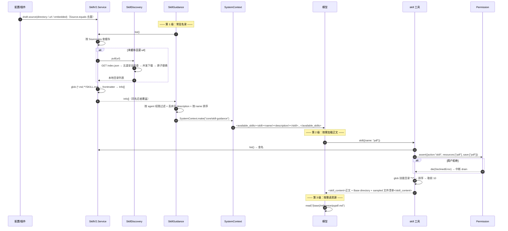

# 15 · 技能系统：三级渐进式披露

源码：`packages/core/src/skill.ts`（132 行）、`skill/discovery.ts`（213 行）、`skill/guidance.ts`（76 行）、`tool/skill.ts`（109 行）、`packages/schema/src/skill.ts`（55 行）、`config/plugin/skill.ts`、`plugin/skill.ts`、`config/markdown.ts`

---

## 1. 解决什么问题

你有 50 篇「怎么做某类任务」的操作手册（写 PDF、改数据库迁移、发版流程……）。三条朴素路线都不行：

| 做法 | 问题 |
| --- | --- |
| 全塞进 system prompt | 50 × 2000 字 = 10 万 token，一句话都还没说就把窗口吃光 |
| 让模型自己去 `read` 文档 | 模型不知道有哪些文档、叫什么、什么时候该读 |
| 做成 RAG 检索 | 要维护向量库；召回不稳定；模型无法「知道自己有什么能力」 |

opencode 的答案是**三级渐进式披露**（progressive disclosure）：

```
第 1 级：system context 里只放 <name> + <description>          ← 每个技能约 30–80 token
              ↓ 模型判断任务匹配某个 description
第 2 级：调 skill 工具，把 SKILL.md 正文注入对话                ← 按需，一次几百到几千 token
              ↓ 正文里写着 "详见 reference/api.md"
第 3 级：模型用 read 工具读技能目录下的具体文件                 ← 按需，模型自己决定
```

**只有第 1 级是常驻成本。** 50 个技能的常驻开销约 2–4k token，而不是 10 万。

这个设计的另一半好处是**可解释**：模型明确知道自己有哪些能力、边界在哪，而不是靠检索碰运气。

---

## 2. 概念模型与不变量

**Source（技能来源）**：三种 —— `directory`（本地目录）、`url`（远程索引）、`embedded`（代码内置）。
**Info（技能）**：`{name, description?, slash?, location, content}`。
**Guidance**：把「可用技能名录」渲染成一个 Context Source（第 01 章）。

不变量：

1. **K1** 同名技能后加载的覆盖先加载的（`Map.set` 语义）。
2. **K2** 只有带 `description` 的技能才进 system context —— 没描述模型无法判断何时用。
3. **K3** 技能列表变化时，通过 Context Source 的 `update` 渲染告诉模型「列表已替换」，而不是发 diff。
4. **K4** 技能受权限系统管控，动作名为 `skill`，资源为技能名。
5. **K5** 远程技能的下载路径必须限制在缓存目录内，且资源 URL 必须同源。
6. **K6** 远程技能版本更新是原子替换（staging → rename → 删备份），失败可回滚。
7. **K7** 加载后按 source key 缓存，进程内不重复读盘。
8. **K8** 技能正文注入时附带**采样的**文件清单（最多 10 个），并明确告诉模型这是采样。

---

## 3. 数据结构定义

### 3.1 原样摘录

```ts
export const DirectorySource = Schema.Struct({
  type: Schema.Literal("directory"),
  path: AbsolutePath,
})
export const UrlSource = Schema.Struct({
  type: Schema.Literal("url"),
  url: Schema.String,
})
export const Info = Schema.Struct({
  name: Schema.String,
  description: Schema.String.pipe(optional),
  slash: Schema.Boolean.pipe(optional),
  location: AbsolutePath,
  content: Schema.String,
})
export const EmbeddedSource = Schema.Struct({
  type: Schema.Literal("embedded"),
  skill: Schema.suspend(() => Info),
})

export type Source = DirectorySource | UrlSource | EmbeddedSource
export const Source = Object.assign(
  Schema.Union([DirectorySource, UrlSource, EmbeddedSource]).pipe(Schema.toTaggedUnion("type"), ...),
  {
    equals: (a: Source, b: Source) => {
      if (a.type !== b.type) return false
      if (a.type === "directory" && b.type === "directory") return a.path === b.path
      if (a.type === "url" && b.type === "url") return a.url === b.url
      if (a.type === "embedded" && b.type === "embedded") return a.skill.name === b.skill.name
      return false
    },
    key: (source: Source) =>
      source.type === "directory" ? `directory:${source.path}`
      : source.type === "url" ? `url:${source.url}`
      : `embedded:${source.skill.name}`,
  },
)
```
> `packages/schema/src/skill.ts:7-55`

**`equals` 和 `key` 挂在 schema 对象上**：前者用于注册去重，后者用于加载缓存的键。这两个函数是 K1 和 K7 的实现基础。

技能文件的 frontmatter：

```ts
const Frontmatter = Schema.Struct({
  name: Schema.String.pipe(Schema.optional),
  description: Schema.String.pipe(Schema.optional),
  slash: Schema.Boolean.pipe(Schema.optional),
})
```
> `packages/core/src/skill.ts:33-37`

**三个字段全部可选。** `name` 缺失时从文件名推导；`description` 缺失时技能仍可被 `skill` 工具加载，但**不会出现在 system context 里**（K2）；`slash` 标记这个技能可以作为斜杠命令直接触发。

### 3.2 等价纯 TS 版

```ts
export type SkillSource =
  | { type: "directory"; path: string }
  | { type: "url"; url: string }
  | { type: "embedded"; skill: SkillInfo }

export interface SkillInfo {
  name: string
  description?: string          // 缺失 = 不进 system context
  slash?: boolean               // 可作为斜杠命令
  location: string              // SKILL.md 的绝对路径
  content: string               // 去掉 frontmatter 的正文
}

export const sourceKey = (s: SkillSource) =>
  s.type === "directory" ? `directory:${s.path}`
  : s.type === "url" ? `url:${s.url}`
  : `embedded:${s.skill.name}`

export const sourceEquals = (a: SkillSource, b: SkillSource) => sourceKey(a) === sourceKey(b)
```

### 3.3 技能文件长什么样

```markdown
---
name: pdf
description: Use this skill whenever the user wants to do anything with PDF files. This includes reading or extracting text/tables from PDFs, combining or merging multiple PDFs, ... If the user mentions a .pdf file or asks to produce one, use this skill.
---

# PDF 处理

## 何时用
...

## 步骤
1. ...
2. 详细的 API 用法见 `reference/pypdf.md`
3. 转换脚本在 `scripts/convert.py`
```

目录结构：

```
skills/
  pdf/
    SKILL.md            ← 必须叫这个名字（或 <目录名>.md）
    reference/
      pypdf.md          ← 第 3 级，模型按需 read
    scripts/
      convert.py
```

**`description` 的写法决定了技能能不能被正确触发。** 看 opencode 内置那个 `customize-opencode` 技能的描述，它是个好模板：

```
Use ONLY when the user is editing or creating opencode's own configuration: opencode.json, opencode.jsonc, files under .opencode/, or files under ~/.config/opencode/. Also use when creating or fixing opencode agents, subagents, commands, skills, plugins, MCP servers, or permission rules. Do not use for the user's own application code, or for any project that is not configuring opencode itself.
```
> `packages/core/src/plugin/skill.ts:22-23`

结构是：**正向触发条件（具体到文件名/路径）+ 补充触发条件 + 明确的排除条件**。三段都不能少——只写正向条件的描述会导致过度触发。

---

## 4. 核心算法

### 4.1 来源注册

来源来自四个地方，全部通过 `draft.source(...)` 注册，`Source.equals` 去重：

```ts
draft: (draft) => ({
  source: (source) => {
    if (draft.sources.some((item) => Source.equals(item, source))) return
    draft.sources.push(source as Types.DeepMutable<Source>)
  },
  list: () => draft.sources as Source[],
}),
```
> `packages/core/src/skill.ts:64-70`

**① 配置目录约定**（每个配置目录下的 `skill/` 和 `skills/` 两个名字都收）：

```ts
const entries = yield* config.entries()
const directories = entries.flatMap((entry) => (entry.type === "directory" ? [entry.path] : []))
const items = entries.flatMap((entry) => (entry.type === "document" ? (entry.info.skills ?? []) : []))
for (const directory of directories) {
  draft.source(SkillV2.DirectorySource.make({ type: "directory", path: AbsolutePath.make(path.join(directory, "skill")) }))
  draft.source(SkillV2.DirectorySource.make({ type: "directory", path: AbsolutePath.make(path.join(directory, "skills")) }))
}
```
> `packages/core/src/config/plugin/skill.ts:20-33`

**② 配置显式声明**（`opencode.json` 的 `skills` 数组，支持 URL、`~/` 展开、相对路径）：

```ts
for (const item of items) {
  if (URL.canParse(item) && /^(https?:)$/.test(new URL(item).protocol)) {
    draft.source(SkillV2.UrlSource.make({ type: "url", url: item }))
    continue
  }
  const expanded = item.startsWith("~/") ? path.join(global.home, item.slice(2)) : item
  draft.source(SkillV2.DirectorySource.make({
    type: "directory",
    path: AbsolutePath.make(path.isAbsolute(expanded) ? expanded : path.join(location.directory, expanded)),
  }))
}
```
> `config/plugin/skill.ts:34-46`

**只接受 `http:` / `https:`**——不做这个校验，`file://` 或自定义协议会变成任意文件读取。

**③ 代码内置**（`embedded`）：

```ts
draft.source(SkillV2.EmbeddedSource.make({
  type: "embedded",
  skill: SkillV2.Info.make({
    name: "customize-opencode",
    description: "...",
    location: AbsolutePath.make("/builtin/customize-opencode.md"),
    content: CustomizeOpencodeContent,       // import ... with { type: "text" }
  }),
}))
```
> `packages/core/src/plugin/skill.ts:16-28`

内置技能用一个**假的绝对路径**（`/builtin/...`）作为 location。因为 `location` 的用途只有两个：作为 `path.dirname` 求技能目录、判断文件名是不是 `SKILL.md`。假路径两者都能正确工作（`skill` 工具会因为文件名不是 `SKILL.md` 而跳过文件清单枚举）。

**④ 插件动态注册**（`packages/core/src/plugin/host.ts:213`）。

### 4.2 加载与解析

```ts
const load = Effect.fn("SkillV2.load")(function* (source: Source) {
  const skills: Info[] = []
  if (source.type === "embedded") return [source.skill]
  const directories = source.type === "directory" ? [source.path] : yield* discovery.pull(source.url)
  for (const directory of directories) {
    const files = yield* fs
      .glob("{*.md,**/SKILL.md}", { cwd: directory, absolute: true, include: "file", symlink: true, dot: true })
      .pipe(Effect.catch(() => Effect.succeed([] as string[])))
    for (const filepath of files.toSorted()) {
      const content = yield* fs.readFileStringSafe(filepath).pipe(Effect.catch(() => Effect.succeed(undefined)))
      if (!content) continue
      const markdown = ConfigMarkdown.parseOption(content)
      if (!markdown) continue
      const frontmatter = decodeFrontmatter(markdown.data).valueOrUndefined
      if (!frontmatter) continue
      const name =
        frontmatter.name !== undefined
          ? frontmatter.name
          : path.dirname(filepath) === directory
            ? path.basename(filepath, ".md")
            : undefined
      if (!name) continue
      skills.push({
        name,
        description: frontmatter.description,
        slash: frontmatter.slash,
        location: AbsolutePath.make(filepath),
        content: markdown.content,
      })
    }
  }
  return skills
})
```
> `packages/core/src/skill.ts:73-105`

**glob 模式 `{*.md,**/SKILL.md}` 支持两种布局**：

| 布局 | 匹配 | name 来源 |
| --- | --- | --- |
| `skills/pdf.md`（扁平） | `*.md` | 文件名去扩展名（`pdf`）或 frontmatter |
| `skills/pdf/SKILL.md`（目录） | `**/SKILL.md` | **必须**由 frontmatter 提供 |

**为什么目录布局必须写 `name`**：`path.dirname(filepath) === directory` 这个判断只对扁平布局成立。子目录里的 `SKILL.md` 如果没写 `name`，`basename` 会得到 `"SKILL"`——那显然不是技能名。所以直接 `continue` 跳过，逼你写 `name`。

**每一步失败都是 `continue`，不是抛错**：glob 失败返回空数组、读文件失败跳过、frontmatter 解析失败跳过、缺 name 跳过。**一个坏技能文件不能让整个技能系统瘫痪。**

**`toSorted()`** 保证同一目录内加载顺序确定（K1 的覆盖语义才有意义）。

frontmatter 解析用 `gray-matter`，且带一个容错层：

```ts
export function parse(content: string) {
  try { return matter(content) } catch { return matter(sanitize(content)) }
}

// Other coding agents accept unquoted colons in frontmatter values. Retry
// those values as YAML block scalars so existing config files keep working.
export function sanitize(content: string) {
  const match = content.match(/^---\r?\n([\s\S]*?)\r?\n---/)
  if (!match) return content
  const frontmatter = match[1]
  const result = frontmatter.split(/\r?\n/).flatMap((line) => {
    if (line.trim().startsWith("#") || line.trim() === "" || /^\s+/.test(line)) return [line]
    const entry = line.match(/^([a-zA-Z_][a-zA-Z0-9_]*)\s*:\s*(.*)$/)
    if (!entry) return [line]
    const value = entry[2].trim()
    if (value === "" || value === ">" || value === "|" || value.startsWith('"') || value.startsWith("'")) return [line]
    if (!value.includes(":")) return [line]
    return [`${entry[1]}: |-`, `  ${value}`]     // 转成 YAML block scalar
  })
  return content.replace(frontmatter, () => result.join("\n"))
}
```
> `packages/core/src/config/markdown.ts:4-36`

**这段非常实用**：技能描述里经常出现冒号（`Use when: the user...`），标准 YAML 会解析失败。这个 sanitizer 把带未引号冒号的值自动转成 block scalar 再重试。抄技能系统时**一定要带上这一层**，否则用户写的第一个技能就会因为一个冒号加载失败。

### 4.3 缓存（K7）

```ts
// QUESTION(Dax): Should local skill sources invalidate on filesystem watch
// events, following the reload policy chosen for other context sources?
const cache = new Map<string, Info[]>()
const list = Effect.fn("SkillV2.list")(function* () {
  const skills = new Map<string, Info>()
  for (const source of state.get().sources) {
    const key = Source.key(source)
    const loaded = cache.get(key) ?? (yield* load(source))
    cache.set(key, loaded)
    for (const skill of loaded) skills.set(skill.name, skill)     // K1：后者覆盖
  }
  return Array.from(skills.values())
})
```
> `packages/core/src/skill.ts:107-119`

**注意源码里那条 QUESTION 注释**——本地技能目录目前**不做文件监听失效**，进程生命周期内缓存。改了 SKILL.md 要重启才生效。这是当前实现的已知取舍，你自己实现时可以选择加 watcher（代价是要处理 Context Source 的重新 reconcile）。

### 4.4 权限过滤（K4）

```ts
export const available = (skills: ReadonlyArray<Info>, agent: AgentV2.Info) =>
  skills.filter((skill) => PermissionV2.evaluate("skill", skill.name, agent.permissions).effect !== "deny")
```
> `packages/core/src/skill.ts:30-31`

用第 14 章的权限规则模型，动作 `skill`、资源 = 技能名。配置示例：

```jsonc
{
  "agent": {
    "docs-writer": {
      "permissions": [
        { "action": "skill", "resource": "*", "effect": "deny" },
        { "action": "skill", "resource": "docx", "effect": "allow" },
        { "action": "skill", "resource": "pdf", "effect": "allow" }
      ]
    }
  }
}
```

**注意这里用 `!== "deny"`**，也就是 `ask` 也算可用。技能出现在名录里，真正加载时 `skill` 工具再走一次 `permission.assert`，那时才会弹窗。

### 4.5 Guidance：把名录变成 Context Source

```ts
const render = (skills: ReadonlyArray<Summary>) =>
  [
    "Skills provide specialized instructions and workflows for specific tasks.",
    "Use the skill tool to load a skill when a task matches its description.",
    ...(skills.length === 0
      ? ["No skills are currently available."]
      : [
          "<available_skills>",
          ...skills.flatMap((skill) => [
            "  <skill>",
            `    <name>${skill.name}</name>`,
            `    <description>${skill.description}</description>`,
            "  </skill>",
          ]),
          "</available_skills>",
        ]),
  ].join("\n")
```
> `packages/core/src/skill/guidance.ts:16-32`

```ts
load: Effect.fn("SkillGuidance.load")(function* (selection) {
  const agent = selection.info
  if (!agent) return SystemContext.empty
  const permitted = SkillV2.available(yield* skills.list(), agent)
  if (permitted.length === 0 && PermissionV2.evaluate("skill", "*", agent.permissions).effect === "deny")
    return SystemContext.empty
  const available = permitted
    .flatMap((skill) => (skill.description === undefined ? [] : [{ name: skill.name, description: skill.description }]))
    .toSorted((a, b) => a.name.localeCompare(b.name))
  return SystemContext.make({
    key: SystemContext.Key.make("core/skill-guidance"),
    codec: Schema.toCodecJson(Schema.Array(Summary)),
    load: Effect.succeed(available),
    baseline: render,
    update: (_previous, current) =>
      ["The available skills have changed. This list supersedes the previous available skills list.", render(current)].join("\n"),
    removed: () => "Skill guidance is no longer available. Do not use any previously listed skill.",
  })
})
```
> `skill/guidance.ts:46-69`

五个细节：

1. **`description === undefined` 的技能被过滤掉**（K2）。它们仍可被 `skill` 工具按名加载，只是模型不会主动知道。
2. **按 name 字典序排序**——第 01 章 I2（渲染确定性）的要求。技能加载顺序变化不能导致 baseline 文本抖动、缓存失效。
3. **空名录也渲染**（`"No skills are currently available."`），而不是返回 `empty`。因为「明确告知没有技能」比「什么都不说」更能防止模型幻觉出一个 skill 调用。
4. **只有 agent 完全禁用 skill 时才返回 `SystemContext.empty`**——此时连「有技能系统」这件事都不告诉模型。
5. **`update` 全量重发 + 明说「supersedes」**（K3）。和第 01 章的 `AGENTS.md` 来源一样：名录是**枚举**，发 diff 会让模型不确定最终有哪些。

**这就是为什么切换 agent 会自动触发一条系统消息**：`load(agent)` 依赖 agent 的权限规则，换 agent → 可用技能集变化 → 下一个安全边界上 `reconcile` 检测到 → 发一条「available skills have changed」。整个链路不需要任何 agent 切换的专门代码。

### 4.6 `skill` 工具：第 2 级披露

```ts
export const toModelOutput = (skill: SkillV2.Info, files: ReadonlyArray<string>) => {
  const directory = path.dirname(skill.location)
  return [
    `<skill_content name="${skill.name}">`,
    `# Skill: ${skill.name}`,
    "",
    skill.content.trim(),
    "",
    `Base directory for this skill: ${directory}`,
    "Relative paths in this skill (e.g., scripts/, reference/) are relative to this base directory.",
    "Note: file list is sampled.",
    "",
    "<skill_files>",
    ...files.map((file) => `<file>${file}</file>`),
    "</skill_files>",
    "</skill_content>",
  ].join("\n")
}
```
> `packages/core/src/tool/skill.ts:35-52`

**这段输出模板是第 3 级披露的桥梁**，四个要素缺一不可：

| 要素 | 作用 |
| --- | --- |
| `Base directory for this skill: /abs/path` | 模型知道去哪读文件 |
| `Relative paths ... are relative to this base directory` | 明确相对路径的基准，否则模型会用 cwd 拼 |
| `Note: file list is sampled.` | **告诉模型清单不完整**，避免它认定「没列出的文件不存在」 |
| `<skill_files>` 清单 | 让模型知道有什么可读，不用瞎猜文件名 |

执行体：

```ts
execute: (input, context) =>
  Effect.gen(function* () {
    const current = yield* skills.list()
    const skill = current.find((skill) => skill.name === input.name)
    if (!skill) return yield* unableToLoad(input.name)
    return yield* Effect.gen(function* () {
      yield* permission.assert({
        action: name,                              // "skill"
        resources: [skill.name],
        save: [skill.name],                        // 只记住这一个技能
        sessionID: context.sessionID,
        agent: context.agent,
        source: { type: "tool", messageID: context.assistantMessageID, callID: context.toolCallID },
      })
      const directory = path.dirname(skill.location)
      const files =
        path.basename(skill.location) === "SKILL.md"
          ? (yield* fs.glob("**/*", { cwd: directory, absolute: true, include: "file", dot: true }))
              .filter((file) => path.basename(file) !== "SKILL.md")
              .toSorted()
              .slice(0, FILE_LIMIT)                // FILE_LIMIT = 10
          : []
      return { name: skill.name, directory, output: toModelOutput(skill, files) }
    }).pipe(Effect.mapError((error) => unableToLoad(input.name, error)))
  }),
```
> `tool/skill.ts:70-98`

- **`FILE_LIMIT = 10`**（`tool/skill.ts:15`）：清单最多 10 个文件，配合 `Note: file list is sampled.`。技能目录可能有几百个文件，全列会把第 2 级的成本推回第 1 级的量级。
- **只对 `SKILL.md` 布局枚举文件**：扁平布局（`pdf.md`）没有专属目录，枚举会把整个 skills 目录列出来。
- **`save: [skill.name]`**：用户点「总是允许」只记住这一个技能，不是所有技能。

### 4.7 远程技能拉取（`url` 来源）

远程来源要下载到本地缓存目录。这是**唯一涉及网络 + 写盘的路径**，安全约束最多。

**索引格式**：

```ts
class IndexSkill extends Schema.Class<IndexSkill>("SkillDiscovery.IndexSkill")({
  name: Schema.String,
  version: Schema.optional(Schema.String),
  files: Schema.Array(Schema.String),
}) {}
class Index extends Schema.Class<Index>("SkillDiscovery.Index")({ skills: Schema.Array(IndexSkill) }) {}
```
> `packages/core/src/skill/discovery.ts:55-63`

`GET {url}/index.json`：

```json
{
  "skills": [
    { "name": "pdf", "version": "1.2.0", "files": ["SKILL.md", "reference/pypdf.md", "scripts/convert.py"] }
  ]
}
```

**五道安全检查（K5）：**

```ts
function isSafeSegment(value: string) {
  return value.length > 0 && value !== "." && value !== ".." &&
    !value.includes("/") && !value.includes("\\") && !value.includes("\0")
}

function isSafeRelativePath(value: string) {
  const segments = value.split("/")
  return value.length > 0 && !value.includes("\\") && !value.includes("\0") &&
    !value.includes("?") && !value.includes("#") && !URL.canParse(value) &&
    !path.posix.isAbsolute(value) && !path.win32.isAbsolute(value) &&
    segments.every((segment) => {
      try {
        const decoded = decodeURIComponent(segment)      // ← 解码后再查，防 %2e%2e
        return decoded.length > 0 && decoded !== "." && decoded !== ".." &&
          !decoded.includes("/") && !decoded.includes("\\") && !decoded.includes("\0")
      } catch { return false }
    })
}
```
> `skill/discovery.ts:15-53`

| # | 检查 | 挡住什么 |
| --- | --- | --- |
| 1 | `isSafeSegment(skill.name)` | 技能名里的 `..` / `/` → 写到缓存目录外 |
| 2 | `isSafeRelativePath(file)` + **URL 解码后再查** | `%2e%2e%2f` 这类编码的路径穿越 |
| 3 | `resource.origin !== source.origin` → 丢弃 | 索引里塞一个指向别的域名的文件 |
| 4 | `FSUtil.contains(root, destination) && destination !== root` | 解析后仍在技能目录内 |
| 5 | `FSUtil.contains(sourceRoot, root) && root !== sourceRoot` | 技能目录仍在缓存根内 |

```ts
const files = skill.files.map((file) => {
  if (!isSafeRelativePath(file)) return undefined
  let resource: URL
  try { resource = new URL(file, skillUrl) } catch { return undefined }
  if (resource.origin !== source.origin) return undefined                     // ③
  const destination = path.resolve(root, file)
  if (!FSUtil.contains(root, destination) || destination === root) return undefined   // ④
  return { url: resource.href, destination, file }
})
if (files.some((file) => file === undefined)) {
  return []                                                                    // 任一不合法 → 整个技能丢弃
}
```
> `skill/discovery.ts:130-151`

**任一文件不合法就丢弃整个技能**，不是跳过那个文件。半个技能比没有技能更危险。

**还要求索引里必须声明 `SKILL.md` 或 `<name>.md`**：

```ts
if (!skill.files.includes("SKILL.md") && !skill.files.includes(`${skill.name}.md`)) {
  return []
}
```
> `skill/discovery.ts:119-121`

**缓存根按 URL 哈希分桶**：

```ts
const sourceRoot = path.resolve(global.cache, "skills", Bun.hash(base).toString(16))
```
> `skill/discovery.ts:113`

不同来源的同名技能不会互相覆盖。

**原子版本更新（K6）：**

```ts
const version = skill.version
const current = version === undefined ? undefined
  : yield* fs.readFileStringSafe(versionFile).pipe(Effect.catch(() => Effect.succeed(undefined)))

if (version === undefined || current === version) {
  // 无版本或版本未变 → 只补缺失的文件（download 里 exists 就跳过）
  yield* Effect.forEach(files, (file) => download(file.url, file.destination),
    { concurrency: fileConcurrency, discard: true })
} else {
  const token = crypto.randomUUID()
  const staging = `${root}.tmp-${token}`
  const backup = `${root}.old-${token}`
  yield* Effect.gen(function* () {
    const downloaded = yield* Effect.forEach(files, (file) => download(file.url, path.resolve(staging, file.file)),
      { concurrency: fileConcurrency })
    if (!downloaded.every(Boolean)) return                        // 有文件下载失败 → 放弃，保留旧版本
    const exists = (yield* fs.exists(path.join(staging, "SKILL.md"))) ||
                   (yield* fs.exists(path.join(staging, `${skill.name}.md`)))
    if (!exists) return                                            // 没有入口文件 → 放弃
    yield* fs.writeFileString(path.join(staging, ".opencode-version"), version)
    yield* Effect.uninterruptible(
      Effect.gen(function* () {
        const cached = yield* fs.exists(root)
        if (cached) yield* fs.rename(root, backup)                 // 旧的挪走
        yield* fs.rename(staging, root).pipe(                      // 新的就位
          Effect.catch((error) =>
            Effect.gen(function* () {
              if (cached) yield* fs.rename(backup, root).pipe(Effect.ignore)   // 失败回滚
              return yield* Effect.fail(error)
            }),
          ),
        )
        if (cached) yield* fs.remove(backup, { recursive: true, force: true }).pipe(Effect.ignore)
      }),
    )
  }).pipe(
    Effect.catch((error) => Effect.logError("failed to refresh skill", { skill: skill.name, error })),
    Effect.ensuring(fs.remove(staging, { recursive: true, force: true }).pipe(Effect.ignore)),   // 总是清理 staging
  )
}
```
> `skill/discovery.ts:153-200`

标准的 staging + rename + rollback，加上 `Effect.ensuring` 保证 staging 目录一定被清理。整个块 `catch` 后只记日志——**远程技能更新失败不能让会话起不来**。

并发与重试参数：

```ts
const skillConcurrency = 4     // 同时处理 4 个技能
const fileConcurrency = 8      // 每个技能内同时下 8 个文件
```
> `skill/discovery.ts:12-13`

```ts
const http = (yield* HttpClient.HttpClient).pipe(
  HttpClient.retryTransient({
    retryOn: "errors-and-responses",
    times: 2,
    schedule: Schedule.exponential(200).pipe(Schedule.jittered),
  }),
  HttpClient.filterStatusOk,
)
```
> `skill/discovery.ts:76-83`

重试 2 次，指数退避从 200ms 起，**带 jitter**（多个技能同时失败时不会同步重试打爆服务器）。

`download` 的短路：

```ts
const download = Effect.fn("SkillDiscovery.download")(function* (url: string, destination: string) {
  if (yield* fs.exists(destination).pipe(Effect.orDie)) return true       // 已存在直接跳过
  return yield* HttpClientRequest.get(url).pipe(...)
})
```
> `skill/discovery.ts:85-96`

---

## 5. 时序



---

## 6. 边界情况与失败模式

| 场景 | opencode 怎么处理 | 你自己实现时必须处理 |
| --- | --- | --- |
| 技能文件 frontmatter 里有未引号的冒号 | `sanitize()` 转成 YAML block scalar 后重试 | 用户写的第一个技能就加载失败 |
| 某个技能文件损坏 | `continue` 跳过，其余照常 | 一个坏文件让整个技能系统瘫痪 |
| 子目录 `SKILL.md` 没写 `name` | 跳过（不会得到 `"SKILL"` 这个名字） | 出现一个叫 SKILL 的假技能 |
| 技能没写 `description` | 不进 system context，但可按名加载 | 模型不知道何时该用它却又占着 token |
| 两个来源有同名技能 | 后加载的覆盖（`Map.set`） | 静默产生歧义 |
| 技能名录为空 | 仍渲染 `"No skills are currently available."` | 模型可能幻觉出 skill 调用 |
| agent 完全禁用 skill | 返回 `SystemContext.empty`，连系统本身都不提 | 白占 token |
| 切换 agent 导致可用技能变化 | Context Source 的 `update` 自动发一条「列表已替换」 | 模型继续用已失效的技能 |
| 改了 SKILL.md | **当前实现要重启**（进程内缓存，源码有 QUESTION 注释） | 想热更新就要加 watcher + 缓存失效 |
| 远程索引里技能名含 `..` | `isSafeSegment` 拒绝 | 写到缓存目录外 |
| 远程文件路径是 `%2e%2e%2f` | 解码后再查 | 编码穿越 |
| 远程文件指向别的域名 | `origin` 比对 | 索引可以让你下载任意 URL |
| 远程技能某个文件下载失败 | 整个技能放弃更新，保留旧版本 | 半个技能被装上 |
| 远程更新时 rename 失败 | 回滚 backup | 技能目录变空 |
| staging 目录残留 | `Effect.ensuring` 总是清理 | 缓存目录无限增长 |
| 远程服务不可用 | 记日志，返回空数组 | 会话起不来 |
| 技能目录有 500 个文件 | 清单只取前 10 + 标注 sampled | 第 2 级成本爆炸 |
| 扁平布局技能枚举文件 | 只对 `SKILL.md` 布局枚举 | 把整个 skills 目录列进去 |
| 技能正文里的相对路径 | 输出里显式声明 base directory | 模型用 cwd 拼，读不到 |

---

## 7. 移植到你自己的项目

### 7.1 最小可用版（只做本地目录）

```ts
import matter from "gray-matter"
import fg from "fast-glob"
import fs from "node:fs/promises"
import path from "node:path"

export interface SkillInfo { name: string; description?: string; location: string; content: string }

function sanitizeFrontmatter(content: string) {
  const m = content.match(/^---\r?\n([\s\S]*?)\r?\n---/)
  if (!m) return content
  const fmText = m[1]
  const out = fmText.split(/\r?\n/).flatMap((line) => {
    if (line.trim().startsWith("#") || line.trim() === "" || /^\s+/.test(line)) return [line]
    const e = line.match(/^([a-zA-Z_][a-zA-Z0-9_]*)\s*:\s*(.*)$/)
    if (!e) return [line]
    const v = e[2].trim()
    if (v === "" || v === ">" || v === "|" || v.startsWith('"') || v.startsWith("'")) return [line]
    if (!v.includes(":")) return [line]
    return [`${e[1]}: |-`, `  ${v}`]
  })
  return content.replace(fmText, () => out.join("\n"))
}

const parseMd = (content: string) => {
  try { return matter(content) } catch { try { return matter(sanitizeFrontmatter(content)) } catch { return undefined } }
}

export async function loadSkillsFromDirectory(directory: string): Promise<SkillInfo[]> {
  let files: string[] = []
  try {
    files = await fg(["*.md", "**/SKILL.md"], { cwd: directory, absolute: true, onlyFiles: true, dot: true })
  } catch { return [] }
  const out: SkillInfo[] = []
  for (const filepath of files.sort()) {
    let content: string
    try { content = await fs.readFile(filepath, "utf8") } catch { continue }
    const md = parseMd(content)
    if (!md) continue
    const fm = md.data as { name?: string; description?: string }
    const name = fm.name ?? (path.dirname(filepath) === directory ? path.basename(filepath, ".md") : undefined)
    if (!name) continue
    out.push({ name, description: fm.description, location: filepath, content: md.content })
  }
  return out
}

/** 同名后者覆盖 */
export async function listSkills(directories: string[]): Promise<SkillInfo[]> {
  const map = new Map<string, SkillInfo>()
  for (const dir of directories) for (const s of await loadSkillsFromDirectory(dir)) map.set(s.name, s)
  return [...map.values()]
}
```

名录渲染（第 1 级）：

```ts
export function renderSkillGuidance(skills: SkillInfo[]) {
  const listed = skills
    .filter((s) => s.description !== undefined)
    .sort((a, b) => a.name.localeCompare(b.name))
  return [
    "Skills provide specialized instructions and workflows for specific tasks.",
    "Use the skill tool to load a skill when a task matches its description.",
    ...(listed.length === 0
      ? ["No skills are currently available."]
      : ["<available_skills>",
         ...listed.flatMap((s) => ["  <skill>", `    <name>${s.name}</name>`,
                                   `    <description>${s.description}</description>`, "  </skill>"]),
         "</available_skills>"]),
  ].join("\n")
}
```

skill 工具（第 2 级）：

```ts
const FILE_LIMIT = 10

export const skillTool = makeTool({
  description: [
    "Load a specialized skill when the task at hand matches one of the available skills in the system context.",
    "",
    "Use this tool to inject the skill's instructions and resources into the current conversation. The output may contain detailed workflow guidance as well as references to scripts, files, etc. in the same directory as the skill.",
    "",
    "The skill name must match one of the available skills in the system context.",
  ].join("\n"),
  input: z.object({ name: z.string().describe("The name of the skill from the available skills list") }),
  output: z.object({ name: z.string(), directory: z.string(), output: z.string() }),
  toModelOutput: ({ output }) => [{ type: "text", text: output.output }],
  async execute(input, ctx) {
    const skill = (await listSkills(dirs)).find((s) => s.name === input.name)
    if (!skill) throw new ToolFailure(`Unable to load skill ${input.name}`)
    await assertPermission({ sessionId: ctx.sessionId, action: "skill",
                             resources: [skill.name], save: [skill.name], source: {...} })
    const directory = path.dirname(skill.location)
    const files = path.basename(skill.location) === "SKILL.md"
      ? (await fg("**/*", { cwd: directory, absolute: true, onlyFiles: true, dot: true }))
          .filter((f) => path.basename(f) !== "SKILL.md").sort().slice(0, FILE_LIMIT)
      : []
    return {
      name: skill.name,
      directory,
      output: [
        `<skill_content name="${skill.name}">`,
        `# Skill: ${skill.name}`, "",
        skill.content.trim(), "",
        `Base directory for this skill: ${directory}`,
        "Relative paths in this skill (e.g., scripts/, reference/) are relative to this base directory.",
        "Note: file list is sampled.", "",
        "<skill_files>", ...files.map((f) => `<file>${f}</file>`), "</skill_files>",
        "</skill_content>",
      ].join("\n"),
    }
  },
})
```

### 7.2 落地步骤

1. 定 `SkillInfo` 和 `SkillSource`（§3.2）。
2. 实现 frontmatter 解析 + **sanitize 容错层**（§7.1，别省）。
3. 实现 `loadSkillsFromDirectory`：glob `{*.md,**/SKILL.md}`，逐步失败即跳过，`sort()` 保序。
4. 实现 `listSkills`：按 source key 缓存，同名后者覆盖。
5. 实现 `renderSkillGuidance`：过滤无 description、按 name 排序、空名录也渲染。
6. 把它接成一个 Context Source（第 01 章）：`baseline` = render，`update` = 「supersedes」+ render，`removed` = 「不再可用」。
7. 实现 `skill` 工具（§7.1），输出模板四要素全带上。
8. 接权限：动作 `skill`、资源为技能名、`save` 只存该名。
9. 写 2–3 个真实技能验证触发率，重点打磨 `description`（正向 + 补充 + 排除三段）。
10. 需要远程技能时再做 `discovery`，**五道安全检查一条都不能少**。

### 7.3 你需要自己提供的依赖

| 依赖 | 用途 | 建议 |
| --- | --- | --- |
| frontmatter 解析 | SKILL.md 元数据 | `gray-matter` + 自己的 sanitize 层 |
| glob | 技能发现与文件枚举 | `fast-glob`，注意 `dot: true` |
| Context Source | 名录进 system prompt | 第 01 章 |
| 权限系统 | 技能级授权 | 第 14 章 |
| HTTP + 重试 | 远程技能 | 带 jitter 的指数退避 |

---

## 8. 验收清单

- [ ] **K1** 两个目录都有 `pdf` 技能 → 后加载的生效
- [ ] **K2** 无 `description` 的技能 → 不在 `<available_skills>` 里，但 `skill({name})` 能加载
- [ ] **K3** 新增一个技能后下一轮 → 出现一条系统消息，含 `supersedes` 字样和完整新名录
- [ ] **K3** 名录内容不变时 → 不产生系统消息
- [ ] **K4** agent 配 `deny skill *` + `allow skill pdf` → 名录里只有 pdf
- [ ] **K4** agent 完全 `deny skill *` → 名录为 `SystemContext.empty`（system prompt 里完全没有技能段）
- [ ] **K5** 远程索引技能名为 `../evil` → 该技能被丢弃
- [ ] **K5** 远程文件路径为 `%2e%2e%2fevil` → 整个技能被丢弃
- [ ] **K5** 远程文件 URL 指向另一个域名 → 整个技能被丢弃
- [ ] **K5** 索引里没有 `SKILL.md` 也没有 `<name>.md` → 该技能被丢弃
- [ ] **K6** 版本更新时某文件 404 → 旧版本完好保留
- [ ] **K6** rename 失败 → backup 被还原
- [ ] **K6** 任意失败路径下 staging 目录都被清理
- [ ] **K7** 连续调 `list()` 10 次 → 只读盘一次
- [ ] **K8** 技能目录有 50 个文件 → 清单只有 10 个，且输出含 `Note: file list is sampled.`
- [ ] **K8** 扁平布局技能（`pdf.md`）→ 文件清单为空
- [ ] **排序确定性** 打乱来源注册顺序 → 名录文本逐字节相同
- [ ] **容错** frontmatter 值含未引号冒号 → 正常加载
- [ ] **容错** 目录里放一个空的 `.md` → 跳过，其余技能正常
- [ ] **容错** 子目录 `SKILL.md` 无 `name` → 跳过，不产生名为 `SKILL` 的技能
- [ ] **协议校验** 配置里写 `file:///etc` → 不被当作 URL 来源
- [ ] **权限传播** 用户对 pdf 点「总是允许」→ 加载 docx 时仍然询问
- [ ] **输出模板** 加载后的输出含 base directory 绝对路径、相对路径说明、sampled 提示、文件清单四要素
