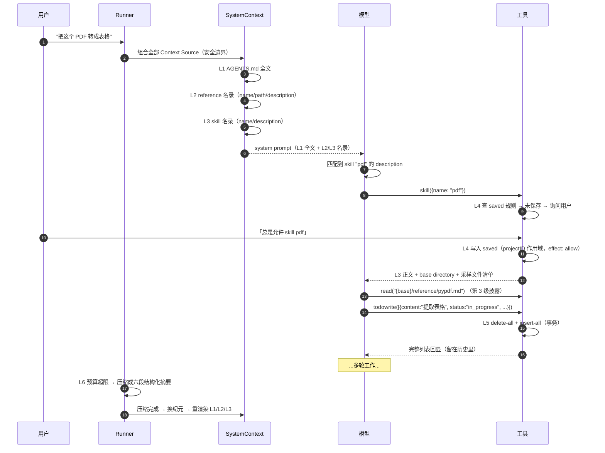

# 16 · 记忆系统：六层记忆及其各自的写入、失效与淘汰

源码：`packages/core/src/instruction-context.ts`（101 行）、`reference.ts`（125 行）、`reference/guidance.ts`（69 行）、`session/todo.ts`（78 行）、`tool/todowrite.ts`（62 行）、`permission/saved.ts`（79 行）、`session/compaction.ts`、`plugin/command/initialize.txt`

---

## 1. 解决什么问题

opencode 里**没有一个叫 "memory" 的模块**。它把记忆拆成了六个各自独立、各有生命周期的机制。这个拆法本身就是最值得抄的东西——因为「AI 的记忆」实际上是六个完全不同的问题，用一个 KV 存储去解会全部解错。

| 层 | 记忆类型 | opencode 实现 | 作用域 | 谁写 | 怎么进上下文 |
| --- | --- | --- | --- | --- | --- |
| **L1** | 程序性记忆（规则） | `AGENTS.md` → `InstructionContext` | 项目 + 全局，跨会话 | 人（或 `/init` 让模型写） | 常驻 system context |
| **L2** | 语义记忆（外部知识） | `Reference`（本地目录 / git 仓库） | 项目，跨会话 | 人（配置） | 名录常驻，内容按需 `read` |
| **L3** | 技能记忆（可执行流程） | `Skill`（第 15 章） | 全局 + 项目，跨会话 | 人（写 SKILL.md） | 名录常驻，正文按需加载 |
| **L4** | 决策记忆（用户偏好） | `PermissionSaved` | 项目，跨会话 | 用户点「总是允许」 | 不进上下文，只影响授权判定 |
| **L5** | 工作记忆（当前任务） | `SessionTodo` | 会话 | 模型（`todowrite` 工具） | 不进 system context，UI 独立展示 |
| **L6** | 情景记忆（对话本身） | 消息历史 + `compaction` 摘要 | 会话 | 系统自动 | 就是历史本身 |

**贯穿全书的一条判断**：不同记忆的「进入上下文的方式」必须不同。L1 必须常驻（否则规则失效），L2/L3 必须是「名录常驻 + 内容按需」（否则爆窗口），L4 根本不该进上下文（它是判定规则不是知识），L5 进 UI 不进 prompt，L6 靠压缩控制。

---

## 2. 不变量

1. **M1** L1（规则类）变化时**全量重发**，绝不发 diff。
2. **M2** L2/L3 的名录进上下文，内容不进；内容通过工具按需拉取。
3. **M3** L4 只能是 `allow`，不能提权绕过 agent 的 `deny`（第 14 章 §5.2）。
4. **M4** L5 是全量替换语义，不是增量追加。
5. **M5** 每一层「观测失败」和「观测到空」必须区分（第 01 章 I5）。
6. **M6** 跨会话的层（L1–L4）都以**项目**为作用域边界，不是会话。

---

## 3. L1 · 程序性记忆：`AGENTS.md`

### 3.1 发现规则

```ts
const observe = Effect.fn("InstructionContext.observe")(function* () {
  const start = yield* fs.resolve(location.directory)
  const stop = yield* fs.resolve(location.project.directory)
  const fromProject = relative(stop, start)
  const insideProject =
    fromProject === "" || (fromProject !== ".." && !fromProject.startsWith(`..${sep}`) && !isAbsolute(fromProject))
  const discovered = new Set(
    yield* Effect.forEach(
      Flag.OPENCODE_DISABLE_PROJECT_CONFIG || !insideProject
        ? []
        : yield* fs.up({ targets: ["AGENTS.md"], start, stop }),      // 从当前目录向上扫到项目根
      fs.resolve,
    ),
  )
  const paths = Array.dedupe([yield* fs.resolve(join(global.config, "AGENTS.md")), ...discovered])
  const files = yield* Effect.forEach(
    paths,
    (path) => fs.readFileStringSafe(path).pipe(
      Effect.map((content) => (content === undefined ? undefined : new File({ path: AbsolutePath.make(path), content }))),
    ),
    { concurrency: "unbounded" },
  )
  if (files.some((file, index) => file === undefined && discovered.has(paths[index])))
    return SystemContext.unavailable                                  // M5
  return files.filter((file): file is File => file !== undefined)
})
```
> `packages/core/src/instruction-context.ts:40-74`

**扫描规则**：

1. 全局 `~/.config/opencode/AGENTS.md`（永远尝试）
2. 从当前工作目录**向上逐级**扫到项目根，每一级的 `AGENTS.md` 都收
3. `Array.dedupe` 去重，全局的排在最前
4. 有环境变量 `OPENCODE_DISABLE_PROJECT_CONFIG` 或当前目录不在项目内 → 跳过第 2 步

**M5 的精确实现**：`files.some((file, index) => file === undefined && discovered.has(paths[index]))`

- 全局文件不存在 → **正常**（`discovered` 里没有它），返回空数组
- 向上扫描**明确发现了**某个 `AGENTS.md`、读它却失败 → **`unavailable`**

前者是「成功观测到不存在」，后者是「观测失败」。这两者在第 01 章的 Context Source 语义里是完全不同的处理路径：前者会渲染 `removed` 或不渲染，后者会保留上次已告知模型的状态、不发任何更新。

### 3.2 渲染（M1）

```ts
const source = (value: ReadonlyArray<File> | SystemContext.Unavailable) =>
  SystemContext.make({
    key,                                                   // "core/instructions"
    codec: Schema.toCodecJson(Files),
    load: Effect.succeed(value),
    baseline: render,
    update: (_previous, current) =>
      `These instructions replace all previously loaded ambient instructions.\n\n${render(current)}`,
    removed: () => "Previously loaded instructions no longer apply.",
  })

function render(files: ReadonlyArray<File>) {
  return files.map((file) => `Instructions from: ${file.path}\n${file.content}`).join("\n\n")
}
```
> `instruction-context.ts:29-38, 99-101`

**`update` 全量重发**（M1），措辞是 `These instructions replace all previously loaded ambient instructions.`

**为什么规则类记忆不能发 diff**：指令是命令式的。发「删除了第 3 条」这样的 diff，模型需要自己在脑子里重建最终状态，而且历史里同时存在旧版本和 diff，模型不确定该听哪个。全量重发 + 明说「取代之前所有」是唯一可靠的做法。

**同样的模式在第 15 章的技能名录、reference 名录上重复出现**——凡是「枚举 / 规则」类的上下文来源，全部是全量重发 + supersedes 措辞。

**注册时的三态**：

```ts
yield* registry.register({
  key,
  load: observe().pipe(
    Effect.map((files) =>
      files === SystemContext.unavailable
        ? source(files)                                    // 不可用
        : files.length === 0
          ? SystemContext.empty                            // 确认没有 → 整个来源不存在
          : source(files),                                 // 有内容
    ),
    Effect.catch(() => Effect.succeed(source(SystemContext.unavailable))),
    Effect.catchDefect(() => Effect.succeed(source(SystemContext.unavailable))),
  ),
})
```
> `instruction-context.ts:76-89`

**零个文件时返回 `SystemContext.empty` 而不是空内容的 source**。区别在于：前者让这个 key 从快照里消失（走 `removed` 渲染路径），后者会在 system prompt 里留下一段空的 "Instructions from:" 。

**任何异常和 defect 都兜底成 `unavailable`**，绝不让指令加载失败把整轮请求打挂。

### 3.3 让模型写自己的记忆：`/init`

`AGENTS.md` 是人写的，但 opencode 提供一个命令让模型来写。这个 prompt 本身就是一份「AI 记忆写作规范」，值得逐条抄：

```
Create or update `AGENTS.md` for this repository.

The goal is a compact instruction file that helps future OpenCode sessions avoid mistakes and ramp up quickly. Every line should answer: "Would an agent likely miss this without help?" If not, leave it out.
```
> `packages/core/src/plugin/command/initialize.txt:1-3`

核心判据是那一句：**"Would an agent likely miss this without help?" If not, leave it out.**

调查顺序（**按信息密度排序**，不是按目录顺序）：

```
- `README*`, root manifests, workspace config, lockfiles
- build, test, lint, formatter, typecheck, and codegen config
- CI workflows and pre-commit / task runner config
- existing instruction files (`AGENTS.md`, `CLAUDE.md`, `.cursor/rules/`, `.cursorrules`, `.github/copilot-instructions.md`)
- repo-local OpenCode config such as `opencode.json`
...
Prefer executable sources of truth over prose. If docs conflict with config or scripts, trust the executable source and only keep what you can verify.
```

**「可执行的事实优先于散文」**——文档和脚本冲突时信脚本。这条能挡住绝大多数过时记忆。

该提取什么：

```
- exact developer commands, especially non-obvious ones
- how to run a single test, a single package, or a focused verification step
- required command order when it matters, such as `lint -> typecheck -> test`
- monorepo or multi-package boundaries, ownership of major directories, and the real app/library entrypoints
- framework or toolchain quirks: generated code, migrations, codegen, build artifacts, special env loading, dev servers, infra deploy flow
- testing quirks: fixtures, integration test prerequisites, snapshot workflows, required services, flaky or expensive suites
- important constraints from existing instruction files worth preserving

Good `AGENTS.md` content is usually hard-earned context that took reading multiple files to infer.
```

该排除什么：

```
- generic software advice
- long tutorials or exhaustive file trees
- obvious language conventions
- speculative claims or anything you could not verify
- content better stored in another file referenced via `opencode.json` `instructions`

When in doubt, omit.
```

更新已有文件时：

```
If `AGENTS.md` already exists at `${path}`, improve it in place rather than rewriting blindly. Preserve verified useful guidance, delete fluff or stale claims, and reconcile it with the current codebase.
```

**"improve it in place rather than rewriting blindly"** —— 记忆更新是**对账**，不是覆写。

还有一条提问约束：

```
Only ask the user questions if the repo cannot answer something important. Use the `question` tool for one short batch at most.
```

**最多问一批**。记忆生成不该变成二十问。

---

## 4. L2 · 语义记忆：Reference

### 4.1 两种来源

```ts
export const LocalSource = Schema.Struct({
  type: Schema.Literal("local"),
  path: AbsolutePath,
  description: Schema.String.pipe(optional),
  hidden: Schema.Boolean.pipe(optional),
})
export const GitSource = Schema.Struct({
  type: Schema.Literal("git"),
  repository: Schema.String,
  branch: Schema.String.pipe(optional),
  description: Schema.String.pipe(optional),
  hidden: Schema.Boolean.pipe(optional),
})
export class Info extends Schema.Class<Info>("Reference.Info")({
  name: Schema.String,
  path: AbsolutePath,
  description: Schema.String.pipe(optional),
  hidden: Schema.Boolean.pipe(optional),
  source: Source,
}) {}
```
> `packages/schema/src/reference.ts:11-39`

**这是「让 agent 能查外部资料」的最简方案**：不做 RAG、不做向量库，就是挂一个目录（或一个 git 仓库）给它，配一段描述告诉它里面是什么，剩下的交给已有的 `read` / `grep` / `glob` 工具。

典型用途：内部 API 文档仓库、设计规范、另一个相关服务的代码、共享的 schema 定义。

### 4.2 物化（materialize）

```ts
finalize: (draft) =>
  Effect.gen(function* () {
    materialized.clear()
    for (const [name, source] of draft.list()) {
      if (source.type === "local") {
        materialized.set(name, new Info({ name, path: source.path, ...描述, ...hidden, source }))
        continue
      }
      const repository = Repository.parse(source.repository)
      if (!repository || !Repository.isRemote(repository)) continue           // 非法仓库 → 跳过
      if (source.branch) {
        try { Repository.validateBranch(source.branch) } catch { continue }   // 非法分支名 → 跳过
      }
      materialized.set(name, new Info({
        name,
        path: AbsolutePath.make(Repository.cachePath(global.repos, repository, source.branch)),
        ...描述, ...hidden, source,
      }))
      yield* cache.ensure({ reference: repository, branch: source.branch, refresh: true }).pipe(
        Effect.catchCause((cause) => Effect.logWarning("failed to materialize reference", { name, repository: source.repository, cause })),
        Effect.forkIn(scope),                                                  // ← 后台 clone/pull
      )
    }
    yield* events.publish(Event.Updated, {})
  }),
```
> `packages/core/src/reference.ts:58-106`

三个设计点：

1. **git clone/pull 是后台 fork 的**（`Effect.forkIn(scope)`），不阻塞配置加载。路径先算出来（`Repository.cachePath` 是纯函数），仓库慢慢拉。模型可能在拉完之前就去读——读到的是空目录或旧版本，这是刻意接受的取舍：**宁可给旧资料，不要卡住会话**。
2. **仓库地址和分支名都要校验**，非法直接跳过而不是报错。
3. **物化完成后发 `reference.updated` 事件**，前端据此刷新（第 08 章 §4.2 的 `reference.updated` → `loadReferences()`）。

### 4.3 Guidance（M2）

```ts
const render = (references: ReadonlyArray<typeof Summary.Type>) =>
  [
    "Project references provide additional directories that can be accessed when relevant.",
    "<available_references>",
    ...references.flatMap((reference) => [
      "  <reference>",
      `    <name>${reference.name}</name>`,
      `    <path>${reference.path}</path>`,
      ...(reference.description === undefined ? [] : [`    <description>${reference.description}</description>`]),
      "  </reference>",
    ]),
    "</available_references>",
  ].join("\n")

load: Effect.fn("ReferenceGuidance.load")(function* () {
  const available = (yield* references.list())
    .filter((reference) => reference.description !== undefined)      // 无描述不进上下文
    .map((reference) => ({ name: reference.name, path: reference.path, description: reference.description }))
    .toSorted((a, b) => a.name.localeCompare(b.name))
  if (available.length === 0) return SystemContext.empty
  return SystemContext.make({
    key: SystemContext.Key.make("core/reference-guidance"),
    codec: Schema.toCodecJson(Schema.Array(Summary)),
    load: Effect.succeed(available),
    baseline: render,
    update: (_previous, current) =>
      ["The available project references have changed. This list supersedes the previous reference list.", render(current)].join("\n"),
    removed: () => "Project reference guidance is no longer available. Do not use previously listed references.",
  })
}),
```
> `packages/core/src/reference/guidance.ts:14-62`

**和技能名录一模一样的模式**：无描述则过滤、按 name 排序、空则 `empty`、`update` 全量 + supersedes。

**关键区别在于 `<path>`**：技能名录不给路径（用 `skill` 工具加载），reference 名录直接给绝对路径（模型用通用 `read`/`grep` 工具去读）。

> **为什么不给 reference 也做一个专用工具？** 因为 reference 是「一堆文件」，没有固定入口。技能有 `SKILL.md` 这个约定入口，所以值得做专用工具做渐进式披露；reference 没有，直接暴露路径让模型用通用工具探索更简单。

**注意 reference 里的 `hidden` 字段进了 `Info` 但没进 `Summary`** —— 它是给 UI 用的（在文件树里隐藏），不影响模型可见性。模型可见性完全由 `description` 是否存在决定。

---

## 5. L4 · 决策记忆：PermissionSaved

用户点「总是允许」时记住的东西。

```ts
export const AddInput = Schema.Struct({
  projectID: ProjectV2.ID,
  action: Schema.String,
  resources: Schema.Array(Schema.String),
})
export interface Interface {
  readonly list: (input?: ListInput) => Effect.Effect<ReadonlyArray<Info>>
  readonly add: (input: AddInput) => Effect.Effect<void>
  readonly remove: (id: ID) => Effect.Effect<void>
}
```
> `packages/core/src/permission/saved.ts:22-33`

```ts
const savedRules = EffectRuntime.fnUntraced(function* () {
  return (yield* saved.list({ projectID: location.project.id })).map(
    (item): Permission.Rule => ({ action: item.action, resource: item.resource, effect: "allow" }),
  )
})
```
> `packages/core/src/permission.ts:130-134`

**三条硬约束（M3）：**

1. **`effect` 硬编码为 `"allow"`**。保存的记忆只能放宽，不能收紧——收紧应该改 agent 配置。
2. **按 `projectID` 作用域**（M6）。在 A 项目允许的 `rm -rf build/` 不会泄漏到 B 项目。
3. **agent 的 `deny` 先单独判一次，不可被 saved 覆盖**（第 14 章 §5.2）。这是安全底线。

**这一层完全不进 system context。** 它是判定规则，不是模型该知道的知识。模型不需要（也不应该）知道用户批准过什么——知道了反而可能诱导它去做更多同类操作。

**记什么由工具的 `save` 字段决定**（第 14 章 §5.5）：`read` 存 `["*"]`（一次批准全部放行），`bash` 存 `[具体命令]`（逐条批准）。**这个粒度选择就是「用户体验」和「安全」的平衡点**，是整个权限系统里最需要按你自己的产品调的一处。

---

## 6. L5 · 工作记忆：Todo

### 6.1 数据模型

```ts
export const Info = Schema.Struct({
  content: Schema.String.annotate({ description: "Brief description of the task" }),
  status: Schema.String.annotate({
    description: "Current status of the task: pending, in_progress, completed, cancelled",
  }),
  priority: Schema.String.annotate({ description: "Priority level of the task: high, medium, low" }),
}).annotate({ identifier: "Todo" })
```
> `packages/schema/src/session-todo.ts:7-15`

**`status` 和 `priority` 是 `Schema.String` 而不是枚举**，合法值只写在 `description` 里给模型看。

这是刻意的：模型偶尔会写 `"in-progress"` 或 `"done"`，用严格枚举会让整个 `todowrite` 调用失败（工具输入校验不过），模型得重试。用字符串 + 描述，UI 侧做宽松匹配，**容错优先于严格**。

> 移植时可以自己选：如果你的 UI 需要严格状态，就用枚举 + 在 `execute` 里做归一化（`"done"` → `"completed"`），而不是在 schema 层拒绝。

### 6.2 全量替换（M4）

```ts
const update = Effect.fn("SessionTodo.update")(function* (input) {
  yield* db.transaction((tx) =>
    Effect.gen(function* () {
      yield* tx.delete(TodoTable).where(eq(TodoTable.session_id, input.sessionID)).run()   // 先删全部
      if (input.todos.length === 0) return
      yield* tx.insert(TodoTable).values(
        input.todos.map((todo, position) => ({
          session_id: input.sessionID,
          content: todo.content,
          status: todo.status,
          priority: todo.priority,
          position,                                     // ← 数组下标即顺序
        })),
      ).run()
    }),
  ).pipe(Effect.orDie)
  yield* events.publish(Event.Updated, input)
})
```
> `packages/core/src/session/todo.ts:32-57`

**delete-all + insert-all 在一个事务里。** 不做 diff、不做增量更新。

理由：模型每次都传完整列表。做 diff 需要稳定 id，而模型不会可靠地维护 id（它会重写整个数组）。**全量替换 + `position` 记顺序**是最不容易出错的做法。

代价是 todo 项没有稳定身份，前端要按内容 diff 做动画。opencode 前端用 `reconcile(props.todos, { key: "id" })`（第 08 章 §4.2）——但 `Info` 里其实没有 `id` 字段，所以实际是按位置重建。

### 6.3 工具定义

```ts
description:
  "Create and maintain a structured task list for the current coding session. Use it to track progress during multi-step work and keep todo statuses current.",
input: Schema.Struct({ todos: Schema.Array(SessionTodo.Info).annotate({ description: "The updated todo list" }) }),
output: Schema.Struct({ todos: Schema.Array(SessionTodo.Info) }),
toModelOutput: ({ output }) => [{ type: "text", text: JSON.stringify(output.todos, null, 2) }],
execute: (input, context) =>
  Effect.gen(function* () {
    yield* permission.assert({ action: name, resources: ["*"], save: ["*"], ... })
    yield* todos.update({ sessionID: context.sessionID, todos: input.todos })
    return { todos: input.todos }
  }).pipe(Effect.mapError(() => new ToolFailure({ message: "Unable to update todos" }))),
```
> `packages/core/src/tool/todowrite.ts:33-52`

**把完整列表回显给模型**（`JSON.stringify(todos, null, 2)`）。这既确认了写入成功，也让模型在后续轮次中不用重新回忆自己写过什么。

### 6.4 不进 system context

todo **不是** Context Source。它：

- 通过 `todo.updated` 事件推给前端，UI 里有专门的 todo dock（第 10 章）
- 在时间线里**不渲染**为工具卡片（`HIDDEN_TOOLS = new Set(["todowrite"])`，第 09 章 §4.3）
- 模型对它的记忆来自**工具调用的回显**留在历史里

**这是个重要的设计取舍**：把 todo 做成常驻 Context Source 会让每次列表变化都产生一条系统消息，污染历史；靠工具回显则天然随历史留存，且压缩时会被摘要吸收。

---

## 7. L6 · 情景记忆：历史与压缩

见第 03 章（压缩）和第 04 章（历史投影）。这里只补一句本章视角的总结：

**压缩摘要的模板本身就是一份「情景记忆的结构化 schema」**：

```
## Objective          ← 目标（最不该忘的）
## Important Details  ← 约束、决定及其理由
## Work State
   ### Completed      ← 已完成
   ### Active         ← 进行中
   ### Blocked        ← 卡住的
## Next Move          ← 下一步
## Relevant Files     ← 相关文件
```

配合那条硬规则：

```
Preserve exact file paths, symbols, commands, error strings, URLs, and identifiers when known.
```

**这就是把「无结构的对话历史」压成「有结构的工作记忆」**。做 agent 记忆时，与其自己发明一套 schema，不如直接抄这六段——它们覆盖了「继续工作所需的最小信息集」。

---

## 8. 六层对照总表

| 维度 | L1 AGENTS.md | L2 Reference | L3 Skill | L4 PermissionSaved | L5 Todo | L6 History |
| --- | --- | --- | --- | --- | --- | --- |
| 载体 | 文件 | 目录 / git 仓库 | SKILL.md + 资源 | SQLite | SQLite | SQLite |
| 作用域 | 全局 + 项目 | 项目 | 全局 + 项目 | 项目 | 会话 | 会话 |
| 写入方 | 人 / `/init` | 人（配置） | 人 | 用户点击 | 模型 | 系统 |
| 进上下文 | 全文常驻 | 名录常驻 | 名录常驻 | **不进** | **不进** | 就是上下文 |
| 内容获取 | — | `read`/`grep` | `skill` 工具 | — | 工具回显 | — |
| 变化通知 | 全量重发 | 全量重发 | 全量重发 | 无 | 事件推 UI | — |
| 失效策略 | 每轮边界重读 | 后台 pull | 进程内缓存 | 永久 | 会话结束 | 压缩 |
| 不可用处理 | `unavailable` 保留旧值 | 跳过 + 日志 | 跳过 | — | — | — |
| 权限控制 | 无 | 无 | `skill` 动作 | 自身 | `todowrite` 动作 | 无 |
| 典型体积 | 1–5 KB | 名录 200 B | 名录 2–4 KB | 0 | 0 | 全部 |

**三条可以直接迁移的经验**：

1. **凡是「枚举 / 规则」类的记忆，变化时全量重发 + 明说 supersedes。** L1、L2、L3 三层独立实现，措辞完全一致，说明这是被验证过的做法。
2. **凡是体积不可控的记忆，名录进上下文、内容留在工具后面。** L2 和 L3 用了同一个模式的两个变体（通用工具 vs 专用工具）。
3. **判定规则不是知识。** L4 完全不进上下文，只影响授权。把用户偏好塞进 system prompt 是常见错误。

---

## 9. 时序：一次提问触到几层记忆



---

## 10. 边界情况与失败模式

| 场景 | opencode 怎么处理 | 你自己实现时必须处理 |
| --- | --- | --- |
| `AGENTS.md` 存在但读失败 | `unavailable` → 保留上次已告知的状态 | 当成「规则被删了」→ 模型突然不守规矩 |
| 全局 `AGENTS.md` 不存在 | 正常，不算 unavailable | 误判成失败会阻塞每一轮 |
| 一个 `AGENTS.md` 都没有 | `SystemContext.empty`（该 key 从快照消失） | 留一段空的 "Instructions from:" |
| `AGENTS.md` 内容变了 | 全量重发 + "replace all previously loaded" | 发 diff → 模型不确定最终生效什么 |
| 当前目录不在项目内 | 跳过向上扫描，只用全局 | 扫到别人的项目配置 |
| 环境变量禁用项目配置 | 跳过向上扫描 | CI 环境读到开发者的本地规则 |
| git reference 仓库地址非法 | 跳过该条 + 不报错 | 一条坏配置让所有 reference 失效 |
| git reference 还在 clone | 路径先给出，后台拉 | 阻塞会话启动 |
| git clone 失败 | `logWarning` + 继续 | 会话起不来 |
| reference 无 description | 不进上下文（但路径仍在 Info 里给 UI） | 模型不知道该不该用 |
| 用户在 A 项目点「总是允许」 | 只写 A 项目的 projectID | 泄漏到所有项目 |
| saved 规则试图覆盖 agent deny | agent deny 先单独判 | 一次点击打开整个沙箱 |
| 模型写 `status: "done"` | schema 是 String，宽松接受 | 严格枚举 → 工具调用失败 → 模型重试 |
| 模型传空 todo 数组 | 事务里 delete 后直接 return | 插入空数组报错 |
| todo 并发更新 | 事务保证原子 | 半删半插 |
| 压缩后 L1/L2/L3 状态 | 换纪元 → baseline 重渲染，全部回到上下文 | 压缩后模型忘记项目规则 |

---

## 11. 移植到你自己的项目

### 11.1 优先级建议

如果只做一层，**做 L1**。`AGENTS.md` 这类项目规则文件的投入产出比远高于其它任何记忆机制：一个文件、一次读取、常驻 system prompt，能消除掉一半以上的「模型不知道我们项目怎么跑测试」类问题。

顺序建议：**L1 → L5 → L3 → L2 → L4 → L6**。

- L1 立刻见效
- L5（todo）几乎零成本，且大幅提升多步任务的可观测性
- L3（技能）在你积累了 3–5 篇操作手册之后再做
- L2（reference）在你有外部知识仓库时做
- L4 在你有权限系统之后自然就有了
- L6（压缩）见第 03 章，长会话产品必须做

### 11.2 L1 最小实现

```ts
import fs from "node:fs/promises"
import path from "node:path"

const UNAVAILABLE = Symbol.for("unavailable")

async function findUpwards(target: string, start: string, stop: string) {
  const out: string[] = []
  let dir = path.resolve(start)
  const root = path.resolve(stop)
  while (true) {
    out.push(path.join(dir, target))
    if (dir === root) break
    const parent = path.dirname(dir)
    if (parent === dir) break
    dir = parent
  }
  return out.reverse()                                  // 项目根在前，当前目录在后（后者优先级更高）
}

export async function observeInstructions(cwd: string, projectRoot: string, globalConfigDir: string) {
  const rel = path.relative(projectRoot, path.resolve(cwd))
  const insideProject = rel === "" || (!rel.startsWith("..") && !path.isAbsolute(rel))
  const discovered = insideProject ? await findUpwards("AGENTS.md", cwd, projectRoot) : []
  const paths = [...new Set([path.join(globalConfigDir, "AGENTS.md"), ...discovered])]

  const files = await Promise.all(
    paths.map(async (p) => {
      try { return { path: p, content: await fs.readFile(p, "utf8") } }
      catch (e: any) { return e?.code === "ENOENT" ? undefined : null }   // undefined=不存在, null=读失败
    }),
  )
  // 明确发现的文件读失败 → unavailable
  if (files.some((f, i) => f === null && discovered.includes(paths[i]))) return UNAVAILABLE
  return files.filter((f): f is { path: string; content: string } => !!f)
}

export const renderInstructions = (files: { path: string; content: string }[]) =>
  files.map((f) => `Instructions from: ${f.path}\n${f.content}`).join("\n\n")

// 接成 Context Source（第 01 章 §3.2）
export const instructionSource = (value: typeof UNAVAILABLE | { path: string; content: string }[]) => ({
  key: "core/instructions",
  codec: jsonCodec,
  load: async () => value,
  baseline: renderInstructions,
  update: (_prev: any, cur: any) =>
    `These instructions replace all previously loaded ambient instructions.\n\n${renderInstructions(cur)}`,
  removed: () => "Previously loaded instructions no longer apply.",
})
```

### 11.3 L5 最小实现

```sql
CREATE TABLE todo (
  session_id TEXT NOT NULL REFERENCES session(id) ON DELETE CASCADE,
  content    TEXT NOT NULL,
  status     TEXT NOT NULL,
  priority   TEXT NOT NULL,
  position   INTEGER NOT NULL
);
CREATE INDEX idx_todo_session ON todo(session_id, position);
```

```ts
export async function updateTodos(sessionId: string, todos: Todo[]) {
  await db.transaction(async (tx) => {
    await tx.run("DELETE FROM todo WHERE session_id = ?", sessionId)
    for (const [position, t] of todos.entries())
      await tx.run(
        "INSERT INTO todo(session_id, content, status, priority, position) VALUES(?,?,?,?,?)",
        sessionId, t.content, t.status, t.priority, position,
      )
  })
  bus.publish({ type: "todo.updated", properties: { sessionID: sessionId, todos } })
}

export const todoWriteTool = makeTool({
  description:
    "Create and maintain a structured task list for the current coding session. Use it to track progress during multi-step work and keep todo statuses current.",
  input: z.object({
    todos: z.array(z.object({
      content: z.string().describe("Brief description of the task"),
      status: z.string().describe("Current status of the task: pending, in_progress, completed, cancelled"),
      priority: z.string().describe("Priority level of the task: high, medium, low"),
    })).describe("The updated todo list"),
  }),
  output: z.object({ todos: z.array(TodoSchema) }),
  toModelOutput: ({ output }) => [{ type: "text", text: JSON.stringify(output.todos, null, 2) }],
  async execute(input, ctx) {
    await assertPermission({ sessionId: ctx.sessionId, action: "todowrite", resources: ["*"], save: ["*"], source: {...} })
    await updateTodos(ctx.sessionId, input.todos)
    return { todos: input.todos }
  },
})
```

**别忘了在前端把 `todowrite` 加进隐藏工具集**（第 09 章），它由专门的 dock 呈现。

### 11.4 L2 最小实现（只做本地目录）

```ts
interface ReferenceInfo { name: string; path: string; description?: string }

export function renderReferenceGuidance(refs: ReferenceInfo[]) {
  const listed = refs.filter((r) => r.description !== undefined).sort((a, b) => a.name.localeCompare(b.name))
  if (listed.length === 0) return undefined                 // → SystemContext.empty
  return [
    "Project references provide additional directories that can be accessed when relevant.",
    "<available_references>",
    ...listed.flatMap((r) => [
      "  <reference>",
      `    <name>${r.name}</name>`,
      `    <path>${r.path}</path>`,
      `    <description>${r.description}</description>`,
      "  </reference>",
    ]),
    "</available_references>",
  ].join("\n")
}
```

配置形态：

```jsonc
{
  "reference": {
    "design-system": { "type": "local", "path": "/Users/me/work/design-system",
                       "description": "组件库源码与用法示例。改前端样式前先查这里的组件是否已有实现。" },
    "api-docs":      { "type": "git", "repository": "git@github.com:acme/api-docs.git", "branch": "main",
                       "description": "后端 API 的 OpenAPI 定义与变更日志。" }
  }
}
```

**`description` 的写法同样决定命中率**——要写「什么时候该来查这里」，不是「这是什么」。

### 11.5 你需要自己提供的依赖

| 依赖 | 用途 | 建议 |
| --- | --- | --- |
| Context Source | L1/L2/L3 进 system prompt | 第 01 章 |
| 事务 | L5 全量替换 | 任意 SQL |
| 项目 id | L4/L2 的作用域边界 | 项目根路径的哈希即可 |
| git 缓存 | L2 的 git 来源 | `simple-git`，后台执行 |

---

## 12. 验收清单

- [ ] **M1** 改 `AGENTS.md` → 下一轮出现一条系统消息，含 "replace all previously loaded" 和**全文**（不是 diff）
- [ ] **M1** 技能名录变化 → 消息含 "supersedes the previous available skills list"
- [ ] **M1** reference 名录变化 → 消息含 "supersedes the previous reference list"
- [ ] **M2** reference 的内容**不**在 system prompt 里，只有 name/path/description
- [ ] **M2** 技能正文**不**在 system prompt 里，只有 name/description
- [ ] **M3** saved 规则的 effect 永远是 `allow`（查库验证）
- [ ] **M3** 在 A 项目保存的规则不影响 B 项目
- [ ] **M3** agent 配了 `deny bash *`，用户点过「总是允许 bash npm test」→ 仍然 deny
- [ ] **M4** 模型传 3 条 todo，再传 2 条 → 库里正好 2 条（不是 5 条）
- [ ] **M4** 传空数组 → 库里 0 条，不报错
- [ ] **M4** todo 顺序与模型传入的数组顺序一致
- [ ] **M5** `AGENTS.md` 权限改成 000 → 返回 unavailable，system prompt 保持上一轮的内容不变
- [ ] **M5** `AGENTS.md` 被删除 → 走 `removed` 渲染（"no longer apply"），不是 unavailable
- [ ] **M5** 全局 `AGENTS.md` 从来不存在 → 不影响项目级指令加载
- [ ] **M6** L1/L2/L4 的作用域是项目，不是会话（新开会话仍然生效）
- [ ] **L1** 从子目录启动 → 子目录和项目根的 `AGENTS.md` 都被加载，顺序为根在前
- [ ] **L1** 在项目外的目录启动 → 只加载全局 `AGENTS.md`
- [ ] **L1** 设 `OPENCODE_DISABLE_PROJECT_CONFIG` → 只加载全局
- [ ] **L2** git reference 首次配置 → 会话立即可用（不等 clone 完成）
- [ ] **L2** git clone 失败 → 记警告，其它 reference 与会话不受影响
- [ ] **L2** reference 无 description → 不进上下文
- [ ] **L5** `todowrite` 不在时间线渲染成工具卡片
- [ ] **L5** todo 变化推送 `todo.updated` 事件，UI dock 更新
- [ ] **L5** 模型传 `status: "done"` → 接受，不报 schema 错误
- [ ] **L6** 压缩后 L1/L2/L3 全部重新出现在新 baseline 里
- [ ] **跨层** 一次会话里同时触发 L1 加载、L3 加载、L4 写入、L5 写入 → 互不干扰
