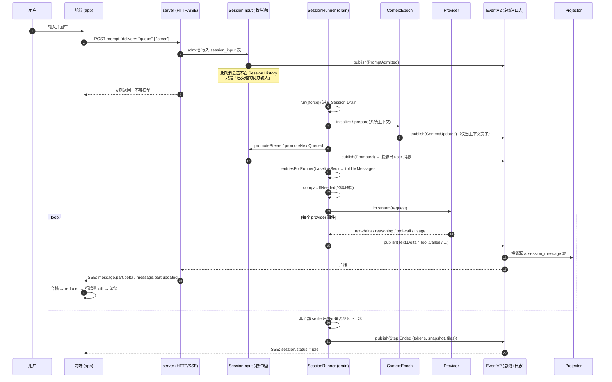

# opencode 上下文管理与对话过程展示 —— 可复刻实现指南

> 这是一份**实现规格**，不是导览。目标是：你把其中任意一章交给 AI 编码助手，它不需要再问你任何问题就能把功能做出来。
>
> 所有类型定义、常量、正则、CSS 数值、prompt 原文都直接摘自 `opencode` 仓库源码，并标注 `path:line`。
> 阅读时把 `path` 理解为相对仓库根目录。

## 关于源码引用的约定

- 每段代码摘录后面的引用行（形如 `` > `path:line` ``）指向 opencode 仓库中的真实位置，全部经过自动校验（文件存在、行号在范围内、内容匹配）。
- 摘录**语义忠实**，但为了篇幅做过两类无害改写，读源码时会看到细微差异：
  1. 把多行的 `return {...}` / 参数列表折叠成一行；
  2. 加了 `// ←` 开头的中文旁注（原文没有）。
- 需要逐字原文时，直接按 `path:line` 打开源文件。
- 类型定义一律给两个版本：**原样摘录**（Effect Schema）和**去 Effect 依赖的等价纯 TS/zod 版**，后者可直接复制进你的项目。

## 这份文档解决什么

大多数 AI 对话产品的实现是：把 system prompt 拼成字符串常量 → 把全部历史消息塞进数组 → 调 `stream()` → 前端把 delta 往一个 `text` state 上 `+=`。

demo 阶段没问题。一旦进入「长会话 + 工具调用 + 多端」，会同时在三处崩掉：

| 崩溃点 | 朴素做法的症状 | opencode 的答案 |
| --- | --- | --- |
| **系统上下文会变** | 用户切了目录、改了 `AGENTS.md`、跨天了，但 system prompt 是第一轮就固化的字符串，模型拿着过期事实干活 | **Context Source + Context Epoch**：系统上下文拆成若干可独立观测的类型化来源；变化时在会话中插入一条「现在生效值是 X」的系统消息，而不是重写 system prompt（第 1–2 章） |
| **上下文会超窗** | 直接崩 `context_length_exceeded`；或粗暴丢头部消息导致模型失忆 | **两级压缩**：预算预检 + 溢出兜底，压缩成结构化摘要并开启新纪元（第 3 章） |
| **过程要被看见** | `+=` 到一个字符串，一长就卡；刷新页面过程全丢；多端不一致 | **事件溯源 + 双投影**：过程写成 durable event，SSE 广播，前端 reducer 投影成 store，再投影成虚拟化行（第 7–11 章） |

贯穿全文的一句话架构判断：

> **「模型看到什么」和「用户看到什么」，是同一份事件流的两次不同投影。**

后端不为前端单独造数据，前端也不需要理解模型协议。

## 目录

| 章节 | 主题 | 你会拿到 |
| --- | --- | --- |
| [01](./01-system-context.md) | **SystemContext 抽象** | 类型化上下文来源的完整代数：`make / combine / initialize / reconcile / replace`，以及为什么它能让异构来源统一组合 |
| [02](./02-context-epoch.md) | **Context Epoch 与会话中系统消息** | 纪元生命周期、快照原子推进、安全边界的确切位置、SQL 表结构 |
| [03](./03-compaction.md) | **上下文压缩** | 两级触发判据、完整摘要 prompt 原文、head/recent 切分算法、新纪元衔接 |
| [04](./04-history-and-messages.md) | **消息模型与历史投影** | 8 种消息 / 3 种 assistant content / 4 种工具态的完整 schema；双 cutoff 的投影 SQL；`toLLMMessages` 的每条分支 |
| [05](./05-input-and-drain.md) | **输入收件箱与 drain 循环** | 受理≠入历史、steer vs queue、provider-turn 配额重置、崩溃恢复 |
| [06](./06-tool-output.md) | **工具输出的上下文治理** | 2000 行 / 50KB 上限、头尾采样 + 落盘、模型看到的替代文本 |
| [07](./07-events-and-sse.md) | **事件模型与 SSE** | durable vs live-only 事件的分野、`LLMEvent → SessionEvent` 完整映射表、SSE 端点实现 |
| [08](./08-client-sync.md) | **客户端同步层** | 事件 reducer 逐事件行为、16ms 合帧与 delta 合并、断线重连、内存治理 |
| [09](./09-timeline-and-scroll.md) | **时间线投影与滚动** | 9 种行类型、turn 分组算法、增量行复用、虚拟化参数、贴底跟随的完整状态机 |
| [10](./10-rendering-parts.md) | **Part 渲染与过程视觉** | 追赶式打字节奏、工具卡片状态机、标题共同前缀交叉淡入、进度点阵 |
| [11](./11-streaming-markdown.md) | **流式 Markdown 管线** | Worker 协议、latest-wins 队列、未闭合围栏状态机、稳定/不稳定 token 分段 |
| [12](./12-context-usage-ui.md) | **上下文用量可视化** | 按 system/user/assistant/tool/other 拆分的估算与归一化算法 |
| [13](./13-porting-checklist.md) | **移植清单** | 分阶段落地路线、React 版关键骨架代码、逐条验收断言 |
| [14](./14-tools.md) | **工具系统** | 不可变工具值、作用域注册栈、materialize 快照、结算五步管线、权限规则模型、路径安全三道检查 |
| [15](./15-skills.md) | **技能系统** | 三级渐进式披露、来源与发现、frontmatter 容错、名录 Context Source、远程拉取的五道安全检查 |
| [16](./16-memory.md) | **记忆系统** | 六层记忆模型及各自的写入/进上下文/失效/淘汰策略；AGENTS.md 生成规范原文 |

## 包分层（读代码时的地图）

```
packages/
  schema/          # 唯一事实来源：Message / Part / Event 的 Effect Schema 定义（前后端共用）
  llm/             # provider 协议适配层（LLM.request / llm.stream / LLMEvent）
  core/            # 领域层
    system-context/    # 第 1 章
    session/           # 第 2–6 章
    event.ts           # 第 7 章
  server/          # HTTP + SSE 传输层（很薄）
  sdk/ client/     # 生成的客户端
  session-ui/      # 会话渲染组件库（SolidJS，被 app 与 desktop 共用）
  app/             # Web / Desktop 前端（store、时间线、虚拟化）
  tui/             # 终端前端（opentui），消费同一套事件流
```

**第一条可抄的经验**：`schema` 独立成包不是洁癖。前端要按 `part.type` 分派渲染，后端要按 `message.type` 转 LLM 消息，两边必须严格同构，否则加一种 part 类型就要改四处。你的项目里哪怕不用 Effect Schema，也应该有一个 `shared/types.ts` 作为唯一定义处。

## 端到端时序：一次提问的完整生命周期



图里有 **五个必须理解的边界**，也是本书的骨架：

1. **受理 ≠ 进入历史**（第 5 章）。`POST prompt` 只把输入写进收件箱并立刻返回。什么时候变成模型可见的 user 消息，由 runner 在「安全的 provider 轮次边界」决定。这解耦了「用户可以随时输入」和「模型正在跑一轮不能被打断」。
2. **系统上下文不是字符串**（第 1–2 章）。`system.baseline` 是一个纪元内不可变的缓存基线；纪元内的变化以「会话中系统消息」形式出现在历史里。
3. **历史是投影出来的**（第 4 章）。`entriesForRunner` 是一条带两个 cutoff 的 SQL 查询，而不是一个内存数组。
4. **事件是唯一的写路径**（第 7 章）。`events.publish(...)` 同时做三件事：追加 durable 事件、原子提交本地投影、广播给订阅者。
5. **前端做三次投影**（第 8–9 章）。SSE 事件 → store → 时间线行 → 虚拟化可见窗口。每层都增量复用，不整表重建。

## 关键常量速查

抄的时候直接用这些数，它们都是被真实负载调出来的。

### 后端

| 常量 | 值 | 位置 | 含义 |
| --- | --- | --- | --- |
| `DEFAULT_BUFFER` | `20_000` | `packages/core/src/session/compaction.ts:12` | 触发压缩的安全余量（token） |
| `DEFAULT_KEEP_TOKENS` | `8_000` | `compaction.ts:13` | 压缩时保留在尾部不进摘要的 token 数 |
| `TOOL_OUTPUT_MAX_CHARS` | `2_000` | `compaction.ts:14` | 序列化进摘要时单条工具输出的截断长度 |
| `SUMMARY_OUTPUT_TOKENS` | `4_096` | `compaction.ts:15` | 摘要生成的最大输出 token |
| `MAX_LINES` | `2_000` | `packages/core/src/tool-output-store.ts:13` | 单次工具输出进入历史的最大行数 |
| `MAX_BYTES` | `50 * 1024` | `tool-output-store.ts:14` | 单次工具输出进入历史的最大字节数 |
| `RETENTION` | `7 days` | `tool-output-store.ts:15` | 落盘工具输出的保留期 |
| `MAX_TIMEOUT_MS` (bash) | `10 min` | `packages/core/src/tool/bash.ts:20` | 单条 shell 命令的超时上限 |
| `MAX_CAPTURE_BYTES` (bash) | `1 MB` | `tool/bash.ts:21` | shell 输出的**采集**上限（区别于入历史上限） |
| `MAX_READ_LINES` | `2_000` | `packages/core/src/tool/read-filesystem.ts:11` | read 单次最大行数 |
| `MAX_MEDIA_INGEST_BYTES` | `20 MB` | `tool/read-filesystem.ts:13` | 图片读取上限 |
| `FILE_LIMIT` (skill) | `10` | `packages/core/src/tool/skill.ts:15` | 技能文件清单的采样上限 |
| `skillConcurrency` / `fileConcurrency` | `4` / `8` | `packages/core/src/skill/discovery.ts:12-13` | 远程技能拉取并发度 |
| `subscriberCapacity` | `256` | `packages/server/src/handlers/event.ts:9` | 单个 SSE 订阅者的有界队列容量 |
| SSE 心跳 | `15 seconds` | `handlers/event.ts:37` | `: heartbeat\n\n` 注释行 |

### 前端

| 常量 | 值 | 位置 | 含义 |
| --- | --- | --- | --- |
| `FLUSH_FRAME_MS` | `16` | `packages/app/src/context/server-sdk.tsx:218` | 事件合帧间隔（一帧） |
| `STREAM_YIELD_MS` | `8` | `server-sdk.tsx:219` | 读流时每 8ms 让出一次主线程 |
| `RECONNECT_DELAY_MS` | `250` | `server-sdk.tsx:220` | SSE 断线重连退避 |
| `TEXT_RENDER_PACE_MS` | `24` | `packages/session-ui/src/components/message-part.tsx:252` | 追赶式打字每帧间隔 |
| `TEXT_RENDER_IMMEDIATE` | `512` | `message-part.tsx:253` | 落后不足 512 字符时直接全量显示 |
| `overscan` | `50` | `packages/app/src/pages/session/timeline/message-timeline.tsx:445` | 虚拟化测量 overscan |
| `renderOverscan` | `6 → 20` | `message-timeline.tsx:411` | 渲染 overscan（首屏 6，稳定后 20） |
| `scrollEndThreshold` | `80` | `message-timeline.tsx:441` | 判定滚动结束的阈值 |
| `paddingEnd` | `64` | `message-timeline.tsx:446` | 列表底部留白 |
| `bottomThreshold` | `10` | `packages/ui/src/hooks/create-auto-scroll.tsx:19` | 距底多少 px 内算「在底部」 |
| 程序化滚动识别窗口 | `1500ms` / `2px` | `create-auto-scroll.tsx:51,63` | 区分「自己滚的」和「用户滚的」 |
| `settling` 尾巴 | `300ms` | `create-auto-scroll.tsx:203` | 生成结束后仍跟随的缓冲期 |
| `MAX_DIR_STORES` | `30` | `packages/app/src/context/global-sync/types.ts:132` | 前端最多保留多少个目录级 store |
| `DIR_IDLE_TTL_MS` | `20 min` | `types.ts:133` | 目录 store 空闲驱逐时间 |
| `SESSION_RECENT_WINDOW` | `4 h` | `types.ts:134` | 「最近会话」时间窗 |
| `SESSION_RECENT_LIMIT` | `50` | `types.ts:135` | 超出主 limit 后额外保留的最近会话数 |
| 进度点阵动画 | `1200ms` | `packages/session-ui/src/v2/components/session-progress-indicator-v2.css:2` | 5×5 点阵一轮 |
| 工具标题交叉淡入 | `600ms` | `packages/session-ui/src/components/tool-status-title.tsx:77` | active → done 的宽度过渡 |

## 落地路线图

按这个顺序做，每一步都能独立跑起来、独立验收：

| 阶段 | 做什么 | 对应章节 | 验收 |
| --- | --- | --- | --- |
| **P0** | 统一 Message/Part 模型，前后端共用 | 04 | 能把一次完整对话序列化成 JSON 再还原 |
| **P1** | 事件总线 + durable 事件表 + SSE 端点 | 07 | 断开重连后不丢事件 |
| **P2** | 前端 store reducer + 合帧 + 逐字追加 | 08、10 | 文本能流式出现，刷新页面能恢复 |
| **P3** | 输入收件箱 + drain 循环（排队/打断） | 05 | 模型跑着的时候能再发一条并被正确插入 |
| **P4** | 工具调用的四态与渲染 | 06、10 | 工具卡片能从 pending 走到 completed |
| **P5** | 时间线行投影 + 虚拟滚动 + 滚动锚定 | 09 | 1000 条消息不卡，流式时不跳动 |
| **P6** | SystemContext + Snapshot + 会话中系统消息 | 01、02 | 改 `AGENTS.md` 后下一轮模型能感知 |
| **P7** | 压缩 + 用量可视化 | 03、12 | 长会话不再报超窗 |
| **P8** | 工具系统 + 权限 | 14 | 模型能安全地读写文件、跑命令 |
| **P9** | 技能 + 记忆分层 | 15、16 | 项目规则常驻、操作手册按需加载 |

**P0–P2 是最小闭环，P6–P7 是长会话产品的分水岭。** 很多团队只做到 P2 就上线，然后在 P3 和 P7 上反复踩坑。

## 一处必须提前知道的事实

本仓库正处在 v1 → v2 重写中，`packages/session-ui/src/v2/` 与 `packages/app/src/pages/session/v2/` 是并行演进的新版组件。本文档以**当前 `dev` 分支实际生效的代码**为准；凡是 v1/v2 存在差异的地方，正文会明确标注。

工具渲染器注册表（`packages/session-ui/src/components/message-part.tsx:1484` 的 `registerTool`）在同一文件内注册了 **14 个**内置渲染器：`read` / `list` / `glob` / `grep` / `webfetch` / `websearch` / `task` / `shell` / `edit` / `write` / `patch` / `todowrite` / `question` / `skill`，另有两个别名映射 `apply_patch → patch`、`bash → shell`（`message-part.tsx:1490`）。未注册的工具（如 MCP 工具）落到 `GenericTool` 兜底渲染。完整映射表见第 10 章 §4.1。
